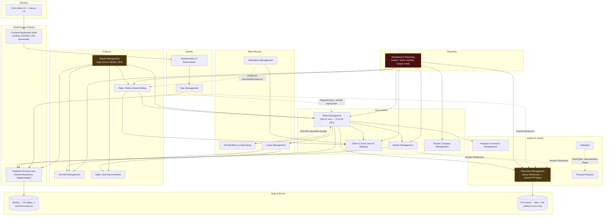
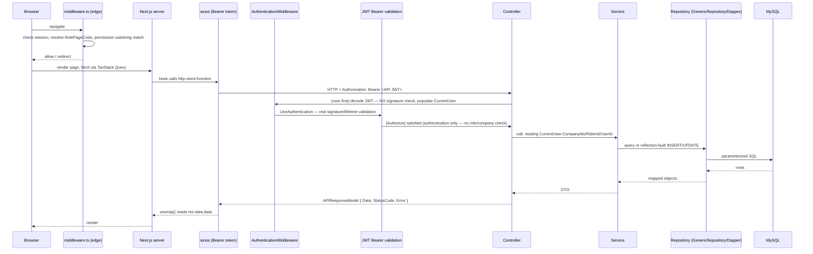
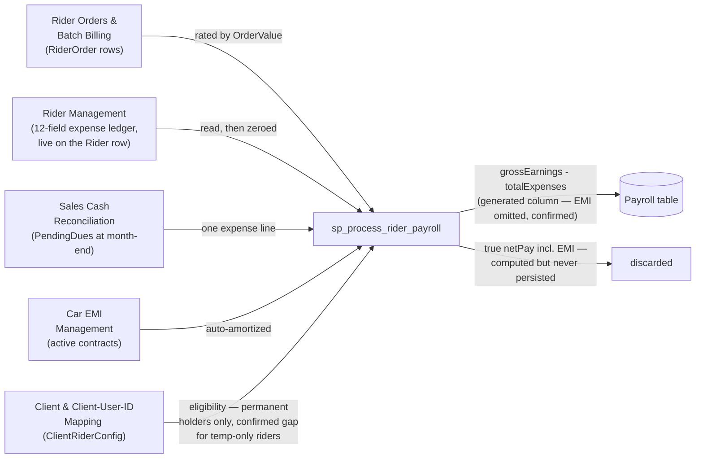
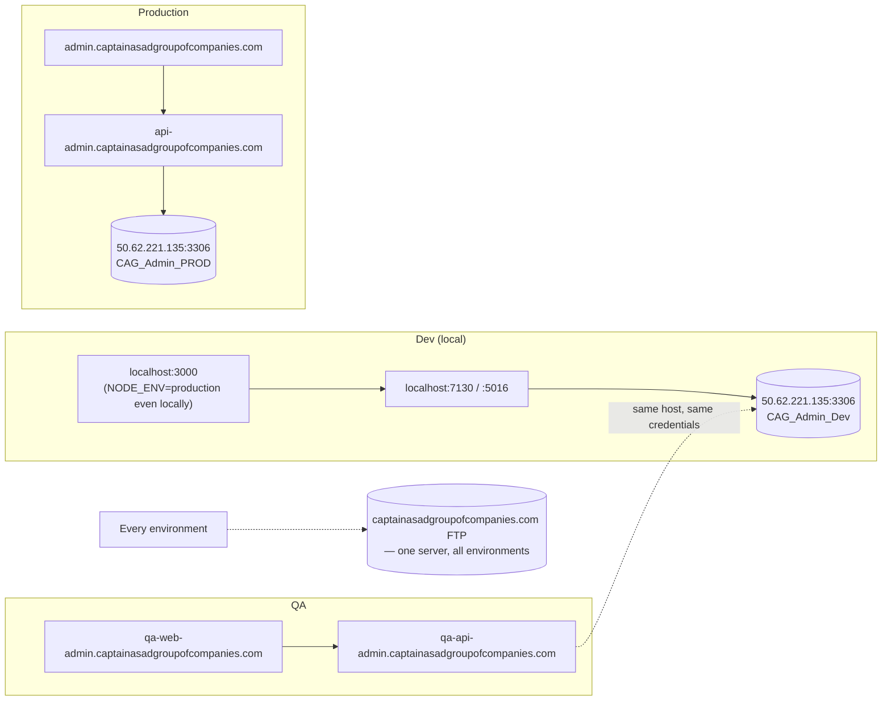

# CAG Admin Platform — Architecture Overview

This is the cross-module synthesis of the 20 module documents in this `docs/` folder. Where a module document establishes a fact within its own domain, this document connects it to the rest of the system — which modules share it, which findings recur across module boundaries, and what that means at the platform level. Every claim here is either drawn directly from a module doc (linked) or from direct inspection of `docs/database/schema.sql` and the underlying source noted inline. Nothing here is invented; where a conclusion required interpretation, it is marked **[Inferred]**, matching the convention used throughout the module docs.

**Scope:** `CAG.Admin.API` (.NET 10 Web API), `CAG.Admin.UI` (Next.js 15), and the MySQL database they share. Two independent git repositories, no root-level version control, no CI, no automated tests in either tier.

---

## 1. System-wide architecture diagram



**Reading this diagram:** solid arrows are structural dependencies (documented in each module's §3.7); dotted arrows are the more surprising cross-module couplings this review surfaced — a controller in one module calling straight into another module's service (`RiderController.DeleteRider` → `HrWorkflowService`), a module's import pipeline writing another module's table (`AttendanceController`'s `orderList/import` writing `OrderList`), or two modules sharing a DBModel type by accident (`PassportRequestService` constructing a `Helpdesk` object). Dashboard is highlighted because it depends on more modules than any other (7) while scoping none of them; Payroll and Document Management are highlighted because each hides a platform-critical mechanism (business logic in un-version-controlled SQL; the sole error-logging path) behind an unassuming name.

---

## 2. Data flow — how data moves through the system end to end

### 2.1 The request path (every read and write)



Three platform-wide facts this diagram encodes, each detailed in its own module doc:

- **Authorization stops at the dotted line inside the Controller box.** `[Authorize]` proves the caller is *someone*; nothing downstream proves they're allowed to touch *this* data, except where an individual service happens to add its own check. See §5.2.
- **`CurrentUser` is populated from an unverified decode before the real signature check runs** ([Authentication & Authorization](authentication-authorization.md) §3.3) — safe in the common case because `[Authorize]` gates the action, but the one endpoint without `[Authorize]` (`AuthController.Logout`) inherits the unverified value directly.
- **The response envelope (`APIResponseModel` → `unwrap()`) is an implicit contract with no shared schema** — an endpoint that returns a bare object instead of calling `Success(data)` silently yields `undefined` in the UI with no error on either side.

### 2.2 The bulk-import data flow — three independent strategies, three independent defects

Three modules ingest Excel workbooks, and each invented its own strategy for handling re-imports and partial failure, documented independently in [Attendance Management](attendance-management.md), [Rider Orders & Batch Billing](rider-orders-batch-billing.md), and [Sales Cash Reconciliation](sales-cash-reconciliation.md). Laid side by side, the pattern is clearer than any one module doc shows alone:

```mermaid
flowchart TB
    subgraph "Attendance — incremental lookback"
        A1[Parse workbook] --> A2[Filter to dates AFTER<br/>last successfully-processed log]
        A2 --> A3[AddBulkAttendance]
        A3 --> A4{"Exception before<br/>log row created?"}
        A4 -- yes --> A5["SILENT — no log, no error,<br/>HTTP 200 regardless"]
        A4 -- no --> A6[Log written correctly]
    end

    subgraph "Rider Orders — delete and replace"
        B1[Parse workbook] --> B2[DELETE all rows for company+month]
        B2 --> B3[INSERT all new rows]
        B3 --> B4["Log write: FAILED if row errors existed"]
        B4 --> B5["Log write: SUCCESS — unconditional,<br/>OVERWRITES the FAILED write above"]
    end

    subgraph "Sales Cash — no strategy at all"
        C1[Parse workbook] --> C2["INSERT directly —<br/>no delete, no lookback, no pre-check"]
        C2 --> C3["Relies entirely on uq_entry_rider_date<br/>to catch a re-import, as an unhandled exception"]
        C3 --> C4["NO upload-log table exists for this import at all"]
    end
```



Each of these was found and verified independently, by reading each service's full method body — the pattern only becomes visible by placing the three side by side. **No bulk import in the platform has a fully correct partial-failure story.** Attendance's is silent-on-early-failure; Rider Orders' overwrites its own failure record; Sales Cash's has no record-keeping mechanism at all. This is the platform's most consistent, most independently-rediscovered class of defect.

### 2.3 The payroll data-gathering flow — the one place many modules' data converges



This diagram makes visible something no single module doc could show on its own: [Payroll Management](payroll-management.md) is a confluence point for five other modules' data, and two of the five confirmed defects in this review sit exactly on that confluence — the `Payroll.netPay` generated column silently drops the EMI term that [Car EMI Management](car-emi-management.md) contributes, and the eligibility join silently excludes temp-cover riders that [Client & Client-User-ID Mapping](client-clientuserid-mapping.md)'s own data model explicitly supports.

### 2.4 File storage — bytes and the platform's own error log share one path

Every file — rider/vehicle/company documents and images, and the platform's own exception log — flows through [Document Management](document-management.md)'s `FileService` to the same FTP server, documented in that module's §2.4:

```mermaid
flowchart TD
    subgraph "Four modules inherit or share this"
        UM[User Management] -.inherits.-> FS[FileService]
        PCM[Partner Company Management] -.inherits.-> FS
        VM[Vehicle Management] -.inherits.-> FS
        DM["Document Management<br/>(owns it)"] --> FS
    end
    FS -->|UploadAsync / GetFileAsync / DeleteAsync| FTP1[FTP: files]
    EHM["ExceptionHandlingMiddleware<br/>(every module, fire-and-forget)"] -->|AppendAsync — empty catch{}| FTP2["FTP: Log-{date}.txt —<br/>THE PLATFORM'S ONLY ERROR LOG"]
    FTP2 -.if FTP has any issue.-> VOID2["Silently discarded.<br/>No fallback. No alert. No trace."]
```

If the FTP server has any problem — credential rotation, network blip, disk full, downtime — the platform's file storage *and* its only error-logging mechanism fail at the same time, and the logging failure is invisible by design (`catch {}` with no fallback). See §5.4.

---

## 3. Dependency matrix

Compiled from each module document's §3.7 ("Internal module dependencies"). Listed as upstream dependencies per module rather than a sparse 20×20 grid, since most cells in a full matrix would be empty — this table carries the same information more legibly.

| Module | Depends on (upstream) | Depended on by (downstream) |
|---|---|---|
| [Database Access Layer](database-access-layer.md) | — (foundational) | all 18 business modules |
| [Frontend Application Shell](frontend-application-shell.md) | Authentication & Authorization | every UI-facing module |
| [Authentication & Authorization](authentication-authorization.md) | — (foundational) | all 18 business modules |
| [User Management](user-management.md) | Auth, Database Access Layer, Document Management (FileService) | Rider Management (shared-transaction account creation) |
| [Rider Management](rider-management.md) | User Management, Auth, Leave Management, Property & Inventory, Vehicle Management, Client & Client-User-ID Mapping, Database Access Layer | HR Workflow, Attendance, Payroll, Rider Orders, Sales Cash, Dashboard |
| [Vehicle Management](vehicle-management.md) | Database Access Layer, Document Management (FileService) | Rider Management, Rider Orders & Batch Billing, Dashboard |
| [Partner Company Management](partner-company-management.md) | Database Access Layer, Document Management (FileService) | Rider Management, Vehicle Management, User Management, Dashboard |
| [Client & Client-User-ID Mapping](client-clientuserid-mapping.md) | Rider Management | Rider Orders & Batch Billing, Attendance, Sales Cash, Payroll |
| [HR Workflow & Onboarding](hr-workflow-onboarding.md) | Rider Management (bidirectional — also *implements* Rider's own delete endpoint) | — |
| [Attendance Management](attendance-management.md) | Client & Client-User-ID Mapping | (writes `OrderList`, conceptually owned by Rider Orders) |
| [Leave Management](leave-management.md) | Sales Cash Reconciliation, Car EMI Management (both via direct repository reads) | Rider Management (vacation-status sync) |
| [Payroll Management](payroll-management.md) | Rider Orders, Rider Management, Car EMI, Sales Cash, Client & Client-User-ID Mapping | — (terminal) |
| [Rider Orders & Batch Billing](rider-orders-batch-billing.md) | Client & Client-User-ID Mapping, Rider Management | Payroll, Dashboard |
| [Car EMI Management](car-emi-management.md) | — (near leaf) | Payroll, Rider Orders (skip-flag writer), Leave Management, Dashboard |
| [Sales Cash Reconciliation](sales-cash-reconciliation.md) | Client & Client-User-ID Mapping, Partner Company Management | Payroll, Leave Management |
| [Document Management](document-management.md) | — (owns shared infra) | User Mgmt, Partner Company Mgmt, Vehicle Mgmt (FileService), Dashboard, **every module indirectly via error logging** |
| [Property & Inventory Management](property-inventory-management.md) | — (near leaf) | Rider Management (shares the broken stock-tracking defect jointly) |
| [Helpdesk](helpdesk.md) | — (near leaf) | — |
| [Passport Request](passport-request.md) | — (near leaf); accidentally references Helpdesk's DBModel at runtime | — |
| [Dashboard & Reporting](dashboard-reporting.md) | Partner Company, Vehicle, Rider, Client & Client-User-ID Mapping, Car EMI, Document, Rider Orders (7 modules) | — (terminal) |

**Observations from the matrix:**

- **[Rider Management](rider-management.md) and [Database Access Layer](database-access-layer.md)/[Authentication & Authorization](authentication-authorization.md) are the structural center of gravity** — consistent with `Rider` being the foreign-key hub of the schema itself (14 of 44 FKs).
- **[Dashboard & Reporting](dashboard-reporting.md) has the highest fan-in of any single service (7 modules)** and, per §5.1 below, is also the module with the least authorization enforcement of any of them — the module that touches the most other modules' data enforces the least protection over it.
- **Three pairs of modules have an inverted or bidirectional dependency that isn't visible from either module's name**: [Rider Management](rider-management.md) ↔ [HR Workflow & Onboarding](hr-workflow-onboarding.md) (Rider's own delete endpoint is implemented inside HR Workflow); [Property & Inventory Management](property-inventory-management.md) ↔ [Rider Management](rider-management.md) (a single defect — broken stock tracking — is jointly owned by both, with the fix requiring both to change together); [Helpdesk](helpdesk.md) ↔ [Passport Request](passport-request.md) (a copy-paste bug means one module's create-path is, at runtime, indistinguishable from the other's).

---

## 4. Shared infrastructure

| Component | Technology | Used by | Notes |
|---|---|---|---|
| Primary datastore | MySQL (InnoDB), 52 tables, 2 stored procedures, 0 views, 0 triggers | every module | No ORM — [Database Access Layer](database-access-layer.md)'s reflection-based `GenericRepository`/`DapperHelper`. No migration framework; `docs/database/schema.sql` is a manually-maintained snapshot (see its header for confirmed drift against the CSV catalog). |
| File storage | FTP (FluentFTP client) | [Document Management](document-management.md) (owner), inherited by User Management, Partner Company Management, Vehicle Management | Also carries the platform's entire error log — see §2.4 and §5.4. |
| In-process cache | ASP.NET `IMemoryCache` | 4 controllers: Document, User, Vehicle, Partner Company (images/logos/documents) | **No shared cache server** — each policy was set independently: 10min sliding/30min absolute (User, Vehicle), 15min/30min (Document), and **no expiration at all** (Partner Company's logo cache) — four inconsistent policies for the same conceptual operation, and not shared across replicas if the API ever scales horizontally. |
| Message queue / broker | **None** | — | Every bulk operation (imports, payroll generation) runs synchronously inside the HTTP request. |
| Search engine | **None** | — | List/filter operations are SQL `WHERE` plus client-side AG Grid filtering over an unpaginated full result set. |
| Session/auth store | NextAuth JWT cookie (UI) + stateless API JWT | [Authentication & Authorization](authentication-authorization.md), [Frontend Application Shell](frontend-application-shell.md) | No server-side session store on either tier — both are token-based. |
| Background jobs / scheduler | **None** | — | Confirmed absent across all 20 modules — no `IHostedService`, `BackgroundService`, cron, or queue consumer anywhere in the API. Every process that reads as "should be scheduled" (payroll generation, vacation-status sync, EMI amortization) is instead triggered synchronously by a request or piggybacked onto an unrelated read. |
| CI/CD | **None** | — | `.github/workflows/` exists in the API repo but is empty; the UI repo has no workflow directory at all. |
| Automated tests | **None** | — | `CAG.Admin.API.UnitTests` is a stale `obj/` folder with no project file; the UI has no test runner configured. |

---

## 5. Cross-cutting concerns

This section is the payoff of reading all 20 module docs together: patterns that no single module doc can fully characterize because they only become a *pattern* once repeated. Each item below was independently confirmed in two or more modules by direct code inspection.

### 5.1 Authorization exists on a spectrum from "absent" to "well-implemented," and the spectrum correlates with data sensitivity in the wrong direction

No module in the platform enforces role-based access control — `[Authorize]` (authentication only) is the sole gate everywhere, confirmed identically in every module doc's §3.11/§4.3. Beneath that shared ceiling, **company-scope enforcement** (restricting a query to the caller's assigned companies) varies enormously by module, and the variance is not explained by sensitivity:

| Scoping quality | Modules | Consequence |
|---|---|---|
| **None whatsoever, confirmed by full-text inspection** | [Dashboard & Reporting](dashboard-reporting.md) | Any authenticated user retrieves financial/fleet/compliance aggregates for every company in the system |
| **Conditional — enforced only if the caller supplies the filter** | [Payroll Management](payroll-management.md), [Attendance Management](attendance-management.md), [Rider Orders & Batch Billing](rider-orders-batch-billing.md) | Omitting the filter (not supplying it at all) bypasses scoping entirely |
| **Present on some methods, absent on siblings in the same service** | [Vehicle Management](vehicle-management.md) (`Add`/`Get` scoped, `Update`/`Delete` not), [Document Management](document-management.md) (one of four read methods scoped) | Predictable, exploitable inconsistency within one file |
| **A confirmed IDOR — worse than absent scoping, because it looks intentional** | [Helpdesk](helpdesk.md), [Passport Request](passport-request.md) | The rider-scoped ticket list filters by a *client-supplied* ID instead of the caller's own identity |
| **Correctly implemented — allow-list intersection with a `Forbidden` fallback** | [Sales Cash Reconciliation](sales-cash-reconciliation.md)'s export endpoint, [Partner Company Management](partner-company-management.md)'s single-company read | Proof the pattern is known and achievable elsewhere in the same codebase |

**[Inferred]** The best-protected endpoints are ordinary reads; the worst-protected — Dashboard's cross-company financial aggregates, and the two ticketing modules' IDOR — expose the platform's most consequential and most personal data respectively. Nothing in the code suggests this was a deliberate risk-based decision; it reads as scoping logic that each service author reinvented independently, with wildly inconsistent rigor.

### 5.2 "GET performs a write" — the same anti-pattern, independently invented three times

Confirmed in three unrelated modules, each unaware of the other two:

- [Rider Management](rider-management.md) §2.3 — `GET api/rider/all` bulk-updates `Rider.StatusId` for every rider on vacation/vacation-overdue, on every call.
- [Sales Cash Reconciliation](sales-cash-reconciliation.md) §2.3 — `GET api/salescashentry/export` stamps `ExportedAt` on every returned row.
- [Payroll Management](payroll-management.md)'s underlying data touches this too, transitively, since the vacation-status writes above feed a status Payroll's own eligibility logic reads.

**[Inferred]** No shared "this endpoint has side effects" convention or code review checkpoint caught this pattern being reused; it appears to be a recurring instinct ("just sync it while we're already querying") rather than a deliberate architectural choice, since each instance solves a scheduling problem (no background jobs exist — see §4) by piggybacking a write onto an unrelated read instead.

### 5.3 The `AdminAPIException` `statusCode` parameter is dead code, confirmed by two independent developers' mistaken reliance on it

[Vehicle Management](vehicle-management.md) §3.12 first established this by direct proof: `AddVehicle`'s duplicate-number check constructs `AdminAPIException(DuplicateEntityExists, "...", (int)HttpStatusCode.OK)` — explicitly requesting HTTP 200 for an error. [Property & Inventory Management](property-inventory-management.md) §3.12 independently confirmed the same pattern: `SimCardService.AssignRiderAsync` passes `(int)HttpStatusCode.Ambiguous` (300). In both cases, `ExceptionHandlingMiddleware` (see [architecture reference below](#6-technology-stack)) computes the actual response status **solely** from a hardcoded switch on the exception's `ExceptionType` enum value, never reading the `statusCode`/`Data["StatusCode"]` value at all. **Two different developers, in two different modules, wrote code that only makes sense if this parameter has an effect it does not have** — strong evidence this misunderstanding is systemic across the codebase, not a one-off, since the constructor signature invites exactly this mistake (`AdminAPIException(type, message, statusCode)` reads as "this sets the status code").

### 5.4 The platform's only error log can fail completely, silently, with no fallback

Established in full in [Document Management](document-management.md) §2.4: `FileService.AppendAsync` — invoked fire-and-forget by `ExceptionHandlingMiddleware` on every unhandled exception, in every module — wraps its entire body in `try { ... } catch { }`. If the FTP server is unreachable for any reason, every exception thrown anywhere in the API from that moment forward is logged nowhere, with no console fallback, no metric, no alert. This is the single highest-leverage observability gap in the platform precisely because it would be invisible during the incident that makes it matter most — a production outage severe enough to affect FTP connectivity is exactly the moment detailed error logs would be needed, and exactly the moment they'd silently stop being written.

### 5.5 Reflection-based data access trades compile-time safety for flexibility — with one confirmed casualty

[Database Access Layer](database-access-layer.md) §4.1/§4.2 frames this as an abstract risk: `DapperHelper` builds SQL by reflecting over C# property names, so a type mismatch that happens to share a shape with the intended type produces no error anywhere. [Passport Request](passport-request.md) §2.3 found the concrete instance: `PassportRequestService.CreateTicketAsync` constructs and inserts a `Helpdesk` object instead of a `PassportRequest` object — a near-certain copy-paste error that compiles cleanly and runs correctly *only* because `Helpdesk` and `PassportRequest` happen to declare identical properties. Neither the compiler, a conventional ORM's type system, nor any test in this codebase (there are none) would have caught this. It remains silently correct only until one of the two tables' schemas is extended and the other isn't.

### 5.6 Validation logic that was written, then disabled, in at least two places

[Property & Inventory Management](property-inventory-management.md) §2.3 and [Rider Management](rider-management.md) §2.3 jointly document the same defect from two sides: a complete, carefully-reasoned stock-quantity reconciliation algorithm exists as commented-out code in `PropertyService.UpdatePropertyAsync`, and the parallel `AvailableQuantity` adjustment logic in `RiderService`'s property-issuance flow is *also* commented out. **[Inferred]** Two independent disablings of the same feature area strongly suggest a deliberate rollback of a stricter inventory model that was never completed or reverted cleanly — not two unrelated oversights.

### 5.7 Enum-as-string persistence, and two confirmed value mismatches found only by reading the DDL directly

Multiple modules persist C# enums as database strings rather than as constrained types checked against the enum at the application layer ([Vehicle Management](vehicle-management.md), [Helpdesk](helpdesk.md)/[Passport Request](passport-request.md), [Leave Management](leave-management.md)). Reading `docs/database/schema.sql` directly (rather than relying on the C# enum definitions alone) surfaced two concrete, previously-invisible mismatches:

- **`Vehicle.spareKeys`** is a MySQL `ENUM('Office','Driver','N/A')`, but the C# `SpareKeys` enum's third member is `NA` (no slash) — `SpareKeys.NA.ToString()` produces a string the database column does not accept.
- **`LeaveRequest.status`** is a MySQL `ENUM('PendingReview','SupervisorApproved','Approved','OnHold','Rejected','Cancelled')` — six values — while the C# `LeaveStatus` enum defines only four, missing both `Cancelled` (which the API's own business logic references as a literal string) and `SupervisorApproved` (which appears unused anywhere in the API, suggesting an intended two-stage approval flow that was never built into the application layer).

**[Inferred]** Both mismatches are only detectable by cross-referencing the C# source against the live schema — exactly the kind of drift the [Database Access Layer](database-access-layer.md)'s reflection-based, no-schema-verification design cannot catch, and exactly the kind of gap automated tests would ordinarily catch on the first attempt to persist the missing value.

### 5.8 Logging, error handling, and audit trails are wherever each module's author decided to put them

There is no shared logging abstraction (`ILogger` is not used anywhere in the reviewed code — the only structured log is `PayrollErrorLog`, and the only unstructured one is the FTP text file). Consequently:

- Some bulk imports have an upload-log table ([Attendance Management](attendance-management.md), [Rider Orders & Batch Billing](rider-orders-batch-billing.md)); one has none at all ([Sales Cash Reconciliation](sales-cash-reconciliation.md)).
- Some writes populate `CreatedBy`; some silently don't ([Helpdesk](helpdesk.md)/[Passport Request](passport-request.md) creation).
- `CreatedBy`/`UpdatedBy` inconsistently means `User.UserId` or `Rider.RiderId` depending on the module — [Document Management](document-management.md) and [Helpdesk](helpdesk.md)/[Passport Request](passport-request.md) prefer `RiderId` when present; every other module uses `UserId` unconditionally.
- [Payroll Management](payroll-management.md)'s `PayrollErrorLog` is, by contrast, genuinely well-designed — structured, queryable, capturing the actual MySQL error code — demonstrating the codebase is capable of good observability when a module's author invested in it.

---

## 6. Technology stack

| Layer | Technology | Version | Notes |
|---|---|---|---|
| API runtime | .NET | 9.0 | |
| API framework | ASP.NET Core Web API | 9.0 | Clean Architecture, 4 projects (Presentation/Application/Domain/Infrastructure) |
| Data access | Dapper | 2.1.66 | No ORM — [Database Access Layer](database-access-layer.md)'s custom reflection-based SQL generation on top |
| DB driver | MySqlConnector | 2.5.0 | Vestigial `Microsoft.Data.SqlClient`/`System.Data.SqlClient` references are unused |
| Database | MySQL (InnoDB) | — | 52 tables, 2 stored procedures, mixed `utf8mb4`/`latin1` collations |
| Auth | Microsoft.AspNetCore.Authentication.JwtBearer, System.IdentityModel.Tokens.Jwt | 9.0.9 / 8.14.0 | HS256, shared secret with the UI |
| Password hashing | BCrypt.Net-Next | 4.0.3 | Work factor 12 |
| File transport | FluentFTP | 53.0.2 | The platform's only external storage integration |
| Excel import/export | ClosedXML | 0.105.0 | Used by 5 of the platform's bulk-import/export paths |
| API docs | Microsoft.AspNetCore.OpenApi + Swashbuckle.AspNetCore.SwaggerUI | 10.0.x / 6.9.0 | `/swagger` (JSON at `/openapi/v1.json`) |
| API versioning | Asp.Versioning.Mvc | 8.1.0 | Configured but inert — every controller overrides its route with a literal, unversioned path |
| UI framework | Next.js (App Router) | ^15.5.7 | |
| UI runtime | React / React DOM | 19.1.0 | |
| Language (UI) | TypeScript, `strict: true` | ^5 | |
| Server state | TanStack React Query | ^5.90.2 | Global `retry: false`, `refetchOnWindowFocus: false` |
| HTTP client | axios | ^1.12.2 | |
| Auth (UI) | NextAuth | ^4.24.12 | JWT strategy, no server-side session store |
| Components | Ant Design | ^6.0.0 | |
| Styling | Tailwind CSS | ^4.1.16 | |
| Data grid | AG Grid React | ^34.3.0 | No server-side pagination anywhere — every list loads its full result set |
| Charts | Recharts | ^3.6.0 | |
| Client state | Zustand | ^5.0.8 | |

---

## 7. Deployment topology

**[Inferred from configuration; neither repository documents its own deployment pipeline.]**



- **Dev and prod MySQL share a host and credentials**, distinguished only by database name (`CAG_Admin_Dev` vs. `CAG_Admin_PROD`); both connect with `SslMode=none`.
- **JWT signing secrets (`AppSettings:Token` / UI `JWT_SECRET`) are identical across dev, QA, and prod** in the config files inspected — a token minted against the dev database is valid against production.
- **Containers**: the API ships a multi-stage `Dockerfile` (`mcr.microsoft.com/dotnet/sdk:9.0-alpine` → `aspnet:9.0-alpine`, port 8080); the UI ships its own (`node:22-alpine`, port 3000, selecting `.env.qa`/`.env.prod` via an `APP_ENV` build arg that is consumed but never declared, so it silently falls through to the committed default `.env` if omitted).
- **No CI/CD pipeline moves code between these environments** — `.github/workflows/` is empty in the API repo, absent in the UI repo. How a build reaches QA or production is not recorded in either repository.
- **Credentials for all of the above (MySQL, FTP, JWT signing keys, NextAuth secret) are committed to source control** in `appsettings.development.json`, `appsettings.production.json`, and the UI's `.env`/`.env.qa`/`.env.prod` files.

---

## 8. Consolidated findings, ranked by severity

Every module document ends with its own findings; this table exists only to let a reader prioritize across all 20 at once. "Severity" reflects blast radius and ease of exploitation together, not just theoretical impact.

| # | Finding | Module(s) | Severity |
|---|---|---|---|
| 1 | `DashboardService` performs zero company-scope verification on any of its 12 endpoints — any authenticated user retrieves cross-company financial/fleet/compliance data | [Dashboard & Reporting](dashboard-reporting.md) §4.3 | **Critical** |
| 2 | No role-based authorization anywhere in the API — `[Authorize]` checks authentication only; any authenticated user can rewrite the permission matrix, create Admin accounts, approve their own leave, delete riders | [Authentication & Authorization](authentication-authorization.md) §4.3, [User Management](user-management.md) §4.3, [Leave Management](leave-management.md) §4.3 | **Critical**, platform-wide |
| 3 | Confirmed IDOR: rider-scoped helpdesk/passport-request ticket lists filter by a client-supplied ID, not the caller's own identity | [Helpdesk](helpdesk.md) §4.3, [Passport Request](passport-request.md) §4.3 | **High** |
| 4 | `FileService.AppendAsync`'s empty `catch {}` means the platform's only error log can silently stop working entirely, with no fallback | [Document Management](document-management.md) §4.3 | **High** — invisible until it matters most |
| 5 | New rider accounts get a predictable, name-derived default password with no forced change and no lockout policy | [Rider Management](rider-management.md) §4.3, [Authentication & Authorization](authentication-authorization.md) §4.3 | **High** |
| 6 | Property/kit stock tracking is broken end-to-end — confirmed disabled validation in two independent modules | [Property & Inventory Management](property-inventory-management.md) §4.1, [Rider Management](rider-management.md) §4.1 | **Medium** — data integrity, not security |
| 7 | `PassportRequestService.CreateTicketAsync` inserts the wrong DBModel type, masked by reflection-based ORM and coincidentally-identical schemas | [Passport Request](passport-request.md) §4.1 | **Medium** — silently correct today, a latent time bomb |
| 8 | Persisted `Payroll.netPay` generated column omits EMI deductions — every payslip with an active vehicle loan overstates take-home pay | [Payroll Management](payroll-management.md) §4.1 | **Medium-High** — financial correctness |
| 9 | Password sent as a URL query parameter (`PUT api/user/updatepassword`) | [User Management](user-management.md) §4.3 | **Medium** |
| 10 | All three bulk-import pipelines mishandle partial failure, each in a different way (silent, overwritten, or unlogged) | [Attendance Management](attendance-management.md), [Rider Orders & Batch Billing](rider-orders-batch-billing.md), [Sales Cash Reconciliation](sales-cash-reconciliation.md) | **Medium** — operational reliability |
| 11 | Rider deletion is a non-transactional, cross-module operation (spanning Rider Management, HR Workflow, Client mapping) that can leave HR history permanently deleted while the rider record survives a downstream FK failure | [Rider Management](rider-management.md) §4.1, [HR Workflow & Onboarding](hr-workflow-onboarding.md) §4.1 | **Medium** |
| 12 | `AdminAPIException`'s `statusCode` constructor parameter has no effect anywhere in the API — confirmed by two independent, mistaken uses of it | [Vehicle Management](vehicle-management.md) §4.1, [Property & Inventory Management](property-inventory-management.md) §4.1 | **Low-Medium** — correctness/maintainability |
| 13 | Car EMI loan math (principal, rate, tenure, monthly payment) is entirely client-supplied with zero server-side validation, yet drives automated payroll deductions | [Car EMI Management](car-emi-management.md) §4.3 | **Medium** |
| 14 | Committed secrets (DB credentials, JWT signing keys, FTP credentials) identical across dev/QA/prod | [architecture reference: §7 above] | **High** |
| 15 | No automated tests, no CI, no migration framework anywhere in the platform | [Database Access Layer](database-access-layer.md) §4.2, and every module's absence of test coverage | **High**, structural | 

---

## Appendix — how this documentation set was produced

Twenty module documents plus this overview were produced by direct inspection of the source in `CAG.Admin.API/`, `CAG.Admin.UI/`, and `CAG.Admin.DB/` — every controller, every service implementation, every repository referenced, the full MySQL DDL (`docs/database/schema.sql`), and both stored procedure bodies (transcribed in full in [Payroll Management](payroll-management.md)). Findings marked **confirmed** were verified by reading the actual method body or table definition named; findings marked **[Inferred]** are reasonable interpretations flagged as such rather than asserted as fact. No behavior in these documents was guessed or assumed from naming conventions alone without checking the implementation.
