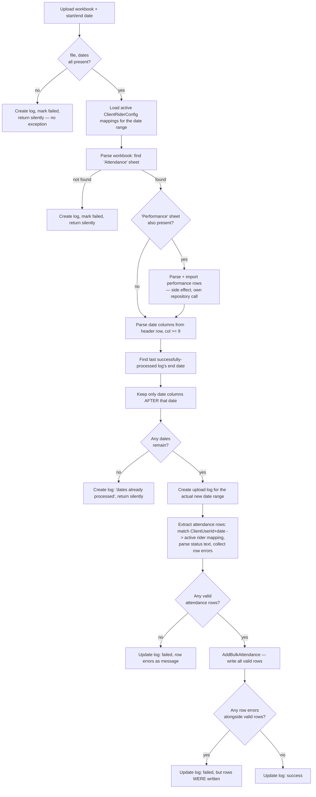
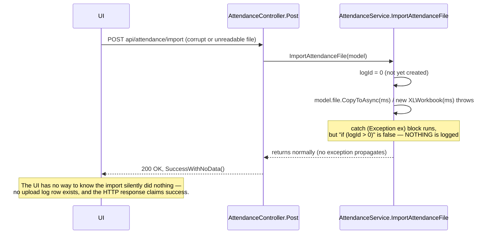
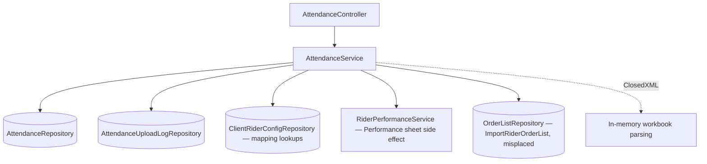
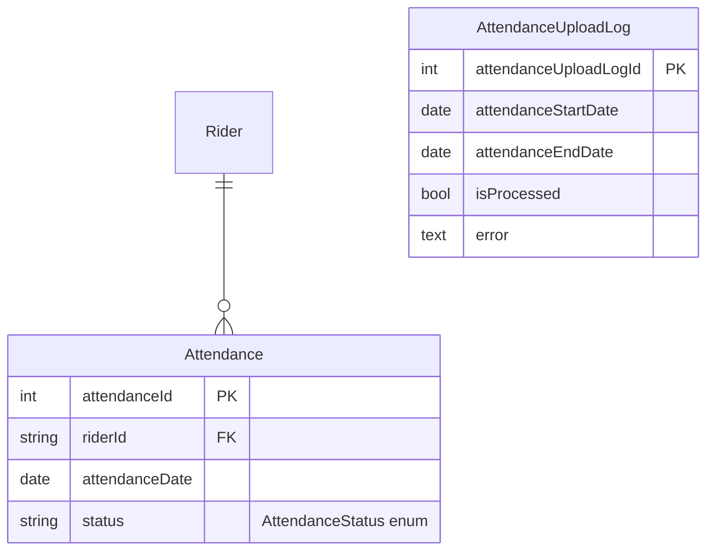

# Attendance Management

## 1. Module overview

Ingests rider attendance from an Excel workbook uploaded by HR/Ops, with an incremental (non-duplicating) date-range import strategy, an upload audit log, and an optional secondary sheet that feeds rider performance data as a side effect. Also — misplaced, by naming and by module boundary — hosts the rider daily-order-count import that conceptually belongs to [Rider Orders & Batch Billing](rider-orders-batch-billing.md).

**Where it lives:**

| Concern | Path |
|---|---|
| Controller | `CAG.Admin.API/CAG.Admin.API/Controllers/v1/AttendanceController.cs` |
| Service | `CAG.Admin.API.Application/Service/Implementation/AttendanceService.cs` |
| Repository | `CAG.Admin.API.DBRepository/Repository/AttendanceRepository.cs`, `AttendanceUploadLogRepository.cs` |
| Enum | `CAG.Admin.API.Domain/Enums/AttendanceStatus.cs` |

## 2. Business perspective

### 2.1 Business purpose

Attendance is tracked from client-side timesheets exported as Excel, not captured live by the platform — this module's job is to reliably ingest that external data, avoid double-counting on re-upload, and surface a clear audit trail of what was imported and when.

### 2.2 Key use cases

1. **HR uploads an attendance workbook** covering a date range, optionally with a second "Performance" sheet.
2. **HR re-uploads a workbook that overlaps a previous upload** — only genuinely new dates are processed.
3. **HR/Ops queries attendance** by rider, client, or date range.
4. **HR/Ops reviews the upload log** to see what succeeded/failed.
5. **[Rider Orders & Batch Billing](rider-orders-batch-billing.md)-shaped use case actually implemented here**: Ops imports a rider daily order-count sheet via `POST api/attendance/orderList/import`.

### 2.3 Business rules & logic

- **Attendance import is date-range incremental, not purely file-driven**: `ImportAttendanceFile` looks up the most recently *successfully processed* upload log's end date (`processedLogs.Where(IsProcessed).OrderBy(AttendanceEndDate).LastOrDefault()`) and filters the current workbook's date columns to only those **after** that date (explicit) — so uploading the same file twice, or a file whose range overlaps a prior successful upload, only imports the non-overlapping new days. This is a deliberate application-level safeguard, layered on top of (not a replacement for) the database's own `uq_attendance_rider_date` constraint.
- **Attendance status parsing is lenient on formatting, strict on vocabulary**: cell text has spaces replaced with underscores and is parsed case-insensitively against the `AttendanceStatus` enum (explicit, `Enum.TryParse(statusText.Replace(" ","_"), true, out status)`); an empty cell is treated as the literal status `"EMPTY"`; an unparseable value is recorded as a row-level error and that cell is skipped, not fatal to the whole import.
- **A rider must have an active client mapping covering the attendance date** for a row to import — `ExtractAttendanceRows` matches each `(ClientUserId, date)` against `ClientRiderMapping`s where `StartDate <= date <= (EndDate ?? unbounded)` (explicit) — this directly consumes [Client & Client-User-ID Mapping](client-clientuserid-mapping.md)'s `ClientRiderConfig` history, making that module's data-integrity fix (see that module's §2.3) load-bearing for attendance accuracy too.
- **A "Performance" sheet, if present in the same workbook, is parsed and imported as a side effect** of the attendance upload (explicit) — feeding [Rider Performance](payroll-management.md)-adjacent data (`RiderPerformanceService.AddRiderPerformance`) from the same file, same request, same transaction-less sequence as the attendance rows.
- **The rider daily order-count import (`ImportRiderOrderList`) lives in this service and this controller**, not in [Rider Orders & Batch Billing](rider-orders-batch-billing.md) — confirmed by reading the method body: it parses a workbook keyed by `ClientUserId` rows and day-of-month columns, resolves each row to a rider via `ClientRiderConfigRepository.GetAllMappings`, and writes `OrderList` rows (the 115,573-row table — see [architecture-overview.md](architecture-overview.md) §4.3) via `IOrderListRepository.UpsertOrderListAsync`. [Inferred] This placement appears to be historical/organizational rather than deliberate domain modeling — the method has nothing to do with attendance.

### 2.4 End-to-end business flows

**Incremental attendance import:**

**The silent-failure defect — an exception before the log exists:**

### 2.5 Actors & interactions

| Actor | Role |
|---|---|
| HR/Ops staff | Upload attendance workbooks, review logs |
| [Client & Client-User-ID Mapping](client-clientuserid-mapping.md) | Upstream — supplies the rider mapping every attendance row depends on |
| [Rider Performance] (part of [Payroll Management](payroll-management.md)'s adjacent data) | Downstream — populated as a side effect when a Performance sheet is present |
| [Rider Orders & Batch Billing](rider-orders-batch-billing.md) | The conceptual home of `ImportRiderOrderList`, which is actually implemented and routed here |

## 3. Technical perspective

### 3.1 Architecture overview

A single service doing heavy Excel parsing (ClosedXML) with two distinct import pipelines (attendance+performance, and order-list) that share the workbook-parsing style but not code. No transactions wrap any multi-step write.

### 3.2 Component breakdown

| Component | Responsibility | Key methods |
|---|---|---|
| `AttendanceController` | 4-endpoint HTTP surface | `Get`, `GetUploadLog`, `Post` (import), `ImportRiderOrderList` |
| `AttendanceService` | Excel parsing, incremental-date logic, dual import pipelines | `ImportAttendanceFile`, `ImportRiderOrderList`, `ParseRiderPerformanceSheet`, `ParseDateColumns`, `ExtractAttendanceRows` |
| `AttendanceRepository` | `GenericRepository<Attendance>` + bulk insert | `AddBulkAttendance`, `GetAttendanceDetailsByAsync` |
| `AttendanceUploadLogRepository` | Audit log CRUD | `AddAsync`, `UpdateAsync`, `GetAllLogsAsync` |

### 3.3 Detailed technical flows

See §2.4 — both diagrams above are the load-bearing technical traces of this module.

### 3.4 API & interface documentation

| Method | Route | Notes |
|---|---|---|
| `POST` | `api/attendance/get` | Filtered query (date range, rider, client), company-scoped |
| `GET` | `api/attendance/getlog` | Upload audit trail |
| `POST` | `api/attendance/import` | Never throws to the controller — always `SuccessWithNoData()` regardless of outcome (§4.1) |
| `POST` | `api/attendance/orderList/import` | Misplaced [Rider Orders & Batch Billing](rider-orders-batch-billing.md) functionality; **does** throw `ValidationFailed` on row errors, after already persisting any valid rows (§4.1) |

### 3.5 Database & data model

`Attendance` carries `uq_attendance_rider_date (riderId, attendanceDate)` plus composite indexes `idx_rider_date`, `idx_status_date`, `idx_date` (see [architecture-overview.md](architecture-overview.md) §4.6) — the only table in the platform with this much index investment, consistent with it being a write-heavy, date-range-queried table.

### 3.6 External integrations

None (ClosedXML is a library).

### 3.7 Internal module dependencies

**Upstream:** [Client & Client-User-ID Mapping](client-clientuserid-mapping.md) (rider mapping resolution).

**Downstream:** none formally, but `ImportRiderOrderList` writes into `OrderList`, the table [Rider Orders & Batch Billing](rider-orders-batch-billing.md) and [Dashboard & Reporting](dashboard-reporting.md) both read from — making this an undeclared cross-module data producer.

### 3.8 Configuration & environment

None module-specific.

### 3.9 Background jobs & workers

None — import is entirely request-driven, synchronous, and can process an entire month's workbook within a single HTTP request.

### 3.10 Events & messaging

None.

### 3.11 Authentication & authorization

`[Authorize]` only; company-scoped read (`GetByAsync` passes `_userAssignedCompanies`), but the import endpoints do not appear to validate that the riders/clients referenced in the uploaded file fall within the caller's assigned companies — [Inferred from reading `ImportAttendanceFile`/`ImportRiderOrderList`, neither of which filters `clientRiderMappings` by `_userAssignedCompanies`] a non-admin user could potentially import attendance/order data for riders outside their assigned companies, though they would need access to a plausible-looking `ClientUserId` set to do so meaningfully.

### 3.12 Validation & error handling

- **`ImportAttendanceFile`'s error handling is a confirmed, concrete availability/correctness defect**: the top-level `catch` only writes to the upload log `if (logId > 0)`, and the log isn't created until *after* the file has been successfully read into a workbook and the "Attendance" sheet located — so any exception during file upload, memory-stream copy, or workbook parsing (a corrupt `.xlsx`, an unsupported format, a password-protected file) is caught, produces **no log entry at all**, and the method returns normally. `AttendanceController.Post` then returns `SuccessWithNoData()` — HTTP 200 — for an import that did nothing and left no trace.
- **`ImportRiderOrderList` has the opposite problem**: it persists any successfully-parsed rows via `UpsertOrderListAsync` **before** checking whether row-level errors were collected, then throws `ValidationFailed` (400) if any errors exist — so a response that looks like total failure to the caller can still have written real data.
- Both import methods accumulate row-level errors into a list and report them jointly rather than failing fast — a reasonable pattern for bulk import UX, undermined by the two issues above.

### 3.13 Logging & observability

`AttendanceUploadLog` is the only structured "log" in the traditional sense anywhere in the codebase — and per §3.12, it is not reliably written for the failure mode most likely to occur (malformed input files).

### 3.14 Design patterns & architectural decisions

- **Header-driven column resolution** (`ParseDateColumns`, the `headers` dictionary in `ParseRiderPerformanceSheet`) rather than fixed-position parsing for most fields — resilient to column reordering, though `ParseDateColumns`'s hardcoded `startCol = 9` for where date columns begin is a fixed-position assumption about the template's layout that isn't self-documenting in code.
- **Incremental-import-by-log-lookback** (§2.3) is a genuinely well-designed piece of business logic — a deliberate, considered idempotency mechanism rather than an accident of the unique constraint.

## 4. Risk & improvement analysis

### 4.1 Edge cases & failure scenarios

- **Confirmed: malformed-file imports fail completely silently** (§3.12) — the single highest-priority defect in this module, since it means the audit log this module exists to provide can have gaps precisely when something went wrong.
- **Confirmed: `ImportRiderOrderList` can report failure while having already written data** — a caller retrying after a 400 could re-import already-persisted rows, though the `uq_rider_date` constraint on `OrderList` would reject exact duplicates (surfacing as an unhandled 500, per the platform-wide pattern noted in [architecture-overview.md](architecture-overview.md) §10 item 12).
- No transaction wraps the attendance-plus-performance dual write — a failure partway through leaves one written without the other.

### 4.2 Known limitations

- `ImportRiderOrderList`'s home in this module/controller is a naming and domain-boundary defect, not just cosmetic — anyone looking for order-import logic in [Rider Orders & Batch Billing](rider-orders-batch-billing.md) won't find it there.
- No company-scope filtering on import data (§3.11).
- The Excel template's column layout (date columns starting at column 9, `ClientUserId` always in column 1) is an undocumented, code-embedded contract with the source file's producer.

### 4.3 Security considerations

Same platform-wide absence of role checks; the import endpoints' apparent lack of company-scope filtering (§3.11) is the concrete, module-specific instance worth flagging here.

### 4.4 Performance considerations

Whole-workbook, in-memory, synchronous parsing within the HTTP request — consistent with every other Excel import in the platform (see [architecture-overview.md](architecture-overview.md) §6.5). A full month's attendance for the current rider count is unlikely to be a problem; the incremental-import design (§2.3) actually helps here by avoiding redundant reprocessing on repeat uploads.

### 4.5 Potential improvements

**Quick wins:**
- Make `ImportAttendanceFile`'s outer catch always create a log entry (even a minimal one) before attempting to parse the file, so no failure mode goes unrecorded.
- Have `AttendanceController.Post` surface the log's `IsProcessed`/`Error` result in its response rather than an unconditional `SuccessWithNoData()`, so the UI doesn't need to separately poll the log to learn whether an import actually worked.

**Medium effort:**
- Move `ImportRiderOrderList` (and its controller route) into [Rider Orders & Batch Billing](rider-orders-batch-billing.md)'s service/controller.
- Add company-scope filtering to both import paths' mapping lookups.

**Major refactors:**
- None beyond what's already covered in [architecture-overview.md](architecture-overview.md) (background-job-based import processing for large files, generally).

## 5. Summary

- Implements a genuinely well-designed incremental import strategy — re-uploading an overlapping date range only processes new days, based on the last successfully-processed log entry.
- **Confirmed defect**: a malformed or unparseable uploaded file fails completely silently — no log entry, no error surfaced, HTTP 200 returned regardless.
- **Confirmed inconsistency**: the sibling `ImportRiderOrderList` method does the opposite — it can report a validation failure to the caller *after* already persisting some rows.
- A "Performance" sheet in the same workbook silently also imports rider performance data as a side effect of an attendance upload.
- `ImportRiderOrderList` — despite living in this module — has nothing to do with attendance; it belongs to [Rider Orders & Batch Billing](rider-orders-batch-billing.md) by function, confirmed by reading its implementation.
- No apparent company-scope enforcement on either import path.
- `Attendance` is the most heavily-indexed table in the schema, reflecting its write-heavy, date-range-query-heavy usage pattern.
