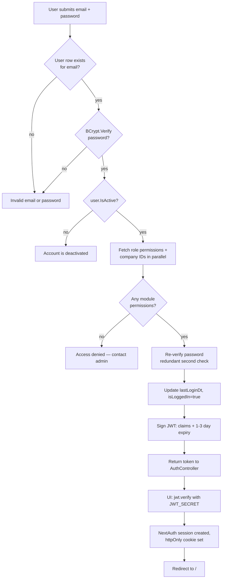
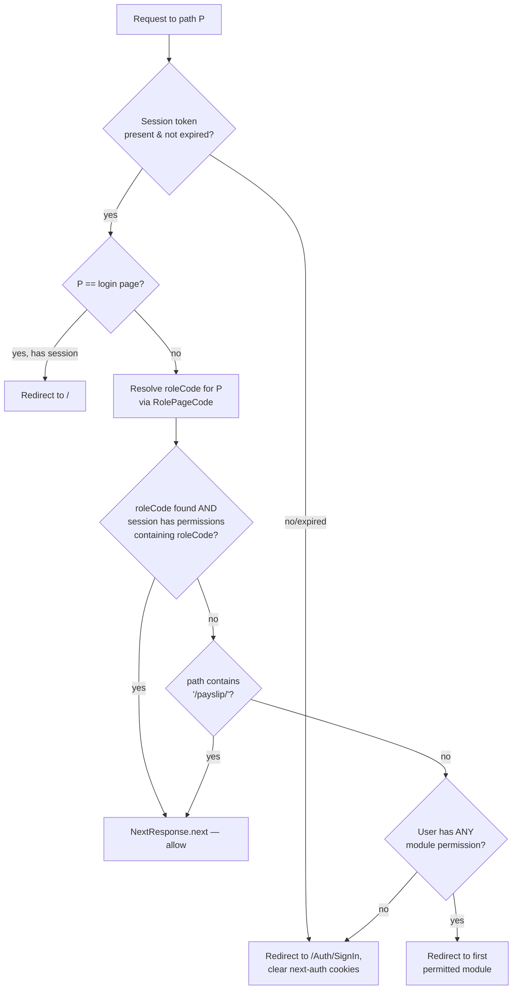
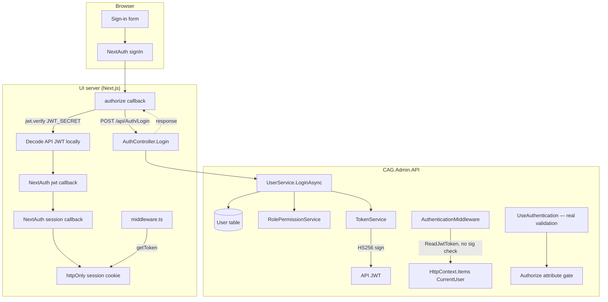
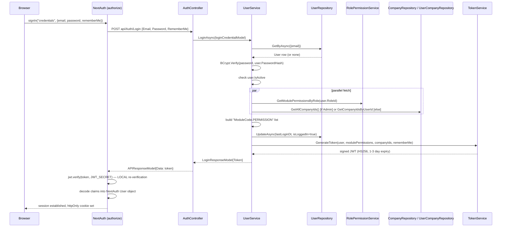
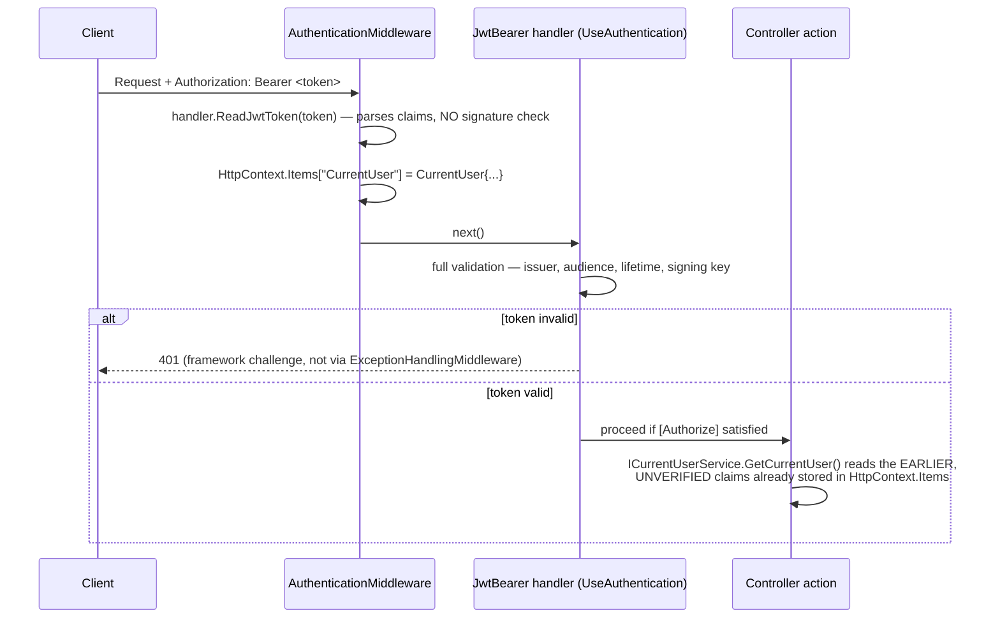
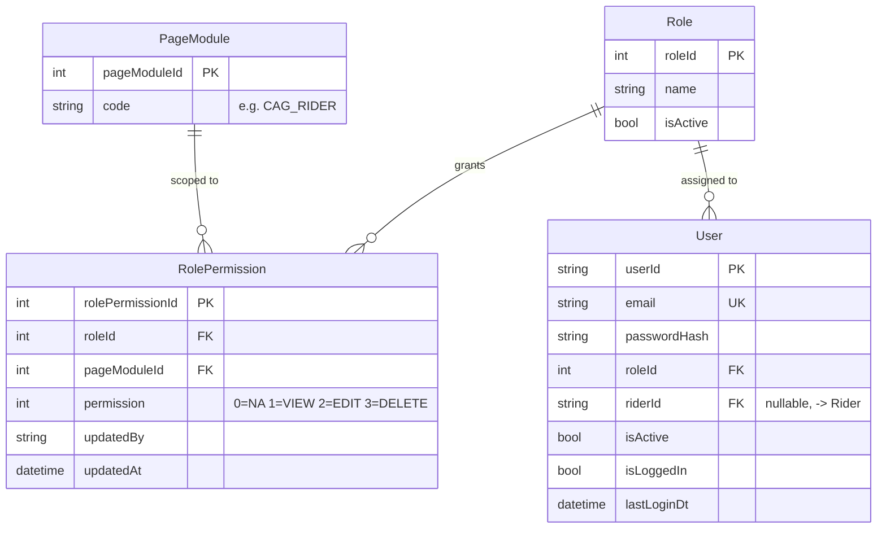

# Authentication & Authorization

## 1. Module overview

This module covers how a user proves identity (authentication) and how the system decides what an authenticated user may do (authorization) across the CAG Admin platform. It spans both repositories: the API issues and would-be-validates JWTs and exposes a permission matrix; the UI performs the actual permission enforcement.

**Where it lives:**

| Concern | Path |
|---|---|
| Login/logout endpoints | `CAG.Admin.API/CAG.Admin.API/Controllers/v1/AuthController.cs` |
| Credential check, token assembly | `CAG.Admin.API/CAG.Admin.API.Application/Service/Implementation/UserService.cs` (`LoginAsync`, `LogoutAsync`) |
| JWT issuance | `CAG.Admin.API/CAG.Admin.API.Application/Service/Implementation/TokenService.cs` |
| Unverified claim extraction | `CAG.Admin.API/CAG.Admin.API/Middlewares/AuthenticationMiddleware.cs` |
| Current-user accessor | `CAG.Admin.API/CAG.Admin.API.Application/Service/Implementation/CurrentUserService.cs` |
| Permission matrix CRUD | `RolePermissionController.cs`, `RolePermissionService.cs`, `RolePermissionRepository.cs` |
| JWT signature validation | `Program.cs` (`AddJwtBearer`) |
| UI session issuance | `CAG.Admin.UI/src/app/api/auth/[...nextauth]/auth.ts` |
| UI route-level gate | `CAG.Admin.UI/src/middleware.ts` |
| UI component-level gate | `CAG.Admin.UI/src/app/utils/permission-helper.ts` |
| UI sign-in screen | `CAG.Admin.UI/src/app/(auth-pages)/Auth/SignIn/index.tsx` |

## 2. Business perspective

### 2.1 Business purpose

The platform serves several distinct staff roles (Admin, Operational Manager, HR, Supervisor, Team Leader, Coordinator, Reporter) plus a Rider role, each of whom should see only the modules relevant to their job — HR should not need to touch payroll approval, a Coordinator should not edit role permissions. The module exists to (a) confirm a user is who they claim to be, and (b) confine each role to an assigned slice of the 13 business modules with per-module VIEW/EDIT/DELETE granularity, so the admin portal can be safely used by non-technical staff across departments without over-exposing sensitive operations (payroll, permissions, user management).

### 2.2 Key use cases

1. **Staff member logs in** — triggered by a user submitting email + password on the sign-in screen.
2. **Staff member logs out** — triggered by the user (or the app, on token expiry) — flips a tracking flag server-side.
3. **Admin edits the role-permission matrix** — triggered by an Admin user on the Permission Management screen, changing what a role (e.g. "Reporter") can see or edit.
4. **Session auto-expiry** — triggered by the passage of time; the UI checks `expiresAt` against the current clock in both `middleware.ts` and the NextAuth `session` callback.
5. **Route-level access denial and redirect** — triggered by any authenticated user navigating to a module they lack permission for; the system redirects them to the first module they *do* have.
6. **"Remember me" extended session** — triggered by the user checking a box at login, extending token lifetime from 1 day to 3 days.

### 2.3 Business rules & logic

- **A deactivated user cannot log in**, even with correct credentials — `UserService.LoginAsync` checks `user.IsActive` and returns "Your account is deactivated. Please contact admin" (explicit).
- **A user with zero assigned module permissions cannot log in**, even if active and password-correct — returns "Access denied. Please contact admin for permissions" (explicit). This means permission assignment is a prerequisite for account usability, not an independent layer applied after login.
- **Admins see all companies**; non-admins see only companies explicitly mapped to them via `UserCompany` (explicit — `isAdminUser ? GetAllCompanyIds() : GetCompanyIdsByUserId(...)`). This company scope is embedded as a JWT claim and drives multi-tenant data filtering everywhere else in the system.
- **Session length is 1 day by default, 3 days with "Remember Me"** (explicit, `TokenService.GenerateToken`, `DateTime.UtcNow.AddDays(isLongLivedToken ? 3 : 1)`).
- **Role 1 (Admin) is excluded from the editable permission matrix** — `RolePermissionRepository.GetPageModulePermissions` filters `WHERE r.roleId != 1` (explicit). [Inferred] Admin permissions are presumably fixed/full and not meant to be edited away accidentally through the UI.
- **A permission row only appears in `ModulePermissionsByRole` (and thus in the JWT) if `Permission > 0`** — a module explicitly set to `NA` (0) for a role is simply absent from the claim rather than present-with-no-access (explicit, `RolePermissionRepository.GetModulePermissionsByRole`).
- **Permission scope is coarser than the UI's own module catalog.** The UI defines 13 modules in `ModuleCodes` (including `CAG_PAYROLL_HISTORY` and `CAG_PASSPORT_REQUEST`), but `ModulePermissionModel` — the shape returned by `GetPageModulePermissions` and rendered in the admin Permission grid — carries only 11 module columns and has **no field for Payroll History or Passport Request**. [Inferred from code comparison, not stated anywhere] Those two modules' permissions cannot be viewed or edited through the permission-management screen; whatever value they hold in the `RolePermission` table (if any row exists at all) is effectively fixed outside the UI.
- **Route access falls back to redirect-to-first-permitted-module, not a blanket deny.** If a user hits a path their role doesn't cover, `middleware.ts` looks up their first granted `modulepermissions` entry and redirects there, rather than showing a 403 page — except paths containing `/payslip/`, which are allowed through regardless (explicit carve-out in `middleware.ts`).
- **Rider self-service login is implied by the UI but not implemented in the API.** The sign-in form's validation message reads "Enter valid Email or Rider ID (min 4 characters)," and the JWT does carry an optional `RiderId` claim when `user.RiderId` is set on the `User` row — but `UserService.LoginAsync` looks the user up **only by `email`** (`GetByAsync(new { email = ... })`). [Inferred] A rider attempting to sign in with a Rider ID rather than an email would fail; either the UI copy is stale or this is unfinished functionality.

### 2.4 End-to-end business flows

**Login — success and failure paths:**



**Route access check (per navigation, in `middleware.ts`):**



### 2.5 Actors & interactions

| Actor | Role |
|---|---|
| Staff user (any role) | Authenticates via email/password; session governs what they can reach |
| Admin | Only role that can edit the `RolePermission` matrix; sees all companies by default |
| `AuthenticationMiddleware` | Extracts (unverified) claims into `CurrentUser` for downstream services on every request carrying a Bearer header |
| ASP.NET JWT Bearer handler | Performs the actual cryptographic/lifetime validation, gating any `[Authorize]` endpoint |
| NextAuth (UI) | Re-verifies the API's JWT locally, owns the browser session lifecycle |
| `middleware.ts` (UI) | Enforces per-route module access before a page ever renders |

## 3. Technical perspective

### 3.1 Architecture overview

Authentication is a **two-hop JWT handoff**: the API is the identity provider and signer; the UI is simultaneously a JWT *consumer* (it re-verifies the token) and its own session authority (NextAuth issues a separate, cookie-based session on top of the API token). Authorization is **claims-based and string-coded** (`MODULE.PERMISSION`), enforced at three independent points with three different levels of rigor — UI route middleware, UI component checks, and (nominally) `[Authorize]` at the API. There is no ASP.NET policy or role-based authorization configured; `[Authorize]` on API controllers checks authentication only.



### 3.2 Component breakdown

| Component | Responsibility | Key methods | Depends on |
|---|---|---|---|
| `AuthController` | HTTP surface for login/logout; **no `[Authorize]`, no `[AllowAnonymous]`** | `Login`, `Logout` | `IUserService` |
| `UserService.LoginAsync` | Credential verification, permission/company lookup, token request, last-login update | `LoginAsync` | `IUserRepository`, `IRolePermissionService`, `ICompanyRepository`, `IUserCompanyRepository`, `ITokenSerivce` |
| `UserService.LogoutAsync` | Flips `isLoggedIn=false` for the current user | `LogoutAsync` | `ICurrentUserService`, `IUserRepository` |
| `TokenService` | Builds and signs the JWT | `GenerateToken(user, modulePermissions, companyIds, isLongLivedToken)` | `IConfiguration` (`AppSettings:Token/Issuer/Audience`) |
| `AuthenticationMiddleware` | Decodes (does **not** verify) any `Bearer` token present, populates `HttpContext.Items["CurrentUser"]` | `Invoke` | `JwtSecurityTokenHandler.ReadJwtToken` |
| `CurrentUserService` | Typed accessor over `HttpContext.Items["CurrentUser"]` | `GetCurrentUser()` | `IHttpContextAccessor` |
| `RolePermissionService` | Assembles the per-role permission grid; applies updates | `GetPageModulePermissions`, `GetModulePermissionsByRole`, `UpdateModulePermissions` | `IRolePermissionRepository` |
| `RolePermissionRepository` | SQL joins `Role`/`RolePermission`/`PageModule` | `GetModulePermissionsByRole`, `GetPageModulePermissions`, `UpdatePermissions` | Dapper |
| NextAuth `authOptions` (UI) | `Credentials` provider; calls API login; locally verifies + decodes the returned JWT; builds the NextAuth session | `authorize`, `jwt` callback, `session` callback | `jsonwebtoken`, `loginAsync` |
| `middleware.ts` (UI) | Per-request route gate using `RolePageCode` | `middleware`, `resolveRoleCode` | `next-auth/jwt.getToken` |
| `useHasPermission` (UI) | Component-level show/hide/disable | `useHasPermission(module, permission)` | `useSession` |

### 3.3 Detailed technical flows

**Login, method by method:**



**Per-request authentication inside the API (every request with a `Bearer` header):**



The important subtlety: by the time a controller action runs, the *bearer token itself* has been cryptographically validated by `UseAuthentication()` — but the `CurrentUser` object the action actually reads was populated **earlier**, by `AuthenticationMiddleware`, from an **unverified** decode. In the common case these agree (the token is valid, so its claims are trustworthy either way). The gap matters specifically for `AuthController.Logout`, which has no `[Authorize]` gate at all — so `UseAuthentication()`'s validation is never invoked for that route, and `CurrentUser` is trusted straight from the unverified decode. See §4.3.

### 3.4 API & interface documentation

| Method | Route | Auth | Request | Response |
|---|---|---|---|---|
| `POST` | `api/Auth/login` | none (`AuthController` has no `[Authorize]`, no `[AllowAnonymous]`) | `LoginCredentialModel { Email, Password, RememberMe }` | `Success(token)` (200) or `UnAuthorized(error)` (401); unhandled exceptions caught locally and returned as `BadRequest(ex.Message)` |
| `POST` | `api/Auth/logout` | none (see §4.3) | — | `SuccessWithNoData()` or `BadRequest(ex.Message)` |
| `GET` | `api/permissions/getall` | `[Authorize]` (authenticated only) | — | `List<ModulePermissionModel>` — one row per non-Admin role, 11 module columns |
| `GET` | `api/permissions/getbyroleId` | `[Authorize]` | `?roleId=` | `List<ModulePermissionsByRole>` (`ModuleCode`, `Permission`) |
| `PUT` | `api/permissions/update` | `[Authorize]` | `List<RolePermUpdateRequestModel> { rolePermissionId, permission }` | `SuccessWithNoData()` or `BadRequest("Update Failed ,Try Again")` if not all rows updated |

No endpoint here checks the caller's *role* — any authenticated user (any role) can call `PUT api/permissions/update`, not just Admins. See §4.3.

### 3.5 Database & data model



`Permission` is an integer enum (`NA=0, VIEW=1, EDIT=2, DELETE=3`) — a single ordinal per module per role, not independent booleans; `EDIT` and `DELETE` are not composable flags. Only `Role`, `RolePermission`, `PageModule`, and `User` participate directly; there is no `docs/database`-level FK from `RolePermission` back to `User` — the link is `User.RoleId → Role.RoleId`.

Key query, `GetModulePermissionsByRole` (used at login to build the JWT claim):

```sql
SELECT pm.code AS ModuleCode, rp.Permission
FROM Role r
INNER JOIN RolePermission rp ON r.RoleId = rp.RoleId
INNER JOIN PageModule pm ON rp.PageModuleId = pm.PageModuleId
WHERE r.IsActive = 1 AND rp.Permission > 0 AND r.RoleId = @roleId
```

`WHERE rp.Permission > 0` means a module set to `NA` for a role simply does not appear in the JWT — absence, not an explicit deny claim.

### 3.6 External integrations

None. No external identity provider, no OAuth, no SSO. `BCrypt.Net-Next` (library, not a service) performs password hashing (work factor 12, hardcoded in `UserService.HashPassword`).

### 3.7 Internal module dependencies

**Upstream (this module depends on):** none within the domain — it is foundational.

**Downstream (depend on this module):** every other module. `ICurrentUserService.GetCurrentUser()` supplies `CompanyIds` used for multi-tenant filtering almost everywhere ([Rider Management](rider-management.md), [Vehicle Management](vehicle-management.md), [Dashboard & Reporting](dashboard-reporting.md), etc.), and `UserId` is stamped as `CreatedBy`/`UpdatedBy` on nearly every write across the system via `DapperHelper`. The UI's `useHasPermission` and `middleware.ts` gate every route documented in [Frontend Application Shell](frontend-application-shell.md).

### 3.8 Configuration & environment

| Setting | Location | Notes |
|---|---|---|
| `AppSettings:Token` | API appsettings | HS256 signing key — **must equal UI's `JWT_SECRET`** |
| `AppSettings:Issuer` / `Audience` | API appsettings | `CAG.Admin.API` / `CAG.Admin.UI` |
| `JWT_SECRET` | UI `.env`/`.env.qa`/`.env.prod` | Used by NextAuth to `jwt.verify` the API token locally — identical value across dev/QA/prod in the files inspected |
| `NEXTAUTH_SECRET` | UI env files | Signs the NextAuth session JWT/cookie (separate from the API token) — also identical across dev/QA/prod |
| `NEXTAUTH_URL` | UI env files | Per-environment callback base URL |
| Session cookie | `auth.ts` → `cookies.sessionToken` | `httpOnly: true`, `sameSite: "lax"`, `secure: NODE_ENV === "production"` — and the local `.env` sets `NODE_ENV=production`, so the cookie is `secure` even on `localhost` |

### 3.9 Background jobs & workers

None. Session expiry is checked reactively (on request), not swept by a scheduled job.

### 3.10 Events & messaging

None.

### 3.11 Authentication & authorization

This section *is* the module; see §2.3, §3.3, and §4.3 rather than duplicating here.

### 3.12 Validation & error handling

- `LoginCredentialModel` has no `[Required]`/DataAnnotations; an empty email/password reaches `UserService.LoginAsync` and simply fails the `GetByAsync`/`BCrypt.Verify` steps, falling through to the generic "Invalid email or password" message.
- Both `AuthController` actions wrap their body in `try/catch` and return `BadRequest(ex.Message)` — this **bypasses `ExceptionHandlingMiddleware` entirely** for this controller, so exceptions here are never logged to FTP and their raw `.Message` (which can include database or null-reference detail) is returned directly to an unauthenticated caller.
- `RolePermissionService.UpdateModulePermissions` counts successful row-updates vs. requested count and returns `false` (→ `BadRequest`) on any mismatch, but performs no rollback — partial updates to the permission matrix are possible and are not transactional.

### 3.13 Logging & observability

No structured logging in this module. The only trace of a login attempt is `User.lastLoginDt`/`isLoggedIn`, updated only on a **successful** login — failed attempts leave no record anywhere (no audit table, no counter, no lockout).

### 3.14 Design patterns & architectural decisions

- **Claims-carried authorization** — permissions are computed once at login and baked into the JWT as a flat string list, not re-queried per request. [Inferred] This is simple and fast, but means a permission change made by an Admin does not take effect for an already-logged-in user until their token expires and they log in again (no `session.update()` trigger tied to permission changes was found).
- **Dual verification of the API token** (once inside NextAuth's `authorize`, decoded into the session; implicitly again by `UseAuthentication()` on every subsequent API call) is a defensible defense-in-depth pattern, though it is what creates the secret-coupling risk in §4.3.

## 4. Risk & improvement analysis

### 4.1 Edge cases & failure scenarios

- **Concurrent permission edits**: `UpdateModulePermissions` loops row-by-row with no transaction; a failure partway through leaves the matrix in a mixed old/new state with no indication to the Admin of *which* rows succeeded beyond a generic "Update Failed ,Try Again."
- **Already-logged-in user survives a permission downgrade** until token expiry (up to 3 days with Remember Me) — an Admin revoking access does not take effect immediately.
- **Race between `IsActive` check and login completion**: no re-check after the parallel `Task.WhenAll` — if an admin deactivates the account in the moments between the two, the login can still complete.

### 4.2 Known limitations

- Password policy is enforced nowhere visible in this module (no minimum length/complexity check before `HashPassword`).
- No lockout/rate-limiting after repeated failed logins — brute-force is unconstrained at the application layer.
- No password-reset / forgot-password flow exists in this module (`updatepassword` in [User Management](user-management.md) requires being already authenticated).
- The permission matrix cannot express independent VIEW+DELETE-without-EDIT combinations — `Permissions` is an ordinal, not flags.

### 4.3 Security considerations

**Unauthenticated logout can flip another user's `isLoggedIn` flag.** `AuthController.Logout` has neither `[Authorize]` nor `[AllowAnonymous]`; with no fallback authorization policy configured in `Program.cs`, it is reachable without a valid bearer token — meaning `UseAuthentication()`'s cryptographic check is never invoked for this route. `LogoutAsync` instead trusts `CurrentUser`, which `AuthenticationMiddleware` populated by decoding *any* JWT-shaped `Bearer` token **without checking its signature** (`JwtSecurityTokenHandler.ReadJwtToken` performs no cryptographic verification — that's `ValidateToken`'s job, which this middleware doesn't call). Concretely: a caller can construct an unsigned or arbitrarily-signed token containing `{"UserId": "<any-user-id>", ...}`, send it as the bearer token to `POST api/Auth/logout`, and the API will execute `UPDATE User SET isLoggedIn = false WHERE userId = '<any-user-id>'` for a user they do not control. **Impact is currently limited** — `isLoggedIn` is not read anywhere in the login gate or elsewhere as an access-control signal in the code inspected, so the practical damage is a false "logged out" state on whatever admin view (if any) surfaces that flag — but the underlying pattern (business logic trusting `AuthenticationMiddleware`'s unverified decode on an endpoint with no `[Authorize]`) would be a full account-impersonation bug on any *other* unauthenticated-by-omission endpoint that reads `CurrentUser`. Recommend adding `[AllowAnonymous]` explicitly to document intent everywhere it's meant, and auditing for any other controller action lacking `[Authorize]`.

**No server-side role/permission enforcement.** Every business-module endpoint requires only `[Authorize]` (valid signature + not expired) — never a specific role or module claim. `PUT api/permissions/update` itself is reachable by *any* authenticated user of *any* role, including a Rider account, not just Admins — the entire permission system that gates the UI can be rewritten by anyone who can log in at all. This is the single highest-impact finding in the whole platform and is **cross-cutting**, not unique to this module — see [architecture-overview.md](architecture-overview.md) §5.

**Shared, committed signing secrets.** `AppSettings:Token`/`JWT_SECRET` are identical across dev, QA, and prod in the files inspected, and are committed to source control (see [architecture-overview.md](architecture-overview.md)). A token minted in dev is valid in production.

**Exception detail leakage.** `AuthController`'s local `catch (Exception ex) → BadRequest(ex.Message)` can surface internal exception text (including, on a DB connectivity failure, connection-related detail) to an unauthenticated caller.

**No brute-force protection**, as noted in §4.2 — combined with verbose distinct error messages ("deactivated" vs. "access denied" vs. "invalid credentials"), an attacker can enumerate which emails exist and their account state.

### 4.4 Performance considerations

Login performs two sequential-ish awaited operations (permission fetch + company fetch, run via `Task.WhenAll` — this part is parallelized) plus a synchronous double `BCrypt.Verify` call (see §4.5 quick win). None of this is a hot path (login is infrequent relative to other traffic) so the impact is negligible.

### 4.5 Potential improvements

**Quick wins:**
- Add `[Authorize]` (or explicit `[AllowAnonymous]` with a comment) to `AuthController.Logout`.
- Remove the redundant second `VerifyPassword` call in `LoginAsync` (line 96 duplicates line 74).
- Let `AuthController` exceptions flow to `ExceptionHandlingMiddleware` instead of local `catch`.
- Add the two missing modules (`CAG_PAYROLL_HISTORY`, `CAG_PASSPORT_REQUEST`) to `ModulePermissionModel` so they're editable in the permission grid.

**Medium effort:**
- Add role/policy-based `[Authorize(Policy=...)]` on sensitive endpoints (`permissions/update`, all `delete` routes) so authentication and authorization are no longer conflated.
- Add basic rate-limiting/lockout on repeated failed logins.
- Rotate `AppSettings:Token`/`JWT_SECRET`/`NEXTAUTH_SECRET` per environment and move them out of source control.

**Major refactors:**
- Move from a claims-baked-at-login permission model to a server-side permission check per request (or a short-TTL cache), so permission edits take effect without waiting for token expiry, and so the UI's `RolePageCode`/`useHasPermission` checks are backed by an equivalent API-side check rather than being the only enforcement.

## 5. Summary

- Two-hop JWT: the API issues and signs a token; NextAuth independently re-verifies it with a shared secret and drives the UI session from its claims.
- Permissions are flat `MODULE.PERMISSION` strings baked into the JWT at login time from the `Role`/`RolePermission`/`PageModule` tables; they do not update until re-login.
- `AuthController` is the only controller without `[Authorize]`; `Logout` is unintentionally reachable without a valid token due to `AuthenticationMiddleware`'s unverified claim decode.
- **No endpoint in the system enforces role or module permission server-side** — `[Authorize]` checks authentication only; all real authorization is client-side (`middleware.ts`, `useHasPermission`).
- The admin Permission Management screen cannot manage two of the platform's 13 modules (`CAG_PAYROLL_HISTORY`, `CAG_PASSPORT_REQUEST`) due to a field gap in `ModulePermissionModel`.
- Signing secrets are shared verbatim across dev/QA/prod and committed to source control.
- No lockout, no rate limiting, no audit trail for failed logins, no password policy enforced in this module.
- Deactivated accounts and accounts with zero assigned permissions are both explicitly blocked at login with distinct user-facing messages.
