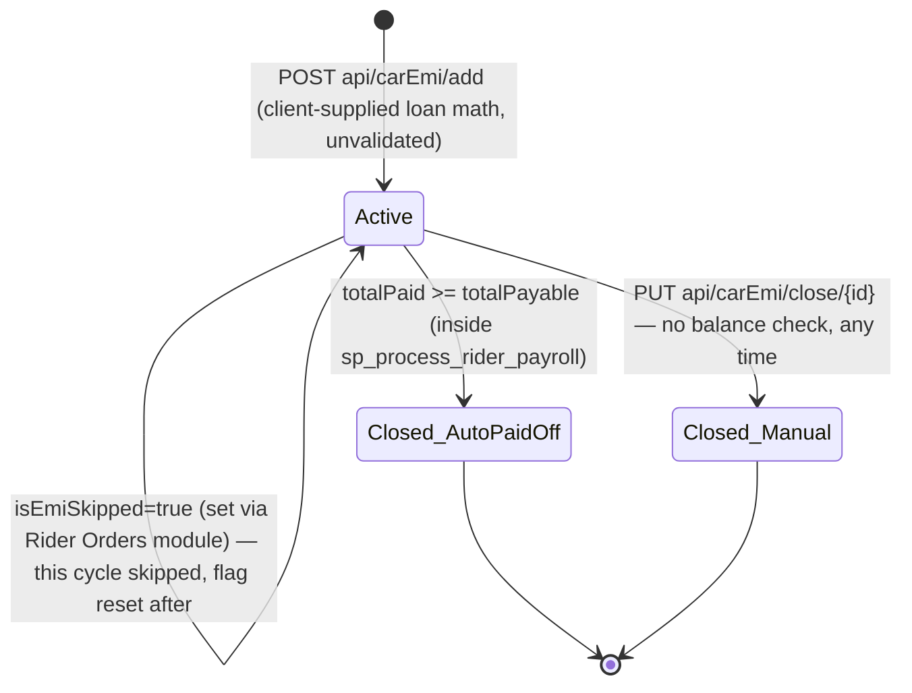
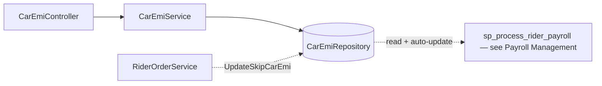
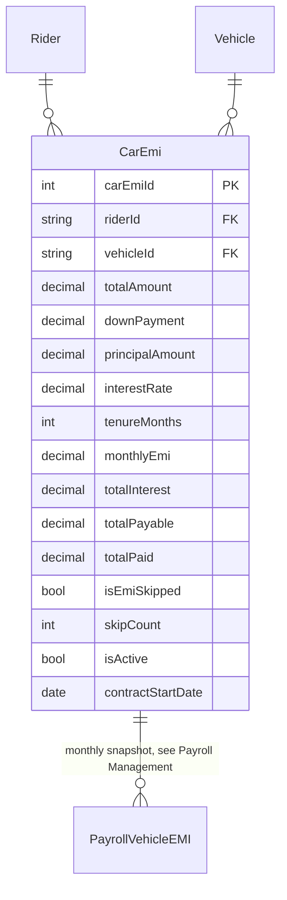

# Car EMI Management

## 1. Module overview

Tracks vehicle financing installment ("EMI") contracts held by riders — the loan terms, running payment balance, and skip/close state — which [Payroll Management](payroll-management.md)'s stored procedure reads and auto-amortizes every month. The API layer here is thin CRUD; the only real state-machine logic (payment progression, auto-close on payoff) lives in that other module's SQL, not here.

**Where it lives:**

| Concern | Path |
|---|---|
| Controller | `CAG.Admin.API/CAG.Admin.API/Controllers/v1/CarEmiController.cs` |
| Service | `CAG.Admin.API.Application/Service/Implementation/CarEmiService.cs` |
| Repository | `CAG.Admin.API.DBRepository/Repository/CarEmiRepository.cs` |

## 2. Business perspective

### 2.1 Business purpose

Some riders finance their vehicle through the company rather than owning or renting it outright ([Vehicle Management](vehicle-management.md)'s `OwnerType.Installment`). This module is the system of record for those loan terms and their running balance, feeding a monthly payroll deduction until the loan is paid off.

### 2.2 Key use cases

1. **Finance/Ops registers a new EMI contract** for a rider-vehicle pairing — loan amount, rate, tenure, computed monthly payment.
2. **Finance/Ops edits contract terms.**
3. **Finance/Ops manually closes a contract early** (e.g., payoff outside the normal schedule, vehicle returned).
4. **Finance/Ops deletes a contract record.**
5. **[Rider Orders & Batch Billing](rider-orders-batch-billing.md) flags a specific EMI as skipped** for the current cycle (`PUT api/riderorder/{id}/update/permanent` with a `CarEmiId`, if supplied — see that module's §3.4).
6. **[Payroll Management](payroll-management.md) reads active contracts and auto-advances them monthly**, closing any that reach full payment.
7. **[Dashboard & Reporting](dashboard-reporting.md) shows outstanding EMI totals and this-month's due amount.**

### 2.3 Business rules & logic

- **One EMI contract per rider-vehicle pairing**: `uq_rider_vehicle (riderId, vehicleId)` (database constraint, see [architecture-overview.md](architecture-overview.md) §4.5) — no application-layer duplicate check was found in the service; a violation would surface as an unhandled constraint exception.
- **All loan math is client-supplied, not server-computed or validated**: `CarEmiRequestModel` carries `TotalAmount`, `DownPayment`, `PrincipalAmount`, `InterestRate`, `TenureMonths`, `MonthlyEmi`, `TotalInterest`, and `TotalPayable` as plain, independently-settable decimal/int fields with **no DataAnnotations validation beyond `RiderId`/`VehicleId` being required**, and `InsertCarEmiAsync`/`UpdateCarEmiAsync` pass the DTO straight into a generic `AddAsync`/`UpdateAsync` call with no recalculation or cross-check (explicit, confirmed by reading both the repository and the DTO). [Inferred] Whatever amortization formula relates these fields to each other is implemented only in the UI's form logic, if at all — the server trusts whatever numbers arrive.
- **Two independent ways a contract becomes inactive**: a manual `PUT api/carEmi/close/{id}` sets `IsActive = 0` unconditionally, regardless of how much has actually been paid (explicit, `CloseCarEmiAsync` — a plain UPDATE with no balance check); separately, [Payroll Management](payroll-management.md)'s stored procedure auto-sets `IsActive = 0` only once `totalPaid >= totalPayable` (see that module's §2.3). Manual closure does not reconcile or write off any remaining balance.
- **Skipping a cycle is a one-directional flag set from a different module**: `UpdateSkipCarEmi(carEmiId, isEmiSkipped)` is called only from [Rider Orders & Batch Billing](rider-orders-batch-billing.md)'s order-update flow, not from anything in this module's own controller — there is no direct "skip this month" endpoint in `CarEmiController` itself. The flag is consumed and reset to `false` by [Payroll Management](payroll-management.md) on the next run (see that module's §2.3).
- **The EMI summary's "days remaining" figure is calendar-month-generic, not per-contract**: `GetEmiSummaryAsync`'s `DueInNextDays` is `DATEDIFF(LAST_DAY(CURDATE()), CURDATE())` — days left in the *current* calendar month, the same value for every contract and every caller, not a per-loan due date (explicit).

### 2.4 End-to-end business flows

**Contract lifecycle, spanning this module and [Payroll Management](payroll-management.md):**

### 2.5 Actors & interactions

| Actor | Role |
|---|---|
| Finance/Ops staff | Register, edit, close, delete contracts |
| [Payroll Management](payroll-management.md) | Owns the actual amortization logic and auto-closure |
| [Rider Orders & Batch Billing](rider-orders-batch-billing.md) | Sets the skip flag as a side effect of an order-record update |
| [Leave Management](leave-management.md) | Reads EMI data directly (bypassing this module's service) to enrich the rider leave-detail view |
| [Dashboard & Reporting](dashboard-reporting.md) | Reads the summary aggregate |

## 3. Technical perspective

### 3.1 Architecture overview

Minimal — a straight passthrough service over a repository whose only non-trivial method is the dashboard summary query.

### 3.2 Component breakdown

| Component | Responsibility | Key methods |
|---|---|---|
| `CarEmiController` | 7-endpoint HTTP surface | CRUD + close |
| `CarEmiService` | Company-scoped passthrough | `CreateAsync`, `UpdateAsync`, `CloseAsync`, `DeleteAsync`, `GetAllAsync`, `GetByRiderIdAsync`, `GetEmiSummaryAsync` |
| `CarEmiRepository` | `GenericRepository<CarEmi>` + summary query + skip/close raw SQL | `InsertCarEmiAsync`, `UpdateSkipCarEmi`, `CloseCarEmiAsync`, `GetEmiSummaryAsync` |

### 3.3 Detailed technical flows

No multi-step flow beyond straightforward CRUD exists within this module in isolation; the meaningful flow (monthly amortization) is documented in [Payroll Management](payroll-management.md) §2.4.

### 3.4 API & interface documentation

| Method | Route | Auth | Notes |
|---|---|---|---|
| `GET` | `api/carEmi/all` | `[Authorize]` (class-level) | Company-scoped |
| `GET` | `api/carEmi/{id}` | `[Authorize]` (class-level) | Company-scoped |
| `GET` | `api/carEmi/rider/{riderId}` | `[Authorize]` (class-level) | Throws `InvalidRequest` (400, not 404) if none found |
| `POST` | `api/carEmi/add` | `[Authorize]` (method-level, redundant) | No loan-math validation |
| `PUT` | `api/carEmi/update/{id}` | `[Authorize]` (class-level) | Full field overwrite |
| `PUT` | `api/carEmi/close/{id}` | `[Authorize]` (class-level) | Unconditional, no balance check |
| `DELETE` | `api/carEmi/delete/{id}` | `[Authorize]` (class-level) | Hard delete, no guard |

### 3.5 Database & data model

Unique constraint `uq_rider_vehicle (riderId, vehicleId)`.

### 3.6 External integrations

None.

### 3.7 Internal module dependencies

**Upstream:** none of substance — this module is close to a leaf node, reference-data-like in shape.

**Downstream:** [Payroll Management](payroll-management.md) (primary consumer and mutator), [Rider Orders & Batch Billing](rider-orders-batch-billing.md) (skip-flag writer), [Leave Management](leave-management.md) (direct repository read for view enrichment), [Dashboard & Reporting](dashboard-reporting.md) (summary).

### 3.8 Configuration & environment

None module-specific.

### 3.9 Background jobs & workers

None — all state progression happens inside [Payroll Management](payroll-management.md)'s manually-triggered generation, not on a schedule.

### 3.10 Events & messaging

None.

### 3.11 Authentication & authorization

`[Authorize]` at both class and method level (redundant on `Create`); company-scoped reads; no role checks, consistent with the platform-wide pattern.

### 3.12 Validation & error handling

- **No validation of loan-math consistency** — `MonthlyEmi × TenureMonths` need not equal `TotalPayable`, and `PrincipalAmount + TotalInterest` need not equal `TotalPayable`, since nothing checks these relationships server-side. An inconsistent contract would still drive [Payroll Management](payroll-management.md)'s deduction and progress arithmetic exactly as entered.
- `GetByRiderIdAsync` throws `InvalidRequest` (400) for a not-found rider EMI record — a not-found condition mapped to a 400 rather than the platform's own `EntityNotFound` (404) convention.
- `CloseCarEmiAsync`/`DeleteCarEmiAsync` have no existence checks.

### 3.13 Logging & observability

None beyond the platform-wide exception log.

### 3.14 Design patterns & architectural decisions

Deliberately thin — this module's design places all the interesting logic in [Payroll Management](payroll-management.md), leaving this one as a data-entry and reference surface. That's a reasonable split *if* the loan-math trust boundary (§3.12) is acceptable; it becomes a real liability specifically because the numbers entered here flow unchecked into automated monthly payroll deductions.

## 4. Risk & improvement analysis

### 4.1 Edge cases & failure scenarios

- An EMI contract entered with internally-inconsistent numbers (e.g., a `MonthlyEmi` that would never amortize `TotalPayable` within `TenureMonths`, or a negative value in any field) is accepted as-is and will drive incorrect payroll deductions indefinitely.
- Manually closing a contract via `PUT api/carEmi/close/{id}` before it's fully paid leaves the unpaid remainder unresolved — no write-off, refund, or reconciliation record is created.
- Duplicate `(riderId, vehicleId)` contract creation relies entirely on the database constraint; the resulting error is unhandled/ungraceful.

### 4.2 Known limitations

- No server-side amortization calculation or validation.
- `GetByRiderIdAsync`'s 400-for-not-found is inconsistent with the platform's `EntityNotFound`/404 convention used elsewhere.
- No skip-flag management endpoint exists directly in this module — it's set only as a side effect of [Rider Orders & Batch Billing](rider-orders-batch-billing.md).

### 4.3 Security considerations

No role checks; company-scoped reads only — consistent with the platform-wide gap, notable here given the financial nature of the data.

### 4.4 Performance considerations

Nothing notable — `CarEmi` has 0 rows in the current dataset snapshot (see [architecture-overview.md](architecture-overview.md) §4.3), so this module is effectively unused/untested in the observed data at the time of this analysis. [Inferred from the row-count table, not independently re-verified here]

### 4.5 Potential improvements

**Quick wins:**
- Change `GetByRiderIdAsync`'s not-found response to `EntityNotFound`/404.
- Add existence checks to `CloseCarEmiAsync`/`DeleteCarEmiAsync`.

**Medium effort:**
- Add server-side validation that the four loan-math fields are internally consistent (or compute `TotalInterest`/`TotalPayable`/`MonthlyEmi` server-side from `PrincipalAmount`/`InterestRate`/`TenureMonths` rather than trusting client-supplied totals).
- Add a first-class "skip this cycle" endpoint to `CarEmiController` rather than only reaching the flag through [Rider Orders & Batch Billing](rider-orders-batch-billing.md).

**Major refactors:**
- If early/manual closure with an outstanding balance is a real business scenario, add an explicit write-off or balance-transfer path rather than silently dropping the remainder.

## 5. Summary

- Tracks vehicle financing contracts; the module itself is thin CRUD, with the real amortization state machine living in [Payroll Management](payroll-management.md)'s stored procedure.
- **Confirmed**: all loan-math fields (principal, rate, tenure, monthly payment, totals) are client-supplied with zero server-side validation or consistency checking, yet drive automated monthly payroll deductions.
- Two independent closure paths exist — automatic (fully paid, inside payroll) and manual (any time, no balance check) — with no reconciliation on the manual path.
- The "skip this cycle" flag is set only from a different module ([Rider Orders & Batch Billing](rider-orders-batch-billing.md)), not from this one's own controller.
- Currently zero rows in the live dataset per the schema snapshot, suggesting this feature may be new or lightly used.
