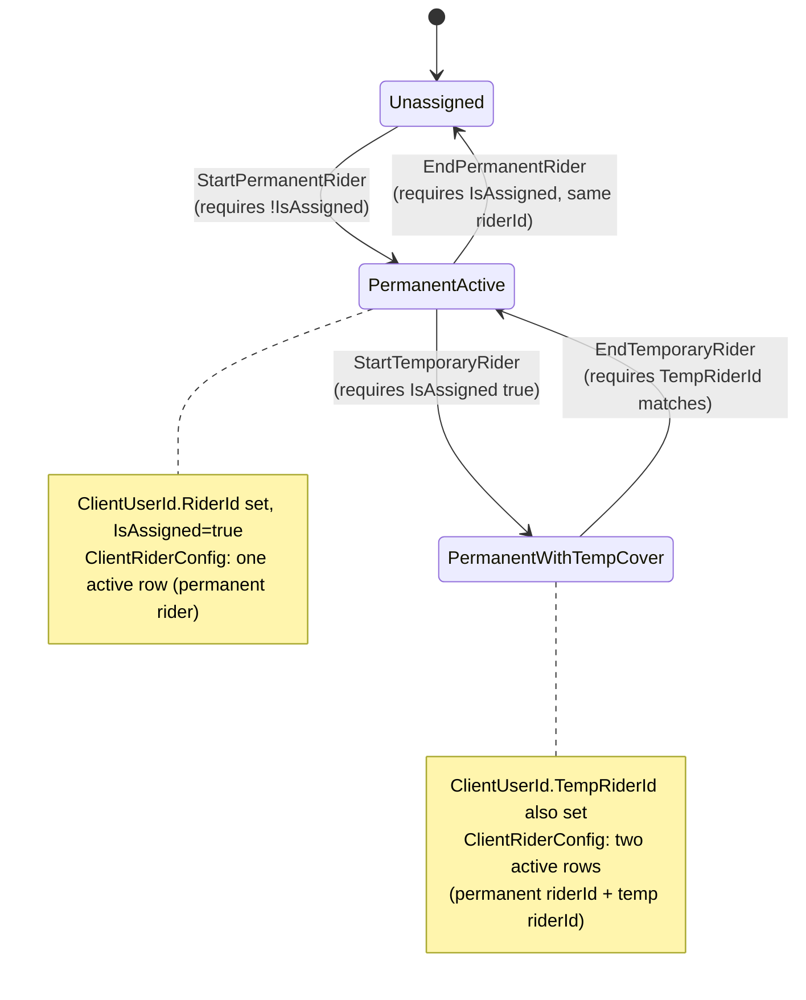
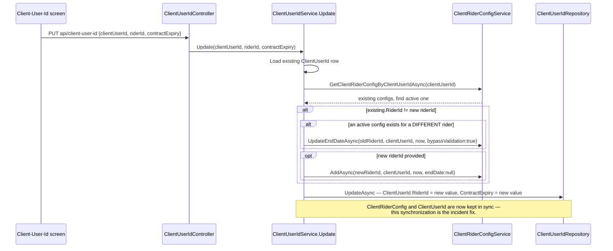
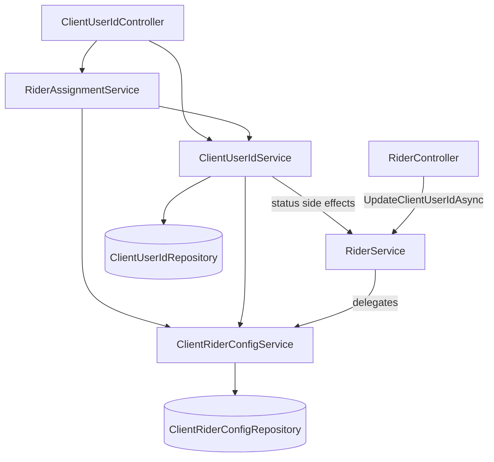
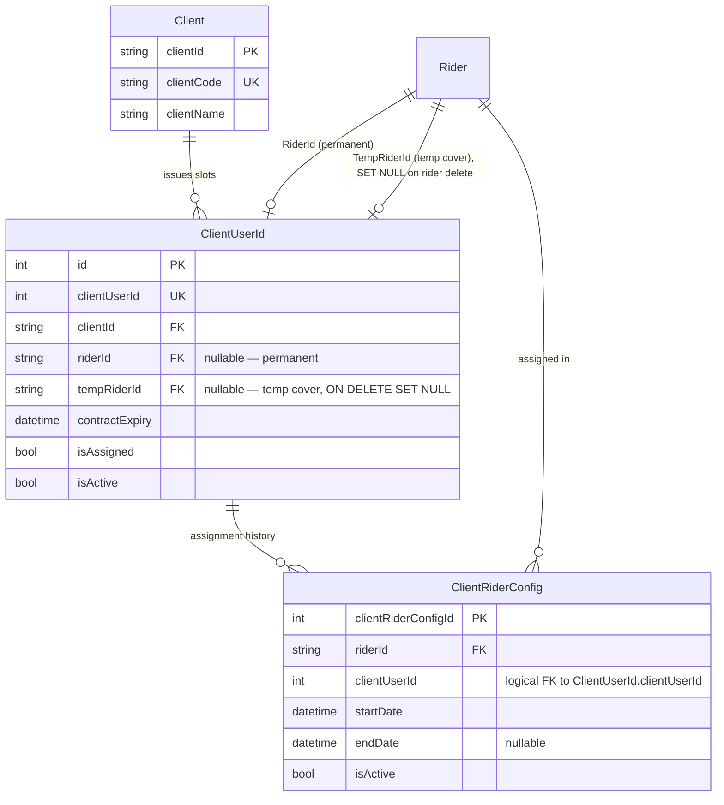

# Client & Client-User-ID Mapping

## 1. Module overview

Manages external **Clients** (the businesses CAG's riders deliver for) and the **ClientUserId** contract-slot model that maps a client's delivery-app account slot to CAG riders over time, including a permanent/temporary-cover dual-assignment scheme and a full historical audit trail (`ClientRiderConfig`). This module was the subject of a documented production data-consistency incident (May 18, 2026) whose fix is now live in the code inspected here.

**Where it lives:**

| Concern | Path |
|---|---|
| Client CRUD | `ClientController.cs` → `ClientService` |
| ClientUserId slot management | `ClientUserIdController.cs` → `ClientUserIdService` |
| Assignment state machine | `RiderAssignmentService.cs` |
| Historical mapping | `ClientRiderConfigService.cs`, `ClientRiderConfigRepository.cs` |
| Prior incident record | `CAG.Admin.API/ANALYSIS_ClientRiderConfig_ClientUserId_Mismatch.md`, `IMPACT_ANALYSIS_Functionality_Check.md`, `QUICK_REFERENCE_RiderId_Mismatch.md` (repo-root, not code, but directly informs this module's current design) |
| UI | `src/app/(pages)/Rider/Client-User-Id/`, `http-client/client-user-id.api.ts`, `client.api.ts` |

## 2. Business perspective

### 2.1 Business purpose

CAG's riders deliver under client-issued app accounts (e.g., a food-delivery platform account). A client's account slot (`ClientUserId`) needs a rider assigned to it to be usable, and the business needs to (a) track which rider currently holds which slot, (b) support a **temporary cover rider** while the permanent holder is unavailable, without losing the permanent assignment, and (c) keep a clean audit trail of assignment history for billing and dispute resolution (rider order imports key off this mapping — see [Rider Orders & Batch Billing](rider-orders-batch-billing.md)).

### 2.2 Key use cases

1. **Onboard a new client** — CRUD via `ClientController`.
2. **Create a new ClientUserId slot**, optionally with an initial rider and date range.
3. **Start a permanent rider assignment** on an existing (currently unassigned) slot.
4. **End a permanent rider assignment** — frees the slot.
5. **Start a temporary cover rider** on a slot whose permanent assignment continues underneath.
6. **End a temporary cover rider** — reverts the slot to its permanent rider.
7. **Directly edit a slot's rider/contract expiry** (the endpoint at the center of the historical incident).
8. **Delete a slot** — cascades to free any active permanent/temp rider and close their config history.
9. **[Rider Orders & Batch Billing](rider-orders-batch-billing.md) reads the active mapping** to determine which rider gets credited for a client's delivery orders during import.

### 2.3 Business rules & logic

**The data model, precisely** (confirmed by reading both DBModels and every service method, not inferred):

- `ClientUserId` is a **slot**: one row per client-issued account, holding at most one `RiderId` (permanent) and at most one `TempRiderId` (temporary cover) at a time, plus an `IsAssigned` flag and a `ContractExpiry` date.
- `ClientRiderConfig` is a **per-rider assignment history** row: `(RiderId, ClientUserId, StartDate, EndDate, IsActive)`. Critically, it has **no field distinguishing permanent from temporary** — a slot can have *two simultaneously-active* `ClientRiderConfig` rows (one for the permanent rider's ID, one for the temp rider's ID), disambiguated only by which `RiderId` each row carries, not by any "type" column. [Confirmed by reading `ClientRiderConfigService.UpdateEndDateAsync`'s lookup filter, which keys on `(RiderId, ClientUserId, IsActive)`, not on `ClientUserId` alone]
- **Starting a permanent rider requires the slot to be currently unassigned to a *different* rider** — `StartPermanentRider` throws `ValidationFailed` if `cui.IsAssigned` is true, *or* if `cui.RiderId != riderId` (explicit, `RiderAssignmentService`). Ending it requires the reverse (`!cui.IsAssigned` → error).
- **Starting a temporary rider requires the slot's permanent side to be currently assigned** (`StartTemporaryRider` throws if `cui.IsAssigned` — note: this checks the *same* `IsAssigned` flag the permanent flow uses, not a separate temp-specific flag) [Inferred: this reads as intending "you can't add temp cover to an already-permanently-assigned-and-marked slot," but see §4.1 for a concrete inconsistency this creates].
- **Every assignment start/end pairs a `ClientRiderConfig` history write with a `ClientUserId` slot-state write**, always in the same order (history first, then slot state) across all four `RiderAssignmentService` methods — this consistent ordering is what the May 2026 fix (below) generalized into the direct-edit path too.
- **The documented incident and its fix**: `PUT api/client-user-id` (`ClientUserIdService.Update`) previously updated only `ClientUserId.RiderId`, leaving `ClientRiderConfig` untouched — so a direct rider reassignment through this one endpoint diverged from the `ClientRiderConfig` history that [Rider Orders & Batch Billing](rider-orders-batch-billing.md)'s import used as its source of truth, causing orders to be attributed to the *previous* rider (`RD261011`) instead of the newly-assigned one (`RD261089`). The fix, present in the current `ClientUserIdService.Update` (confirmed by reading it): when `riderId` changes, it now first ends the current active `ClientRiderConfig` (if the active config's rider differs from the new one) and creates a new active one, *before* updating `ClientUserId.RiderId` itself. The old direct-update code path (`UpdateClientUserIdAsync` called straight from the controller) is now **commented out** in `ClientUserIdController.cs` rather than deleted — a visible fossil of the incident.
- **`AddClientUserIdAsync` no longer auto-activates the assigned rider** — a status-activation call (`RiderService.ChangeRiderStatus(riderId, RiderStatuses.Active)`) is present in the source but commented out (explicit). [Inferred] Either superseded by the `update-rider-assignment` endpoint's explicit `ChangeRiderStatus` call (which *is* live — see below) or a deliberately disabled rule; the effect today is that creating a slot with a rider pre-assigned does not, by itself, flip that rider to Active.
- **`PUT api/client-user-id/update-rider-assignment` explicitly toggles rider status as a side effect**: `Action=START` sets the rider `Active`; `Action=END` sets them `FreeId` (explicit, `ClientUserIdController.UpdateClientUserId`) — this is a *third* place (alongside [Rider Management](rider-management.md)'s own status endpoints) that can change `Rider.StatusId`.
- **Deleting a slot cascades status + history cleanup**: `DeleteClientUserIdAsync` looks up both the permanent and temp rider (if any), flips either from `Active` to `FreeId`, and closes out both their `ClientRiderConfig` histories with today's date — all run concurrently via `Task.WhenAll` (explicit).

### 2.4 End-to-end business flows

**The four-verb assignment state machine (`RiderAssignmentService`):**



**Direct rider reassignment (`PUT api/client-user-id`) — the fixed flow:**



**Slot deletion cascade:**

```mermaid
flowchart TD
    A[DeleteClientUserIdAsync id] --> B[Load slot]
    B --> C{RiderId set?}
    B --> D{TempRiderId set?}
    C -- yes --> E[Fetch permanent rider, skipStatusCheck]
    D -- yes --> F[Fetch temp rider, skipStatusCheck]
    E --> G{permanent rider<br/>StatusId == Active?}
    G -- yes --> H[ChangeRiderStatus -> FreeId]
    F --> I{temp rider<br/>StatusId == Active?}
    I -- yes --> J[ChangeRiderStatus -> FreeId]
    E --> K[UpdateEndDateAsync permanent config, bypassValidation]
    F --> L[UpdateEndDateAsync temp config, bypassValidation]
    H & J & K & L -.Task.WhenAll, run concurrently.-> M[DeleteAsync the ClientUserId row]
```

### 2.5 Actors & interactions

| Actor | Role |
|---|---|
| Ops/Coordinator staff | Manage slot assignments day-to-day (start/end permanent/temp cover) |
| [Rider Management](rider-management.md) | Downstream of status side effects (`Active`/`FreeId` toggled from here) |
| [Rider Orders & Batch Billing](rider-orders-batch-billing.md) | Reads `ClientRiderConfig` as the source of truth for order attribution — the module the original incident actually broke |

## 3. Technical perspective

### 3.1 Architecture overview

Three-layer collaboration: `ClientUserIdService` owns the slot record itself; `ClientRiderConfigService` owns the historical audit trail; `RiderAssignmentService` sits above both as an orchestrator enforcing the state-machine preconditions in §2.3 and keeping the two in sync for the four "guided" operations. The one operation that bypasses `RiderAssignmentService` (`ClientUserIdService.Update`, the direct-edit endpoint) implements its own, narrower synchronization logic — which is exactly where the historical bug lived.



### 3.2 Component breakdown

| Component | Responsibility | Key methods |
|---|---|---|
| `ClientService` | Plain CRUD on `Client` | `GetAllClientsAsync`, `AddClientAsync`, etc. |
| `ClientUserIdService` | Slot record CRUD; the fixed direct-update path; deletion cascade | `AddClientUserIdAsync`, `Update` (fixed), `UpdateClientUserIdAsync` (legacy, still used internally by `RiderAssignmentService`), `DeleteClientUserIdAsync` |
| `RiderAssignmentService` | State-machine orchestration for guided permanent/temp start/end | `AssignClientUserToRiderAsync`, `Start/EndPermanentRider`, `Start/EndTemporaryRider` |
| `ClientRiderConfigService` | Historical assignment records | `AddAsync`, `UpdateEndDateAsync`, `GetByRiderIdAsync`, `GetClientRiderConfigByClientUserIdAsync` |

### 3.3 Detailed technical flows

Already covered in full in §2.4 (state machine, direct-update fix, deletion cascade) — those diagrams are the technical trace, not just the business narrative, since the logic in this module *is* the business rule.

### 3.4 API & interface documentation

| Method | Route | Delegates to | Notes |
|---|---|---|---|
| `GET` | `api/client-user-id/all?details=&free=` | `ClientUserIdService` (3 variants by query flag) | `free=true` → unassigned slots only; `details=true` → joined view |
| `GET` | `api/client-user-id/{id}` | `GetClientUserIdByIdAsync` | |
| `POST` | `api/client-user-id` | `RiderAssignmentService.AssignClientUserToRiderAsync` | Creates slot + optional initial `ClientRiderConfig` |
| `DELETE` | `api/client-user-id/{id}` | `DeleteClientUserIdAsync` | Full cascade (§2.4) |
| `PUT` | `api/client-user-id/update-rider-assignment` | `RiderAssignmentService` (4-way dispatch on `Type`×`Action`) + `RiderService.ChangeRiderStatus` | The guided state-machine entry point |
| `PUT` | `api/client-user-id` | `ClientUserIdService.Update` | The direct-edit endpoint, now fixed to sync `ClientRiderConfig` |
| `GET`/`POST`/`PUT`/`DELETE` | `api/client` | `ClientService` | Plain client CRUD |

The **old** `PUT api/client-user-id` handler (pre-fix, calling `UpdateClientUserIdAsync` directly with no `ClientRiderConfig` sync) is left in `ClientUserIdController.cs` as a commented-out block rather than removed.

### 3.5 Database & data model



Check constraint on `ClientRiderConfig`: `endDate IS NULL OR endDate >= startDate` (from [architecture-overview.md](architecture-overview.md) §4.5) — the one piece of this invariant enforced by the database itself rather than application code.

### 3.6 External integrations

None.

### 3.7 Internal module dependencies

**Upstream:** [Rider Management](rider-management.md) (`RiderService.ChangeRiderStatus`, `GetRiderByIdAsync`).

**Downstream:** [Rider Orders & Batch Billing](rider-orders-batch-billing.md) reads `ClientRiderConfig` to attribute imported orders to the correct rider — this is the consumer the original incident affected, and the reason this module's internal consistency matters beyond its own screen.

### 3.8 Configuration & environment

None module-specific.

### 3.9 Background jobs & workers

None. Contract expiry (`ContractExpiry` on `ClientUserId`) is not swept by any scheduled job found in the codebase — an expired contract does not automatically end the assignment or change `IsAssigned`. [Inferred from absence — no code path was found that reads `ContractExpiry` for enforcement, only for display/export]

### 3.10 Events & messaging

None.

### 3.11 Authentication & authorization

`ClientUserIdController` has class-level `[Authorize]` but, notably, **most of its individual actions have no method-level `[Authorize]` at all** (unlike most other controllers in the codebase, which redundantly repeat it) — functionally identical under ASP.NET's attribute inheritance, but an inconsistency in code style worth noting since it stands out against the codebase's dominant pattern. No role check anywhere, consistent with the platform-wide finding in [architecture-overview.md](architecture-overview.md) §5.

### 3.12 Validation & error handling

- `RiderAssignmentService`'s four state-machine methods validate preconditions explicitly and throw `ValidationFailed` (400) with descriptive messages — one of the more thoroughly-validated corners of the codebase.
- `ClientUserIdController.UpdateClientUserId` (the `update-rider-assignment` endpoint) validates `Type`/`Action` against hardcoded string sets (`"PERMANENT"/"TEMP"`, `"START"/"END"`) rather than binding to an enum — a stringly-typed API contract that a client-side typo would only catch at runtime.
- `DateTime.Parse(dto.Date)` in that same handler is unguarded — a malformed date string throws an unhandled `FormatException`, surfacing as a generic 500 rather than a validation error. (`AddClientUserId`'s `DateTime.TryParse` for `StartDate`/`EndDate` is the safer pattern, used inconsistently within the same controller.)

### 3.13 Logging & observability

None beyond the platform-wide exception log. No audit log of *who* changed a rider assignment beyond the generic `UpdatedBy` column on each row touched — reconstructing "who reassigned this slot and why" requires correlating `ClientRiderConfig` history rows with `UpdatedBy`/`CreatedBy` manually.

### 3.14 Design patterns & architectural decisions

- **Orchestrator-over-two-aggregates pattern** (`RiderAssignmentService` coordinating `ClientUserIdService` + `ClientRiderConfigService`) is a deliberate design that, when followed consistently, is exactly what prevents the class of bug the incident exposed. The incident happened precisely in the one place (`ClientUserIdService.Update`) that didn't originally go through this orchestration.
- **Leaving the buggy code path commented out rather than deleted** is worth naming as a (likely unintentional) documentation-in-code choice — it preserves the "before" state for anyone reading the file, at the cost of dead code accumulating in a live controller.

## 4. Risk & improvement analysis

### 4.1 Edge cases & failure scenarios

- **`StartTemporaryRider`'s precondition may be backwards for its own use case**: it requires `cui.IsAssigned == true` to start temp cover, i.e., a temp rider can only be added when the slot is *already* marked assigned — which is presumably true when a permanent rider holds it, but `IsAssigned` is a single shared boolean, not permanent-specific. [Inferred from re-reading the four methods together] If `IsAssigned` were ever `true` due to a temp-only assignment with no permanent rider (not observed as reachable through the four guided methods, but not structurally prevented at the data level either, given `ClientUserId.RiderId` is nullable), the "temp cover requires a permanent holder" intent could be violated without the code detecting it.
- The commented-out old `PUT` handler and the commented-out `ChangeRiderStatus` call in `AddClientUserIdAsync` are both silent behavior changes relative to whatever the UI's help text or user expectations still assume — worth confirming neither is user-visibly expected to still happen.
- `DateTime.Parse` (unguarded) in `update-rider-assignment` will 500 on a malformed date rather than returning a 400.

### 4.2 Known limitations

- No enforcement of `ContractExpiry` — an expired contract slot remains assignable/active indefinitely unless a human notices and manually ends it.
- `ClientRiderConfig` has no field to distinguish a permanent from a temporary assignment after the fact — reconstructing "was this historical row a permanent or temp-cover assignment" requires cross-referencing timing against `ClientUserId`'s current state, which is lossy once further reassignments have occurred.
- Two overlapping "update" verbs remain in `ClientUserIdService` (`Update` and `UpdateClientUserIdAsync`) with different sync behavior and different callers — a future maintainer adding a new call site could easily pick the legacy, non-syncing one by mistake, exactly reproducing the original incident. This is the single most important thing for a future change in this module to get right.

### 4.3 Security considerations

No role check on any endpoint in this module (platform-wide finding); slot reassignment and deletion — both of which have real billing consequences via [Rider Orders & Batch Billing](rider-orders-batch-billing.md) — are reachable by any authenticated user.

### 4.4 Performance considerations

`DeleteClientUserIdAsync`'s use of `Task.WhenAll` for the four concurrent lookups/updates is a reasonable, correctly-applied optimization — one of the few places in the codebase using explicit concurrency for a business operation rather than sequential awaits.

### 4.5 Potential improvements

**Quick wins:**
- Replace `DateTime.Parse` with `DateTime.TryParse` in `update-rider-assignment`, matching the safer pattern already used in `AddClientUserId`.
- Delete the commented-out legacy `PUT` handler now that its replacement is verified live, or convert the comment into a code comment explaining the incident for future readers if intentionally kept as a warning.
- Replace the `Type`/`Action` string pairs with enums for compile-time safety.

**Medium effort:**
- Consolidate `ClientUserIdService.Update` and `UpdateClientUserIdAsync` into a single method (or make the legacy one `private`/internal-only, callable solely through `RiderAssignmentService`) to remove the risk of a future caller bypassing synchronization.
- Add a `Type` (permanent/temp) column to `ClientRiderConfig` so history is self-describing without needing to infer it from concurrent state.

**Major refactors:**
- Add scheduled or on-access enforcement of `ContractExpiry` (auto-end an assignment past its contract date), if that matches actual business intent — currently undetermined from the code alone.

## 5. Summary

- Models client delivery-app account slots (`ClientUserId`) with a permanent rider plus optional simultaneous temporary cover rider (`TempRiderId`), backed by a per-rider assignment history (`ClientRiderConfig`).
- This module previously shipped a real production bug — a direct-edit endpoint updated the slot's current rider without updating the historical config table, causing [Rider Orders & Batch Billing](rider-orders-batch-billing.md)'s import to attribute orders to the wrong rider — fixed as of May 18, 2026, confirmed live in the current code.
- The fix's evidence is visible in the source itself: the old buggy handler is commented out rather than deleted, and the new `Update` method now explicitly re-synchronizes `ClientRiderConfig` before saving.
- A four-verb orchestrated state machine (`RiderAssignmentService`) is the "safe" path for permanent/temporary assignment changes; a narrower direct-edit path still exists in parallel and is where a *future* version of the same bug class is most likely to reappear if a new caller bypasses it.
- Slot deletion cascades correctly and concurrently across rider status, config history, and the slot record itself.
- No enforcement of contract expiry; no role-based access control, consistent with the rest of the platform.
