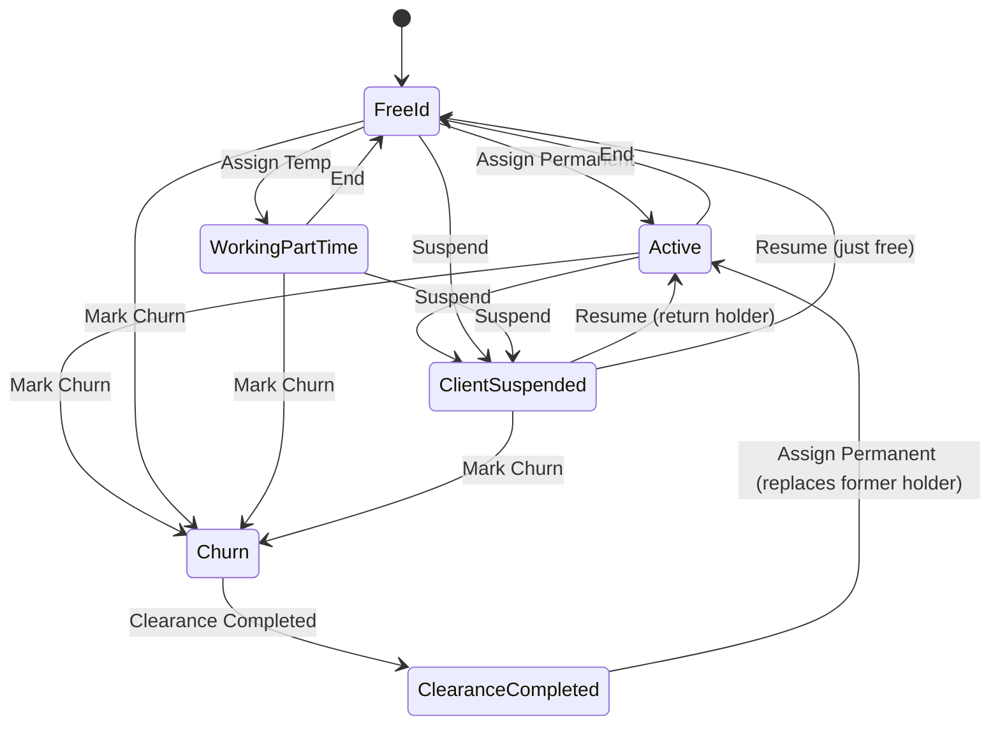
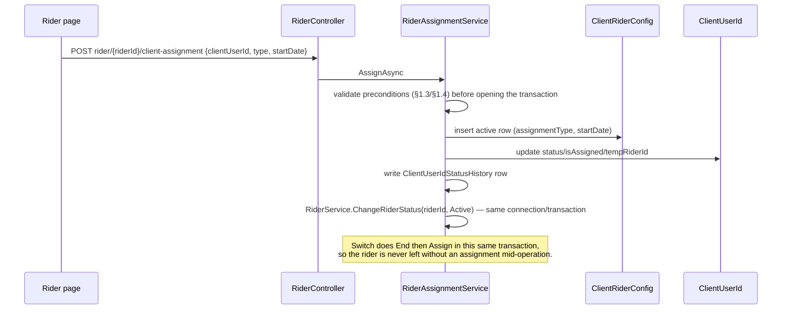
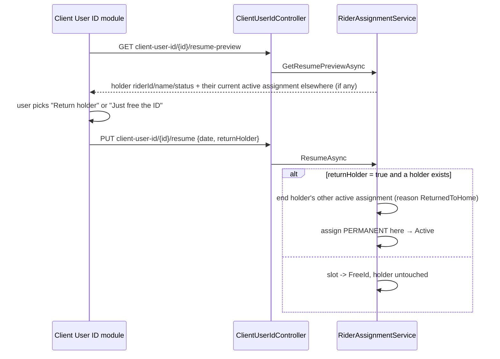
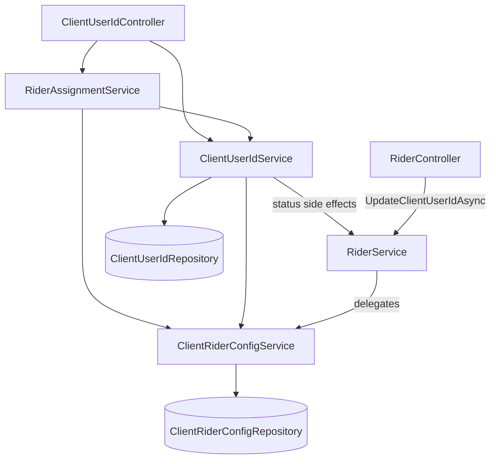
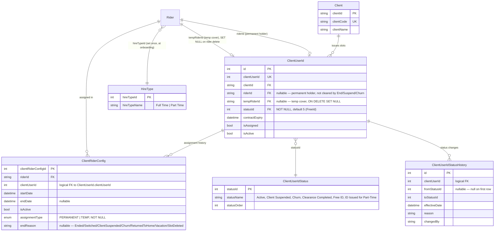

# Client & Client-User-ID Mapping

## 1. Module overview

Manages external **Clients** (the businesses CAG's riders deliver for) and the **ClientUserId** contract-slot model that maps a client's delivery-app account slot to CAG riders over time, including a permanent/temporary-cover dual-assignment scheme and a full historical audit trail (`ClientRiderConfig`). This module was the subject of a documented production data-consistency incident (May 18, 2026) whose fix is now live in the code inspected here.

**Where it lives:**

| Concern | Path |
|---|---|
| Client CRUD | `ClientController.cs` → `ClientService` |
| ClientUserId slot management | `ClientUserIdController.cs` → `ClientUserIdService` |
| Assignment state machine | `RiderAssignmentService.cs` |
| Historical mapping | `ClientRiderConfigService.cs`, `ClientRiderConfigRepository.cs` |
| Prior incident record | `CAG.Admin.API/ANALYSIS_ClientRiderConfig_ClientUserId_Mismatch.md`, `IMPACT_ANALYSIS_Functionality_Check.md`, `QUICK_REFERENCE_RiderId_Mismatch.md` (repo-root, not code, but directly informs this module's current design) |
| UI | `src/app/(pages)/Rider/Client-User-Id/`, `http-client/client-user-id.api.ts`, `client.api.ts` |

## 2. Business perspective

### 2.1 Business purpose

CAG's riders deliver under client-issued app accounts (e.g., a food-delivery platform account). A client's account slot (`ClientUserId`) needs a rider assigned to it to be usable, and the business needs to (a) track which rider currently holds which slot, (b) support a **temporary cover rider** while the permanent holder is unavailable, without losing the permanent assignment, and (c) keep a clean audit trail of assignment history for billing and dispute resolution (rider order imports key off this mapping — see [Rider Orders & Batch Billing](rider-orders-batch-billing.md)).

### 2.2 Key use cases

1. **Onboard a new client** — CRUD via `ClientController`.
2. **Create a new ClientUserId slot**, optionally with an initial rider and date range.
3. **Start a permanent rider assignment** on an existing (currently unassigned) slot.
4. **End a permanent rider assignment** — frees the slot.
5. **Start a temporary cover rider** on a slot whose permanent assignment continues underneath.
6. **End a temporary cover rider** — reverts the slot to its permanent rider.
7. **Directly edit a slot's rider/contract expiry** (the endpoint at the center of the historical incident).
8. **Delete a slot** — cascades to free any active permanent/temp rider and close their config history.
9. **[Rider Orders & Batch Billing](rider-orders-batch-billing.md) reads the active mapping** to determine which rider gets credited for a client's delivery orders during import.

### 2.3 Business rules & logic

**Rewritten September 2026** (client-user-id-assignment-rework) to replace the model described further below in §4 — that section still documents the *prior* design and the incident that motivated this rewrite; treat §4 as history, not current behavior.

**The data model, precisely:**

- `ClientUserId` is a **slot**: one row per client-issued account. It carries `StatusId` (`ClientUserIdStatus`: 1 Active, 2 Client Suspended, 3 Churn, 4 Clearance Completed, 5 Free ID, 6 ID Issued for Part-Time), plus the denormalized `RiderId` (permanent holder), `TempRiderId` (temp cover), `IsAssigned`, and `ContractExpiry`. `StatusId` is never written directly by a caller — it's always derived by `RiderAssignmentService` from whether the slot has an active `ClientRiderConfig` and that row's `AssignmentType`.
- **Names (2026-10-01):** the client's wording is *Free ID* and *ID Issued for Part-Time*; the master table still says `FreeId` / `Working Part-Time` until `Database/Migrations/2026-10-01_ClientUserIdStatus_Names.sql` is run (the C# enum member stays `WorkingPartTime`). The UI shows its own names either way. **Vacation is not a Client rider status** — it is a Company rider status only, set by Leave Management (Phase II RM-05 / RM-06, decided 2026-10-01).
- **Status list in the UI (2026-10-01):** the rider pages' *Client rider status → Change* menu (edit mode only) and the Client User ID flyout's *Client rider status* section list all six statuses. Only Suspend, Resume (→ Active, or → Free ID), Release (ID Issued for Part-Time → Free ID), Mark Churn and Clearance Completed are user actions and are clickable when allowed from the current status; Active, Free ID and ID Issued for Part-Time are set by the assignment operations (assign / end / assign TEMP) and are shown greyed out with the reason. Rules: `getStatusChangeActionKeys` in `components/details/client-user-id/client-user-id-status-rules.ts`.
- `ClientRiderConfig` is a **per-assignment-period history** row: `(RiderId, ClientUserId, StartDate, EndDate, IsActive, AssignmentType, EndReason)`. `AssignmentType` (`PERMANENT`/`TEMP`) makes history self-describing — the single biggest gap in the prior model (§4.2 below). `EndReason` is one of `Ended`, `Switched`, `ClientSuspended`, `Churn`, `ReturnedToHome`, `Vacation`, `SlotDeleted`.
- `ClientUserIdStatusHistory` is new: one row per status transition (`fromStatusId`, `toStatusId`, `effectiveDate`, `reason`, `changedBy`), giving an audit trail status changes previously had none of (§3.13's old gap).
- `Rider.HireTypeId` (1 Full Time / 2 Part Time) is now set once at onboarding and never updated — `Rider.EmploymentType` remains the *current* type, which can diverge from hire type over a rider's tenure.

**Invariants** (I1–I6), enforced in `RiderAssignmentService` up front and, since Phase 4 of the rework, backed by unique indexes on generated DB columns as a race-condition safety net:

- I1/I2 — a rider has at most one active `ClientRiderConfig`; a slot has at most one active `ClientRiderConfig`. (`UX_CRC_ActiveRider`, `UX_CRC_ActiveSlot`)
- I3 — a rider is the permanent holder (`ClientUserId.riderId`) of at most one slot whose status isn't Churn/Clearance Completed. (`UX_CUI_LiveHolder`)
- I4 — status ∈ {Active, ID Issued for Part-Time} ⇔ an active CRC exists ⇔ `isAssigned = 1`; `tempRiderId` is set ⇔ status = ID Issued for Part-Time.
- I5 — a new assignment period must start on/after the latest ended period, per rider and per slot (no overlap on new writes; historical overlaps from before the rework are left as-is).
- I6 — dates can't be in the future; `endDate ≥ startDate` (DB `CHECK`).

A duplicate-key error (1062) from I1–I3's unique indexes is caught and turned into a readable 400 — the last line of defense when two requests race past the service-layer precondition checks.

**Operations, by where they're triggered:**

*Rider page* (`RiderAssignmentService.AssignAsync` / `EndAsync` / `SwitchAsync`):
- **Assign Permanent** — slot must be FreeId (with no different existing holder) or Clearance Completed (replaces the former holder); rider must be Full Time, have no active assignment, and not already hold another live slot (I3).
- **Assign Temp** — slot must be FreeId and not the rider's own home slot; rider must be Part Time, or a Full Time rider whose own home slot is Client Suspended.
- **End** — ends the rider's active assignment; slot → FreeId (its `riderId` is *not* cleared — see below).
- **Release** (`PUT api/client-user-id/{id}/release`, `RiderAssignmentService.ReleaseAsync`, added 2026-10-03) — the same as *End* on the covering part-time rider, started from the ID: only for an *ID Issued for Part-Time* slot; ends the active TEMP assignment (reason `Ended`), slot → Free ID, the rider → Company status Free ID. In the UI it is *Client rider status → Free ID* on the Client User ID flyout or the rider page when the ID is in *ID Issued for Part-Time*. Before this, the only ways to take the ID back from the ID's side were Suspend / Churn, which also change the client's status for the ID.
- **Switch** — End + Assign on the same date, one transaction.

*Rider page — employment type* (`RiderAssignmentService.ChangeEmploymentTypeAsync`, `PUT api/rider/{riderId}/employment-type`, with `GET …/employment-type/preview?type=` for the confirm dialog):
- The business case: a permanent rider's own ID is **Client Suspended** → they're switched to **Part Time** (paid as part-time) and cover a Free ID as TEMP → when the ID is resumed with "Return holder" they go back to it as PERMANENT and are switched back to **Full Time** automatically (in the same Resume transaction).
- **Full Time → Part Time** — blocked while the rider is working PERMANENT on an ID, and while they still hold a live own ID that isn't Client Suspended (suspend it or mark it Churn first). A Client Suspended own ID is kept — they stay its holder so they can return. An active TEMP assignment continues.
- **Part Time → Full Time** — an active TEMP assignment continues only if their own ID is Client Suspended; otherwise it is ended (reason `Ended`) on the given date, in the same transaction.
- Only `Rider.EmploymentType` changes; `HireTypeId` (onboarding type) never does.
- Payroll is unaffected by this switch: `PayrollRepository.GetDraftPayrollAsync` classifies full/part-time pay from the rider's latest assignment (permanent holder of the slot vs. not), not from `EmploymentType`.

*Client User ID module* (`RiderAssignmentService.SuspendAsync` / `ResumeAsync` / `MarkChurnAsync` / `MarkClearanceCompletedAsync`):
- **Suspend** (from Active/FreeId/ID Issued for Part-Time) — ends any active assignment (reason `ClientSuspended`) and moves the slot to Client Suspended.
- **Resume** (from Client Suspended) — two-step: `GET .../resume-preview` reports the holder and whether they're currently covering another slot; the caller then confirms whether to **return the holder** (ends their other assignment, reason `ReturnedToHome`, and reinstates them here as PERMANENT → Active) or **just free the slot** → FreeId.
- **Mark Churn** (from anything but Churn/Clearance Completed) — ends any active assignment (reason `Churn`) and moves the slot to Churn.
- **Clearance Completed** (from Churn only) — a terminal status change, no rider side effects.
- **Edit** — `contractExpiry`/`clientId` only, never rider fields.
- **Delete** — hard delete, rejected (with a message pointing at Churn/Clearance Completed instead) if the slot has any `ClientRiderConfig` history at all.

A slot's `riderId` is **not cleared** by End, Suspend, or Mark Churn — it keeps pointing at the last permanent holder even while the slot is FreeId/Suspended/Churn, which is what lets "Assign Permanent" allow the *same* rider back onto a FreeId slot that still names them, while I3 blocks them from taking a *different* slot until this one is explicitly Churned.

**Rider status side effects** still go through `RiderService.ChangeRiderStatus` (Active on assign, FreeId on end/suspend/churn) — now called with the same DB connection/transaction as the slot and CRC writes, so a partial failure can't leave the rider's status out of sync with the assignment.

**HR Workflow is unchanged and untouched by the rework.** Its final step still calls `POST api/client-user-id` with `riderId` + `startDate`; `RiderAssignmentService.CreateClientUserIdAsync` handles this by creating the slot FreeId and then, in the same transaction, running the PERMANENT-assign write path if a rider was given.

### 2.4 End-to-end business flows

**The slot status state machine:**

```mermaid
stateDiagram-v2
    [*] --> FreeId
    FreeId --> Active: Assign Permanent
    FreeId --> WorkingPartTime: Assign Temp
    Active --> FreeId: End
    WorkingPartTime --> FreeId: End
    Active --> ClientSuspended: Suspend
    FreeId --> ClientSuspended: Suspend
    WorkingPartTime --> ClientSuspended: Suspend
    ClientSuspended --> Active: Resume (return holder)
    ClientSuspended --> FreeId: Resume (just free)
    Active --> Churn: Mark Churn
    FreeId --> Churn: Mark Churn
    WorkingPartTime --> Churn: Mark Churn
    ClientSuspended --> Churn: Mark Churn
    Churn --> ClearanceCompleted: Clearance Completed
    ClearanceCompleted --> Active: Assign Permanent (replaces former holder)
```

**Assign / End / Switch (Rider page) — one transaction per call:**

```mermaid
sequenceDiagram
    participant UI as Rider page
    participant RC as RiderController
    participant RAS as RiderAssignmentService
    participant CRC as ClientRiderConfig
    participant CUI as ClientUserId

    UI->>RC: POST rider/{riderId}/client-assignment {clientUserId, type, startDate}
    RC->>RAS: AssignAsync
    RAS->>RAS: validate preconditions (§1.3/§1.4) before opening the transaction
    RAS->>CRC: insert active row (assignmentType, startDate)
    RAS->>CUI: update status/isAssigned/tempRiderId
    RAS->>RAS: write ClientUserIdStatusHistory row
    RAS->>RAS: RiderService.ChangeRiderStatus(riderId, Active) — same connection/transaction
    Note over RAS: Switch does End then Assign in this same transaction,<br/>so the rider is never left without an assignment mid-operation.
```

**Resume — preview then confirm:**

```mermaid
sequenceDiagram
    participant UI as Client User ID module
    participant CUC as ClientUserIdController
    participant RAS as RiderAssignmentService

    UI->>CUC: GET client-user-id/{id}/resume-preview
    CUC->>RAS: GetResumePreviewAsync
    RAS-->>UI: holder riderId/name/status + their current active assignment elsewhere (if any)
    UI->>UI: user picks "Return holder" or "Just free the ID"
    UI->>CUC: PUT client-user-id/{id}/resume {date, returnHolder}
    CUC->>RAS: ResumeAsync
    alt returnHolder = true and a holder exists
        RAS->>RAS: end holder's other active assignment (reason ReturnedToHome)
        RAS->>RAS: assign PERMANENT here → Active
    else
        RAS->>RAS: slot -> FreeId, holder untouched
    end
```

### 2.5 Actors & interactions

| Actor | Role |
|---|---|
| Ops/Coordinator staff | Manage slot assignments day-to-day (start/end permanent/temp cover) |
| [Rider Management](rider-management.md) | Downstream of status side effects (`Active`/`FreeId` toggled from here) |
| [Rider Orders & Batch Billing](rider-orders-batch-billing.md) | Reads `ClientRiderConfig` as the source of truth for order attribution — the module the original incident actually broke |

## 3. Technical perspective

### 3.1 Architecture overview

Three-layer collaboration: `ClientUserIdService` owns the slot record itself; `ClientRiderConfigService` owns the historical audit trail; `RiderAssignmentService` sits above both as an orchestrator enforcing the state-machine preconditions in §2.3 and keeping the two in sync for the four "guided" operations. The one operation that bypasses `RiderAssignmentService` (`ClientUserIdService.Update`, the direct-edit endpoint) implements its own, narrower synchronization logic — which is exactly where the historical bug lived.

```mermaid
graph TD
    CUC[ClientUserIdController] --> RAS[RiderAssignmentService]
    CUC --> CUS[ClientUserIdService]
    RAS --> CUS
    RAS --> CRCS[ClientRiderConfigService]
    CUS --> CRCS
    CUS -->|status side effects| RS[RiderService]
    CUS --> CUR[(ClientUserIdRepository)]
    CRCS --> CRCR[(ClientRiderConfigRepository)]
    RC[RiderController] -->|UpdateClientUserIdAsync| RS
    RS -->|delegates| CRCS
```

### 3.2 Component breakdown

| Component | Responsibility | Key methods |
|---|---|---|
| `ClientService` | Plain CRUD on `Client` | `GetAllClientsAsync`, `AddClientAsync`, etc. |
| `ClientUserIdService` | Slot record CRUD; the fixed direct-update path; deletion cascade | `AddClientUserIdAsync`, `Update` (fixed), `UpdateClientUserIdAsync` (legacy, still used internally by `RiderAssignmentService`), `DeleteClientUserIdAsync` |
| `RiderAssignmentService` | State-machine orchestration for guided permanent/temp start/end | `AssignClientUserToRiderAsync`, `Start/EndPermanentRider`, `Start/EndTemporaryRider` |
| `ClientRiderConfigService` | Historical assignment records | `AddAsync`, `UpdateEndDateAsync`, `GetByRiderIdAsync`, `GetClientRiderConfigByClientUserIdAsync` |

### 3.3 Detailed technical flows

Already covered in full in §2.4 (state machine, direct-update fix, deletion cascade) — those diagrams are the technical trace, not just the business narrative, since the logic in this module *is* the business rule.

### 3.4 API & interface documentation

**`ClientUserIdController`** (`api/client-user-id`):

| Method | Route | Delegates to | Notes |
|---|---|---|---|
| `GET` | `all?details=&free=` | `ClientUserIdService` | `free=true` → `statusId=5` (FreeId); `details=true` → joined view incl. `statusId`/`statusName`/`assignmentType`/`hasHistory` |
| `GET` | `{id}` | `GetClientUserIdByIdAsync` | |
| `GET` | `statuses` | `GetAllStatusesAsync` | Lookup list for the UI |
| `POST` | `` (create) | `RiderAssignmentService.CreateClientUserIdAsync` | Slot created FreeId; if HR Workflow supplies `riderId`+`startDate`, immediately assigned PERMANENT in the same transaction |
| `PUT` | `` (update) | `ClientUserIdService.Update` | `contractExpiry`/`clientId` only — no rider fields |
| `DELETE` | `{id}` | `DeleteClientUserIdAsync` | Rejects with 400 if the slot has any `ClientRiderConfig` history |
| `PUT` | `{id}/suspend` | `RiderAssignmentService.SuspendAsync` | |
| `GET` | `{id}/resume-preview` | `GetResumePreviewAsync` | |
| `PUT` | `{id}/resume` | `ResumeAsync` | `{date, returnHolder}` |
| `PUT` | `{id}/churn` | `MarkChurnAsync` | |
| `PUT` | `{id}/clearance-completed` | `MarkClearanceCompletedAsync` | Churn-only precondition |

**`RiderController`** (`api/rider`), the client-assignment additions:

| Method | Route | Delegates to | Notes |
|---|---|---|---|
| `GET` | `{riderId}/eligible-client-user-ids?type=` | `GetEligibleClientUserIdsAsync` | `type` = `PERMANENT`\|`TEMP`; company-scoped like `GetAllFreeClientUserIdsAsync` |
| `POST` | `{riderId}/client-assignment` | `AssignAsync` | |
| `PUT` | `{riderId}/client-assignment/end` | `EndAsync` | |
| `PUT` | `{riderId}/client-assignment/switch` | `SwitchAsync` | |

`GET`/`POST`/`PUT`/`DELETE` on `api/client` (plain `Client` CRUD) is unchanged.

**Removed** in the rework: `PUT api/client-user-id/update-rider-assignment`, `POST api/rider/{riderId}/client`, and the pre-incident-fix `PUT api/client-user-id` handler that §3.14 below describes as "left commented out rather than deleted" — that block, and the four-verb `RiderAssignmentService` it called into, are gone; §3.14's note about it is now history, not current code.

### 3.5 Database & data model

```mermaid
erDiagram
    Client ||--o{ ClientUserId : "issues slots"
    ClientUserId ||--o{ ClientRiderConfig : "assignment history"
    ClientUserId }o--|| ClientUserIdStatus : "statusId"
    ClientUserId ||--o{ ClientUserIdStatusHistory : "status changes"
    Rider ||--o{ ClientRiderConfig : "assigned in"
    Rider ||--o| ClientUserId : "riderId (permanent holder)"
    Rider ||--o| ClientUserId : "tempRiderId (temp cover), SET NULL on rider delete"
    Rider }o--|| HireType : "hireTypeId (set once, at onboarding)"

    Client {
        string clientId PK
        string clientCode UK
        string clientName
    }
    ClientUserIdStatus {
        int statusId PK
        string statusName "Active, Client Suspended, Churn, Clearance Completed, Free ID, ID Issued for Part-Time"
        int statusOrder
    }
    ClientUserId {
        int id PK
        int clientUserId UK
        string clientId FK
        string riderId FK "nullable — permanent holder, not cleared by End/Suspend/Churn"
        string tempRiderId FK "nullable — temp cover, ON DELETE SET NULL"
        int statusId FK "NOT NULL, default 5 (FreeId)"
        datetime contractExpiry
        bool isAssigned
        bool isActive
    }
    ClientRiderConfig {
        int clientRiderConfigId PK
        string riderId FK
        int clientUserId "logical FK to ClientUserId.clientUserId"
        datetime startDate
        datetime endDate "nullable"
        bool isActive
        enum assignmentType "PERMANENT | TEMP, NOT NULL"
        string endReason "nullable — Ended/Switched/ClientSuspended/Churn/ReturnedToHome/Vacation/SlotDeleted"
    }
    ClientUserIdStatusHistory {
        int id PK
        int clientUserId "logical FK"
        int fromStatusId "nullable — null on first row"
        int toStatusId
        datetime effectiveDate
        string reason
        string changedBy
    }
    HireType {
        int hireTypeId PK
        string hireTypeName "Full Time | Part Time"
    }
```

**Invariant enforcement**, added in the rework's Phase 4 migration, all via `PERSISTENT` generated columns + unique indexes (kept out of the C# DB models — `DapperHelper.BuildInsert/BuildUpdate` writes every public property, and MariaDB rejects writes to generated columns):

| Invariant | Mechanism |
|---|---|
| I1 — one active CRC per rider | `activeRiderKey = IF(isActive=1, riderId, NULL)`, unique index `UX_CRC_ActiveRider` |
| I2 — one active CRC per slot | `activeSlotKey = IF(isActive=1, clientUserId, NULL)`, unique index `UX_CRC_ActiveSlot` |
| I3 — one live permanent slot per rider | `liveHolderKey = IF(statusId IN (3,4), NULL, riderId)` on `ClientUserId`, unique index `UX_CUI_LiveHolder` |
| I6 — `endDate >= startDate` | Pre-existing `CHECK` constraint on `ClientRiderConfig` (unchanged from before the rework) |

A rider or slot with `NULL` in the generated key (inactive CRC, or Churned/Clearance-Completed slot) is exempt from its unique index — MariaDB treats multiple `NULL`s in a unique index as non-conflicting, which is what lets a rider have many *inactive* CRC rows and many *churned* slots simultaneously.

### 3.6 External integrations

None.

### 3.7 Internal module dependencies

**Upstream:** [Rider Management](rider-management.md) (`RiderService.ChangeRiderStatus`, `GetRiderByIdAsync`).

**Downstream:** [Rider Orders & Batch Billing](rider-orders-batch-billing.md) reads `ClientRiderConfig` to attribute imported orders to the correct rider — this is the consumer the original incident affected, and the reason this module's internal consistency matters beyond its own screen.

### 3.8 Configuration & environment

None module-specific.

### 3.9 Background jobs & workers

None. Contract expiry (`ContractExpiry` on `ClientUserId`) is not swept by any scheduled job found in the codebase — an expired contract does not automatically end the assignment or change `IsAssigned`. [Inferred from absence — no code path was found that reads `ContractExpiry` for enforcement, only for display/export]

### 3.10 Events & messaging

None.

### 3.11 Authentication & authorization

`ClientUserIdController` has class-level `[Authorize]` but, notably, **most of its individual actions have no method-level `[Authorize]` at all** (unlike most other controllers in the codebase, which redundantly repeat it) — functionally identical under ASP.NET's attribute inheritance, but an inconsistency in code style worth noting since it stands out against the codebase's dominant pattern. No role check anywhere, consistent with the platform-wide finding in [architecture-overview.md](architecture-overview.md) §5.

### 3.12 Validation & error handling

- `RiderAssignmentService`'s four state-machine methods validate preconditions explicitly and throw `ValidationFailed` (400) with descriptive messages — one of the more thoroughly-validated corners of the codebase.
- `ClientUserIdController.UpdateClientUserId` (the `update-rider-assignment` endpoint) validates `Type`/`Action` against hardcoded string sets (`"PERMANENT"/"TEMP"`, `"START"/"END"`) rather than binding to an enum — a stringly-typed API contract that a client-side typo would only catch at runtime.
- `DateTime.Parse(dto.Date)` in that same handler is unguarded — a malformed date string throws an unhandled `FormatException`, surfacing as a generic 500 rather than a validation error. (`AddClientUserId`'s `DateTime.TryParse` for `StartDate`/`EndDate` is the safer pattern, used inconsistently within the same controller.)

### 3.13 Logging & observability

None beyond the platform-wide exception log. No audit log of *who* changed a rider assignment beyond the generic `UpdatedBy` column on each row touched — reconstructing "who reassigned this slot and why" requires correlating `ClientRiderConfig` history rows with `UpdatedBy`/`CreatedBy` manually.

### 3.14 Design patterns & architectural decisions

- **Orchestrator-over-two-aggregates pattern** (`RiderAssignmentService` coordinating `ClientUserIdService` + `ClientRiderConfigService`) is a deliberate design that, when followed consistently, is exactly what prevents the class of bug the incident exposed. The incident happened precisely in the one place (`ClientUserIdService.Update`) that didn't originally go through this orchestration.
- **Leaving the buggy code path commented out rather than deleted** is worth naming as a (likely unintentional) documentation-in-code choice — it preserves the "before" state for anyone reading the file, at the cost of dead code accumulating in a live controller.

## 4. Risk & improvement analysis

> **Pre-rework section.** Everything below describes the model *before* the September 2026 client-user-id-assignment-rework (§2.3/§2.4/§3.4/§3.5 above are current). Several items this section flags as limitations — no `AssignmentType` on `ClientRiderConfig`, two overlapping "update" verbs, no status audit trail — were exactly what the rework addressed; kept here as the historical record the rework was scoped against, not as open items.

### 4.1 Edge cases & failure scenarios

- **`StartTemporaryRider`'s precondition may be backwards for its own use case**: it requires `cui.IsAssigned == true` to start temp cover, i.e., a temp rider can only be added when the slot is *already* marked assigned — which is presumably true when a permanent rider holds it, but `IsAssigned` is a single shared boolean, not permanent-specific. [Inferred from re-reading the four methods together] If `IsAssigned` were ever `true` due to a temp-only assignment with no permanent rider (not observed as reachable through the four guided methods, but not structurally prevented at the data level either, given `ClientUserId.RiderId` is nullable), the "temp cover requires a permanent holder" intent could be violated without the code detecting it.
- The commented-out old `PUT` handler and the commented-out `ChangeRiderStatus` call in `AddClientUserIdAsync` are both silent behavior changes relative to whatever the UI's help text or user expectations still assume — worth confirming neither is user-visibly expected to still happen.
- `DateTime.Parse` (unguarded) in `update-rider-assignment` will 500 on a malformed date rather than returning a 400.

### 4.2 Known limitations

- No enforcement of `ContractExpiry` — an expired contract slot remains assignable/active indefinitely unless a human notices and manually ends it.
- `ClientRiderConfig` has no field to distinguish a permanent from a temporary assignment after the fact — reconstructing "was this historical row a permanent or temp-cover assignment" requires cross-referencing timing against `ClientUserId`'s current state, which is lossy once further reassignments have occurred.
- Two overlapping "update" verbs remain in `ClientUserIdService` (`Update` and `UpdateClientUserIdAsync`) with different sync behavior and different callers — a future maintainer adding a new call site could easily pick the legacy, non-syncing one by mistake, exactly reproducing the original incident. This is the single most important thing for a future change in this module to get right.

### 4.3 Security considerations

No role check on any endpoint in this module (platform-wide finding); slot reassignment and deletion — both of which have real billing consequences via [Rider Orders & Batch Billing](rider-orders-batch-billing.md) — are reachable by any authenticated user.

### 4.4 Performance considerations

`DeleteClientUserIdAsync`'s use of `Task.WhenAll` for the four concurrent lookups/updates is a reasonable, correctly-applied optimization — one of the few places in the codebase using explicit concurrency for a business operation rather than sequential awaits.

### 4.5 Potential improvements

**Quick wins:**
- Replace `DateTime.Parse` with `DateTime.TryParse` in `update-rider-assignment`, matching the safer pattern already used in `AddClientUserId`.
- Delete the commented-out legacy `PUT` handler now that its replacement is verified live, or convert the comment into a code comment explaining the incident for future readers if intentionally kept as a warning.
- Replace the `Type`/`Action` string pairs with enums for compile-time safety.

**Medium effort:**
- Consolidate `ClientUserIdService.Update` and `UpdateClientUserIdAsync` into a single method (or make the legacy one `private`/internal-only, callable solely through `RiderAssignmentService`) to remove the risk of a future caller bypassing synchronization.
- Add a `Type` (permanent/temp) column to `ClientRiderConfig` so history is self-describing without needing to infer it from concurrent state.

**Major refactors:**
- Add scheduled or on-access enforcement of `ContractExpiry` (auto-end an assignment past its contract date), if that matches actual business intent — currently undetermined from the code alone.

## 5. Summary

- Models client delivery-app account slots (`ClientUserId`) with a permanent rider plus optional simultaneous temporary cover rider (`TempRiderId`), backed by a per-rider assignment history (`ClientRiderConfig`).
- This module previously shipped a real production bug — a direct-edit endpoint updated the slot's current rider without updating the historical config table, causing [Rider Orders & Batch Billing](rider-orders-batch-billing.md)'s import to attribute orders to the wrong rider — fixed as of May 18, 2026, confirmed live in the current code.
- The fix's evidence is visible in the source itself: the old buggy handler is commented out rather than deleted, and the new `Update` method now explicitly re-synchronizes `ClientRiderConfig` before saving.
- A four-verb orchestrated state machine (`RiderAssignmentService`) is the "safe" path for permanent/temporary assignment changes; a narrower direct-edit path still exists in parallel and is where a *future* version of the same bug class is most likely to reappear if a new caller bypasses it.
- Slot deletion cascades correctly and concurrently across rider status, config history, and the slot record itself.
- No enforcement of contract expiry; no role-based access control, consistent with the rest of the platform.

- **Contract expiry bulk import** (2026-10-04): `POST api/client-user-id/contract-expiry/import` (`ClientUserIdService.ImportContractExpiryAsync`), UI *Import Contract Expiry* on the Client User ID page (edit permission). First sheet, header row with *Client User ID* and *Contract Expiry* columns (falls back to A/B); Excel dates or DD/MM/YYYY text. Valid rows are updated one by one, bad rows (non-numeric ID, bad date, duplicate, ID not found / outside the user's companies) are skipped and returned in `Errors`; IDs already on that date count as Unchanged.
- **Client User ID list search** (2026-10-04): the Full Time / Part Time Rider ID columns now have a value (not just a rendered link), so the search box matches rider IDs.
