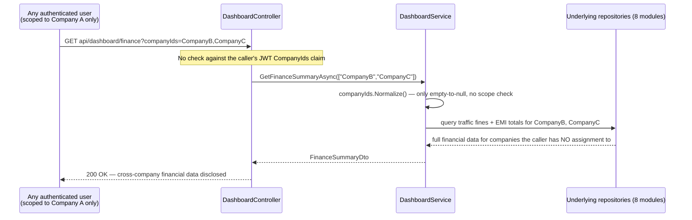
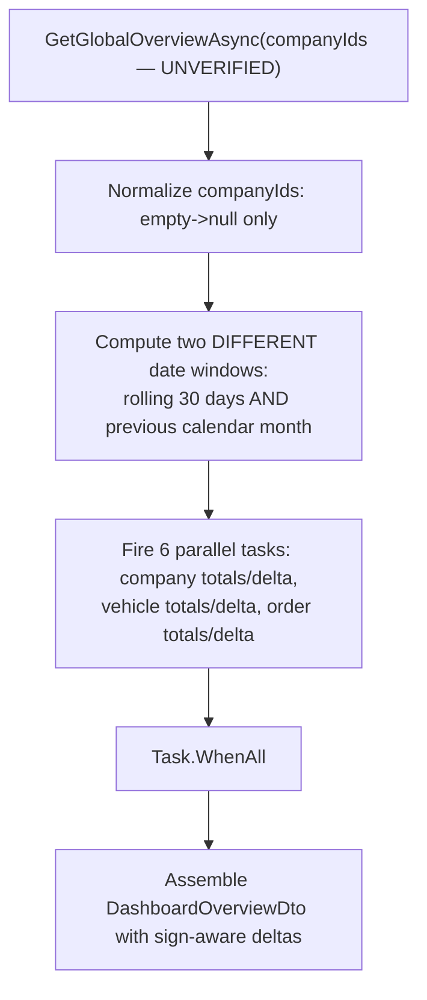
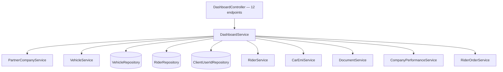

# Dashboard & Reporting

## 1. Module overview

Aggregates KPIs and trend data across nearly every other domain in the platform — fleet totals, order volume, compliance expiry, rider workforce breakdown, finance (traffic fines, EMI, expenses), and revenue/order trends — into the landing-page dashboard. It is the most heavily cross-module-dependent service in the codebase (10 injected dependencies spanning 8 other modules) and, confirmed by direct code inspection, **the one module where company-scope authorization is not merely inconsistent but entirely absent** — every one of its 12 endpoints trusts a client-supplied `companyIds` list with no verification against the caller's actual assigned companies.

**Where it lives:**

| Concern | Path |
|---|---|
| Controller | `CAG.Admin.API/CAG.Admin.API/Controllers/v1/DashboardController.cs` |
| Service | `DashboardService.cs` |
| UI | `src/app/(pages)/page.tsx` (the root/landing dashboard), `src/app/components/dashboard/*` |

## 2. Business perspective

### 2.1 Business purpose

Staff need a single at-a-glance view of the business across companies — how many riders/vehicles/orders, what's expiring soon, financial exposure (fines, EMI), and trend lines — without navigating into each domain module individually. This module exists purely to aggregate and shape data other modules own, adding minimal logic of its own.

### 2.2 Key use cases

1. **Staff land on the dashboard** and see global totals with 30-day deltas (companies, vehicles, orders).
2. **Staff view compliance items expiring soon** across vehicles (daftar/registration), riders (work permits), and clients (contract expiry) in one combined list.
3. **Staff view workforce breakdown** — availability, vacation status, rider status distribution.
4. **Staff view finance summary** — traffic fines and EMI totals, with drill-down detail views.
5. **Staff view expiring documents and vehicles** within a configurable day window.
6. **Staff view order and revenue trend lines** over a date range, per company.

### 2.3 Business rules & logic

- **`companyIds.Normalize()` converts an empty list to `null`; it does not scope anything.** The shared extension method (duplicated verbatim in both this module and [Rider Orders & Batch Billing](rider-orders-batch-billing.md) — the same helper class name `CompanyIdsExtensions` is defined independently in both files) only does `companyIds is { Count: > 0 } ? companyIds : null` (explicit) — an empty-to-null normalization for downstream SQL convenience, with no relationship to the caller's identity or permissions.
- **`DashboardService` never reads `_currentUser.CompanyIds` anywhere in its body** — confirmed by a full-text search of the class: `_currentUser` is used only to extract `_userId` in the constructor (which itself is never subsequently used either), and the constructor does not even perform the `_userAssignedCompanies = _currentUser.CompanyIds ?? throw ...` pattern present in every other service in the codebase. **Every one of this module's 12 public methods accepts a `companyIds` parameter directly from the HTTP request and passes it straight through to the underlying repository queries, unfiltered and unverified.** This means: a non-Admin user whose JWT scopes them to one company can request dashboard data — fleet counts, compliance expiry, rider workforce status, traffic fine totals, EMI exposure, order/revenue trends — for **any other company in the system**, simply by passing that company's ID in the query string. This is not the platform's usual "conditional scoping, skipped when the filter is omitted" pattern seen in [Payroll Management](payroll-management.md)/[Attendance Management](attendance-management.md)/[Rider Orders & Batch Billing](rider-orders-batch-billing.md) — here, scoping is **never present, regardless of whether a filter is supplied**, across the module's entire surface.
- **`GetGlobalOverviewAsync`'s "last 30 days" and "previous calendar month" windows are computed independently and inconsistently**: company/vehicle deltas use a rolling `UtcNow.AddDays(-30)` to `UtcNow` window, while the order totals/delta use the **previous full calendar month** (`ordersFrom`/`ordersTo`, computed via month-start/month-end arithmetic) (explicit) — so the "companies +N" and "orders +N" figures shown together on one KPI row are measuring different time windows, which could read as inconsistent to anyone comparing them closely.
- **`GetTopRidersAsync` is a second, independent unimplemented stub**, distinct from [Rider Management](rider-management.md)'s own `GetTopRidersAsync` — `DashboardService.GetTopRidersAsync` throws `NotImplementedException` (explicit) and, confirmed by searching the controller, **has no route calling it at all** — it is unreachable dead code, not a live 500 risk. [Inferred] The actual "top/bottom performers" feature that shipped is served by a different method entirely — [Rider Orders & Batch Billing](rider-orders-batch-billing.md)'s `GetPerformersAsync`, reachable via `GET api/riderorder/performance` — suggesting this dashboard-specific stub was superseded during development and simply never removed.

### 2.4 End-to-end business flows

**The company-scoping gap, made concrete:**

**Global overview aggregation (parallelized, but unscoped):**

### 2.5 Actors & interactions

| Actor | Role |
|---|---|
| Any authenticated staff user | Views dashboard — and, per the confirmed gap, can view any company's data regardless of assignment |
| [Partner Company Management](partner-company-management.md), [Vehicle Management](vehicle-management.md), [Rider Management](rider-management.md), [Rider Orders & Batch Billing](rider-orders-batch-billing.md), [Car EMI Management](car-emi-management.md), [Document Management](document-management.md), [Client & Client-User-ID Mapping](client-clientuserid-mapping.md) | Upstream data sources — this module reads from all of them, writes to none |

## 3. Technical perspective

### 3.1 Architecture overview

A pure aggregation/read layer with the highest fan-out of any service in the codebase — 10 constructor-injected dependencies spanning company, vehicle, rider, client-user-ID, EMI, document, company-performance, and rider-order concerns, each contributing one or more KPI slices.

### 3.2 Component breakdown

| Component | Responsibility | Key methods |
|---|---|---|
| `DashboardController` | 12-endpoint HTTP surface, all `[FromQuery] List<string>? companyIds` | overview, compliance, workforce, finance ×3, documents/vehicles expiring, order/company performance trends |
| `DashboardService` | Fan-out aggregation, zero scoping (§2.3) | `GetGlobalOverviewAsync`, `GetExpiringComplianceAsync`, `GetWorkforceStatusAsync`, `GetFinanceSummaryAsync`, `GetOrderTrendsAsync`, `GetCompanyPerformanceAsync`, `GetTopRidersAsync` (dead stub) |

### 3.3 Detailed technical flows

Covered fully in §2.4.

### 3.4 API & interface documentation

All 12 endpoints accept `companyIds` as an optional query-string list with **no server-side verification against the caller's assigned companies**:

| Method | Route | Notes |
|---|---|---|
| `GET` | `api/dashboard/overview` | Mixed date-window inconsistency (§2.3) |
| `GET` | `api/dashboard/compliance/expiring` | Combines vehicle/rider/client expiry in one call |
| `GET` | `api/dashboard/riders/breakdown` | Delegates to [Rider Management](rider-management.md) |
| `GET` | `api/dashboard/workforce` | Availability + vacation + status, 3 sequential awaits (not parallelized, unlike `GetGlobalOverviewAsync`) |
| `GET` | `api/dashboard/finance` | Traffic fines + EMI |
| `GET` | `api/dashboard/finance/details/traffic-fines` | |
| `GET` | `api/dashboard/finance/expense` | |
| `GET` | `api/dashboard/finance/details/emi` | |
| `GET` | `api/dashboard/documents/expiring?days=30` | Delegates to [Document Management](document-management.md)'s properly-scoped query — the one place this module's data happens to be filtered, because the *downstream* method does its own scoping, not because this module does |
| `GET` | `api/dashboard/vehicles/expiring` | |
| `GET` | `api/dashboard/company/orders?from=&to=` | Defaults to trailing 12 months if unspecified |
| `GET` | `api/dashboard/company/performance?from=&to=` | Same default window |

Worth noting: `api/dashboard/documents/expiring` is the one endpoint on this list that *is* effectively scoped — but only because [Document Management](document-management.md)'s `GetExpiringDocumentsAsync` does its own company-membership `EXISTS` check internally (see that module's §2.3). Every other endpoint here has no such downstream backstop.

### 3.5 Database & data model

This module owns no tables of its own — it is a pure read-aggregator over `Company`, `Vehicle`, `Rider`, `ClientUserId`, `CarEmi`, `Document`/`DocumentTypeExpiry`, `CompanyPerformance`, and `RiderOrder`, each documented in its owning module.

### 3.6 External integrations

None.

### 3.7 Internal module dependencies

**Upstream:** [Partner Company Management](partner-company-management.md), [Vehicle Management](vehicle-management.md), [Rider Management](rider-management.md), [Client & Client-User-ID Mapping](client-clientuserid-mapping.md), [Car EMI Management](car-emi-management.md), [Document Management](document-management.md), [Rider Orders & Batch Billing](rider-orders-batch-billing.md) — this module depends on more other modules than any other in the codebase.

**Downstream:** none — this is a terminal, read-only aggregation point.

### 3.8 Configuration & environment

None module-specific.

### 3.9 Background jobs & workers

None — every KPI is computed live, on each request, by fanning out to the underlying repositories; nothing is pre-aggregated or cached at the dashboard layer (contrast with the per-file `IMemoryCache` used elsewhere in the platform for images/documents — no equivalent caching exists here for these evidently-larger cross-company queries).

### 3.10 Events & messaging

None.

### 3.11 Authentication & authorization

**This is the concrete headline finding for this module and one of the most consequential in the entire platform**: `[Authorize]` (authentication only) is the sole gate on every endpoint, and — confirmed by full-text inspection of `DashboardService`, not inferred — no method anywhere in the class cross-references the caller's `CompanyIds` claim against the requested `companyIds` parameter. Every other module reviewed in this documentation set exhibits authorization gaps that are either platform-wide-but-consistent (no role checks, but at least *some* company scoping) or conditional (scoping skipped only when a filter is omitted). This module has **no scoping mechanism to omit** — it was never wired in.

### 3.12 Validation & error handling

- No validation that `companyIds` values are real, active company IDs — an arbitrary or non-existent ID simply returns empty/zero results for that slice rather than an error.
- `from`/`to` date range parameters on the two trend endpoints default sensibly (trailing 12 months) when omitted, with no explicit range-sanity check (e.g., `from > to`) found.

### 3.13 Logging & observability

None beyond the platform-wide exception log — and no logging exists that would surface unusual cross-company access patterns even if the scoping gap were later fixed reactively via monitoring rather than code.

### 3.14 Design patterns & architectural decisions

**Fan-out aggregation via `Task.WhenAll`** is used well in `GetGlobalOverviewAsync` (6 parallel independent queries) but not consistently — `GetWorkforceStatusAsync` awaits its three sub-queries sequentially rather than in parallel, an easy, low-risk performance win left on the table in the same class that demonstrates the pattern correctly elsewhere.

## 4. Risk & improvement analysis

### 4.1 Edge cases & failure scenarios

- **Confirmed, platform-significant**: any authenticated user, of any role, scoped to any single company, can retrieve dashboard-level aggregate financial, fleet, compliance, and workforce data for **every other company in the system** by supplying their IDs directly — no exploit technique beyond knowing or guessing company IDs (a predictable `COMP{yy}{seq}` format, per [Partner Company Management](partner-company-management.md)) is required.
- The mixed date-window arithmetic in `GetGlobalOverviewAsync` (§2.3) could present a confusing or misleading picture on the landing page when the "orders" figure and the "companies/vehicles" figures are compared side by side, since they don't measure the same period.

### 4.2 Known limitations

- Two independent, both-unimplemented `GetTopRidersAsync` stubs exist in the codebase ([Rider Management](rider-management.md) and this module) — dead code that could confuse a future maintainer into wiring up the wrong one instead of the actually-working `GetPerformersAsync` in [Rider Orders & Batch Billing](rider-orders-batch-billing.md).
- No caching at the dashboard layer despite this being the highest-fan-out, most-frequently-hit read path in the application (the landing page).
- `CompanyIdsExtensions.Normalize()` is defined identically in two separate files (this module and [Rider Orders & Batch Billing](rider-orders-batch-billing.md)) rather than shared from one location.

### 4.3 Security considerations

**This module's missing company-scoping is the single most severe, concretely-confirmed authorization finding in this entire documentation set.** Every other module's authorization gap requires the caller to either omit a filter (letting an unscoped query run) or already know a specific resource ID; this module's gap is structural and total — there is no code path in `DashboardService` that would ever reject or filter a `companyIds` value, no matter what it contains, for any of its 12 endpoints. Any authenticated account, including the lowest-privilege role in the system, can retrieve company-wide financial and operational summaries for the entire platform, not just their own assignment.

### 4.4 Performance considerations

`GetWorkforceStatusAsync`'s sequential (not parallel) sub-queries are an easy latency improvement, following the pattern already established elsewhere in the same class. No caching exists for what is likely the most frequently-loaded set of queries in the application (every dashboard/landing-page visit re-runs the full fan-out).

### 4.5 Potential improvements

**Quick wins:**
- Add `companyIds = companyIds?.Where(c => _userAssignedCompanies.Contains(c)).ToList() ?? _userAssignedCompanies` (or equivalent intersection logic, matching the well-designed pattern already used in [Sales Cash Reconciliation](sales-cash-reconciliation.md)'s export endpoint) at the top of every `DashboardService` method, or centrally in the constructor/a shared helper.
- Parallelize `GetWorkforceStatusAsync`'s three sub-queries with `Task.WhenAll`.
- Remove the dead `GetTopRidersAsync` stub here (and/or in [Rider Management](rider-management.md)) once confirmed unreachable, or wire it to the real performer-ranking feature if a dashboard-specific version is actually wanted.
- Consolidate the duplicated `CompanyIdsExtensions` class into one shared location.

**Medium effort:**
- Reconcile the two different date-window calculations in `GetGlobalOverviewAsync` so KPIs on the same screen measure comparable periods.
- Add short-lived caching for the more expensive aggregate queries, given this is the platform's highest-traffic read surface.

**Major refactors:**
- None specific beyond the platform-wide authorization architecture recommendation in [architecture-overview.md](architecture-overview.md).

## 5. Summary

- The platform's central aggregation point, fanning out to 8 other modules for the landing-page dashboard — the highest dependency count of any service in the codebase.
- **Confirmed, severe finding**: `DashboardService` performs zero company-scope verification anywhere in its 12 methods — every endpoint trusts a client-supplied `companyIds` list unconditionally, letting any authenticated user retrieve cross-company financial, fleet, compliance, and workforce data regardless of their actual assignment.
- This is structurally worse than the platform's more common "scoping skipped only when a filter is omitted" pattern — here there is no scoping to skip; it was never implemented.
- The one endpoint that behaves as if scoped (`documents/expiring`) does so only because the downstream [Document Management](document-management.md) method independently enforces it, not because of anything in this module.
- Contains a second, dead (unreachable, no route) `NotImplementedException` stub for `GetTopRidersAsync`, alongside a similarly-unimplemented one in [Rider Management](rider-management.md) — the actual shipped "top performers" feature lives elsewhere, in [Rider Orders & Batch Billing](rider-orders-batch-billing.md).
- `GetGlobalOverviewAsync` mixes two different date-window calculations for KPIs shown together on the same screen.
- No caching despite being the platform's most frequently-executed read path.
