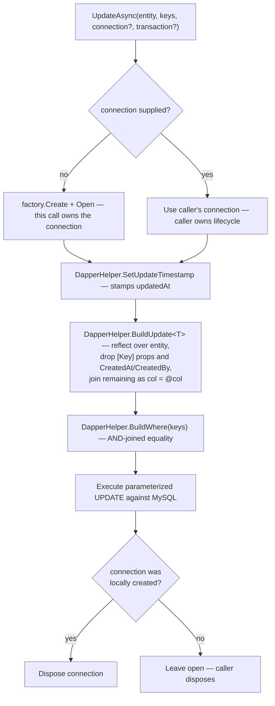
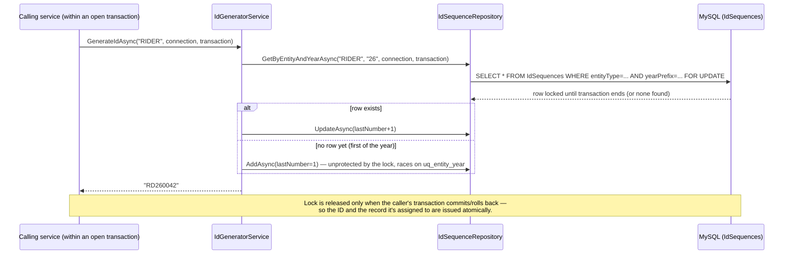
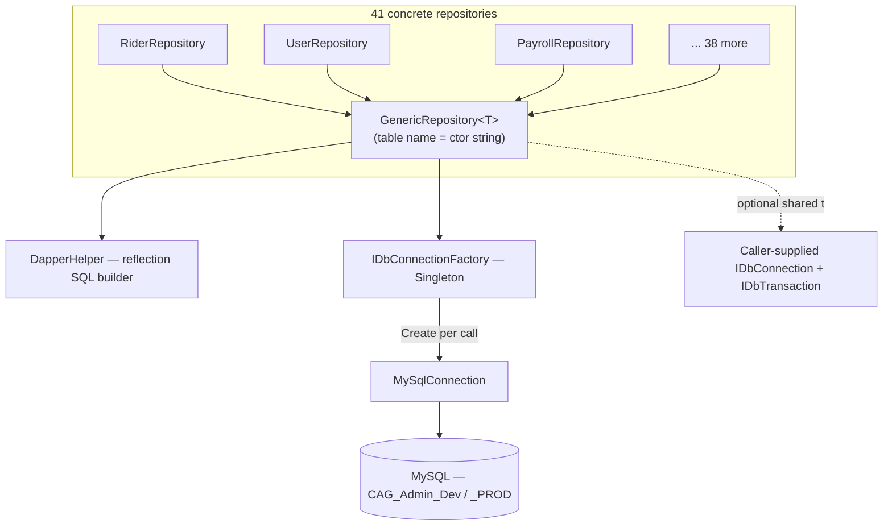
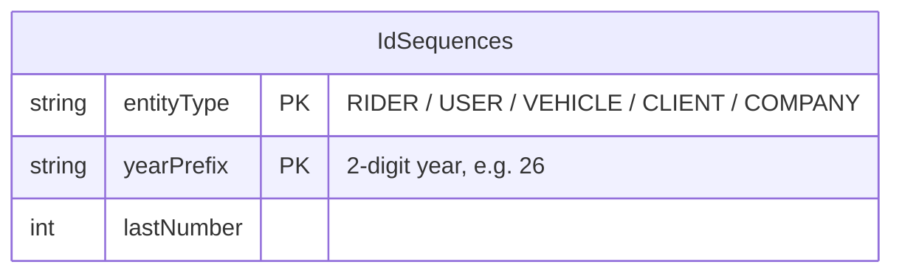

# Database Access Layer (Infrastructure)

## 1. Module overview

The shared data-access substrate used by all 41 repositories in `CAG.Admin.API.DBRepository`. It replaces a conventional ORM with a thin reflection-based SQL generator over Dapper, plus a human-readable sequential ID generator. Every business module documented elsewhere in `docs/` builds on this layer rather than talking to MySQL directly.

**Where it lives:**

| Concern | Path |
|---|---|
| Generic CRUD base class | `CAG.Admin.API.DBRepository/Repository/GenericRepository.cs` |
| SQL generation by reflection | `CAG.Admin.API.DBRepository/Utility/DapperHelper.cs` |
| Connection factory | `CAG.Admin.API.DBRepository/Connection/SqlConnectionFactory .cs` (note the space in the filename) |
| Repository/factory contracts | `CAG.Admin.API.Application/InfraInterface/*.cs` |
| Human-readable ID sequences | `IdSequenceRepository.cs`, `IdGeneratorService.cs` (see [User Management](user-management.md) §2.3 for the format table) |

## 2. Business perspective

### 2.1 Business purpose

Not a business capability in its own right — it's the mechanism that makes every other module's data durable. Documented here because its design choices (no ORM, no migrations, reflection-driven SQL) directly shape what every other module can and cannot safely do, and because its ID-sequence sub-feature (`RD26001`, `CA26001`, etc.) produces the human-readable identifiers that appear throughout the business UI.

### 2.2 Key use cases

1. **Every list/detail/create/update/delete operation** in every module ultimately calls into `GenericRepository<T>` or a hand-written SQL method built on the same connection factory.
2. **Multi-table transactional writes** (e.g., Rider + User creation, Payroll + its three child tables) share a single `IDbConnection`/`IDbTransaction` passed explicitly through optional parameters.
3. **Human-readable ID issuance** for Rider, User, Vehicle, Client, and Company records, generated under a row lock to stay unique under concurrent creation.

### 2.3 Business rules & logic

- **Property name must equal column name.** `DapperHelper` builds every generated SQL statement by reflecting over the C# object's public readable properties (`GetProps`) and using `p.Name` directly as the column name. There is no `[Column]` attribute support. (explicit, `DapperHelper.GetProps`/`BuildWhere`/`BuildInsert`/`BuildUpdate`)
- **`[Key]`-decorated properties are excluded from INSERT and UPDATE column lists** (explicit, `IsKeyProperty`) — a model's primary key is expected to be database-generated (`AUTO_INCREMENT`) or supplied separately as the `keys` object to `UpdateAsync`, never written as a SET clause.
- **`CreatedAt`/`CreatedBy` are permanently immutable after insert** — hardcoded into `_notUpdatableFields` and stripped from every UPDATE's SET clause regardless of whether the caller's entity object has them populated (explicit).
- **Timestamps are stamped automatically, not supplied by callers.** `SetInsertTimestamps` sets both `createdAt` and `updatedAt` to `DateTime.UtcNow` on insert (via reflection, case-insensitively matching a `createdAt`/`updatedAt` property of a `DateTime`/`DateTime?`/`DateTimeOffset`/`DateTimeOffset?` type); `SetUpdateTimestamp` sets only `updatedAt` on update (explicit).
- **`BuildWhere` only supports equality AND-chains** — `string.Join(" AND ", props.Select(p => $"{p.Name} = @{p.Name}"))`. There is no support for `OR`, `IN`, ranges, or `NULL` checks through this helper; any query needing those is hand-written SQL bypassing `DapperHelper` entirely (explicit, by omission).
- **ID sequences reset yearly per entity type**, keyed by `(entityType, yearPrefix)` where `yearPrefix` is the last two digits of the current UTC year — so `RD26001` and a hypothetical `RD27001` are independent counters (explicit, `IdGeneratorService`).
- **ID generation is concurrency-safe for existing sequences, not for the first row of a new year/entity.** `IdSequenceRepository.GetByEntityAndYearAsync` uses `SELECT ... FOR UPDATE`, taking a row lock inside the caller's transaction so two concurrent registrations for the *same, already-existing* `(entityType, yearPrefix)` serialize correctly. But `FOR UPDATE` can only lock a row that exists — the very first ID of each year (or each new entity type) has no row to lock, so two concurrent transactions can both read `null`, both attempt `INSERT`, and one loses to the `uq_entity_year` unique constraint with an unhandled duplicate-key exception. [Inferred from reading the lock sequence against the known unique constraint from the DB schema] This is a narrow, once-a-year race window in practice, not a constant risk.

### 2.4 End-to-end business flows

**Reflection-driven UPDATE — the general case every module relies on:**



**Sequential ID issuance under lock (see [User Management](user-management.md) §3.3 for the full Rider+User transactional example):**



### 2.5 Actors & interactions

Not user-facing. Every service in every other module is a "consumer" of this layer.

## 3. Technical perspective

### 3.1 Architecture overview

A **Table Data Gateway**-style base class (`GenericRepository<T>`) parameterized by table name (a constructor string, not a schema attribute), combined with a static **SQL-generation utility** (`DapperHelper`) that inspects entities via reflection. Connections are created per-operation from a **Singleton factory**, with an escape hatch for shared transactions across multiple repository calls.



### 3.2 Component breakdown

| Component | Responsibility | Key methods | Notes |
|---|---|---|---|
| `IDbConnectionFactory` / `SqlConnectionFactory` | Produces a fresh `MySqlConnection` per call from `ConnectionStrings:CAGDBConnection` | `Create()` | Registered **Singleton**; the connections it hands out are not pooled by the factory itself (pooling is `MySqlConnector`'s internal behavior) |
| `GenericRepository<T>` | Base class for all repositories; generic CRUD + raw-SQL + stored-procedure passthroughs | `GetAllAsync`, `GetByAsync`, `AddAsync` (×2 overloads), `UpdateAsync`, `DeleteAsync`, `QueryAsync<TResult>`, `QueryFirstOrDefaultAsync<TResult>`, `ExecuteAsync`, `ExecuteProcedureAsync`, `ExecuteScalarProcedureAsync`, `QueryProcedureAsync<TResult>` | `_table` is a `protected readonly string` set once in the constructor |
| `DapperHelper` | Static reflection-based SQL text builder | `GetProps`, `IsKeyProperty`, `BuildWhere`, `BuildInsert`, `BuildUpdate`, `BuildOrderBy`, `SetInsertTimestamps`, `SetUpdateTimestamp` | No caching of reflected `PropertyInfo[]` per type — re-reflects on every call (see §4.4) |
| `IdGeneratorService` / `IdSequenceRepository` | Sequential, year-scoped human-readable IDs | `GenerateIdAsync`, `GetByEntityAndYearAsync` (`FOR UPDATE`), `AddAsync`/`UpdateAsync` (transaction-bound overloads) | The one piece of this layer with real concurrency-control logic |

### 3.3 Detailed technical flows

**`BuildInsert` — SQL text produced for, e.g., a new `Rider`:**

```csharp
// DapperHelper.BuildInsert<Rider>("Rider", riderInstance, returnId: false)
var props = GetProps(entity).Where(p => !IsKeyProperty(p));   // every readable prop except [Key]
var cols  = string.Join(", ", props.Select(p => p.Name));      // "FirstName, LastName, CompanyId, ..."
var vals  = string.Join(", ", props.Select(p => "@" + p.Name)); // "@FirstName, @LastName, @CompanyId, ..."
// => INSERT INTO Rider (FirstName, LastName, CompanyId, ...) VALUES (@FirstName, @LastName, @CompanyId, ...)
```

Dapper then binds `@FirstName` etc. directly against the same entity object passed as the SQL parameter — so the parameter names generated by `DapperHelper` **must** match the entity's actual property names for Dapper's implicit parameter binding to succeed. This is the same reflection pass counted on twice (once to build the SQL text, once implicitly by Dapper to bind parameters), which is why a property that exists in C# but not in the table (or vice versa) fails at the database, not at compile time.

**Transaction-sharing contract** (used by [User Management](user-management.md), [Rider Management](rider-management.md), [Payroll Management](payroll-management.md), and others):

```mermaid
sequenceDiagram
    participant Caller
    participant GR as GenericRepository.UpdateAsync/DeleteAsync
    Caller->>Caller: connection = factory.Create(); connection.Open(); transaction = connection.BeginTransaction()
    Caller->>GR: UpdateAsync(entity, keys, connection, transaction)
    Note right of GR: connection != null, so GR does NOT open or dispose it
    GR->>GR: build SQL, execute against the supplied connection+transaction
    GR-->>Caller: rows affected
    Caller->>Caller: more repository calls against the same connection/transaction...
    Caller->>Caller: transaction.Commit() (or Rollback() in catch) + Dispose() — caller's responsibility entirely
```

`AddAsync` has two overloads distinguished by argument shape: `AddAsync(entity, returnId)` (self-managed connection) and `AddAsync(entity, connection, transaction, returnId)` (shared). `UpdateAsync`/`DeleteAsync` use nullable optional parameters instead of separate overloads for the same purpose — an inconsistency in how the two participation styles are expressed across the class (see §4.2).

### 3.4 API & interface documentation

Not HTTP-facing. The internal contract every repository implements is `IGenericRepository<T>` (§2, `Application/InfraInterface`); repository-specific interfaces (`IRiderRepository`, `IUserRepository`, etc.) extend it with hand-written query methods.

### 3.5 Database & data model

No entities of its own — `IdSequences` is the only table this layer owns outright:



Unique constraint `uq_entity_year (entityType, yearPrefix)` is what makes the race window in §2.3 surface as a clean exception rather than silent duplication — the constraint is the actual backstop, the `FOR UPDATE` lock is the fast path that avoids hitting it in the common case.

### 3.6 External integrations

MySQL only, via `MySqlConnector`. No external services.

### 3.7 Internal module dependencies

**Upstream:** none — this is the foundation layer.

**Downstream:** every business module in `docs/`. Two vestigial package references (`Microsoft.Data.SqlClient` in the API project, `System.Data.SqlClient` in this project — the latter's `using` statement is visible at the top of `SqlConnectionFactory .cs` even though the class only ever constructs a `MySqlConnection`) suggest a SQL Server-backed predecessor of this layer; neither package is otherwise used.

### 3.8 Configuration & environment

Single setting: `ConnectionStrings:CAGDBConnection`, read once at `SqlConnectionFactory` construction (Singleton — the connection *string* is fixed for the process lifetime; only the `IDbConnection` instances themselves are created fresh per call). See [architecture-overview.md](architecture-overview.md) for the dev/prod values and the shared-credentials/no-TLS finding.

### 3.9 Background jobs & workers

None.

### 3.10 Events & messaging

None.

### 3.11 Authentication & authorization

Not applicable at this layer — no per-row or per-table access control exists here; every repository call executes with the same MySQL credentials regardless of which application user triggered it. Any row-level authorization ([Rider Management](rider-management.md)'s `CompanyIds` filtering, for example) is implemented by individual repositories adding `WHERE` clauses by hand, not by this shared layer.

### 3.12 Validation & error handling

None at this layer — no validation is performed before generating or executing SQL. A malformed entity (missing required column value, wrong type) surfaces as a raw MySqlConnector exception, which propagates up to `ExceptionHandlingMiddleware` as an unclassified 500 unless the calling service/controller catches it first.

### 3.13 Logging & observability

None. No query logging, no slow-query instrumentation, no connection-pool metrics exposed anywhere in the codebase.

### 3.14 Design patterns & architectural decisions

- **Table Data Gateway** (`GenericRepository<T>`), not Active Record or a full Unit-of-Work/Repository-with-change-tracking pattern — there is no identity map, no dirty-tracking, no `SaveChanges()`; every call is an immediate, independent SQL statement (or explicitly grouped into a caller-managed transaction).
- **Reflection-as-mapping** in place of attribute-based or convention-based ORM mapping (no EF Core, no explicit `[Column]`/`[Table]` decoration beyond `[Key]`). [Inferred] Chosen for minimalism/speed of initial development over EF Core's overhead — consistent with the project's generally lightweight dependency footprint — at the cost of compile-time safety (see §4.2).
- **Optional connection/transaction parameters** as the mechanism for cross-repository transactional consistency, rather than a dedicated Unit-of-Work abstraction — every repository method that needs transactional participation repeats the same `connection ?? factory.Create()` / `if (connection == null) dispose` boilerplate rather than centralizing it.

## 4. Risk & improvement analysis

### 4.1 Edge cases & failure scenarios

- A property renamed on a DBModel without a matching MySQL column rename breaks that entity's INSERT/UPDATE at **runtime**, on the next write — not at build time, not at startup. This is the single highest-leverage latent-defect source in the codebase, because nothing (no test, no schema-check-on-startup) catches it before production traffic does.
- The first `IdSequences` row for a new `(entityType, yearPrefix)` pair is subject to a duplicate-insert race under true concurrency (§2.3) — most likely to manifest at midnight on January 1st UTC, when the first Rider/User/Vehicle/Client/Company of the new year is created, if two such creations happen to race within the same transaction window.
- `UpdateAsync`/`DeleteAsync`'s "dispose only if we created it" logic depends entirely on every caller consistently passing `null` or a real pair for *both* `connection` and `transaction` — passing a `connection` without a `transaction` (or vice versa) is possible at the type level (`IDbConnection?`/`IDbTransaction? ` are independent optional parameters) and is not guarded against.

### 4.2 Known limitations

- No connection pooling/lifetime tuning is configured explicitly (relies entirely on `MySqlConnector` defaults).
- `AddAsync`'s two-overload pattern vs. `UpdateAsync`/`DeleteAsync`'s optional-parameter pattern for the same "shared transaction" concept is an inconsistency that makes the class's usage contract harder to learn from IntelliSense alone.
- No unit tests exist for `DapperHelper`'s SQL-generation logic (see [architecture-overview.md](architecture-overview.md) — there are no automated tests anywhere in the API), despite this being the single piece of code every write operation in the system depends on.
- `BuildWhere`'s AND-only equality model means any repository needing `OR`, ranges, or `NULL` comparisons must bypass `DapperHelper` and hand-write SQL — which most repositories already do for anything beyond trivial lookups, diluting the value of having a shared helper.

### 4.3 Security considerations

- **SQL injection surface is narrow but not zero.** `DapperHelper` always parameterizes *values* (`@PropName`), so entity data itself cannot inject SQL. However, `_table` (the table name) and any `orderby` string passed to `BuildOrderBy` are interpolated **directly into SQL text**, not parameterized — `BuildOrderBy(orderby, isDescending) => $" ORDER BY {orderby} "`. If any caller ever passes user-supplied input as an `orderby` value (none was found to do so in the code inspected — sort fields appear to be developer-chosen constants at every call site checked), that would be a direct SQL injection vector. Worth a guard (whitelist validation) regardless, since it is one parameter change away from being exploitable.
- Connection strings and credentials are configuration-layer concerns, covered in [architecture-overview.md](architecture-overview.md) — this layer just consumes whatever `IConfiguration` provides.

### 4.4 Performance considerations

- **No `PropertyInfo[]` caching.** `DapperHelper.GetProps` calls `obj.GetType().GetProperties()` fresh on every single SQL-building call — reflection is repeated for every insert/update/where-clause construction across the entire system, on every request. For the traffic volumes implied by the current row counts (thousands, not millions) this is not yet a measurable bottleneck, but it's a straightforward, cache-per-`Type` win (a `ConcurrentDictionary<Type, PropertyInfo[]>`) with no behavior change.
- No query batching or bulk-insert path — `RiderOrder`/`Attendance`/`SalesCashDetails` Excel imports insert row-by-row (see the respective module docs), which this layer does nothing to mitigate.

### 4.5 Potential improvements

**Quick wins:**
- Cache reflected `PropertyInfo[]` per `Type` in `DapperHelper`.
- Add a startup-time or CI-time check that every DBModel's properties resolve to real columns (a lightweight schema-drift guard), given there are currently zero automated tests of any kind.

**Medium effort:**
- Whitelist/validate `orderby` inputs wherever they might ever originate from user-controlled data.
- Standardize the shared-transaction parameter pattern (pick optional-parameters *or* overloads, not both, across `AddAsync`/`UpdateAsync`/`DeleteAsync`).

**Major refactors:**
- Consider a proper migration framework (see [architecture-overview.md](architecture-overview.md) §technical debt) so schema and code can be verified to agree, rather than relying on manual DDL discipline plus reflection-based runtime binding.

## 5. Summary

- Every one of the 41 repositories in the system is a thin subclass of `GenericRepository<T>`, itself built on reflection-driven SQL generation (`DapperHelper`) rather than an ORM.
- Table names and property-to-column mapping are implicit — a constructor string and reflected property names, respectively — with no compile-time or startup verification against the actual MySQL schema.
- Cross-repository transactions are supported via optional `IDbConnection`/`IDbTransaction` parameters that each method either owns (creates + disposes) or borrows (uses + leaves alone), based on whether the caller supplied them.
- The one piece of genuine concurrency-control logic in this layer is the `SELECT ... FOR UPDATE` row lock behind human-readable ID generation — correct for existing sequences, with a narrow first-of-year/first-of-entity-type race that the database's own unique constraint (not this code) ultimately prevents from corrupting data.
- No caching, no query logging, no tests, no schema-drift detection.
- The primary latent risk is silent-until-runtime breakage from property/column mismatches, inherent to the reflection-based design.
