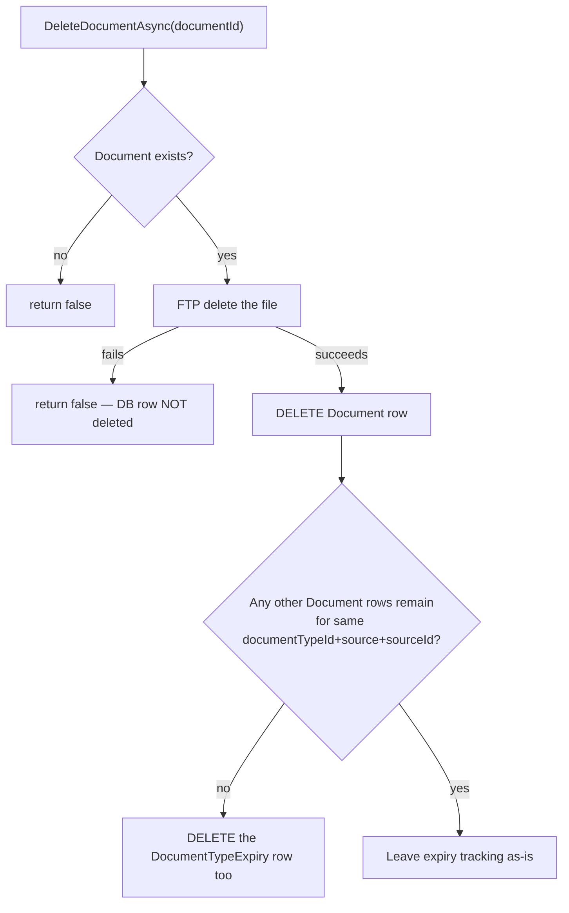
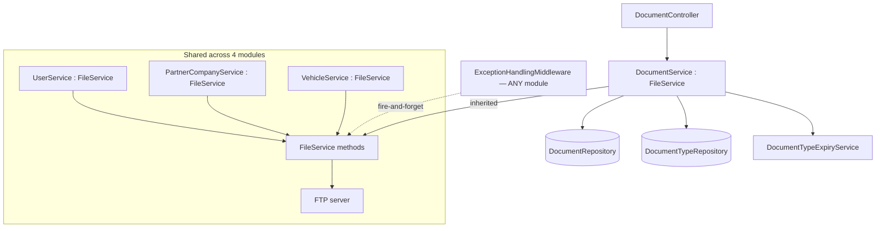
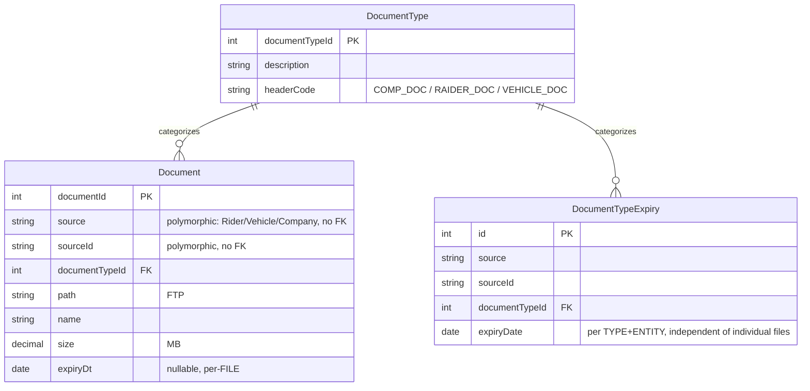

# Document Management

## 1. Module overview

Owns generic document upload/download/expiry-tracking (compliance documents, licenses, etc.) attached polymorphically to a Rider, Vehicle, or Company via a `(Source, SourceId)` pair — and, critically, owns `FileService`, the shared FTP access layer that **every other file-touching module in the platform inherits or injects** (User profile photos, Company logos, Vehicle photos, and this module's own documents all funnel through the same four methods). This module is also where the platform's sole error-logging mechanism (`AppendAsync`) actually lives.

**Where it lives:**

| Concern | Path |
|---|---|
| Controller | `CAG.Admin.API/CAG.Admin.API/Controllers/v1/DocumentController.cs` |
| Service | `DocumentService.cs` (extends `FileService`) |
| **Shared FTP layer** | `CAG.Admin.API.Application/Service/Implementation/FileService.cs` — used by this module, [User Management](user-management.md), [Partner Company Management](partner-company-management.md), [Vehicle Management](vehicle-management.md) |
| Repository | `DocumentRepository.cs`, `DocumentTypeRepository.cs`, `DocumentTypeExpiryRepository.cs` |

## 2. Business perspective

### 2.1 Business purpose

Compliance documents (licenses, permits, IDs, trade documents) need to be stored, retrieved, and — critically — tracked for expiry across three different kinds of entities (riders, vehicles, companies), feeding [Dashboard & Reporting](dashboard-reporting.md)'s "expiring documents" widget. This module is the single generic mechanism for that, rather than each entity type having its own bespoke document storage.

### 2.2 Key use cases

1. **Staff upload one or more documents** against a rider, vehicle, or company, optionally with an expiry date.
2. **Staff view/download a document.**
3. **Staff delete a document** (which also cleans up its expiry tracking if it was the last document of that type for that entity).
4. **Staff update a document's expiry date independently** of re-uploading the file.
5. **Staff view all documents for a specific entity**, or all documents of a source type.
6. **[Dashboard & Reporting](dashboard-reporting.md) queries documents expiring within a window**, company-scoped.
7. **Every write anywhere in the API logs its unhandled exceptions here** via `FileService.AppendAsync` (see [architecture-overview.md](architecture-overview.md) §6.3 and §4.3 below).

### 2.3 Business rules & logic

- **Documents attach polymorphically via `(Source, SourceId)`, not a real foreign key** — `Source` is a free string (`"Rider"`, `"Vehicle"`, `"Company"`, driven by whatever `FileUploadRequestModel.Source` the caller supplies) and `SourceId` is that entity's ID as a string (explicit, confirmed by reading `GetExpiringDocumentsAsync`'s SQL, which must `CASE`-branch on `Source` to `EXISTS`-join against three different tables — `Rider`, `Vehicle`, `Company` — since there is no single real foreign key to follow). [Inferred] This is a classic polymorphic-association pattern: it has no database-level referential integrity, so a typo'd `Source` value or an orphaned `SourceId` (entity later deleted) leaves the document row silently unreferenceable by any real join, and every new consuming query must independently know the full set of valid `Source` values and their target tables.
- **The upload storage path is built from the source type**: `_configuration[$"FilePath:{Source}Files"]` (explicit) — so `Source="Rider"` resolves `FilePath:RiderFiles`, etc. There is no validation that `Source` is one of a known/whitelisted set before this string is used both for config lookup and persisted verbatim into `Document.Source`.
- **Rider-uploaded documents are audited under the rider's ID, not their linked user account's ID**: `_userId = _currentUser.RiderId ?? _currentUser.UserId` (explicit) — every other service in the codebase observed stamps `CreatedBy`/`UpdatedBy` with `_currentUser.UserId` alone; this module prefers `RiderId` whenever the caller is a rider-linked account. [Inferred] Any future code that joins `Document.CreatedBy` against `User.UserId` (e.g., "who uploaded this") would silently fail to match for rider-uploaded documents, since the column would hold a `Rider.RiderId` value instead.
- **Deleting the last document of a given `(documentTypeId, source, sourceId)` combination also removes its expiry-tracking row**: `DeleteDocumentAsync` checks whether any sibling documents remain after the delete and, if none do, deletes the corresponding `DocumentTypeExpiry` record too (explicit) — sensible cleanup that avoids an expiry alert for a document type that no longer has any file behind it.
- **Setting an expiry date on upload creates or updates a separate `DocumentTypeExpiry` row**, keyed by `(documentTypeId, sourceId, source)`, independent of the `Document.ExpiryDt` field on the individual file (explicit, `UpdateOrCreateExpiryDateAsync`) — meaning expiry is tracked per `(type, entity)`, not per individual uploaded file, even though `Document` itself also carries its own `ExpiryDt`.
- **`GetExpiringDocumentsAsync` is the one document-read query that is properly company-scoped** — it CASE-branches by `Source` to verify the underlying `Rider`/`Vehicle`/`Company` row's `companyId` is in the caller's allowed set (explicit). **`GetDocumentAsync` (single document by ID), `GetDocumentsBySourceAsync`, and `GetAllDocuments` have no company-scoping at all** [confirmed by reading all four methods] — an authenticated user can fetch any document, or list all documents for any `(source, sourceId)`, regardless of which company it belongs to, even though the one query that *does* need to aggregate across many entities for a dashboard correctly restricts itself.

### 2.4 The shared FTP layer (`FileService`) — used across four modules

- **`UploadAsync`/`DeleteAsync`/`GetFileAsync` all call `_asyncFtpClient.AutoConnect(...)` per operation** using the DI-injected client (registered `Transient` in `Program.cs`) — each file operation independently establishes its FTP session (explicit).
- **`AppendAsync` — the platform's sole error-logging mechanism — silently discards every exception it encounters**: the entire method body is wrapped in `try { ... } catch { }` with an **empty catch block** (explicit, confirmed by reading the full method). It also does not use the injected, DI-managed FTP client — it constructs and connects a **brand-new `AsyncFtpClient`** on every single call, using raw configuration values read directly from `IConfiguration` (explicit).
- **Consequence, confirmed by tracing the call chain**: `ExceptionHandlingMiddleware` (see [architecture-overview.md](architecture-overview.md) §6.3) calls this method fire-and-forget (`_ = Task.Run(...)`) on every unhandled exception anywhere in the API. If the FTP server is unreachable, credentials are wrong, the log directory can't be created, or *anything* else goes wrong during that write, the failure is caught and silently dropped — **the platform's only error log can go completely, silently dark, with zero indication anywhere (no console output, no secondary logging path, no metric) that it has stopped working.** This is the single highest-leverage observability risk in the entire codebase: a platform-wide outage of the error-logging mechanism itself would be invisible.

### 2.5 End-to-end business flows

**Document upload with optional expiry:**

```mermaid
flowchart TD
    A["Upload files for (Source, SourceId)"] --> B[Resolve FilePath:{Source}Files from config]
    B -- not found --> Z1[Throw — unhandled 'Base file path not found']
    B -- found --> C{For each file}
    C --> D[Build timestamped remote path]
    D --> E[FTP upload via FileService.UploadAsync]
    E -- fails --> Z2[Throw — whole batch aborts, no partial-failure tolerance here<br/>unlike Partner Company / Vehicle image uploads]
    E -- succeeds --> F[INSERT Document row,<br/>CreatedBy = RiderId if caller is a rider, else UserId]
    F --> G{ExpiryDate provided?}
    G -- yes --> H[Upsert DocumentTypeExpiry for this type+entity]
    G -- no --> C
    H --> C
    C -->|all files done| I[Return uploaded Document list]
```

**Delete with expiry-record cleanup:**



### 2.5 Actors & interactions

| Actor | Role |
|---|---|
| Any staff/rider with document access | Upload, view, delete documents |
| [Rider Management](rider-management.md), [Vehicle Management](vehicle-management.md), [Partner Company Management](partner-company-management.md) | Sources of the `(Source, SourceId)` entities documents attach to |
| [Dashboard & Reporting](dashboard-reporting.md) | Consumer of the properly-scoped expiring-documents query |
| **Every module in the platform** | Indirect consumer of `FileService.AppendAsync` via the global exception middleware |

## 3. Technical perspective

### 3.1 Architecture overview



### 3.2 Component breakdown

| Component | Responsibility | Key methods |
|---|---|---|
| `DocumentController` | 7-endpoint HTTP surface; owns per-document `IMemoryCache` (15min sliding / 30min absolute) | get types, get/upload/delete document, expiry update, list by source |
| `DocumentService` | Polymorphic document CRUD, expiry orchestration | `UploadDocumentsAsync`, `DeleteDocumentAsync`, `GetExpiringDocumentsAsync`, `GetDocumentsBySourceAsync` |
| `FileService` (base class) | **Shared FTP primitive for the whole platform** | `UploadAsync`, `GetFileAsync`, `DeleteAsync`, `AppendAsync` (error log — silently fails, §2.4) |
| `DocumentTypeExpiryService`/`Repository` | Per-`(type, entity)` expiry tracking, independent of individual files | `UpdateOrCreateExpiryDateAsync` |

### 3.3 Detailed technical flows

Covered fully in §2.4/§2.5 above.

### 3.4 API & interface documentation

| Method | Route | Notes |
|---|---|---|
| `GET` | `api/document/types?docType=` | Reference data |
| `GET` | `api/document/get?documentId=` | Cached; RFC 5987 UTF-8 filename handling in `Content-Disposition` (correctly implemented — a detail often gotten wrong); **no company scoping** |
| `POST` | `api/document/upload` | Multipart batch; all-or-nothing per file (no partial-failure tolerance, unlike the Partner Company/Vehicle image upload pattern) |
| `DELETE` | `api/document/delete?documentId=` | Cascades to expiry-row cleanup |
| `PUT` | `api/document/expiry-date` | Independent expiry update, no file re-upload |
| `GET` | `api/document/all?source=` | **No company scoping** |
| `GET` | `api/document/{source}/{sourceId}` | **No company scoping** |

### 3.5 Database & data model



Neither `Document.SourceId` nor `DocumentTypeExpiry.SourceId` is a real foreign key — both are plain strings interpreted differently depending on the sibling `Source` column.

### 3.6 External integrations

FTP — the canonical implementation lives in this module (`FileService`) and is reused everywhere.

### 3.7 Internal module dependencies

**Upstream:** none of substance.

**Downstream:** [User Management](user-management.md), [Partner Company Management](partner-company-management.md), [Vehicle Management](vehicle-management.md) all inherit `FileService` directly from this module for their own file operations; [Dashboard & Reporting](dashboard-reporting.md) consumes `GetExpiringDocumentsAsync`; **every module in the platform** indirectly depends on `FileService.AppendAsync` via the global exception-handling middleware.

### 3.8 Configuration & environment

`FilePath:{Source}Files` per entity type (`FilePath:RiderFiles`, `FilePath:VehicleFiles`, `FilePath:CompanyFiles`, etc.), `FilePath:LogPath` (used only by `AppendAsync`), `FTPSettings:Host/UserName/Password`.

### 3.9 Background jobs & workers

None.

### 3.10 Events & messaging

None.

### 3.11 Authentication & authorization

`[Authorize]` only. As detailed in §2.3, three of the four document-read methods have no company-scoping at all, unlike the one that specifically needs it for a dashboard aggregate — an inconsistency *within this module* beyond the platform-wide absence of role checks.

### 3.12 Validation & error handling

- Upload is all-or-nothing per file — the first FTP failure in a batch throws and aborts remaining files, a stricter (if less silently-lossy) behavior than [Partner Company Management](partner-company-management.md)/[Vehicle Management](vehicle-management.md)'s partial-failure-tolerant pattern for conceptually the same operation.
- `Source` is never validated against a known set of values before being used for both config-key construction and persistence.
- **`AppendAsync`'s empty catch block is the single most consequential error-handling defect in the platform** — see §2.4.

### 3.13 Logging & observability

This module **is** the platform's logging mechanism, and it can fail invisibly (§2.4). There is no secondary/fallback logging path (e.g., `Console.Error`, Windows Event Log, a local file) if the FTP write fails — the `catch {}` truly discards the failure.

### 3.14 Design patterns & architectural decisions

- **Polymorphic association via `(Source, SourceId)` string pair** instead of per-entity-type document tables or a proper generalized-FK pattern — simple to add a new source type to (no schema change needed), at the cost of no referential integrity and CASE-branching SQL for any cross-entity query (§2.3).
- **Inheritance-based FTP capability sharing** (`FileService` as a base class) is the pattern this module establishes and that three other modules follow — see those modules' own docs for the same observation from their side.

## 4. Risk & improvement analysis

### 4.1 Edge cases & failure scenarios

- **Confirmed, platform-critical**: if the FTP server becomes unreachable (misconfiguration, credential rotation, network issue, server downtime), `AppendAsync`'s empty catch silently absorbs the failure — every unhandled exception across the entire API from that point forward is logged nowhere, with no alert, no fallback, and no visible symptom beyond "the log file stopped growing," which nobody is actively watching for.
- Three of four document-read paths have no company-scoping — any authenticated user can enumerate or fetch any document, including compliance/ID documents, for any rider/vehicle/company outside their assigned scope.
- A document upload batch aborts entirely on the first FTP failure, potentially after some files in the batch already succeeded and were recorded — leaving a partial, inconsistent batch with no rollback of the already-uploaded files' DB rows for the ones that *did* succeed before the failure. [Inferred from the loop structure — each file's DB insert happens immediately after its own successful upload, so files processed before the failing one remain recorded]

### 4.2 Known limitations

- No referential integrity on `(Source, SourceId)` — orphaned documents (entity deleted, document row survives) are possible and undetectable by a database consistency check.
- `Document.CreatedBy` holds a `RiderId` for rider-uploaded documents instead of the platform's usual `UserId` convention.
- Caching duration (15min/30min) differs from [User Management](user-management.md)/[Vehicle Management](vehicle-management.md)'s 10min/30min and [Partner Company Management](partner-company-management.md)'s no-expiration — three different cache policies for conceptually the same "cache a downloaded file" operation across the platform.

### 4.3 Security considerations

**The `AppendAsync` silent-failure issue is a security concern as much as an operational one**: if an attacker (or a misconfiguration) causes FTP writes to fail, every subsequent exception — including ones that might indicate an attempted exploit — goes unlogged with no trace. Combined with the missing company-scoping on document reads, compliance/identity documents (passports, licenses, IDs — per [Rider Management](rider-management.md)'s document-heavy profile) are reachable across company boundaries by any authenticated user.

### 4.4 Performance considerations

`AppendAsync` opens a brand-new FTP connection per log write rather than reusing the DI-managed client — under any exception-heavy load, this could itself become a bottleneck or source of connection exhaustion on the FTP server, compounding the risk that logging becomes unreliable exactly when it's needed most (during an incident).

### 4.5 Potential improvements

**Quick wins:**
- Add a fallback logging path (at minimum, `Console.Error`/stderr, ideally a proper structured logger) inside `AppendAsync`'s catch block, so an FTP failure doesn't mean total silence.
- Add company-scoping to `GetDocumentAsync`, `GetDocumentsBySourceAsync`, and `GetAllDocuments`, matching `GetExpiringDocumentsAsync`'s existing pattern.
- Standardize `CreatedBy`/`UpdatedBy` to always use `UserId`, consistent with the rest of the platform.

**Medium effort:**
- Validate `Source` against a whitelist before using it for config-key construction and persistence.
- Unify the file-caching duration policy across all four FTP-backed modules.

**Major refactors:**
- Replace the polymorphic `(Source, SourceId)` pattern with either per-entity document tables or a proper database-enforced generalized association, if referential integrity for documents becomes a priority.
- Move the platform's error logging off FTP entirely onto a proper logging framework (e.g., `ILogger`/Serilog to a file or a log aggregation service) — this would also resolve the silent-failure risk structurally rather than by adding a fallback branch.

## 5. Summary

- Owns generic, polymorphically-associated document storage and expiry tracking across riders, vehicles, and companies.
- **Also owns `FileService`, the FTP layer every other file-handling module in the platform depends on** — including, critically, the platform's sole error-logging mechanism.
- **Confirmed, highest-severity platform-wide finding**: `FileService.AppendAsync`'s empty `catch {}` means the entire platform's error logging can silently stop working if the FTP server has any issue, with zero fallback and zero indication anywhere that it happened.
- Three of four document-read methods have no company-scoping, inconsistent with the one method in the same service that does scope correctly.
- The `(Source, SourceId)` polymorphic association pattern trades referential integrity for schema flexibility, requiring every cross-entity query to CASE-branch by source type.
- Rider-uploaded documents are audited under `RiderId` rather than the platform's usual `UserId` convention.
- Upload batches are all-or-nothing per file, unlike the partial-failure-tolerant pattern used for image uploads elsewhere in the platform.
