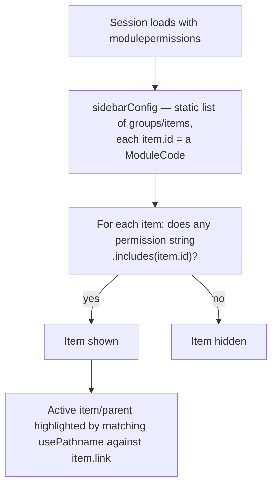
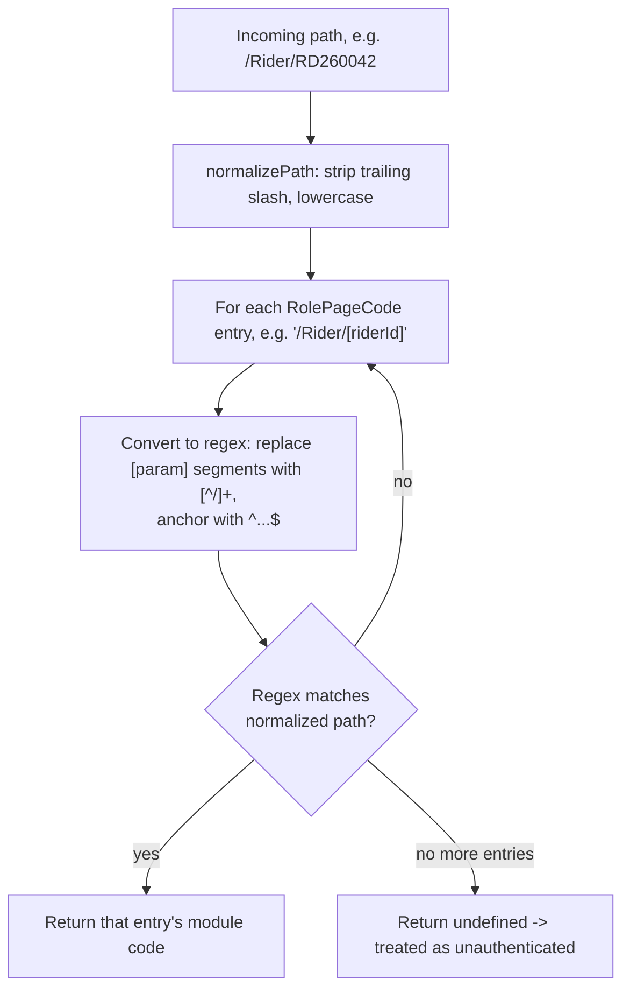

# Frontend Application Shell (Infrastructure)

## 1. Module overview

The Next.js scaffolding shared by every business screen: route groups and their layouts, session/query/theme providers, the permission-driven sidebar, and the AG Grid + Ant Design presentation conventions (`grid-props` builders, shared modal components) that every feature module reuses rather than reimplementing.

**Where it lives:**

| Concern | Path |
|---|---|
| Route-level access gate | `CAG.Admin.UI/src/middleware.ts` |
| Root/route-group layouts | `src/app/(pages)/layout.tsx`, `(details)/layout.tsx`, `(auth-pages)/layout.tsx` |
| App-wide providers | `src/app/providers/app-providers.tsx`, `react-query-client.tsx`, `toast-provider.tsx` |
| Navigation | `src/app/components/sidebar/`, `src/app/constants/navbar-items-config.ts` |
| Grid framework | `src/app/constants/grid-props/*.ts` (22 files), `src/app/components/grid/*.tsx` (24 renderers) |
| Shared modals | `src/app/components/modals/*.tsx` |
| Theming | `src/app/constants/antd-theme-config.ts`, `src/app/styles/` |

## 2. Business perspective

### 2.1 Business purpose

Every business module ([Rider Management](rider-management.md), [Payroll Management](payroll-management.md), etc.) needs a consistent way to be reached only by permitted staff, rendered inside the same navigation chrome, and presented through the same data-grid and modal conventions — so the portal reads as one product rather than 18 disconnected tools. This module is that connective tissue.

### 2.2 Key use cases

1. **A staff member navigates the app** — the sidebar shows only the modules their role has any permission on; route entry is independently re-checked by middleware regardless of whether a sidebar link was clicked or a URL was typed directly.
2. **A staff member's session expires mid-use** — middleware detects `expiresAt` has passed and force-redirects to sign-in, clearing NextAuth cookies.
3. **A developer adds a new list screen** — reuses `buildXColumnDefs()` + AG Grid + the shared modal shell rather than building a bespoke table.

### 2.3 Business rules & logic

- **Permission enforcement exists at three independent layers with three different matching rules**, all keyed off the same `session.user.modulepermissions` string array but implemented differently:
  1. `middleware.ts` — resolves the request path to a single expected module code via `RolePageCode`, then checks `permission.includes(roleCode)` for an **exact-enough substring match** against the full `"MODULE.TYPE"` string.
  2. `sidebar.tsx` — filters nav items where `session.user.modulepermissions.some(p => p.includes(item.id))`, i.e., "does the role have *any* permission (view/edit/delete) on this module," using the same substring `.includes()` technique keyed by module code alone.
  3. `useHasPermission(module, permissionType)` (component level, see [Authentication & Authorization](authentication-authorization.md)) — builds the exact string `${module}.${permissionType}` and checks for an exact array match, not a substring.
  [Inferred] All three happen to agree today because no module code is a substring of another (verified against the 13 codes in `ModuleCodes`), but the substring-based checks in (1) and (2) are one poorly-chosen future module code away from a false match.
- **`/Payslip/[id]` is a hardcoded bypass** in `middleware.ts` — any authenticated session, regardless of module permissions, can reach a payslip detail page (explicit: `if (normalized.includes("/payslip/")) return NextResponse.next();`). [Inferred] Likely because a rider or a user without `CAG_FINANCE` access should still be able to open their own payslip link (e.g., from an email or the HR workflow), but the carve-out is path-based, not identity-based — it does not verify the payslip belongs to the requester.
- **A denied route redirects to the user's first permitted module, not a 403 page.** `middleware.ts` derives this by reverse-matching `session.modulepermissions[0]` back against `RolePageCode` entries (explicit).
- **Route table (`RolePageCode`) is maintained by hand and must be kept in sync with the App Router's actual folder structure** — a new page whose path isn't added to `RolePageCode` resolves to `roleCode === undefined`, which the middleware treats as "not authenticated" and redirects to sign-in even for a fully permitted user (explicit, `middleware.ts` line: `else if (!session?.modulepermissions?.length || !roleCode) isAuthenticated = false`).
- **React Query defaults suppress background refetch on focus and disable retries app-wide** (`refetchOnWindowFocus: false, retry: false` in `react-query-client.tsx`) — a deliberate, global choice that every hook in every module inherits unless it overrides.

### 2.4 End-to-end business flows

**Route access — see the full flowchart already documented in [Authentication & Authorization](authentication-authorization.md) §2.4; this module owns that logic (`middleware.ts` lives here), that module owns the identity/claims it operates on.**

**Sidebar construction on session load:**



### 2.5 Actors & interactions

| Actor | Role |
|---|---|
| Every authenticated user | Subject of route/sidebar filtering |
| Every business module's pages | Consume the shared layouts, providers, grid framework |
| `next-auth/jwt.getToken` | Read by `middleware.ts` on every matched request (Edge runtime) |

## 3. Technical perspective

### 3.1 Architecture overview

Next.js App Router with **route groups** (parenthesized folders that don't affect the URL) used to apply different layouts to different page categories: `(pages)` gets the sidebar/top-nav chrome and a server-side session check; `(details)` gets a lighter detail-page chrome; `(auth-pages)` gets neither. A single `middleware.ts` runs at the edge for every non-static, non-API request (`matcher: ["/((?!.*\\..*|_next|api).*)"]`) ahead of any layout or page code.

```mermaid
graph TD
    Req[Incoming request] --> MW["middleware.ts (Edge)"]
    MW -->|expired/no session| SignIn[/Auth/SignIn]
    MW -->|no permission for path| Redirect[Redirect to first permitted module]
    MW -->|ok| Routing[Next.js route resolution]
    Routing --> PagesGroup["(pages)/layout.tsx<br/>getServerSession + redirect if none"]
    Routing --> DetailsGroup["(details)/layout.tsx"]
    Routing --> AuthGroup["(auth-pages)/layout.tsx"]
    PagesGroup --> Providers[AppProviders]
    DetailsGroup --> Providers
    Providers --> SessionProvider[NextAuth SessionProvider]
    SessionProvider --> RQ[ReactQueryClient]
    RQ --> AntD[ConfigProvider — antdTheme]
    AntD --> Page[Page content]
    PagesGroup --> Sidebar[Sidebar — permission-filtered]
```

### 3.2 Component breakdown

| Component | Responsibility | Key logic | Dependencies |
|---|---|---|---|
| `middleware.ts` | Edge-level route gate | `resolveRoleCode` (regex-converts `[param]` segments), expiry check, redirect logic | `next-auth/jwt`, `RolePageCode`, `RolePageCode` enum from [Authentication & Authorization](authentication-authorization.md) |
| `(pages)/layout.tsx` | Server-rendered shell: session fetch, redirect-if-none, sidebar + top-nav + background image | `getServerSession(authOptions)` | NextAuth, `Sidebar`, `TopNav`, `AutoLogout` |
| `AppProviders` | Composes all client-side providers in one place | — | `SessionProvider`, `ReactQueryClient`, `ConfigProvider` (antd), `ToastProvider`, `Suspense`+`Loading` |
| `ReactQueryClient` | Single `QueryClient` instance, dev-only devtools | `refetchOnWindowFocus:false`, `retry:false`, custom `shouldDehydrateQuery` | TanStack Query |
| `Sidebar` | Permission-filtered, path-aware navigation | active-item detection by pathname matching, `useGetUserImage` for the avatar | `navbar-items-config.ts`, session |
| `grid-props/*.ts` (22 files) | Per-feature AG Grid `ColDef[]` builders (`buildXColumnDefs`) | cell renderers, `valueGetter`s for computed columns | `components/grid/*` renderers |
| `components/grid/*` (24 files) | Reusable cell renderers (status badges, action buttons, progress bars) | e.g. `RiderStatus`, `HelpdeskStatusBadge`, `PercentageBar` | AG Grid `ICellRendererParams` |
| `components/modals/*` | Shared modal shells (`add-edit-modal`, `alert-modal`, `filters-modal`) reused across feature-specific modals | — | Ant Design `Modal` |

### 3.3 Detailed technical flows

**Dynamic-route matching in `resolveRoleCode`** — the mechanism that lets `RolePageCode`'s static map cover parameterized routes like `/Rider/[riderId]`:



### 3.4 API & interface documentation

Not an HTTP API surface — this module's "interface" is the `RolePageCode` route table and the `SidebarItemType`/`SidebarGroupType` config shape in `constants/types.ts`, both of which every new page must be registered into by hand.

### 3.5 Database & data model

None directly — consumes `session.user.modulepermissions`, which originates from [Authentication & Authorization](authentication-authorization.md)'s `Role`/`RolePermission`/`PageModule` tables.

### 3.6 External integrations

None beyond NextAuth (session/JWT) and the Google Font (`Poppins`) loaded via `next/font/google` in the root layout.

### 3.7 Internal module dependencies

**Upstream:** [Authentication & Authorization](authentication-authorization.md) (session, `RolePageCode`, `ModuleCodes`).

**Downstream:** every UI-facing business module depends on this shell for routing, chrome, and the grid/modal component conventions — [Rider Management](rider-management.md), [Vehicle Management](vehicle-management.md), [Payroll Management](payroll-management.md), etc. all build their list screens on `grid-props` + `components/grid` and their forms on the shared modal shells.

### 3.8 Configuration & environment

`NEXTAUTH_SECRET` (session verification inside middleware, via `getToken`), `NEXTAUTH_URL`. See [architecture-overview.md](architecture-overview.md) for the full environment table.

### 3.9 Background jobs & workers

None, aside from client-driven polling intervals set per-hook in individual modules (e.g. [User Management](user-management.md)'s 5-second user-list refetch) — this shell does not itself schedule anything.

### 3.10 Events & messaging

None. `ToastProvider` (react-hot-toast) is the closest thing to an app-wide event bus, but it's a one-way UI notification channel, not a message system.

### 3.11 Authentication & authorization

This module is where UI-side authorization is *implemented* (§2.3); see [Authentication & Authorization](authentication-authorization.md) for where it's *decided* (claims, roles, permission matrix).

### 3.12 Validation & error handling

`(pages)/layout.tsx` is the backstop: if `getServerSession` returns no session, it `redirect()`s server-side before any client code runs — a second, server-rendered check behind the edge middleware's own session check, so a request that somehow bypassed middleware still cannot render a protected page without a session (though it could still, per the substring-matching caveat in §2.3, render a page the session lacks fine-grained permission for, as far as this shell alone is concerned — individual pages/components are expected to layer `useHasPermission` on top for that).

### 3.13 Logging & observability

None beyond `console.log("API token expired")` in the NextAuth `getIsTokenValid` helper (see [Authentication & Authorization](authentication-authorization.md)). React Query Devtools are mounted in development only.

### 3.14 Design patterns & architectural decisions

- **Route groups as layout scoping**, a standard Next.js App Router pattern, used here specifically to give `(pages)` a server-side auth gate that `(auth-pages)` deliberately lacks.
- **Convention-over-configuration grid building** — every feature module supplies a `buildXColumnDefs()` function with a consistent signature, letting `components/grid` renderers be shared across otherwise-unrelated domains (e.g., `status-bar.tsx` is generic enough to back both rider status and helpdesk status presentations in different `grid-props` files).
- **Three-tier, non-unified permission checking** (§2.3) is itself a de facto architectural decision (or its accumulated absence) worth naming: there is no single `hasModuleAccess(module)` utility that `middleware.ts`, `sidebar.tsx`, and `useHasPermission` all call — each reimplements the check.

## 4. Risk & improvement analysis

### 4.1 Edge cases & failure scenarios

- Adding a new page without a matching `RolePageCode` entry silently locks it behind a sign-in redirect for every user, including Admins — this fails safe (denies access) rather than failing open, but the failure mode looks identical to a genuine auth problem, which could cost debugging time.
- The `/payslip/` bypass (§2.3) does not verify the requester owns the payslip being viewed — any authenticated session can view any payslip URL if they know or guess the ID pattern, since module-permission checking is skipped entirely for that path segment, and the identity check (if any) is left to the page/API itself. [Inferred — this shell only establishes that the *route* is reachable; whether [Payroll Management](payroll-management.md)'s API additionally scopes payslip data by rider was not traced here]

### 4.2 Known limitations

- Three separate, independently-coded permission-checking implementations (§2.3) with no shared utility — a change to the permission string format (e.g., adding a fourth permission type, or changing the delimiter) requires updating three call sites correctly.
- The substring `.includes()` matching in `middleware.ts` and `sidebar.tsx` is fragile against future module-code collisions (§2.3) — currently safe by coincidence of naming, not by design.
- `RolePageCode` is a hand-maintained parallel structure to the actual folder-based routing — no build-time check confirms every route under `(pages)`/`(details)` has a corresponding entry.

### 4.3 Security considerations

The `/payslip/` middleware bypass (§4.1) is the most concrete finding here: it trades module-permission enforcement for reachability, with no compensating identity check visible in this layer. Whether that's actually exploitable depends on authorization inside [Payroll Management](payroll-management.md)'s API endpoints, which — per the platform-wide finding in [architecture-overview.md](architecture-overview.md) — do not check caller identity against the resource being requested for `GET api/payroll/{id}` beyond `[Authorize]`. Combined, this suggests any authenticated user (or even a Rider account) who knows or enumerates a payslip ID could view another rider's payslip.

### 4.4 Performance considerations

Every `(pages)` request pays for a server-side `getServerSession` call plus the edge middleware's own `getToken` call — two independent session reads per navigation. [Inferred] Not necessarily expensive (both read the same cookie/JWT rather than hitting the database), but redundant.

### 4.5 Potential improvements

**Quick wins:**
- Extract a single shared `hasModulePermission(permissions, module, type?)` utility and use it in all three enforcement points.

**Medium effort:**
- Replace substring `.includes()` checks with exact segment matching (split on `.` and compare the module portion) to remove the latent collision risk.
- Add an identity check to whatever the `/payslip/[id]` page/API does, rather than relying on route-level bypass alone.

**Major refactors:**
- Generate `RolePageCode` (or validate it in CI) from the actual App Router file tree, so new pages can't silently end up unreachable or unintentionally unguarded.

## 5. Summary

- Owns Next.js routing structure, session-gated layouts, and the shared grid/modal presentation framework every business module builds on.
- Implements UI-side authorization independently in three places (`middleware.ts`, `sidebar.tsx`, `useHasPermission`), each with a slightly different matching rule, all currently consistent only by coincidence.
- `RolePageCode` is a hand-maintained route table; anything missing from it fails closed (redirects to sign-in) rather than failing open.
- `/Payslip/[id]` is explicitly exempted from module-permission checks at the middleware layer, with no visible compensating identity check at this layer.
- React Query is configured globally with `retry:false`/`refetchOnWindowFocus:false`, inherited by every hook in every module unless overridden.
- No shared authorization utility exists; a permission-model change requires touching three independent call sites.
