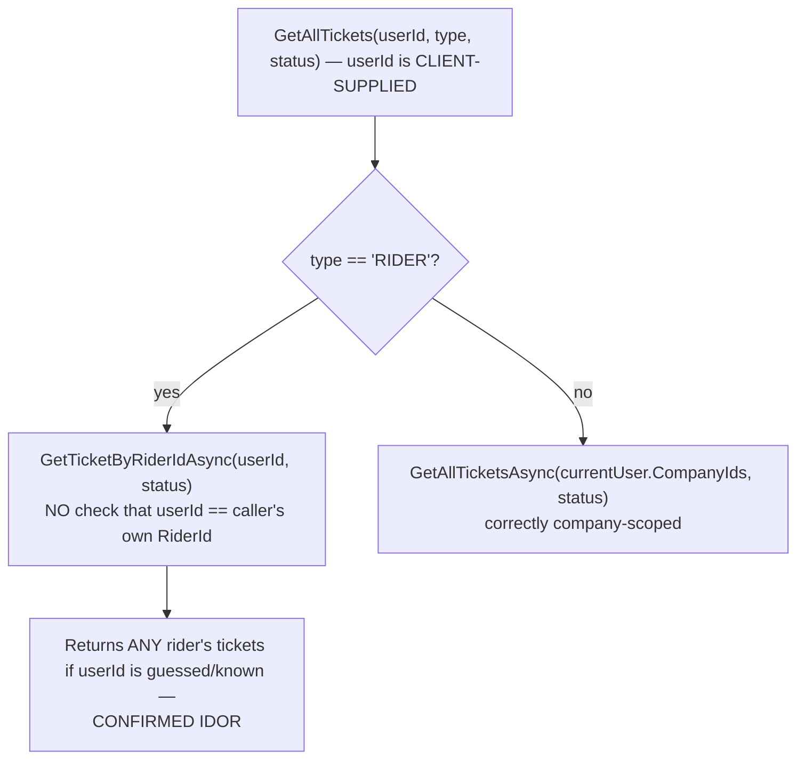
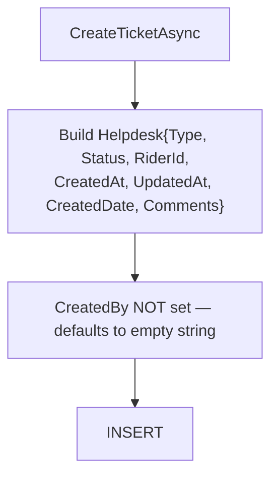
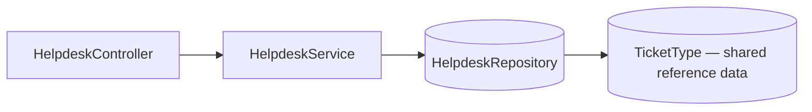
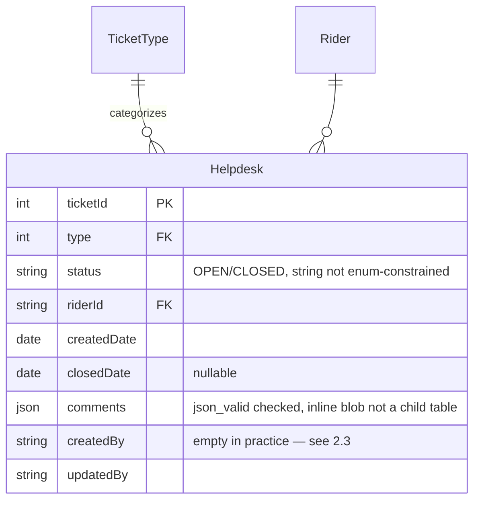

# Helpdesk

## 1. Module overview

A general-purpose internal support ticketing system for riders/staff, with typed tickets (`TicketType`), a JSON-blob comment thread per ticket, and status tracking. Structurally near-identical to [Passport Request](passport-request.md) — the two modules were evidently built from the same template, to the point that [Passport Request](passport-request.md)'s create-ticket method actually constructs *this* module's `Helpdesk` object by mistake (see that module's §2.3 for the confirmed defect and why it happens to work anyway).

**Where it lives:**

| Concern | Path |
|---|---|
| Controller | `CAG.Admin.API/CAG.Admin.API/Controllers/v1/HelpdeskController.cs` |
| Service | `HelpdeskService.cs` |
| Repository | `HelpdeskRepository.cs` |
| Enum | `HelpdeskStatusEnum` (`OPEN`, `CLOSED`) |

## 2. Business perspective

### 2.1 Business purpose

Riders and staff need a channel to raise and track general support issues distinct from HR workflow, leave, or payroll — this module is that generic ticketing surface, typed by `TicketType` (a shared reference table also used by [Passport Request](passport-request.md)).

### 2.2 Key use cases

1. **A rider or staff member raises a support ticket.**
2. **Staff view all open/closed tickets for their assigned companies.**
3. **A rider views their own ticket history** — intended to be scoped to just their tickets (see §2.3 for a confirmed gap in how this is enforced).
4. **Staff update a ticket's status, comments, or details.**
5. **Staff delete a ticket.**

### 2.3 Business rules & logic

- **Ticket comments are a JSON blob in a single column, not a relational child table** — unlike [Leave Management](leave-management.md)'s `LeaveRequestComment` (a proper child table with its own CRUD), `Helpdesk.Comments` is a `string?` holding JSON text, guarded only by a database `json_valid()` check constraint (explicit, confirmed against both the DBModel and [architecture-overview.md](architecture-overview.md) §4.5). [Inferred] This means the comment thread has no per-comment ID, timestamp, or author tracked at the database level unless those are embedded inside the JSON payload itself by the UI — there is no server-side comment-add/comment-delete endpoint at all, only whole-ticket updates that presumably overwrite the entire `Comments` blob.
- **`CreatedBy` is never set on ticket creation**: `CreateTicketAsync` populates `Type`, `Status`, `RiderId`, `CreatedAt`, `UpdatedAt`, `CreatedDate`, and `Comments` — but not `CreatedBy`, despite `Helpdesk.CreatedBy` being a non-nullable `string` field on the DBModel (defaulting to `string.Empty` if never set) (explicit, confirmed against the DBModel). `UpdateTicketAsync`, by contrast, does set `UpdatedBy`. [Inferred] Every created ticket likely has an empty-string `CreatedBy`, silently losing "who raised this ticket" — a gap not present on the update path.
- **A confirmed, exploitable authorization gap in ticket listing**: `GetAllTicketsAsync(userId, type, status)` — when `type == "RIDER"` — calls `GetTicketByRiderIdAsync(userId, status)`, filtering by the **client-supplied `userId` query parameter directly**, not by the caller's own `CurrentUser.RiderId` (explicit, confirmed by reading the full method). There is no check anywhere in this path that `userId` matches the authenticated caller's own identity. **Any authenticated user can view any rider's helpdesk tickets by supplying an arbitrary `userId` value in the query string** — this is a textbook Insecure Direct Object Reference (IDOR), not just the platform's general absence of role checks: even a *correctly scoped* per-rider "my tickets" feature is broken here because the scoping key comes from client input instead of server-derived identity. The parameter's own name (`userId`, used to filter by *rider* ID) reflects the same user/rider identity conflation seen in [Document Management](document-management.md) and elsewhere, and may be part of why this was never caught — the mismatch reads, at a glance, like it's already doing an identity check.
- **The non-`"RIDER"` branch is company-scoped**, using `_currentUser.CompanyIds` correctly (explicit) — so the defect above is specific to the rider self-service path, not the staff-facing list.

### 2.4 End-to-end business flows

**Ticket listing — the two branches, one broken:**

**Ticket creation — the audit gap:**

### 2.5 Actors & interactions

| Actor | Role |
|---|---|
| Rider (self) | Raise and view own tickets — the "view own" path is where the IDOR lives |
| Staff | View/manage tickets across assigned companies |
| [Passport Request](passport-request.md) | Near-identical sibling module, shares `TicketType` reference data |

## 3. Technical perspective

### 3.1 Architecture overview

Minimal, standard four-hop chain; no dependencies on other modules beyond `TicketType` reference data.

### 3.2 Component breakdown

| Component | Responsibility | Key methods |
|---|---|---|
| `HelpdeskController` | 6-endpoint HTTP surface | CRUD + ticket types |
| `HelpdeskService` | Thin business logic | `CreateTicketAsync`, `GetAllTicketsAsync` (§2.3), `UpdateTicketAsync` |
| `HelpdeskRepository` | `GenericRepository<Helpdesk>` + typed queries | `GetTicketByRiderIdAsync`, `GetAllTicketsAsync`, `GetAllTicketTypesAsync` |

### 3.3 Detailed technical flows

Covered fully in §2.4.

### 3.4 API & interface documentation

| Method | Route | Notes |
|---|---|---|
| `GET` | `api/helpdesk?userId=&type=&status=` | **IDOR when `type=RIDER`** — see §2.3 |
| `GET` | `api/helpdesk/{ticketId}` | No ownership/company check found on the single-ticket read either — [Inferred, not fully traced into the repository SQL] worth verifying |
| `POST` | `api/helpdesk` | `CreatedBy` not populated |
| `PUT` | `api/helpdesk/{ticketId}` | Raw `Helpdesk` DBModel bound from body (mass-assignment surface) |
| `DELETE` | `api/helpdesk/{ticketId}` | No existence guard |
| `GET` | `api/helpdesk/ticket-types` | Reference data |

### 3.5 Database & data model

### 3.6 External integrations

None.

### 3.7 Internal module dependencies

**Upstream:** none of substance.

**Downstream:** [Passport Request](passport-request.md) shares the `TicketType` reference table and — due to the confirmed copy-paste defect documented there — occasionally shares this module's exact DBModel shape at runtime.

### 3.8 Configuration & environment

None module-specific.

### 3.9 Background jobs & workers

None.

### 3.10 Events & messaging

None.

### 3.11 Authentication & authorization

`[Authorize]` only. The rider-scoped ticket list is the concrete, confirmed exploitable gap in this module (§2.3) — a step beyond the platform's general absence of role checks, since this breaks even the intended per-user data boundary.

### 3.12 Validation & error handling

- `Status` is stored as a free string (`ticket.Status.ToString()`), not validated against `HelpdeskStatusEnum`'s two values server-side.
- No existence checks before update/delete.
- `Comments` relies entirely on the database's `json_valid()` constraint for structural validity; malformed JSON from the client would fail at the database layer as an unhandled constraint violation rather than a clean 400.

### 3.13 Logging & observability

None beyond the platform-wide exception log.

### 3.14 Design patterns & architectural decisions

**JSON-blob comment storage** instead of a relational child table is a deliberate simplicity/flexibility trade-off, at the cost of losing per-comment queryability, authorship, and timestamps at the database level — a different design choice than [Leave Management](leave-management.md) made for conceptually the same "comment thread on a request" feature, worth reconciling if consistency matters.

## 4. Risk & improvement analysis

### 4.1 Edge cases & failure scenarios

- **Confirmed IDOR**: any authenticated user can view any rider's helpdesk tickets by supplying that rider's ID as the `userId` query parameter.
- Tickets created with no `CreatedBy` lose authorship information permanently.
- Malformed comment JSON from a client-side bug would surface as a raw database constraint error.

### 4.2 Known limitations

- No relational comment history — auditability of the comment thread depends entirely on however the UI structures the JSON blob.
- `Status` not server-validated against its enum.

### 4.3 Security considerations

**The `GetAllTicketsAsync` IDOR (§2.3) is the headline finding for this module** — it is reachable by any authenticated user with no special privilege, requires only guessing or knowing another rider's ID (a predictable `RD{yy}{seq}` format, not a random identifier — see [Rider Management](rider-management.md)), and exposes potentially sensitive support-ticket content across rider boundaries.

### 4.4 Performance considerations

Nothing notable at current volumes (`Helpdesk` at 0 rows per the schema snapshot in [architecture-overview.md](architecture-overview.md) §4.3 — this feature may not yet be in active use).

### 4.5 Potential improvements

**Quick wins:**
- Fix `GetAllTicketsAsync`'s `RIDER` branch to filter by `_currentUser.RiderId`, ignoring or validating the client-supplied `userId` against it.
- Populate `CreatedBy` in `CreateTicketAsync`.
- Validate `Status` against `HelpdeskStatusEnum` server-side.

**Medium effort:**
- Add existence checks before update/delete.
- Consider whether a relational comment table (matching [Leave Management](leave-management.md)'s pattern) would serve this module better than a JSON blob, for consistency and auditability.

**Major refactors:**
- None specific to this module.

## 5. Summary

- A general support-ticketing module, structurally near-identical to [Passport Request](passport-request.md).
- **Confirmed IDOR**: the rider-scoped ticket list filters by a client-supplied `userId` parameter instead of the caller's own identity, letting any authenticated user view any rider's tickets.
- `CreatedBy` is never populated on ticket creation, unlike every write-path in the rest of the platform.
- Comments are stored as an inline JSON blob rather than a relational child table, unlike the analogous feature in [Leave Management](leave-management.md).
- Currently zero rows in the live dataset, suggesting light or no production use yet — a good time to fix the IDOR before real ticket data accumulates.
