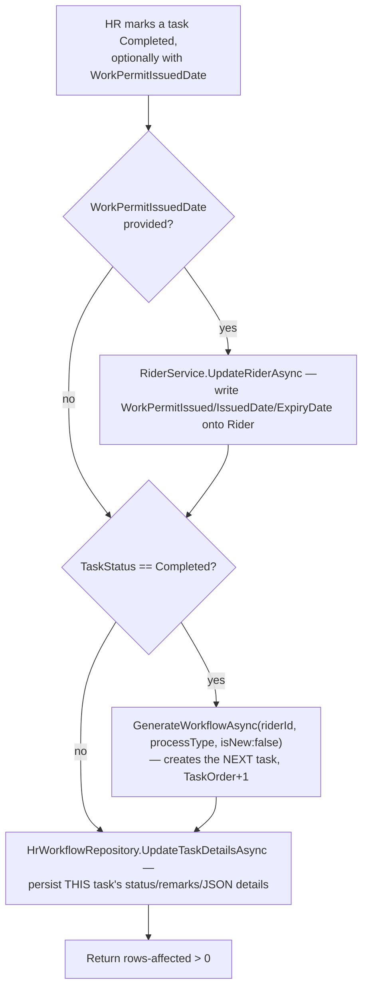
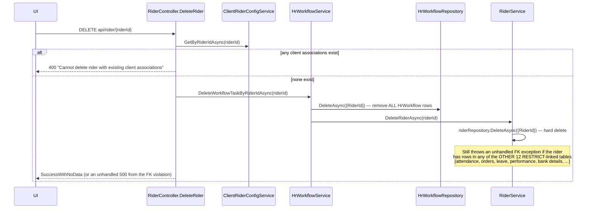
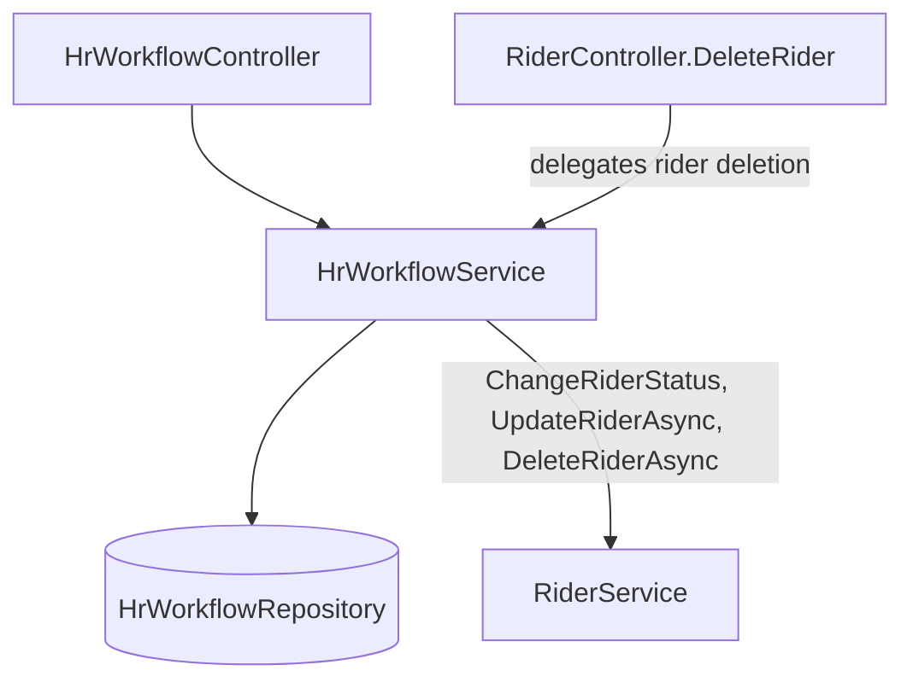
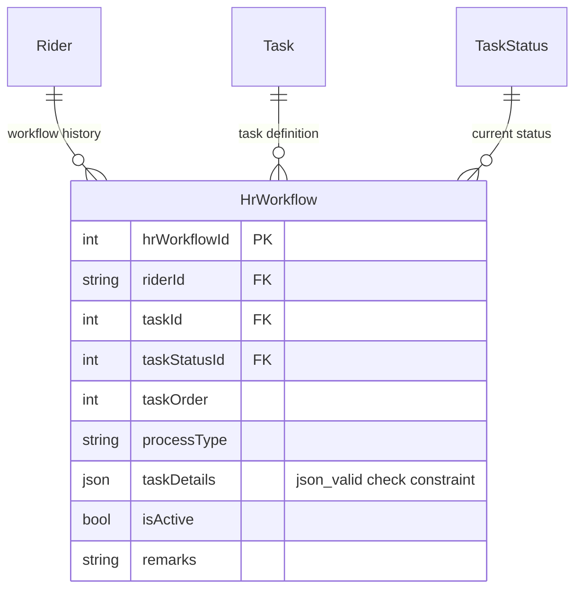

# HR Workflow & Onboarding

## 1. Module overview

A task-chain engine for two specific rider HR processes — Visa Processing and Local Transfer — where completing one task automatically generates the next in sequence. It also, surprisingly, owns the actual implementation of rider deletion (see §2.3). Distinct from [Leave Management](leave-management.md) and [Attendance Management](attendance-management.md), which track ongoing employment rather than one-time administrative processes.

**Where it lives:**

| Concern | Path |
|---|---|
| Controller | `CAG.Admin.API/CAG.Admin.API/Controllers/v1/HrWorkflowController.cs` |
| Service | `CAG.Admin.API.Application/Service/Implementation/HrWorkflowService.cs` |
| Repository | `CAG.Admin.API.DBRepository/Repository/HrWorkflowRepository.cs` |
| Enums | `ProcessType` (`VISA_PROCESS`, `LOCAL_TRANSFER`), `TaskStatuses` |
| UI | `src/app/(pages)/HR/Workflow/` |

## 2. Business perspective

### 2.1 Business purpose

Two of a rider's status transitions — going through visa processing, or transferring locally between sponsors/companies — require a structured, multi-step HR checklist rather than a single status flip. This module drives that checklist: generating tasks in order, tracking completion, and writing certain outcomes (like work permit issuance) back onto the rider record itself.

### 2.2 Key use cases

1. **HR initiates a Visa Process or Local Transfer workflow for a rider** — creates the first task and flips the rider's status accordingly.
2. **HR completes a task** — records the outcome, and if marked complete, automatically generates the next task in the sequence.
3. **HR views all riders currently in an active workflow** (delegates to [Rider Management](rider-management.md)'s `GetWorkflowRiders`).
4. **A completed task can write directly into the Rider record** — specifically work-permit issuance fields.
5. **Deleting a rider** (initiated from [Rider Management](rider-management.md)'s UI) actually routes through this module first.

### 2.3 Business rules & logic

- **Only two process types can be started**: `GenerateWorkflowAsync` rejects any `processType` other than the literal strings `"VISA_PROCESS"`/`"LOCAL_TRANSFER"` with `InvalidRequest` (explicit) — a stringly-typed check duplicating what the `ProcessType` enum already constrains, since the controller always passes `requestModel.ProcessType.GetDescription()` (an enum-derived string) in practice.
- **A rider cannot have two active workflows at once**: starting a new workflow (`isNew = true`) checks for an existing active workflow first and rejects with `InvalidRequest` if one exists (explicit).
- **Task sequencing is order-number-based, not a fixed template**: each new task's `TaskOrder` is either `1` (starting fresh) or `activeWorkflow.TaskOrder + 1` (continuing) (explicit) — there's no explicit "workflow definition" table describing the full expected sequence; each next step is generated reactively from the current one via `GenerateWorkflowByOrderIdAsync` (server/repository-side logic not traced further here, but the ordering contract is confirmed at the service layer).
- **Starting a new workflow changes the rider's status to match the process type**: `VISA_PROCESS` → `RiderStatuses.VisaProcess`, `LOCAL_TRANSFER` → `RiderStatuses.LocalTransfer` (explicit) — these are exactly two of the three statuses that [Rider Management](rider-management.md) uses to block full rider-record access pending workflow completion (the third, `Onboarding`, is not set from anywhere in this module — [Inferred] it is likely the rider's initial/default status set elsewhere, possibly a database column default or the raw `POST api/rider` payload itself, not traced further).
- **Completing a task can auto-advance the workflow**: `UpdateTaskDetails` checks `taskDetails.TaskStatus == TaskStatuses.Completed` and, if so, recursively calls `GenerateWorkflowAsync(riderId, processType, isNew:false)` to create the next task **before** actually persisting the current task's completion via `UpdateTaskDetailsAsync` (explicit — note the ordering: the next task is generated first, then the current one is marked complete in the database).
- **A task completion can write back into the Rider aggregate**: if `taskDetails.WorkPermitIssuedDate` is present, `UpdateTaskDetails` calls `RiderService.UpdateRiderAsync` with `WorkPermitIssued`/`WorkPermitIssuedDate`/`WorkPermitExpiryDate` *before* touching the task itself (explicit) — this is the one concrete example in the codebase of an HR workflow task directly mutating rider fields outside of status.
- **Rider deletion is actually implemented here, under a misleading name**: `DeleteWorkflowTaskByRiderIdAsync(riderId)` deletes every `HrWorkflow` row for the rider, **then calls `IRiderService.DeleteRiderAsync(riderId)`** — i.e., it deletes the rider entirely, not just workflow tasks (explicit, confirmed by reading the method body). This is the actual implementation reached by `DELETE api/rider/{riderId}` (see [Rider Management](rider-management.md) §3.12 for the full corrected trace, including the controller's pre-check against existing client associations).

### 2.4 End-to-end business flows

**Task-chain auto-advance on completion:**

**Rider deletion, corrected full trace (spans three services):**

### 2.5 Actors & interactions

| Actor | Role |
|---|---|
| HR staff | Initiate and progress workflows |
| [Rider Management](rider-management.md) | Bidirectional — this module reads/writes `Rider.StatusId` and work-permit fields, and its own delete endpoint is implemented *inside* this module |
| [Attendance Management](attendance-management.md), [Leave Management](leave-management.md) | Peers, not directly coupled to this module |

## 3. Technical perspective

### 3.1 Architecture overview

A thin service wrapping one repository, made notable by two cross-module writes into [Rider Management](rider-management.md) (status changes and work-permit fields) and by hosting the rider-deletion implementation.

### 3.2 Component breakdown

| Component | Responsibility | Key methods |
|---|---|---|
| `HrWorkflowController` | 6-endpoint HTTP surface (note: `GetAllHrWorkflows` delegates to `IRiderService.GetWorkflowRiders`, not this module's own service) | task listing, workflow generation, task update |
| `HrWorkflowService` | Task-chain generation, rider-status side effects, rider-deletion orchestration | `GenerateWorkflowAsync`, `UpdateTaskDetails`, `ActivateTaskAsync`, `DeleteWorkflowTaskByRiderIdAsync` |
| `HrWorkflowRepository` | `GenericRepository<HrWorkflow>` + ordered task generation/activation queries | `GenerateWorkflowByOrderIdAsync`, `GetActiveWorkflowByRiderIdAsync`, `DeActivateAllAsync`, `ActivateTaskAsync`, `UpdateTaskDetailsAsync` |

### 3.3 Detailed technical flows

See §2.4 — both flows above are the technically load-bearing paths in this module.

### 3.4 API & interface documentation

| Method | Route | Notes |
|---|---|---|
| `GET` | `api/hrworkflow/tasks/{processType}` | Task template/list for a process type |
| `POST` | `api/hrworkflow/generate` | Starts a new workflow (`isNew:true`) |
| `GET` | `api/hrworkflow/riders/all` | Delegates to `RiderService.GetWorkflowRiders`, not this service |
| `GET` | `api/hrworkflow/workflows/{riderId}` | Full history for a rider |
| `GET` | `api/hrworkflow/workflow/{riderId}/active` | Current in-progress task |
| `PUT` | `api/hrworkflow/task/update` | Completes/updates a task, may auto-advance and may write back to `Rider` |

`DeleteWorkflowTaskByRiderIdAsync` has **no dedicated route in this controller at all** — it is reachable only indirectly, via `DELETE api/rider/{riderId}` in [Rider Management](rider-management.md)'s controller.

### 3.5 Database & data model

`HrWorkflow.taskDetails` is a JSON-valid-checked text column (see [architecture-overview.md](architecture-overview.md) §4.5) — read/written whole, not queried by path, consistent with the platform-wide absence of native JSON column usage.

### 3.6 External integrations

None.

### 3.7 Internal module dependencies

**Upstream:** [Rider Management](rider-management.md) (`RiderService.ChangeRiderStatus`, `UpdateRiderAsync`, `DeleteRiderAsync` — all three called from here).

**Downstream:** [Rider Management](rider-management.md)'s own delete endpoint depends on this module to actually perform the deletion — an unusual downstream-depends-on-upstream inversion worth remembering when reading either module in isolation.

### 3.8 Configuration & environment

None module-specific.

### 3.9 Background jobs & workers

None — task generation is entirely request-driven (either an HR action or a completion trigger), never scheduled.

### 3.10 Events & messaging

None — the "next task" trigger is a direct synchronous method call (`UpdateTaskDetails` → `GenerateWorkflowAsync`) within the same request, not an event.

### 3.11 Authentication & authorization

`[Authorize]` only, no role check — consistent with the platform-wide gap. Notably, this means any authenticated user can trigger `DeleteWorkflowTaskByRiderIdAsync` indirectly via the rider-delete endpoint, i.e., can permanently delete a rider's entire HR history and the rider record itself.

### 3.12 Validation & error handling

- `GenerateWorkflowAsync`'s process-type string check and duplicate-active-workflow check are both solid, explicit guards.
- `GetWorlflowTasksAsync` throws `EntityNotFound` for an empty task list — one of the few places using a genuinely correct not-found signal.
- `UpdateTaskDetails` performs two side-effecting writes (rider update, next-task generation) before its own primary write (the current task's completion) — if the primary `UpdateTaskDetailsAsync` call fails after the side effects already succeeded, the rider's work-permit fields and/or the next task could exist despite the triggering task never actually being marked complete, since none of this is wrapped in a shared transaction. [Inferred from the absence of any `IDbTransaction` in this method]

### 3.13 Logging & observability

None beyond the platform-wide exception log.

### 3.14 Design patterns & architectural decisions

- **Reactive, order-number task chaining** rather than a declarative workflow-definition table — simple to implement, but means the "shape" of a Visa Process or Local Transfer workflow (how many steps, what each does) lives implicitly in whatever `GenerateWorkflowByOrderIdAsync` does at the repository/database level for a given `(processType, taskOrderNumber)`, not in an inspectable, versioned definition.
- **Misleading method naming** (`DeleteWorkflowTaskByRiderIdAsync` deleting the rider, not just tasks) is worth flagging as a maintainability hazard in its own right — a future developer reading only the method name (or only [Rider Management](rider-management.md)'s controller, without following the call) would reasonably assume rider deletion is self-contained in `RiderService`.

## 4. Risk & improvement analysis

### 4.1 Edge cases & failure scenarios

- **No transaction wraps `UpdateTaskDetails`'s three writes** (optional rider update, next-task generation, current-task completion) — a mid-sequence failure leaves partial state (§3.12).
- **`DeleteWorkflowTaskByRiderIdAsync`'s two operations (delete all HrWorkflow rows, then delete the Rider) are not transactional either** — if `RiderService.DeleteRiderAsync` throws (e.g., due to one of the other 12 `RESTRICT` FKs), the rider's entire HR workflow history has *already been permanently deleted*, while the rider record itself survives — an unrecoverable partial-deletion state reachable by attempting to delete any rider who has HR history but *also* has, say, attendance or leave records.
- Recursive task generation (`UpdateTaskDetails` → `GenerateWorkflowAsync`) has no visible loop/depth guard — [Inferred, not confirmed exploitable] if `GenerateWorkflowByOrderIdAsync` or the caller ever produced a task that was immediately markable complete without human interaction, this shape could runaway; as built (each step requires an explicit HR PUT), this is not currently reachable, but the structural risk is worth naming for future automation of this flow.

### 4.2 Known limitations

- No workflow-definition/template concept — task sequences are implicit in repository logic rather than data-driven or inspectable from the API.
- Method naming misrepresents actual behavior for `DeleteWorkflowTaskByRiderIdAsync` (§3.14).

### 4.3 Security considerations

Any authenticated user can permanently delete a rider's complete HR history and the rider record via a chain that starts at a *different* controller's endpoint — the lack of role-gating here is compounded by how non-obvious the actual code path is (see §4.1's partial-deletion scenario for the concrete consequence of an unprivileged or mistaken call).

### 4.4 Performance considerations

Nothing notable — low-volume, request-driven operations (2,379 `HrWorkflow` rows currently, per [architecture-overview.md](architecture-overview.md) §4.3 table).

### 4.5 Potential improvements

**Quick wins:**
- Rename `DeleteWorkflowTaskByRiderIdAsync` to something that reflects it deletes the rider (e.g., `DeleteRiderAndWorkflowHistoryAsync`), or split rider deletion back out into `RiderService` and have this module expose only a `ClearWorkflowHistoryAsync` that the rider-delete flow calls first.

**Medium effort:**
- Wrap `UpdateTaskDetails`'s multi-write sequence, and `DeleteWorkflowTaskByRiderIdAsync`'s two-step deletion, in explicit transactions.

**Major refactors:**
- Introduce an explicit, data-driven workflow/task-template definition (ordered steps per `ProcessType`) so the sequence is inspectable and editable without a code change, and so a "what happens next" question can be answered by reading data rather than tracing repository SQL.

## 5. Summary

- Drives a two-process (Visa Process, Local Transfer), auto-advancing task chain for rider HR administration.
- Task completion can both generate the next task and write directly into the Rider record (work-permit fields) — two side effects with no shared transaction.
- **The actual implementation of rider deletion lives in this module**, under a method name (`DeleteWorkflowTaskByRiderIdAsync`) that does not disclose that it deletes the rider — confirmed by tracing the real call chain from `RiderController.DeleteRider`, correcting an earlier, incomplete description of that endpoint in [Rider Management](rider-management.md).
- Rider deletion's two-step, non-transactional nature (delete HR history, then delete rider) means a failure on the second step leaves HR history permanently gone while the rider record survives.
- No workflow-definition data structure exists; task sequencing is implicit in repository logic.
- No role-based access control, consistent with the rest of the platform — and here, the practical blast radius includes irreversible rider deletion.
