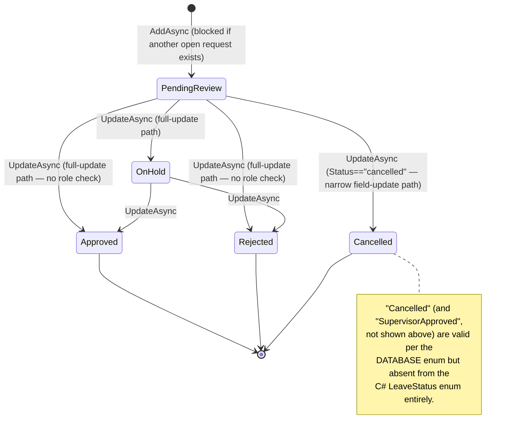
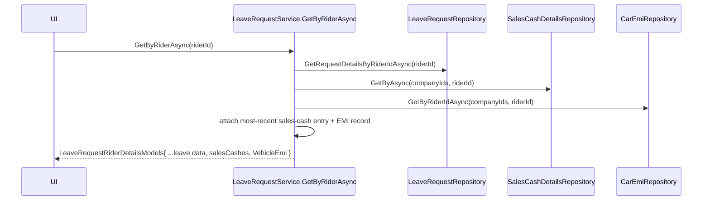
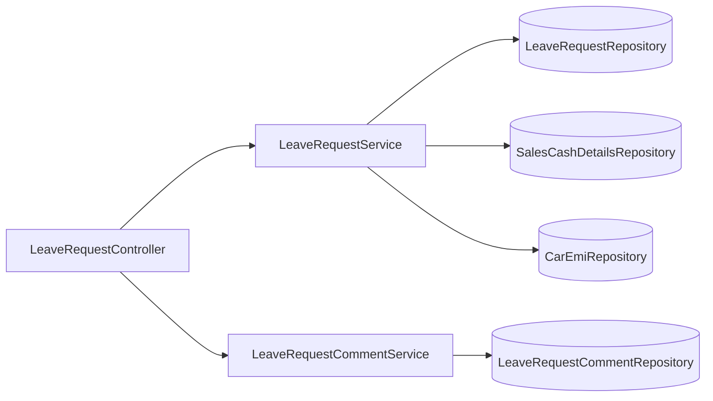
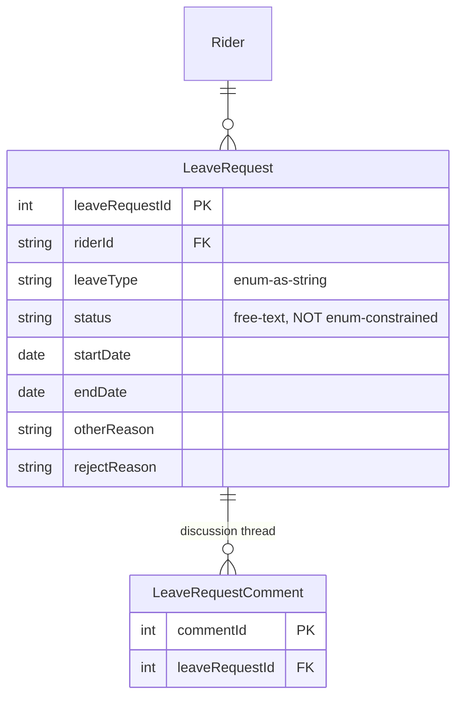

# Leave Management

## 1. Module overview

Tracks rider leave requests (vacation, sick, emergency, vehicle issues) through a review workflow, with a comment thread per request and cross-domain enrichment (sales cash, vehicle EMI) on the rider detail view. Its output — which riders are currently "on vacation" — directly drives an automatic status side effect inside [Rider Management](rider-management.md).

**Where it lives:**

| Concern | Path |
|---|---|
| Controller | `CAG.Admin.API/CAG.Admin.API/Controllers/v1/LeaveRequestController.cs` |
| Services | `LeaveRequestService.cs`, `LeaveRequestCommentService.cs` |
| Repository | `LeaveRequestRepository.cs`, `LeaveRequestCommentRepository.cs` |
| Enums | `CAG.Admin.API.Domain/Enums/LeaveRequest.cs` (`LeaveType`, `LeaveStatus`) |

## 2. Business perspective

### 2.1 Business purpose

Riders need time off, and the business needs a review/approval trail for it (distinct from ad hoc absence — this is a formal request-and-approval flow), plus visibility into a rider's broader financial standing (cash owed, EMI) at the moment their leave is being reviewed.

### 2.2 Key use cases

1. **A rider or staff member submits a leave request** — type, date range, optional reason.
2. **A reviewer approves/rejects/holds a request**, optionally with a rejection reason and comments.
3. **A rider cancels their own pending request.**
4. **Staff review a rider's leave request alongside their outstanding sales-cash balance and vehicle EMI** on one detail view.
5. **[Rider Management](rider-management.md) automatically syncs rider status** to `Vacation`/`VacationOverdue` based on this module's data, on every rider-list fetch (see [Rider Management](rider-management.md) §2.3).

### 2.3 Business rules & logic

- **A rider can have at most one open leave request at a time**: `AddAsync` blocks creation if any existing request for that rider has a status outside `{Rejected, Approved, Cancelled}` (explicit, `DuplicateEntityExists` → 409).
- **`Status` is a free-text string at the C# layer, and the C# `LeaveStatus` enum is missing two values the database itself defines** — confirmed by reading `CAG_Schema.sql` directly: `LeaveRequest.status` is a MySQL `enum('PendingReview','SupervisorApproved','Approved','OnHold','Rejected','Cancelled')` — six values, including a `SupervisorApproved` step suggesting a two-stage approval process. The C# `LeaveStatus` enum (`PendingReview`, `Approved`, `OnHold`, `Rejected`) has only four, missing **both** `Cancelled` and `SupervisorApproved` entirely. Additionally, `UpdateAsync` calls `model.Status.ToLower()` directly, which only compiles against a `string`-typed property — so `LeaveRequestAddModel.Status` is itself declared as a plain string, not the `LeaveStatus` enum, meaning **any string value is accepted and persisted**, constrained only by the database's own enum column (which would reject a truly invalid value outright, surfacing as an unhandled SQL error rather than a clean 400). [Inferred] The missing `SupervisorApproved` value suggests either a two-step approval workflow that the API layer never actually drives, or a status the UI/business process no longer uses but that remains in the schema.
- **A stated access-control intent that the code does not actually enforce**: `UpdateAsync` contains the comment *"rider can only cancel the leave, but can't edit any other details"* and implements a narrower field-update path specifically when `Status == "cancelled"` — but nothing in the method verifies the caller *is* the rider who owns the request, and nothing prevents any authenticated caller from submitting a **non**-"cancelled" status (including `"Approved"` or `"Rejected"`) through the very same endpoint, which takes the full-update path that changes `LeaveType`, dates, reason, and status together. [Confirmed by reading the method — the "rider can only cancel" comment describes an intended restriction with no corresponding authorization check anywhere in the call chain] In practice, a rider-linked account (or any authenticated user) can approve or reject their own — or anyone else's — leave request via `PUT api/leaverequest/update`.
- **The rider detail view is enriched from two unrelated financial domains**: `GetByRiderAsync` attaches the rider's most recent [Sales Cash Reconciliation](sales-cash-reconciliation.md) entry (`OrderBy(EntryDate).FirstOrDefault()`) and their [Car EMI Management](car-emi-management.md) record to the leave-request detail response (explicit) — so a reviewer approving leave can see, on the same screen, whether the rider owes cash or has an active vehicle loan.
- **This module is the upstream data source for two derived rider statuses**: `GetAllRidersByStatus("Vacation")`/`GetAllRidersByStatus(anything else)` return rider ID lists (`GetAllRidersInVacationAsync`/`GetAllRidersInOverdueAsync`) that [Rider Management](rider-management.md)'s `GetAllRidersAsync` bulk-writes onto `Rider.StatusId` on every call (explicit, cross-referenced against [Rider Management](rider-management.md) §2.3) — the actual "vacation" vs. "overdue" distinction logic lives in the repository query, not traced further here.

### 2.4 End-to-end business flows

**Leave request lifecycle:**

**Rider detail enrichment:**

### 2.5 Actors & interactions

| Actor | Role |
|---|---|
| Rider (self) | Submits and (nominally) cancels their own requests |
| Reviewer (any authenticated staff, unrestricted by role — see §4.3) | Approves/rejects/holds |
| [Rider Management](rider-management.md) | Downstream — consumes vacation status for automatic `Rider.StatusId` sync |
| [Sales Cash Reconciliation](sales-cash-reconciliation.md), [Car EMI Management](car-emi-management.md) | Upstream — supply enrichment data for the rider detail view |

## 3. Technical perspective

### 3.1 Architecture overview

Two small, closely related services (`LeaveRequestService`, `LeaveRequestCommentService`) behind one controller, with `LeaveRequestService` reaching directly into two unrelated repositories for view enrichment rather than going through those modules' own services.

### 3.2 Component breakdown

| Component | Responsibility | Key methods |
|---|---|---|
| `LeaveRequestController` | 10-endpoint HTTP surface (6 request + 4 comment) | CRUD + comment CRUD |
| `LeaveRequestService` | Core business rules, cross-domain enrichment | `AddAsync`, `UpdateAsync`, `GetByRiderAsync`, `GetAllRidersByStatus` |
| `LeaveRequestCommentService` | Comment thread per request | `GetByLeaveRequestIdAsync`, `AddAsync`, `DeleteAsync` |
| `LeaveRequestRepository` | `GenericRepository<LeaveRequest>` + joined/status queries | `GetByLeaveRequestIdAsync` (company-scoped), `GetAllLeaveRequestAsync` (self-filterable), `GetAllRidersInVacationAsync`, `GetAllRidersInOverdueAsync` |

### 3.3 Detailed technical flows

Covered fully in §2.4.

### 3.4 API & interface documentation

| Method | Route | Notes |
|---|---|---|
| `GET` | `api/leaverequest/{id}` | Company-scoped |
| `GET` | `api/leaverequest/by-rider/{riderId}` | Enriched with sales-cash + EMI |
| `GET` | `api/leaverequest/all` | Self-filtered if caller has a `RiderId` claim |
| `POST` | `api/leaverequest/add` | Blocked if an open request already exists |
| `PUT` | `api/leaverequest/update` | Branches on `Status=="cancelled"` (§2.3) — the one endpoint covering approve/reject/hold/cancel/edit |
| `DELETE` | `api/leaverequest/delete/{id}` | Hard delete |
| `GET`/`POST`/`DELETE` | `api/leaverequest/comment/*` | Comment thread |

### 3.5 Database & data model

### 3.6 External integrations

None.

### 3.7 Internal module dependencies

**Upstream:** [Sales Cash Reconciliation](sales-cash-reconciliation.md), [Car EMI Management](car-emi-management.md) (both read directly, bypassing their own service layers).

**Downstream:** [Rider Management](rider-management.md) (vacation/overdue status sync, see [Rider Management](rider-management.md) §2.3).

### 3.8 Configuration & environment

None module-specific.

### 3.9 Background jobs & workers

None — vacation-status propagation happens inline inside [Rider Management](rider-management.md)'s list endpoint, not a scheduled job (see that module's §2.3 for the mechanism and its cost).

### 3.10 Events & messaging

None.

### 3.11 Authentication & authorization

`[Authorize]` only. As detailed in §2.3, the code's own comment describes an intended rider-self-service restriction ("can only cancel") that has no enforcement — this is a case where the *absence* of authorization logic is visible in the source as an unfulfilled comment, not just an omission.

### 3.12 Validation & error handling

- The duplicate-open-request check in `AddAsync` is a solid, explicit business rule.
- No validation exists on `LeaveType`/`Status` string values beyond `.ToString()` conversion on the way in — an arbitrary string reaches the database for both fields.
- `DeleteAsync` is an unconditional hard delete with no check for existence or for downstream references (`LeaveRequestComment` has `FK_LeaveRequestComment_LeaveRequest` as `RESTRICT` per [architecture-overview.md](architecture-overview.md) §4.5, so deleting a commented-on request throws an unhandled FK exception).

### 3.13 Logging & observability

None beyond the platform-wide exception log.

### 3.14 Design patterns & architectural decisions

**Direct cross-repository reads for view composition** (`LeaveRequestService` calling `ISalesCashDetailsRepository`/`ICarEmiRepository` directly rather than through `ISalesCashService`/`ICarEmiService`) bypasses whatever business logic those modules' own service layers might apply — currently low-risk since both are simple reads, but it means this module has an undeclared, code-only dependency on two other domains' repository shapes rather than their public service contracts.

## 4. Risk & improvement analysis

### 4.1 Edge cases & failure scenarios

- **Confirmed authorization gap**: any authenticated caller can approve, reject, or edit any rider's leave request via `PUT api/leaverequest/update`, despite a code comment stating the intent that riders should only be able to cancel their own.
- Deleting a leave request with existing comments throws an unhandled FK-constraint exception (§3.12).
- An arbitrary `Status` string (not one of the four `LeaveStatus` values, and not `"Cancelled"`) could be persisted without any validation rejecting it — such a request would then never match `closedStatuses` in future duplicate checks, permanently blocking that rider from submitting a new request unless someone manually corrects the row.

### 4.2 Known limitations

- `LeaveStatus` enum is missing `Cancelled` (load-bearing — used in business logic) and `SupervisorApproved` (present in the database enum but seemingly unused anywhere in the API) — the C# enum and the actual database-defined status vocabulary have drifted apart.
- No transactional or existence guard on delete.

### 4.3 Security considerations

The unenforced "rider can only cancel" intent (§2.3, §3.11) is the concrete finding: a rider account can self-approve leave, bypassing the review process this module exists to implement, in addition to the platform-wide absence of role checks.

### 4.4 Performance considerations

Nothing notable at current volumes (145 `LeaveRequest` rows per [architecture-overview.md](architecture-overview.md) §4.3).

### 4.5 Potential improvements

**Quick wins:**
- Add `Cancelled` to the `LeaveStatus` enum, and validate `model.Status` against it server-side instead of accepting any string.
- Guard `DeleteAsync` with an existence check (and either cascade-delete comments explicitly or block deletion with a friendly message when comments exist).

**Medium effort:**
- Enforce the "rider can only cancel their own request" rule server-side: verify `CurrentUser.RiderId == existingRequest.RiderId` when the caller is rider-scoped, and restrict non-cancel status transitions to reviewer roles once role-based authorization exists.
- Route the sales-cash/EMI enrichment reads through their owning modules' service interfaces rather than repositories directly.

**Major refactors:**
- None specific to this module.

## 5. Summary

- Tracks rider leave requests through a review workflow with a duplicate-open-request guard and a comment thread.
- `Status` is a free-text string at the C# layer — the `LeaveStatus` enum is incomplete relative to the database's own 6-value enum (missing `Cancelled`, which is genuinely used, and `SupervisorApproved`, which appears unused by the API) and not actually enforced server-side.
- **Confirmed**: a code comment states riders should only be able to cancel their own request, but no code enforces either the ownership check or the restriction to cancellation-only — any authenticated caller can approve/reject any request through the same endpoint.
- The rider leave-detail view is enriched with sales-cash and vehicle-EMI data pulled directly from those modules' repositories, bypassing their service layers.
- This module's vacation-status output is consumed by [Rider Management](rider-management.md) as an automatic, inline (non-scheduled) status-sync side effect on every rider list fetch.
- Deletion is unguarded and will throw on any request with existing comments.
