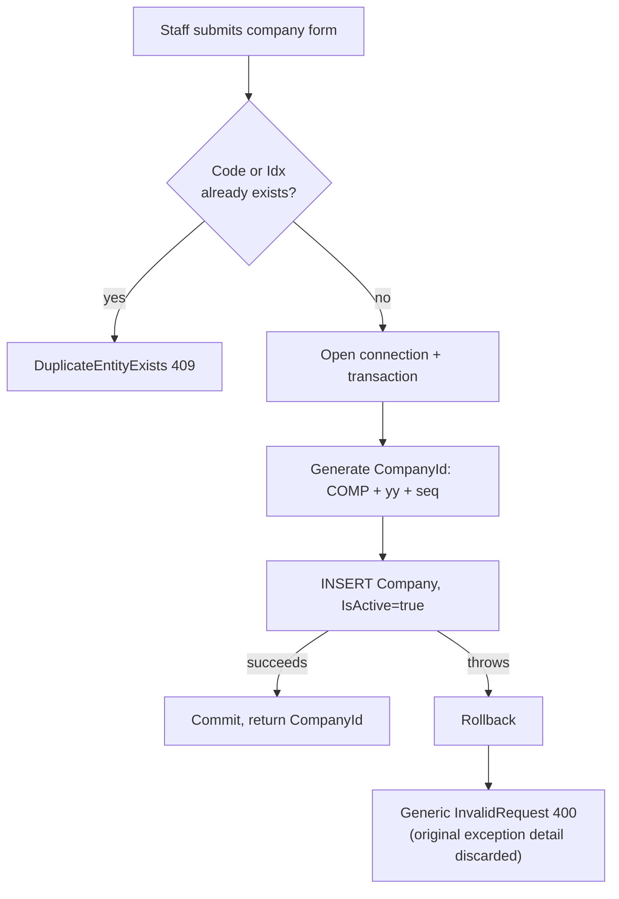
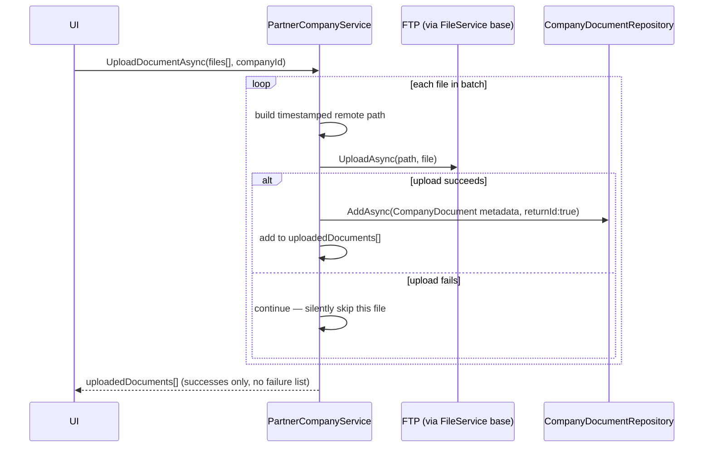
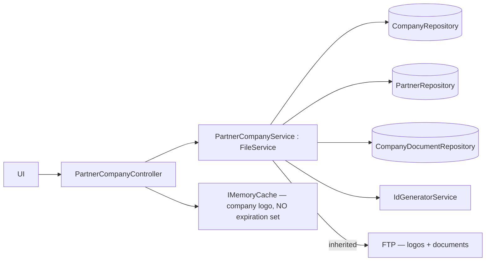
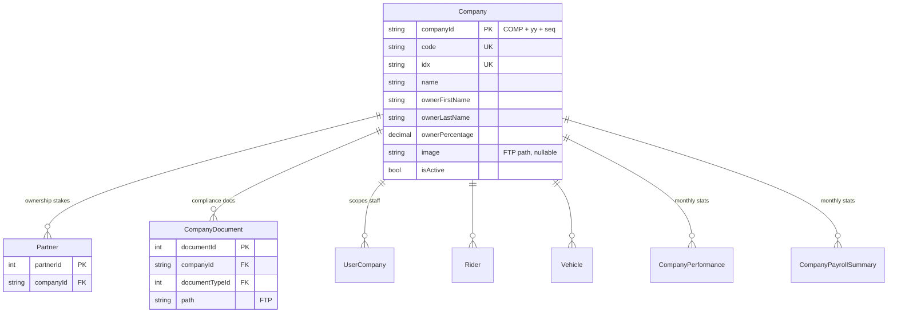

# Partner Company Management

## 1. Module overview

Manages the "Company" tenants that riders and vehicles belong to, their partner/ownership records, company documents, and branding (logo). `Company` is the second-most-referenced table in the schema (7 foreign keys point at it) and is the primary axis of the platform's multi-tenant data scoping (`CompanyIds` on the JWT — see [Authentication & Authorization](authentication-authorization.md)).

**Where it lives:**

| Concern | Path |
|---|---|
| Controller | `CAG.Admin.API/CAG.Admin.API/Controllers/v1/PartnerCompanyController.cs` |
| Service | `CAG.Admin.API.Application/Service/Implementation/PartnerCompanyService.cs` |
| Repository | `CAG.Admin.API.DBRepository/Repository/CompanyRepository.cs`, `PartnerRepository.cs`, `CompanyDocumentRepository.cs` |
| UI | `src/app/(pages)/Partner-Company/`, `src/app/(details)/Partner-Company/[companyId]/` |

## 2. Business perspective

### 2.1 Business purpose

Companies are the organizational units riders and vehicles are assigned to and the unit non-Admin staff are scoped to. Partners represent ownership stakes in a company (with a percentage split). This module is how the business onboards a new operating company, documents its ownership structure, and manages compliance documents and branding for it.

### 2.2 Key use cases

1. **Onboard a new company** — code/identifier, name, owner info, ownership percentage.
2. **View a company's details** — restricted to companies the caller is assigned to (see §2.3).
3. **Update company details or its logo.**
4. **Manage partners** (add/update/delete) — the ownership-stake records attached to a company.
5. **Upload/manage compliance documents** for a company (trade license, etc. — document *types* are shared infrastructure with [Document Management](document-management.md)).
6. **[Dashboard & Reporting](dashboard-reporting.md) reads company counts and deltas** for KPI tiles.

### 2.3 Business rules & logic

- **A company's `Code` and `Idx` must both be unique**, checked proactively before insert (`HasDuplicateCodeOrIdxAsync`), not just relying on the database's own `uq_company_code`/`uq_company_idx` constraints (explicit, `AddCompanyAsync`). [Inferred] `Idx` reads as a secondary short identifier/display index distinct from the business `Code`; its exact business meaning wasn't traceable beyond the schema-level uniqueness constraint.
- **`GetByCompanyID` is the one place in this module with an explicit, correctly-implemented per-resource authorization check**: it throws `Unauthorized` if the requested `companyId` is not in the caller's `CompanyIds` claim (explicit) — a stricter pattern than [Rider Management](rider-management.md)'s equivalent, which instead filters at the SQL layer and returns `null`/not-found rather than raising `Unauthorized` specifically.
- **Company IDs are generated, not user-supplied**: `COMP{yy}{seq:D2}` via the shared [Database Access Layer](database-access-layer.md) sequence generator (explicit).
- **A new company is always created active** (`IsActive = true`, hardcoded, explicit) — there is no "draft"/inactive company creation path.
- **Company creation is transactional but its failure handling discards the real cause**: any exception during the transaction is caught, rolled back, and rethrown as a generic `AdminAPIException(InvalidRequest, "Invalid Request Data", 400)` — regardless of whether the actual failure was a validation problem, a connectivity issue, or something else entirely (explicit, `catch { ...; throw new AdminAPIException(InvalidRequest, ...) }` — the original exception is not wrapped as an inner exception or logged before being replaced). See §4.1.
- **Document upload is per-company, multi-file, and tolerant of partial failure**: `UploadDocumentAsync` iterates a batch of files, and if any single file's FTP upload fails, it `continue`s to the next file rather than aborting the whole batch — the caller only learns which files succeeded via the returned list, with no explicit list of failures (explicit).
- **Uploaded document filenames are de-duplicated with a millisecond timestamp** (`{name}_{yyyyMMddHHmmssfff}{ext}`) to avoid FTP path collisions when the same filename is uploaded twice (explicit).

### 2.4 End-to-end business flows

**Company creation:**

**Company document upload (partial-failure-tolerant batch):**

### 2.5 Actors & interactions

| Actor | Role |
|---|---|
| Admin / Ops staff | Create/edit companies, manage partners and documents |
| Non-admin staff | Read-only within their assigned `CompanyIds` |
| [Rider Management](rider-management.md), [Vehicle Management](vehicle-management.md) | Downstream — both scope their own queries by `CompanyIds`, the claim this module's records populate |
| [Document Management](document-management.md) | Peer — shares `DocumentType`/FTP infrastructure |
| [Dashboard & Reporting](dashboard-reporting.md) | Downstream — reads company totals/deltas |

## 3. Technical perspective

### 3.1 Architecture overview

Standard four-hop chain; `PartnerCompanyService` inherits `FileService` (same inheritance-over-composition pattern as [User Management](user-management.md)'s `UserService`) for logo/document FTP operations. Three repositories (`Company`, `Partner`, `CompanyDocument`) are coordinated by one service.

### 3.2 Component breakdown

| Component | Responsibility | Key methods |
|---|---|---|
| `PartnerCompanyController` | 12-endpoint HTTP surface; owns logo `IMemoryCache` | company CRUD, partner CRUD, document CRUD, logo CRUD |
| `PartnerCompanyService` | Business logic; company-scope enforcement; FTP orchestration | `AddCompanyAsync`, `UpdateCompanyAsync`, `GetByCompanyID` (scope-checked), `UploadDocumentAsync`, logo trio |
| `CompanyRepository` | `GenericRepository<Company>` + duplicate-check query + dashboard aggregates | `HasDuplicateCodeOrIdxAsync`, `InsertCompany`, `GetTotalCompaniesAsync`, `GetCompanyDeltaAsync` |
| `PartnerRepository` | Partner CRUD scoped to a company | `InsertAsync(list, companyId, userId)`, `UpdateAsync`, `DeleteByIdAsync` |
| `CompanyDocumentRepository` | Document metadata CRUD | `UpdateAsync(list, companyId, userId)` |

### 3.3 Detailed technical flows

See §2.4 — the creation and document-upload flows are the two non-trivial technical paths in this module; everything else is direct CRUD passthrough.

### 3.4 API & interface documentation

| Method | Route | Notes |
|---|---|---|
| `GET` | `api/company/all` | Company-scoped list |
| `GET` | `api/company/{id}` | Throws `Unauthorized` if `id` not in caller's `CompanyIds` |
| `POST` | `api/company` | Duplicate-checked create |
| `PUT` | `api/company` | Raw `Company` DBModel bound from body |
| `DELETE` | `api/company/{id}` | Hard delete — see §4.1 |
| `PUT` | `api/company/partner` | Raw `Partner` DBModel |
| `PUT` | `api/company/{id}/documents` | Bulk document metadata update |
| `DELETE` | `api/company/partner/{id}` | |
| `POST` | `api/company/{id}/partner` | Bulk partner add |
| `GET` | `api/company/logo/{companyId}` | Cached indefinitely in `IMemoryCache` (§4.4) |
| `POST` | `api/company/logo/upload` | multipart |
| `DELETE` | `api/company/logo/delete/{companyId}` | Invalidates cache |

### 3.5 Database & data model

### 3.6 External integrations

FTP (logos under `FilePath:CompanyFiles/{companyId}/Logo/logo.{ext}`, documents under `FilePath:CompanyFiles/{companyId}/{name}_{timestamp}.{ext}`) — note both dev and QA appsettings point `FilePath:CompanyFiles` at the same `CAG_Admin/QA/Company` path (see [architecture-overview.md](architecture-overview.md) §8.1), a likely configuration copy-paste that means dev-environment company file uploads land in the QA FTP directory.

### 3.7 Internal module dependencies

**Upstream:** [Database Access Layer](database-access-layer.md) (ID generation, transactions), [Document Management](document-management.md) (shares `DocumentType` reference data conceptually, though `CompanyDocumentRepository` is separate from `DocumentRepository`).

**Downstream:** [Rider Management](rider-management.md), [Vehicle Management](vehicle-management.md), [User Management](user-management.md) (`UserCompany` scoping), [Dashboard & Reporting](dashboard-reporting.md).

### 3.8 Configuration & environment

`FilePath:CompanyFiles` — see the dev/QA path collision noted in §3.6.

### 3.9 Background jobs & workers

None.

### 3.10 Events & messaging

None.

### 3.11 Authentication & authorization

`GetByCompanyID`'s explicit `CompanyIds.Contains()` check is the one genuinely resource-scoped authorization check in this module; every write endpoint has only `[Authorize]` with no role or company-membership check — an Admin-only action (creating a company) is reachable by any authenticated user, consistent with the platform-wide finding in [architecture-overview.md](architecture-overview.md) §5.

### 3.12 Validation & error handling

- `AddCompanyAsync`'s blanket `catch` (§2.3) discards the real exception — a database connectivity failure and a genuine validation problem both surface identically as "Invalid Request Data," which will misdirect debugging effort.
- `UpdateCompanyAsync` checks existence before updating (good) but does not validate field values (e.g., `OwnerPercentage` bounds).
- No validator class exists for `Company`/`Partner`, unlike [Rider Management](rider-management.md)'s `RiderValidator`.

### 3.13 Logging & observability

None beyond the platform-wide exception log — and `AddCompanyAsync`'s exception-swallowing means even that log receives the generic replacement message, not the original error.

### 3.14 Design patterns & architectural decisions

Same inheritance-based file-capability pattern as [User Management](user-management.md) (`PartnerCompanyService : FileService`). Company-scope authorization implemented ad hoc per method rather than via a shared filter/attribute — consistent with the platform-wide absence of a centralized authorization mechanism.

## 4. Risk & improvement analysis

### 4.1 Edge cases & failure scenarios

- **`AddCompanyAsync` masks its real failure cause** — any transaction exception (deadlock, connectivity, constraint violation beyond the pre-checked Code/Idx) becomes an identical, misleading "Invalid Request Data" 400 response.
- **`DeleteCompanyAsync` is a hard delete** against a table with 7 dependent tables (`CASCADE` for `CompanyPerformance`/`UserCompany`, `RESTRICT` for `Rider`/`Vehicle`/`Partner`/`CompanyDocument`/`CompanyPayrollSummary` per [architecture-overview.md](architecture-overview.md) §4.5) — deleting any company with an assigned rider or vehicle throws a raw, unhandled FK-constraint exception, while deleting one with only `UserCompany`/`CompanyPerformance` rows silently cascades those away.
- **Partial document-upload-batch failures are invisible to the caller** beyond a shorter-than-expected result list — no per-file error is surfaced.

### 4.2 Known limitations

- `PUT api/company` and `PUT api/company/partner` bind raw DBModels from the request body (mass-assignment surface, consistent with the platform-wide pattern noted in [architecture-overview.md](architecture-overview.md) §6.2).
- No validator for company/partner field values.
- Dev/QA `FilePath:CompanyFiles` configuration collision (§3.6) risks cross-environment file contamination.

### 4.3 Security considerations

No role check on any endpoint — company creation, partner ownership-percentage edits, and document management are all reachable by any authenticated user regardless of role, the same platform-wide gap documented in [architecture-overview.md](architecture-overview.md) §5.

### 4.4 Performance considerations

**The company logo cache entry is set with no expiration policy** (`_memoryCache.Set(cacheKey, value)` — no `MemoryCacheEntryOptions`), unlike [User Management](user-management.md)'s equivalent user-image cache, which sets a 10-minute sliding / 30-minute absolute expiry. A company logo, once requested, stays in server memory indefinitely (until explicitly removed via the delete-logo endpoint or the process restarts) — across enough distinct companies this is unbounded memory growth with no eviction path other than manual deletion.

### 4.5 Potential improvements

**Quick wins:**
- Add expiration options to the company-logo cache entry, matching the user-image pattern.
- Fix the `FilePath:CompanyFiles` dev/QA path collision in appsettings.
- Preserve and log the original exception in `AddCompanyAsync`'s catch block instead of replacing it outright.

**Medium effort:**
- Surface per-file success/failure detail from `UploadDocumentAsync` rather than a bare success list.
- Add a validator for `Company`/`Partner` (bounds on `OwnerPercentage`, required fields) mirroring `RiderValidator`.

**Major refactors:**
- Convert `DeleteCompanyAsync` to a soft delete (`IsActive = false`), consistent with how `IsActive` already gates company visibility elsewhere in the system.

## 5. Summary

- Manages the company/tenant records that anchor the platform's multi-company data scoping.
- One of the few modules with a genuinely correct, explicit per-resource authorization check (`GetByCompanyID`'s `CompanyIds.Contains()` guard) — though every write endpoint still lacks any such check.
- Company creation is transactional and duplicate-checked, but its error handling discards the real failure cause behind a generic message.
- Document upload tolerates partial batch failure silently, with no failure detail returned to the caller.
- The company logo cache has no expiration policy, unlike the equivalent (properly time-boxed) user-image cache — a real, unbounded memory-growth risk.
- Dev and QA share the same `FilePath:CompanyFiles` FTP path in configuration.
- Hard-delete against a 7-FK table will throw unhandled constraint errors for any company with assigned riders/vehicles/partners/documents.
