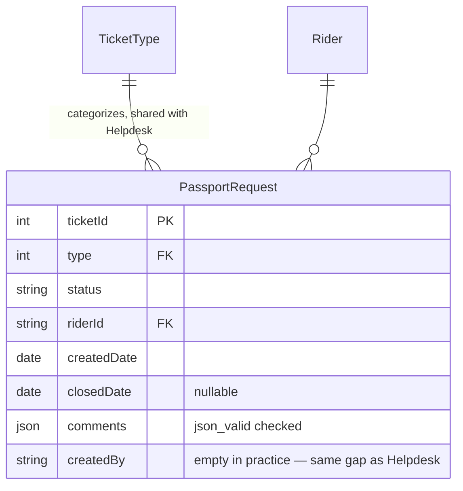

# Passport Request

## 1. Module overview

Tracks passport-processing tickets for riders (renewal, application, related administrative steps) — structurally a near-exact clone of [Helpdesk](helpdesk.md), sharing the same `TicketType` reference table and the same ticket-lifecycle shape. The clone relationship is not just architectural resemblance: this module's ticket-creation method **literally constructs and inserts the other module's DBModel type** by what is almost certainly a copy-paste mistake, confirmed by direct comparison of the two service files.

**Where it lives:**

| Concern | Path |
|---|---|
| Controller | `CAG.Admin.API/CAG.Admin.API/Controllers/v1/PassportRequestController.cs` |
| Service | `PassportRequestService.cs` |
| Repository | `PassportRequestRepository.cs` |

## 2. Business perspective

### 2.1 Business purpose

Riders on work visas typically need company assistance with passport renewal, submission, and collection — a process with its own tracking needs distinct from general support ([Helpdesk](helpdesk.md)) or HR onboarding workflow ([HR Workflow & Onboarding](hr-workflow-onboarding.md)).

### 2.2 Key use cases

Identical in shape to [Helpdesk](helpdesk.md) §2.2: raise a request, view company-scoped or self-scoped request lists, update status/comments, delete a request.

### 2.3 Business rules & logic

- **`CreateTicketAsync` constructs a `Helpdesk` object, not a `PassportRequest` object** — the method body reads: `Helpdesk newTicket = new() { Type = ..., Status = ..., RiderId = ..., ... }; return _passportRequestRepository.AddAsync(newTicket, true);` (explicit, confirmed by direct reading of `PassportRequestService.cs`). `IPassportRequestRepository.AddAsync` is inherited from `GenericRepository<PassportRequest>("PassportRequest")` — so a `Helpdesk`-typed object is being passed into a repository whose generic parameter and target table are both `PassportRequest`.
- **This works — today — purely because `PassportRequest` and `Helpdesk` are structurally identical DBModels**: both declare exactly the same properties (`TicketId`, `Type`, `Status`, `RiderId`, `CreatedDate`, `ClosedDate`, `Comments`, `CreatedBy`, `CreatedAt`, `UpdatedBy`, `UpdatedAt`), confirmed by reading both class definitions side by side. Because [Database Access Layer](database-access-layer.md)'s `DapperHelper.BuildInsert` builds SQL by reflecting over the **runtime object's** property names — not the repository's declared generic type — inserting a `Helpdesk` instance into the `PassportRequest` table produces exactly the same column list and values as if a genuinely-typed `PassportRequest` instance had been used. **This is the single clearest, most concrete piece of evidence in the entire codebase for the risk flagged abstractly in [Database Access Layer](database-access-layer.md) §4.1/§4.2**: a real type-confusion bug exists in shipped code, and the reflection-based ORM's design is precisely what makes it invisible — there is no compiler error, no runtime error, and no incorrect data, only a wrong type in the source that happens to produce correct behavior by coincidence of two tables' schemas being identical today.
- **The same `CreatedBy`-not-set gap exists here as in [Helpdesk](helpdesk.md)** (necessarily — it's the same code, just typed as the wrong class) — `CreateTicketAsync` never sets `CreatedBy`.
- **The same rider-scoped IDOR exists here as in [Helpdesk](helpdesk.md) §2.3**: `GetAllTicketsAsync`'s `type == "RIDER"` branch filters by the client-supplied `userId` parameter with no check against the caller's own identity — confirmed by reading this module's `GetAllTicketsAsync`, which is structurally identical to Helpdesk's.

### 2.4 End-to-end business flows

**The type-confusion bug, made concrete:**

```mermaid
flowchart TD
    A["PassportRequestService.CreateTicketAsync(CreatePassportRequestDto)"] --> B["new Helpdesk { Type, Status, RiderId,<br/>CreatedAt, UpdatedAt, CreatedDate, Comments }"]
    B --> C["_passportRequestRepository.AddAsync(helpdeskInstance, true)"]
    C --> D["GenericRepository&lt;PassportRequest&gt;.AddAsync<br/>-- generic param says PassportRequest,<br/>but the actual object is a Helpdesk"]
    D --> E["DapperHelper.BuildInsert reflects over the<br/>RUNTIME object (Helpdesk's properties),<br/>NOT the declared generic type"]
    E --> F["INSERT INTO PassportRequest (Type, Status, RiderId, ...)"]
    F --> G["Works correctly TODAY because PassportRequest<br/>and Helpdesk have identical column sets"]
    G -.would silently break if either table's schema<br/>diverges from the other's, e.g. a<br/>passport-specific column is added.-> H[Future risk]
```

### 2.5 Actors & interactions

Identical to [Helpdesk](helpdesk.md) §2.5 — rider (self), staff, plus the accidental structural coupling to Helpdesk's own DBModel.

## 3. Technical perspective

### 3.1 Architecture overview

Identical shape to [Helpdesk](helpdesk.md) — the architecture diagram there applies here with `Helpdesk*` renamed to `PassportRequest*`, except that `CreateTicketAsync` internally instantiates `Helpdesk` regardless (§2.3).

### 3.2 Component breakdown

| Component | Responsibility | Key methods |
|---|---|---|
| `PassportRequestController` | 6-endpoint HTTP surface | CRUD + ticket types |
| `PassportRequestService` | Thin business logic — **`CreateTicketAsync` uses the wrong DBModel type** | `CreateTicketAsync` (§2.3), `GetAllTicketsAsync` (shares Helpdesk's IDOR), `UpdateTicketAsync` |
| `PassportRequestRepository` | `GenericRepository<PassportRequest>("PassportRequest")` + typed queries | `GetTicketByRiderIdAsync`, `GetAllTicketsAsync`, `GetAllTicketTypesAsync` |

### 3.3 Detailed technical flows

Covered fully in §2.4.

### 3.4 API & interface documentation

| Method | Route | Notes |
|---|---|---|
| `GET` | `api/passport-request?userId=&type=&status=` | **Shares Helpdesk's IDOR** — see that module's §2.3 |
| `GET` | `api/passport-request/{ticketId}` | |
| `POST` | `api/passport-request` | **Constructs a `Helpdesk` object internally** (§2.3) |
| `PUT` | `api/passport-request/{ticketId}` | Raw `PassportRequest` DBModel bound from body |
| `DELETE` | `api/passport-request/{ticketId}` | No existence guard |
| `GET` | `api/passport-request/ticket-types` | Shared reference data with [Helpdesk](helpdesk.md) |

### 3.5 Database & data model



`PassportRequest.comments` carries a `json_valid` check constraint declared **twice** in the schema (see [architecture-overview.md](architecture-overview.md) §4.5) — the same redundant-declaration artifact observed on `Helpdesk.comments`, further evidence the two tables were created from the same template/script.

### 3.6 External integrations

None.

### 3.7 Internal module dependencies

**Upstream:** none of substance.

**Downstream:** none.

**Sibling coupling:** [Helpdesk](helpdesk.md) — shares `TicketType`, and is accidentally referenced by type at runtime in `CreateTicketAsync` (§2.3).

### 3.8 Configuration & environment

None module-specific.

### 3.9 Background jobs & workers

None.

### 3.10 Events & messaging

None.

### 3.11 Authentication & authorization

Identical to [Helpdesk](helpdesk.md) §3.11 — the same confirmed IDOR on the rider-scoped ticket list.

### 3.12 Validation & error handling

Identical to [Helpdesk](helpdesk.md) §3.12, plus the type-confusion issue in §2.3, which — being a *correctness* defect rather than a *validation* gap — has no error-handling angle at all: nothing detects or reports it, because nothing is wrong at the SQL level.

### 3.13 Logging & observability

None beyond the platform-wide exception log — and no mechanism exists that would have caught the type-confusion bug (no schema-drift check between `Helpdesk` and `PassportRequest`, no tests, no static analysis for this pattern).

### 3.14 Design patterns & architectural decisions

This module is the strongest available evidence in the codebase for a general principle worth stating plainly: **when two DBModels are structurally identical, the reflection-based data layer cannot distinguish a copy-paste type error from correct code.** Nothing about this module's runtime behavior signals the defect — it was found only by reading `CreateTicketAsync`'s body and comparing it, line by line, against `Helpdesk`'s. A conventional ORM with compile-time-checked or attribute-mapped entities would have caught this immediately (either a compile error passing `Helpdesk` where `PassportRequest` is expected, or at minimum a mapping-configuration mismatch).

## 4. Risk & improvement analysis

### 4.1 Edge cases & failure scenarios

- **If `PassportRequest`'s schema is ever extended with a column `Helpdesk` doesn't have** (e.g., a passport-specific field like a passport number or expiry date), `CreateTicketAsync` would continue compiling and running without error, but would **silently never populate that new column**, because the object being inserted is still shaped like a `Helpdesk`. This would not throw — it would just quietly produce incomplete `PassportRequest` rows indefinitely, discovered only when someone notices the new field is always empty.
- Conversely, if `Helpdesk` gains a field `PassportRequest` lacks, `BuildInsert` would generate an `INSERT` referencing a `PassportRequest` column that doesn't exist, and the insert would fail outright with a raw SQL error — an abrupt failure rather than a silent one, but still traceable back to this same root cause only by someone who reads the actual `CreateTicketAsync` source.
- The rider-scoped IDOR (inherited from Helpdesk's pattern) applies here too, exposing passport-request details — arguably more sensitive than general helpdesk tickets, given passport processing often involves identity document numbers — across rider boundaries.

### 4.2 Known limitations

Same as [Helpdesk](helpdesk.md) §4.2, plus the type-confusion defect being unique to this module's creation path.

### 4.3 Security considerations

The IDOR is the same as [Helpdesk](helpdesk.md), arguably higher-stakes here given the passport/identity-document subject matter typically discussed in these tickets' comments.

### 4.4 Performance considerations

Nothing notable (`PassportRequest` at 0 rows per [architecture-overview.md](architecture-overview.md) §4.3 — like Helpdesk, this feature appears to see little or no production use yet, which is also why the type-confusion bug likely hasn't caused a visible problem).

### 4.5 Potential improvements

**Quick wins:**
- Fix `CreateTicketAsync` to construct a `PassportRequest` instance instead of `Helpdesk` — a one-line, zero-risk change given the identical shape, and the single highest-value correctness fix available in this module.
- Apply the same `GetAllTicketsAsync` IDOR fix as [Helpdesk](helpdesk.md).
- Populate `CreatedBy` on creation.

**Medium effort:**
- Same as [Helpdesk](helpdesk.md) §4.5.

**Major refactors:**
- If Helpdesk and Passport Request are truly meant to share identical structure and behavior indefinitely, consider whether they should be unified into one parameterized/generic ticketing module (a single service/table with a `Category` discriminator) rather than maintained as two independently-evolving copies — which is precisely how this bug was introduced. If they're expected to diverge (which the business-purpose distinction in §2.1 suggests they should), keeping them separate but fixing the type-confusion bug is the more conservative path.

## 5. Summary

- Structurally a near-exact clone of [Helpdesk](helpdesk.md) for passport-processing requests instead of general support.
- **Confirmed, concrete defect**: `CreateTicketAsync` constructs and inserts a `Helpdesk` object instead of a `PassportRequest` object — verified by direct comparison of both service files' source code.
- **This defect is currently silent and harmless** only because `PassportRequest` and `Helpdesk` happen to be schema-identical DBModels — a change to either table's shape would make it either silently drop data (new `PassportRequest`-only field) or throw outright (new `Helpdesk`-only field), depending on which table diverges.
- This is the single clearest real-world demonstration of the abstract risk described in [Database Access Layer](database-access-layer.md) — reflection-based SQL generation cannot distinguish a wrong C# type from a right one when their shapes coincide.
- Shares [Helpdesk](helpdesk.md)'s confirmed IDOR on the rider-scoped ticket list, and its missing `CreatedBy` on creation.
- Currently zero rows in the live dataset — the ideal time to fix both the type-confusion bug and the IDOR before real data accumulates.
