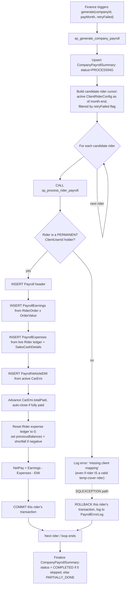
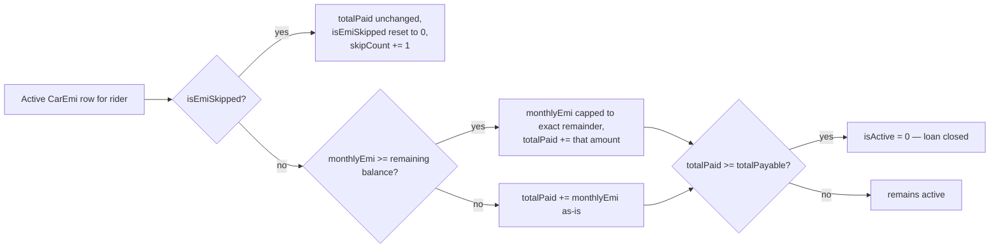
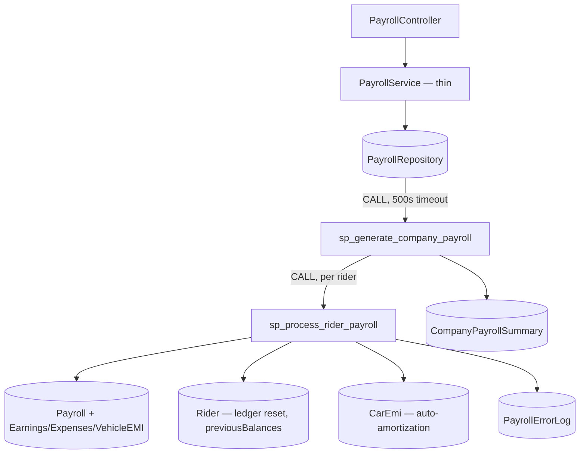
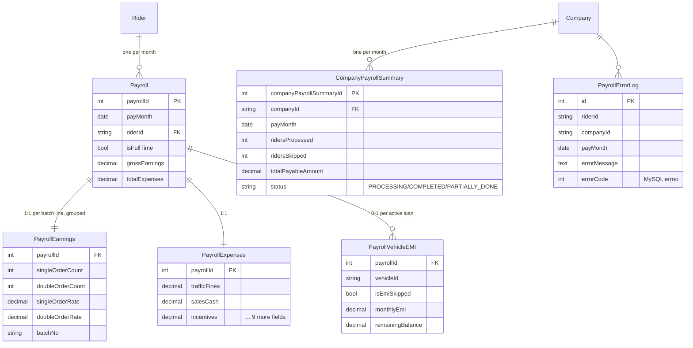

# Payroll Management

## 1. Module overview

Generates monthly rider payslips by invoking a MySQL stored-procedure pipeline that aggregates order earnings, deducts rider expenses and vehicle EMI installments, and carries forward any shortfall as debt. This is the one module in the platform where the substantial majority of business logic lives in the database, not in C# — the API layer is a thin trigger-and-report wrapper around two stored procedures (`sp_generate_company_payroll`, `sp_process_rider_payroll`).

**Where it lives:**

| Concern | Path |
|---|---|
| Controller | `CAG.Admin.API/CAG.Admin.API/Controllers/v1/PayrollController.cs` |
| Service | `CAG.Admin.API.Application/Service/Implementation/PayrollService.cs` (thin) |
| Repository | `CAG.Admin.API.DBRepository/Repository/PayrollRepository.cs` |
| **Actual business logic** | `CAG.Admin.DB/Stored_Procedures.csv` → `sp_generate_company_payroll`, `sp_process_rider_payroll` (MySQL, not version-controlled as executable code — see [architecture-overview.md](architecture-overview.md) §4.8) |
| UI | `src/app/(pages)/Finance/Payroll/` |

## 2. Business perspective

### 2.1 Business purpose

Riders are paid based on delivery order volume, net of company-side deductions (fines, fees, advances) and vehicle financing installments. This module runs that calculation once a month per company and produces an auditable payslip per rider, while automatically progressing each rider's vehicle loan balance and resetting their expense ledger for the next cycle.

### 2.2 Key use cases

1. **Finance generates payroll for one company for one month.**
2. **Finance retries only the riders that failed** in a previous run (without re-processing already-successful ones).
3. **Finance/HR reviews a payroll summary** — riders processed, riders skipped, total payable, per-error detail.
4. **A rider or staff member views an individual payslip.**
5. **The system automatically reduces a rider's outstanding vehicle EMI balance** and closes the loan once fully paid, as a payroll side effect.
6. **The system automatically resets a rider's expense/deduction ledger** to zero after billing it, and carries forward any earnings shortfall as debt for the next month.

### 2.3 Business rules & logic — from the stored procedure, confirmed by reading the SQL directly

- **Payroll is generated per company, per month, one call at a time** — `GeneratePaySlip(companyId, payMonth, userId, retryFailed)` requires a specific `companyId`; there is no "generate for all companies" single call (explicit, C# signature). A 500-second command timeout on the underlying `ExecuteAsync` call (explicit) signals the developers anticipated this could run long for companies with many riders.
- **Candidate rider selection considers both permanent and temporary [Client & Client-User-ID Mapping](client-clientuserid-mapping.md) assignments** active as of the pay month's last day (explicit, the `latest_crc` CTE in `sp_generate_company_payroll`, using `ROW_NUMBER() ... PARTITION BY crc.riderId ORDER BY crc.startDate DESC` to find each rider's most recent config).
- **A candidate rider is only actually payroll-eligible inside `sp_process_rider_payroll` if they are the *permanent* holder of some `ClientUserId`** — the header-insert query requires `JOIN ClientUserId cu ON cu.riderId = r.riderId` (matching `ClientUserId.RiderId`, the permanent-assignment column, not `TempRiderId`). [Inferred from reading the join condition directly, not observed in production] Since the outer candidate cursor in `sp_generate_company_payroll` *does* include temporary-cover riders (via `latest_crc`'s `crc.riderId`, sourced from `ClientRiderConfig`, which — per [Client & Client-User-ID Mapping](client-clientuserid-mapping.md) §2.3 — records both permanent and temp assignments), a rider who is *only* a temporary cover rider (not a permanent holder of any slot) will be selected as a payroll candidate but then fail inside `sp_process_rider_payroll` with `ROW_COUNT() = 0` → logged to `PayrollErrorLog` as *"Rider not found or missing client mapping"* — a potentially confusing message for what is actually a temp-rider-ineligibility case, not a missing-rider case.
- **Retry-failed mode only reprocesses riders with a logged error for that exact `(riderId, companyId, payMonth)`** — the cursor's `WHERE (p_retryFailedRiders = 0 OR EXISTS (SELECT 1 FROM PayrollErrorLog ...))` clause means: when `retryFailed = false`, **every** active, eligible rider for the company is selected regardless of whether they already have a payslip for that month; when `retryFailed = true`, only previously-errored riders are selected. Running a *non-retry* generation twice for the same company+month will attempt to re-insert a `Payroll` row for every already-processed rider, colliding with `uq_payroll_month_rider (payMonth, riderId)` — but see §3.14 for why this fails safely rather than corrupting data.
- **Earnings** = `Σ (singleOrderCount × singleOrderRate + doubleOrderCount × doubleOrderRate)`, grouped by `(batchNo, batchVehicleCategoryId)`, sourced from that rider's [Rider Orders & Batch Billing](rider-orders-batch-billing.md) `RiderOrder` rows for the pay month, rated via `OrderValue` (explicit).
- **Expenses** = `trafficFines + adminFees + processingFees + garageBills + maroorFines + previousBalances + dgDeduction + salesCash(pendingDues from SalesCashDetails on the month-end date) + (advances + akamaRenewalAmount + miscellaneousExpenses, summed as "extras") + mobileBills − incentives` (explicit) — every one of these except `salesCash` and `previousBalances` is read directly off the live `Rider` row, i.e., from the same 12-field ledger [Rider Management](rider-management.md)'s `PUT api/rider/{riderId}/expense` writes.
- **EMI deduction** = sum of `monthlyEmi` from every active [Car EMI Management](car-emi-management.md) contract for that rider whose `contractStartDate` falls within the pay month, **excluding** any marked `isEmiSkipped` (explicit).
- **Net pay** = `GrossEarnings − TotalExpenses − TotalEMI` (explicit, the final formula in `sp_process_rider_payroll`) — **but this figure is only ever returned as a transient stored-procedure output parameter (`p_netPay`), which `PayrollRepository.GeneratePaySlip` doesn't even capture** (its C# only reads back `@p_result`, the overall success flag). The **persisted, queryable** `Payroll.netPay` column is a MySQL generated column defined as `GENERATED ALWAYS AS (grossEarnings - totalExpenses) STORED` (confirmed by reading `CAG_Schema.sql` directly) — **it does not subtract EMI at all**. This is a confirmed discrepancy: the "true" net pay the stored procedure computes internally is never saved anywhere, and every payslip view (`GET api/payroll/{id}`, the summary list) shows a `netPay` figure that overstates take-home pay by exactly the EMI amount for any rider with an active vehicle loan.
- **The rider's expense ledger is unconditionally zeroed after being billed**: `trafficFines, adminFees, processingFees, garageBills, maroorFines, dgDeduction, incentives, advances, akamaRenewalAmount, miscellaneousExpenses` are all reset to `0` on the `Rider` row once included in that month's payroll (explicit) — confirming and completing [Rider Management](rider-management.md) §2.3's description of this ledger as month-to-date, not cumulative.
- **A negative earnings-minus-expenses result becomes next month's `previousBalances`**: `Rider.previousBalances = ABS(earnings − expenses) IF negative ELSE 0` (explicit) — note this is computed from earnings/expenses **before** EMI is subtracted, and note it **overwrites** `previousBalances` rather than adding to it, so a rider who was already carrying debt and then has another shortfall month does not compound within this formula alone (each month's carry-forward replaces, not adds to, the prior one) — though the *prior* `previousBalances` value was itself already included as an expense line for the month just processed, so the debt still flows forward correctly month over month; it simply doesn't compound within a single calculation. [Inferred interpretation of the SQL's intent]
- **Vehicle EMI auto-amortizes as a payroll side effect**: for every active `CarEmi` row touched this run, `totalPaid` increases by `monthlyEmi` (unless skipped), `monthlyEmi` is capped down to the exact remaining balance on the final installment (`IF monthlyEmi >= totalPayable - totalPaid THEN totalPayable - totalPaid`), the loan auto-closes (`isActive = 0`) once `totalPaid >= totalPayable`, and `skipCount` increments (with `isEmiSkipped` reset to `0` for the next cycle) if this cycle's payment had been marked skipped (explicit) — this is a complete loan-amortization state machine embedded entirely in SQL, with no equivalent logic anywhere in the C# codebase.
- **Any SQL exception during a single rider's processing is caught, logged, and does not abort the batch**: `sp_process_rider_payroll` has a `DECLARE EXIT HANDLER FOR SQLEXCEPTION` that rolls back that rider's transaction, writes to `PayrollErrorLog` with the MySQL error code and message, and returns `p_success = 0` — the outer cursor loop in `sp_generate_company_payroll` continues to the next rider regardless (explicit) — a well-designed per-rider failure isolation pattern, not a code smell.
- **Company-level summary status** is `COMPLETED` if zero riders were skipped in a run, otherwise `PARTIALLY_DONE`, upserted into `CompanyPayrollSummary` keyed by `(companyId, payMonth)` (explicit, `ON DUPLICATE KEY UPDATE`).

### 2.4 End-to-end business flows

**Company payroll generation — full pipeline:**

**EMI auto-amortization detail (one rider, one month):**

### 2.5 Actors & interactions

| Actor | Role |
|---|---|
| Finance staff | Trigger generation, review summaries/errors, view payslips |
| [Rider Orders & Batch Billing](rider-orders-batch-billing.md) | Upstream — supplies the order-count/rate data earnings are computed from |
| [Rider Management](rider-management.md) | Bidirectional — supplies the expense ledger read here, which this module then resets |
| [Car EMI Management](car-emi-management.md) | Bidirectional — this module reads and auto-advances EMI contracts |
| [Sales Cash Reconciliation](sales-cash-reconciliation.md) | Upstream — month-end pending-dues figure feeds into expenses |

## 3. Technical perspective

### 3.1 Architecture overview

Deliberately minimal C#: the service layer performs almost no logic of its own (see the full 62-line `PayrollService.cs` above) and exists mainly to enforce a query-filter precondition and marshal parameters to/from a stored procedure. The database is the actual application layer for this domain.

### 3.2 Component breakdown

| Component | Responsibility | Key methods |
|---|---|---|
| `PayrollController` | 4-endpoint HTTP surface | `GetAll`, `GetById`, `Add` (generate), `GetPayrollSummary` |
| `PayrollService` | Precondition check on `GetAllAsync` (at least one filter required); thin passthrough otherwise | `GetAllAsync`, `GeneratePaySlip`, `GetAllCompanySummaryAsync` |
| `PayrollRepository` | SP invocation, joined-detail reads, summary+error-log join query | `GeneratePaySlip` (SP call, 500s timeout), `GetAllByPayrollIdAsync`, `GetAllCompanySummary` |
| `sp_generate_company_payroll` | Candidate selection, per-rider dispatch loop, summary rollup | MySQL |
| `sp_process_rider_payroll` | Per-rider earnings/expenses/EMI calculation, ledger reset, error handling | MySQL |

### 3.3 Detailed technical flows

Covered fully in §2.4 — this module's technical and business logic are the same artifact (the stored procedures), so there is no separate "technical-only" trace beyond what §2.4 already shows.

### 3.4 API & interface documentation

| Method | Route | Notes |
|---|---|---|
| `GET` | `api/payroll/all?companyId=&payMonth=` | Requires at least one of `companyId`/`payMonth`/caller's own `RiderId` claim — see §3.12 |
| `GET` | `api/payroll/{id:int}` | Full payslip detail (earnings/expenses/EMI breakdown) |
| `POST` | `api/payroll/generate` | `GeneratePayslipRequest { CompanyId, PayMonth, retryFailed }` — returns `Success` only if the SP's `p_result` output is exactly `1` |
| `GET` | `api/payroll/summary?payMonth=` | Company-scoped summary + joined error log |

### 3.5 Database & data model

`Payroll` carries `uq_payroll_month_rider (payMonth, riderId)` — the constraint that makes non-retry double-generation fail safely per rider rather than duplicate their payslip.

### 3.6 External integrations

None.

### 3.7 Internal module dependencies

**Upstream:** [Rider Orders & Batch Billing](rider-orders-batch-billing.md) (earnings source), [Rider Management](rider-management.md) (expense ledger source, consumer of `previousBalances`), [Car EMI Management](car-emi-management.md) (EMI source and mutation target), [Sales Cash Reconciliation](sales-cash-reconciliation.md) (pending-dues figure), [Client & Client-User-ID Mapping](client-clientuserid-mapping.md) (candidate-rider eligibility).

**Downstream:** none — payroll is a terminal aggregation point, consumed only by UI reporting.

### 3.8 Configuration & environment

No module-specific config beyond the 500-second stored-procedure command timeout hardcoded in `PayrollRepository.GeneratePaySlip`.

### 3.9 Background jobs & workers

**None** — despite payroll being an inherently monthly, batch-shaped operation, generation is entirely manual and synchronous: a Finance user clicks "Generate," the HTTP request blocks (up to 500 seconds) while MySQL loops through every rider in the company sequentially. There is no scheduled job, no queue, no background worker.

### 3.10 Events & messaging

None.

### 3.11 Authentication & authorization

`[Authorize]` only. `GetAllAsync`'s precondition (§3.12) is the closest thing to a scoping rule, and it's a validation guard, not an authorization one — it doesn't verify the caller is entitled to the `companyId` they pass.

### 3.12 Validation & error handling

- `PayrollService.GetAllAsync` requires at least one of `companyId`, `payMonth`, or the caller's own `RiderId` claim to be present, else `InvalidRequest` (400) — a sensible guard against an accidentally-unbounded query over the whole `Payroll` table, though it does not itself enforce that a **non-rider** caller's `companyId` is one they're actually scoped to (no `_userAssignedCompanies.Contains(companyId)` check was found in this method).
- `PayrollController.Add` checks `result == 1` to decide success — this exactly matches the stored procedure's `p_result` output convention (`1` on completion, left at its initialized `0` only if... actually `p_result` is unconditionally set to `1` at the very end of `sp_generate_company_payroll` regardless of how many individual riders failed, so **this endpoint reports success even when every single rider in the company failed and was logged to `PayrollErrorLog`** — the per-rider failure detail is only visible by separately calling `GET api/payroll/summary`). [Confirmed by reading the full stored procedure — `SET p_result = 1` is the last statement before `END`, unconditional]
- All per-rider error handling happens inside the stored procedure's `EXIT HANDLER`, not in C# — the API layer never sees individual rider failures except through the summary/error-log join query.

### 3.13 Logging & observability

`PayrollErrorLog` is a genuine, structured, queryable error log — capturing the MySQL error number and message per failed rider — a materially better observability story than the rest of the platform's FTP-text-file logging, precisely because it lives in the database next to the data it's about.

### 3.14 Design patterns & architectural decisions

- **Business logic pushed entirely into the database** is the defining, deliberate architectural choice of this module — likely chosen for atomicity (per-rider transactions, easy rollback) and set-based performance (the earnings aggregation is a single grouped `SELECT` per rider rather than N+1 C# round-trips). The cost is that this logic is invisible to code review, static analysis, IDE navigation, and (per [architecture-overview.md](architecture-overview.md) §4.7) any migration/version-control system — it is tracked only in the `CAG.Admin.DB` CSV snapshot as a point-in-time export.
- **Per-rider transaction isolation with a catch-log-continue error handler** is a well-designed resilience pattern (§2.3) — one failing rider (e.g., a data anomaly) cannot abort payroll for the rest of the company.
- **Idempotency is opportunistic, not guaranteed**: the unique constraint on `Payroll` prevents a *retry* from double-paying a rider, but a *fresh, non-retry* re-run of an already-completed company+month will generate a full batch of per-rider "duplicate key" failures rather than being rejected upfront — functionally safe (no double-pay, no data corruption, per §2.3's transaction analysis) but produces a confusing wall of errors rather than a clear "already generated" message.

## 4. Risk & improvement analysis

### 4.1 Edge cases & failure scenarios

- **Confirmed: the persisted `Payroll.netPay` figure omits EMI deductions entirely** (§2.3) — every payslip and payroll summary view is overstating net pay by the EMI amount for any rider with an active vehicle loan, since the generated column formula (`grossEarnings - totalExpenses`) was never updated to match the fuller calculation the stored procedure actually performs in-memory.
- **Temp-cover-only riders likely cannot be paid through this pipeline** without also holding a permanent slot elsewhere (§2.3) — worth validating against real data, since if confirmed in practice this would mean a category of legitimately-working riders systematically fails payroll with a misleading "missing client mapping" error.
- **`POST api/payroll/generate` reports success even when 100% of riders failed** (§3.12) — a Finance user could believe payroll succeeded and only discover otherwise by separately checking the summary screen.
- Re-running a non-retry generation for an already-processed company+month produces a full batch of per-rider errors rather than a clean "already generated" response.

### 4.2 Known limitations

- No background/async processing — a large company's payroll run blocks the HTTP request for however long MySQL takes (bounded at 500 seconds before the call itself times out).
- `previousBalances` carry-forward (§2.3) is a replace, not an accumulate — correct for single-step forward propagation but worth confirming against actual finance expectations for a rider who misses multiple consecutive months.
- No re-run/idempotency guard at the C# or SP entry-point level — relies entirely on the database unique constraint to prevent double-processing.

### 4.3 Security considerations

`GetAllAsync`'s missing `companyId` scope check (§3.12) means a non-admin, non-rider caller could query payroll data for a company outside their assigned scope by supplying an arbitrary `companyId`, consistent with the platform-wide authorization gap but notable here given the financial sensitivity of the data.

### 4.4 Performance considerations

The rider-processing loop inside `sp_generate_company_payroll` is strictly sequential (a MySQL cursor, one `CALL` per rider) — there is no batching or parallelism, so total runtime scales linearly with active-rider count per company. The 500-second timeout suggests this has already been a practical concern at some rider-count threshold.

### 4.5 Potential improvements

**Quick wins:**
- Have `POST api/payroll/generate`'s response include the riders-skipped count (already computed by the SP and available via the summary endpoint) rather than a bare success/failure derived from an unconditional `p_result`.
- Improve the "Rider not found or missing client mapping" error message to distinguish the temp-rider-ineligibility case from a genuinely missing rider, if that gap is confirmed.

**Medium effort:**
- Add a pre-flight check (C# or SP) that returns a clear "payroll already generated for this company/month" response instead of a batch of per-rider unique-constraint failures on accidental re-run.
- Add `companyId` scope verification to `GetAllAsync`.

**Major refactors:**
- Move payroll generation to a background job/queue given its potential multi-minute runtime, freeing the HTTP request from a 500-second timeout budget and allowing progress reporting.
- Bring the stored-procedure logic under version control as executable migration scripts (platform-wide recommendation, especially load-bearing here given this module's unusual concentration of business logic in the database).

## 5. Summary

- The one module where the database, not the API, holds the real business logic — confirmed by reading `sp_generate_company_payroll` and `sp_process_rider_payroll` directly, not inferred from the thin C# wrapper.
- Net pay = order-based gross earnings, minus a 10-field expense ledger (sourced live from the `Rider` table and zeroed after billing), minus active vehicle EMI.
- Vehicle EMI auto-amortizes as a payroll side effect: balance increases, caps to the exact remainder on the final installment, and the loan auto-closes when paid off — entirely in SQL, with no C# equivalent.
- A negative earnings-minus-expenses result carries forward as `Rider.previousBalances`, consumed as an expense line the following month.
- **A likely defect, evidenced directly in the join logic**: temporary-cover-only riders may be selected as payroll candidates but then rejected inside the per-rider procedure because it only recognizes *permanent* `ClientUserId` holders.
- **A confirmed reporting gap**: the generate endpoint reports success unconditionally, even when every rider in the run failed — per-rider failures are visible only via a separate summary call.
- **A second confirmed defect, found by reading the table DDL directly**: the persisted `Payroll.netPay` column is a generated column that only computes `grossEarnings - totalExpenses` — it silently omits the EMI deduction that the stored procedure's in-memory net-pay formula includes, so every displayed payslip overstates take-home pay for riders with an active vehicle loan.
- Per-rider transaction isolation with catch-log-continue error handling is a genuinely well-designed resilience pattern, and `PayrollErrorLog` is a materially better observability mechanism than the rest of the platform's logging.
- No background job — generation is synchronous, sequential, and can take minutes for a large company.
