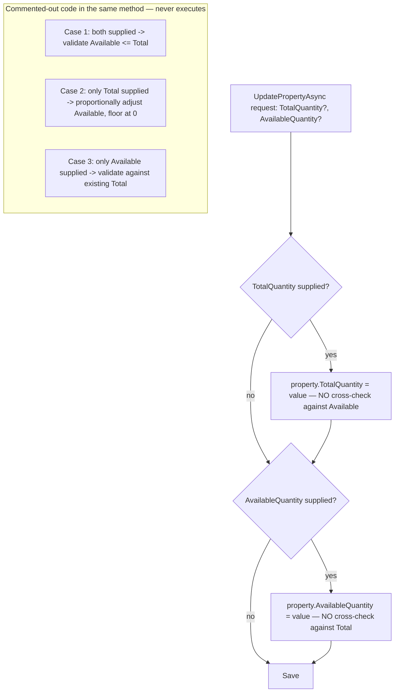
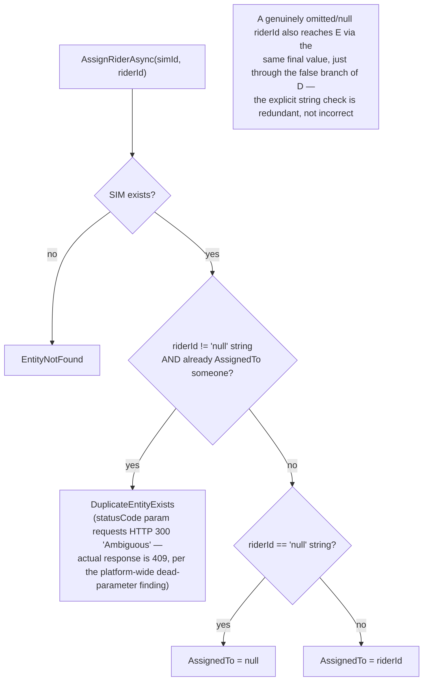
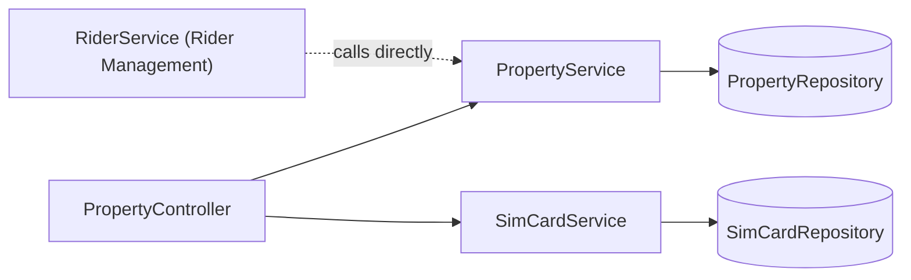
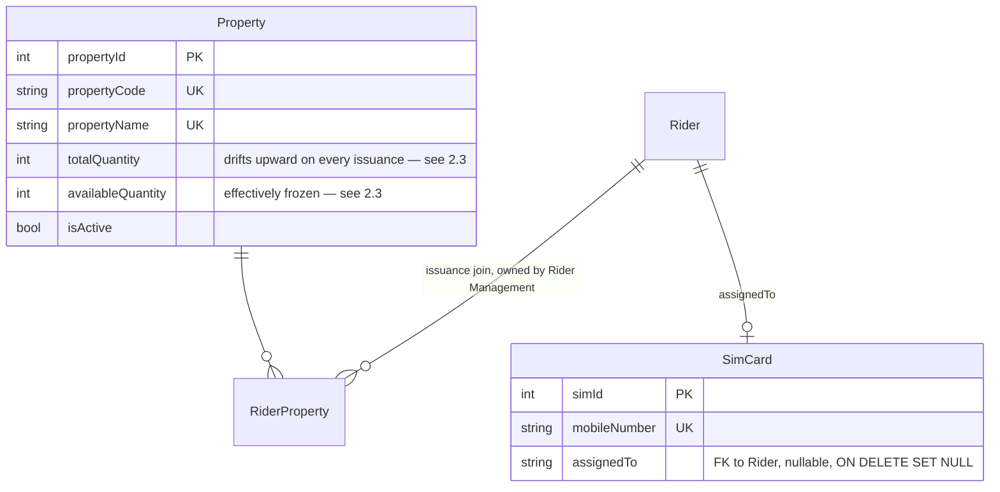

# Property & Inventory Management

## 1. Module overview

Tracks two kinds of physical assets issued to riders: general "property" (kit items — helmets, bags, uniforms, etc., tracked by count) and SIM cards (tracked individually, one row per physical SIM). Both are reachable only through `PropertyController`; there is no separate `SimCardController`. This module contains the codebase's clearest, most directly-confirmable example of disabled business logic: a fully-written stock-consistency algorithm sits commented out in the live source.

**Where it lives:**

| Concern | Path |
|---|---|
| Controller | `CAG.Admin.API/CAG.Admin.API/Controllers/v1/PropertyController.cs` (hosts both property and SIM card endpoints) |
| Services | `PropertyService.cs`, `SimCardService.cs` |
| Repository | `PropertyRepository.cs`, `SimCardRepository.cs` |

## 2. Business perspective

### 2.1 Business purpose

Riders are issued physical kit (uniforms, bags, safety gear) and a company SIM card for their work phone/device. The business needs to know what's been issued to whom, and — in principle — how much stock remains available to issue. In practice, per §2.3, the "how much remains" half of that is currently non-functional.

### 2.2 Key use cases

1. **Ops defines a new property type** (name, code, quantity).
2. **Ops adjusts a property type's quantities.**
3. **[Rider Management](rider-management.md) issues/returns/exchanges property to a specific rider** (see that module's §2.3 — the actual issuance flow lives there, calling into this module's `UpdatePropertyAsync` to adjust the aggregate counts).
4. **Ops registers a new SIM card** or edits an existing one (through the same endpoint — see §2.3).
5. **Ops assigns a SIM card to a rider**, or unassigns it.
6. **Ops deletes a property type or a SIM card record.**

### 2.3 Business rules & logic

- **Property stock-consistency validation exists in the source but is entirely disabled**: `PropertyService.UpdatePropertyAsync` contains a fully-written, three-case quantity-reconciliation algorithm — (1) both `TotalQuantity` and `AvailableQuantity` supplied together, validated so available cannot exceed total; (2) only `TotalQuantity` supplied, proportionally adjusting `AvailableQuantity` by the delta while floor-clamping at zero; (3) only `AvailableQuantity` supplied, validated against the existing total — **all three cases are commented out**, replaced by two unconditional, independent overwrites: `if (request.TotalQuantity.HasValue) property.TotalQuantity = ...` and the same for `AvailableQuantity`, with **no relationship enforced between the two fields at all** (explicit, confirmed by reading the live method body against its commented-out predecessor in the same file). `AddPropertyAsync`'s `TotalQuantity <= 0` guard is likewise commented out (explicit).
- **This is the same defect [Rider Management](rider-management.md) §2.3 documents from the consumer side**: that module's rider-issuance flow (`AddPropertyAsync`/`UpdatePropertyAsync`/`DeletePropertyAsync` on `RiderService`) manipulates `Property.TotalQuantity` directly when issuing/returning kit to a rider, with its own `AvailableQuantity`-adjustment logic also commented out. Between the two modules, stock consistency has been disabled independently in at least two places, strongly suggesting a stricter inventory model was deliberately rolled back partway and never fully re-enabled or removed. **Net effect, confirmed across both modules**: `TotalQuantity` currently drifts upward every time a property is issued to any rider (the opposite of what a "total owned inventory" figure should do), `AvailableQuantity` is essentially frozen at whatever value was last explicitly set, and no code path anywhere validates that enough stock exists before issuing.
- **`PATCH api/property/simcards` is simultaneously the create *and* update endpoint for SIM cards**, branching on whether `SimId` is populated on the incoming object (explicit, `SimCardService.AddAsync`) — the same "one endpoint, ID-presence branch" pattern seen in [User Management](user-management.md)'s `RegisterAsync`.
- **A SIM card can only be assigned if currently unassigned** — `AssignRiderAsync` throws `DuplicateEntityExists` if `model.AssignedTo != null` (checked whenever the caller isn't explicitly unassigning) (explicit) — note this check is purely "is it assigned to *anyone*," not "is it assigned to someone *else*," so re-submitting an assignment to the SIM's current holder is also rejected as a duplicate rather than treated as a no-op.
- **Unassignment uses a string sentinel, `"null"`, alongside genuine C# `null`**: `AssignRiderAsync(int simId, string? riderId)` checks `riderId == "null"` (the literal three-character string) to decide whether to clear `AssignedTo`. Because the controller parameter is a genuinely nullable `string?`, an actually-omitted query parameter already binds to C# `null`, and `null == "null"` is `false` in C# — so the ternary's `else` branch (`: riderId`) is taken, which for a genuine `null` still assigns `null`. [Confirmed by reading the exact comparison] The two paths (true `null` vs. the literal string `"null"`) both happen to produce the same result today, making the explicit string-sentinel check redundant rather than broken — but it is fragile, confusing code that only works because of this coincidence, not because it was designed to rely on it.

### 2.4 End-to-end business flows

**Property update — what actually happens vs. what the code shows was intended:**

**SIM assignment, including the redundant sentinel check:**

### 2.5 Actors & interactions

| Actor | Role |
|---|---|
| Ops staff | Manage property types, SIM inventory, assignments |
| [Rider Management](rider-management.md) | Primary consumer — issues/returns property to specific riders, sharing this module's broken stock-tracking behavior |

## 3. Technical perspective

### 3.1 Architecture overview

Two small, independent services sharing one controller. Neither has any dependency on the other or on file storage.

### 3.2 Component breakdown

| Component | Responsibility | Key methods |
|---|---|---|
| `PropertyController` | 9-endpoint HTTP surface (5 property + 4 SIM) | CRUD for both resource types |
| `PropertyService` | Property CRUD; disabled stock-consistency logic | `AddPropertyAsync`, `UpdatePropertyAsync` (§2.3), `DeletePropertyAsync` |
| `SimCardService` | SIM CRUD + assignment | `AddAsync` (dual create/update), `AssignRiderAsync`, `UpdateAsync` |

### 3.3 Detailed technical flows

Covered fully in §2.4.

### 3.4 API & interface documentation

| Method | Route | Notes |
|---|---|---|
| `GET` | `api/property/all` | |
| `GET` | `api/property/{id:int}` | |
| `POST` | `api/property` | Quantity guard commented out (§2.3) |
| `PUT` | `api/property` | Stock-consistency logic commented out (§2.3) |
| `DELETE` | `api/property/{id:int}` | Existence-checked |
| `GET` | `api/property/simcards` | |
| `PATCH` | `api/property/simcards` | Dual add/update, branches on `SimId` presence |
| `PUT` | `api/property/simcards/assign?simCard=&riderId=` | See §2.3 sentinel handling |
| `DELETE` | `api/property/simcards/{id}` | No existence check before delete |

### 3.5 Database & data model

`RiderProperty` — the actual rider-to-property issuance join table — is populated and managed from [Rider Management](rider-management.md), not from this module; this module owns only the `Property` and `SimCard` master records.

### 3.6 External integrations

None.

### 3.7 Internal module dependencies

**Upstream:** none of substance.

**Downstream:** [Rider Management](rider-management.md) calls `PropertyService.GetPropertyByIdAsync`/`UpdatePropertyAsync` directly as part of its own issuance flow — the two modules jointly own the broken stock-tracking behavior described in §2.3, with neither module able to fix it in isolation without coordinating the fix across both.

### 3.8 Configuration & environment

None module-specific.

### 3.9 Background jobs & workers

None.

### 3.10 Events & messaging

None.

### 3.11 Authentication & authorization

`[Authorize]` at the controller level for the property endpoints; the four SIM card endpoints have **no `[Authorize]` attribute of their own** and rely entirely on the class-level `[Authorize]` — functionally equivalent to every other endpoint in the codebase, but worth noting as the same code-style inconsistency (some controllers repeat `[Authorize]` per-method, some don't) observed elsewhere. No role checks, consistent with the platform-wide finding.

### 3.12 Validation & error handling

- **The central finding of this module**: two independent, fully-written validation/reconciliation blocks (one here, one in [Rider Management](rider-management.md)) are commented out rather than removed, leaving the feature they protect — inventory stock accuracy — silently non-functional while the surrounding CRUD operations continue to run without it.
- `SimCardService.AddAsync`'s existence check uses `.Result` on a `Task` (`_repository.GetByAsync(...).Result.Any()`) instead of `await` — a synchronous-blocking-on-async anti-pattern. In ASP.NET Core (which, unlike ASP.NET Framework, has no `SynchronizationContext` to deadlock against) this is unlikely to deadlock, but it still blocks a thread-pool thread for the duration of the query and is inconsistent with the `async`/`await` pattern used everywhere else in the codebase.
- `AssignRiderAsync`'s `statusCode: (int)HttpStatusCode.Ambiguous` (numeric value 300, "Multiple Choices") is an unusual, almost certainly mistaken status-code choice for a duplicate-assignment error — though per the platform-wide finding documented in [Vehicle Management](vehicle-management.md) §3.12, this has **no actual effect**, since `ExceptionHandlingMiddleware` derives the real HTTP status solely from the `AdminAPIExceptions.DuplicateEntityExists` enum value (→ 409), never from this parameter. This is a second, independent piece of evidence (alongside Vehicle Management's) that developers throughout the codebase believe this parameter has an effect it does not.
- `DELETE api/property/simcards/{id}` has no existence check before deleting.

### 3.13 Logging & observability

None beyond the platform-wide exception log.

### 3.14 Design patterns & architectural decisions

The commented-out-rather-than-deleted validation blocks (§2.3, §3.12) are, like the parallel finding in [Client & Client-User-ID Mapping](client-clientuserid-mapping.md)'s old `PUT` handler, a visible artifact of an incomplete refactor — but unlike that module (where the *replacement* logic is correct and the old code is a harmless fossil), here the replacement is a **regression**: the disabled code was strictly more correct than what currently runs.

## 4. Risk & improvement analysis

### 4.1 Edge cases & failure scenarios

- **Confirmed, cross-module**: property stock figures (`TotalQuantity`, `AvailableQuantity`) do not reflect reality and cannot be trusted for any operational decision (e.g., "do we have enough helmets to issue") — the platform currently cannot answer that question correctly.
- A SIM card can be "assigned" to a rider it's already assigned to only by first unassigning it — the duplicate check doesn't special-case re-assignment to the same holder.

### 4.2 Known limitations

- No inventory audit trail — no history of who issued/returned what, when, beyond the generic `UpdatedBy`/`UpdatedAt` columns on the current-state rows.
- `.Result`-blocking async anti-pattern in `SimCardService.AddAsync`.

### 4.3 Security considerations

Nothing module-specific beyond the platform-wide absence of role checks.

### 4.4 Performance considerations

Nothing notable at current volumes (`Property` 8 rows, `SimCard` 0 rows per [architecture-overview.md](architecture-overview.md) §4.3).

### 4.5 Potential improvements

**Quick wins:**
- Replace `.Result` with `await` in `SimCardService.AddAsync`.
- Remove the redundant `"null"` string-sentinel check in `AssignRiderAsync` (or make the intent explicit with a comment if it's deliberately defensive).
- Add an existence check before deleting a SIM card.

**Medium effort:**
- Decide, deliberately, whether the commented-out stock-consistency logic should be restored (in both this module and [Rider Management](rider-management.md) together) or whether the inventory model is intentionally being simplified to a single quantity figure — and either re-enable the validation coherently across both modules, or remove `AvailableQuantity` entirely if it's no longer meant to be tracked.

**Major refactors:**
- If accurate real-time stock levels become a business requirement, this is the module where that inventory-tracking rework belongs, coordinated with [Rider Management](rider-management.md)'s issuance flow.

## 5. Summary

- Manages two independent asset types — general property/kit and SIM cards — through one shared controller.
- **The clearest, most directly verifiable example of disabled business logic in the codebase**: a complete, well-reasoned stock-consistency algorithm is commented out in `PropertyService.UpdatePropertyAsync`, replaced by unconditional overwrites with no validation between `TotalQuantity` and `AvailableQuantity`.
- This defect is confirmed to span two modules — the same disabling pattern independently appears in [Rider Management](rider-management.md)'s issuance flow — meaning inventory accuracy is broken end-to-end, not just in one code path.
- SIM card assignment uses a redundant (not broken, but fragile) string-sentinel pattern for unassignment, and a `SimCardService.AddAsync` existence check uses blocking `.Result` instead of `await`.
- A second independent instance of the platform-wide dead-`statusCode`-parameter pattern (documented first in [Vehicle Management](vehicle-management.md)) appears here in `AssignRiderAsync`'s deliberately-but-ineffectively chosen `HttpStatusCode.Ambiguous`.
- Both asset types currently hold zero-to-single-digit row counts in the live dataset, suggesting light production use so far.
