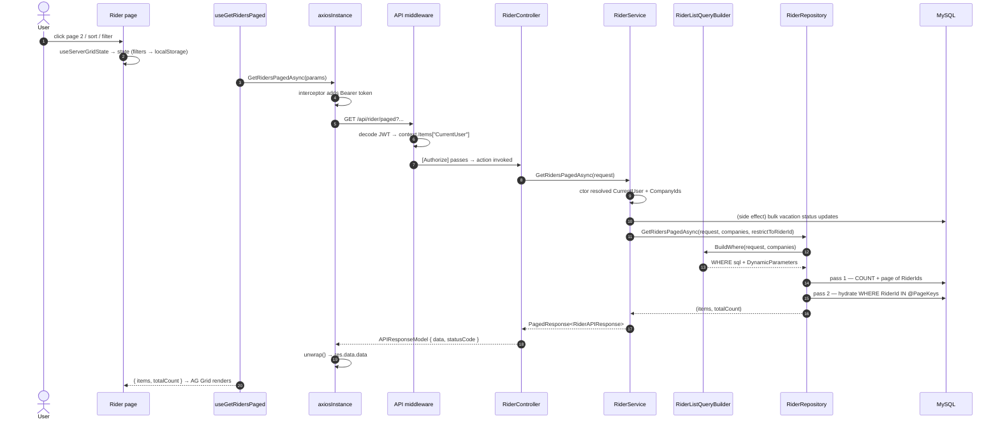

# Request Lifecycle — One Request, Traced

> Scope: a single request followed hop by hop, with the real file and method at each step. Use this
> to learn the codebase's mechanics; use the module docs for what each feature actually does.

The worked example is **"open the Riders grid, page 2, sorted by name, filtered to Active"** —
it exercises auth, company scoping, server paging, the query builder and the response envelope.

---

## The hops



---

## Step by step

### 1 — Page: user interaction becomes grid state

`CAG.Admin.UI/src/app/(pages)/Rider/index.tsx`

`useServerGridState(undefined, DEFAULT_PAGE_SIZE)` holds `pageIndex`, `pageSize`, `sort`,
`searchTerm` and `activeFilters` as component state, and persists **sort/search/filters** (not the
page number) to **`localStorage` keyed by route** — so reopening the page restores your last
filters. It is not URL-backed (not shareable, not restored by back/forward). The page assembles a
`RiderListParams` from that state with `useMemo`. See
[ui-data-layer.md](frontend-application-shell.md).

### 2 — Hook: caching and invalidation

`CAG.Admin.UI/src/app/hooks/react-query/rider.tsx`

TanStack Query owns the cache. The params object is part of the query key, so changing page, sort
or filter is a new key → a new fetch, while previously-seen pages stay cached. Mutations elsewhere
in the module invalidate these keys rather than refetching manually.

### 3 — API client: one call, one unwrap

`CAG.Admin.UI/src/app/http-client/rider.api.ts` → `GetRidersPagedAsync`

Builds the query string **by hand** with `URLSearchParams` rather than passing a plain object,
because array filters must be sent as repeated keys (`status=A&status=B`) — the shape ASP.NET
Core's default `List<string>` query binding expects. Path comes from
`constants/api-urls.ts`; the response is reduced by `unwrap()`.

### 4 — Axios: transport and auth

`CAG.Admin.UI/src/app/http-client/axios.ts`

`baseURL` is `NEXT_PUBLIC_CAG_ADMIN_API_BASE_URL`. A request interceptor pulls
`session.access_token` (memoised in `cachedToken`) and sets `Authorization: Bearer`. In
non-production an `https.Agent({ rejectUnauthorized: false })` allows the dev self-signed cert.

### 5 — Middleware: identity, then guard rails

`CAG.Admin.API/CAG.Admin.API/Program.cs` pipeline order:

1. `AuthenticationMiddleware` — decodes the JWT and materialises `CurrentUser`
   (`UserId`, `Email`, `RoleId`, `RiderId`, `CompanyIds`) into `context.Items["CurrentUser"]`.
2. `ExceptionHandlingMiddleware` — wraps everything downstream, maps exceptions to JSON + status,
   fire-and-forget appends to the FTP log.
3. `UseCors` → `UseAuthentication` → `UseAuthorization` → `MapControllers`.

`[Authorize]` is satisfied by the `JwtBearer` handler, which *does* validate issuer, audience,
lifetime and signature (unlike the middleware's decode-only read).

### 6 — Controller: thin by design

`CAG.Admin.API/CAG.Admin.API/Controllers/v1/RiderController.cs`

```csharp
[HttpGet("paged")]
[Authorize]
public async Task<APIResponseModel> GetRidersPaged([FromQuery] RiderListRequest request)
{
    var res = await _riderService.GetRidersPagedAsync(request);
    return Success(res);
}
```

Model binding turns the query string into `RiderListRequest`. The controller adds no logic beyond
null-checks and wrapping the result in `APIResponseModel`.

### 7 — Service: rules, scoping, side effects

`CAG.Admin.API.Application/Service/Implementation/RiderService.cs`

The constructor resolves `CurrentUser` and `CompanyIds`, throwing `Unauthorized` if either is
missing — so an unauthenticated call dies before the action body runs.

`GetRidersPagedAsync` then:
1. Syncs leave-driven statuses: riders on `"Vacation"` / `"Vacation Overdue"` are bulk-updated to
   the matching `RiderStatuses` — **a write performed inside a GET**.
2. Delegates to the repository, passing `_userAssignedCompanies` and
   `restrictToRiderId: _currentUser.RiderId` (non-null only for rider logins).
3. Wraps the result as `PagedResponse<RiderAPIResponse>(items, pageNumber, pageSize, totalCount)`.

### 8 — Query builder: the safety boundary

`CAG.Admin.API.DBRepository/Repository/RiderListQueryBuilder.cs`

- `SortColumns` — a **whitelist dictionary**; an unknown `sortBy` falls back to
  `DefaultSortColumn = "r.RiderId"`. This is what makes dynamic sorting injection-safe.
- `BuildWhere` — assembles `AND` conditions with Dapper parameters, including
  `@Search` as `%term%` and the company-scope `IN` clause.

### 9 — Repository: two-pass paging

`CAG.Admin.API.DBRepository/Repository/RiderRepository.cs` + `Utility/PagingQueryHelper.cs`

Because riders join one-to-many children, `LIMIT/OFFSET` on the joined query would paginate join
rows. So: **pass 1** counts and fetches the page's `RiderId`s from the base query
(`ORDER BY MIN(<sort>)`, key as tie-breaker); **pass 2** hydrates with
`WHERE RiderId IN @PageKeys` and reorders in memory to match the key order.

### 10 — Response envelope

The controller returns `APIResponseModel { Data, StatusCode, Error }`, serialised by
`System.Text.Json` with `JsonStringEnumConverter` — enums travel as **strings**.

### 11 — Back up the stack

`unwrap()` → `res.data.data` → the hook resolves → `GenericPage` receives `data` +
`serverPagination` → `Grid` renders with AG Grid's own paging disabled and its local sort
comparator neutralised.

---

## Same trace, for a write

A mutation differs in four places:

| Step | Read | Write |
|---|---|---|
| Hook | `useQuery` | `useMutation` + `queryClient.invalidateQueries` |
| Client | `GET`, `unwrap()` | `POST`/`PUT`/`DELETE`, often returns `res.status` |
| Service | scoping + projection | validation, transaction, orchestration |
| Repository | `SELECT` | `AddAsync` / `UpdateAsync` / `DeleteAsync` via `DapperHelper` |

Example — `POST /api/rider`:

```
AddRiderModal.handleFinalSubmit
  → useAddRider (mutation)
    → AddRiderAsync (POST /api/rider)
      → RiderController.AddRider (null-check)
        → RiderService.AddRiderAsync
            RiderValidator.Validate           ← throws ValidationException → 500 (plain exception, see below)
            BEGIN TRANSACTION
              IdGeneratorService.GenerateIdAsync("RIDER")
              RiderRepository.AddAsync(rider, conn, tx)
              UserService.RegisterAsync(user, conn, tx)
            COMMIT  (rollback + rethrow on any failure)
        → returns riderId
```

---

## Error paths

| Failure | Where it surfaces | What the client sees |
|---|---|---|
| Missing/invalid JWT | `JwtBearer` handler | 401, empty body |
| Malformed JWT | `AuthenticationMiddleware` | ⚠️ unhandled → 500 (handler registered after it) |
| Validation failure | `RiderValidator` → `ValidationException` (plain, not `AdminAPIException`) | ⚠️ **500** `InternalServerError` — the message is the validation text (see [cross-cutting](authentication-authorization.md)) |
| Out-of-scope / not found via `AdminAPIException` | Service throws `Unauthorized` / `EntityNotFound` | 401 / 404 |
| Not found via plain `NotFoundException` | e.g. `UpdateRiderAsync` | ⚠️ **500**, not 404 |
| Out-of-scope company | Service throws `Unauthorized` | 401 with the scoping message |
| Rider mid-workflow | `GetRiderByIdAsync` throws `Forbidden` | 403 |
| Duplicate (vehicle number, assignment) | Service throws `DuplicateEntityExists` | 409 |
| Controller `BadRequest(...)` helper | `ApiBaseController` | ⚠️ **HTTP 200** with `statusCode: 400` in the body |

The last row is the one that trips people up — see
[cross-cutting.md](authentication-authorization.md).
