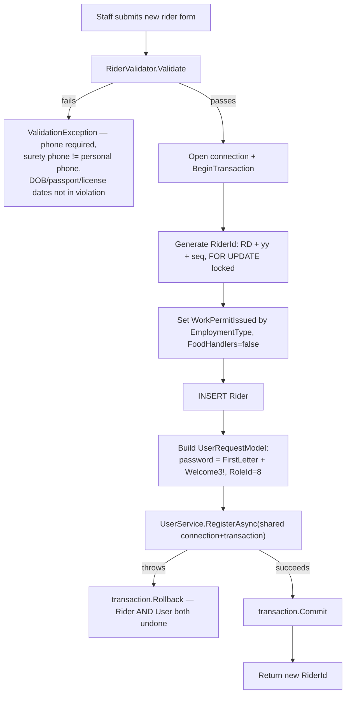
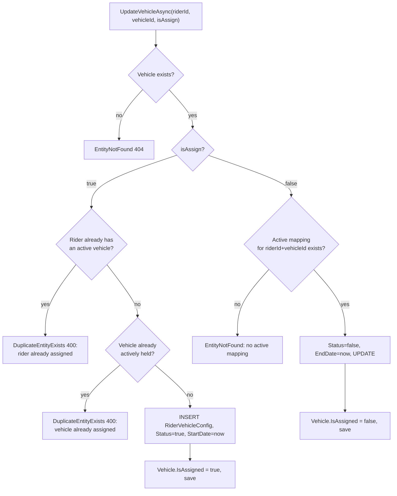
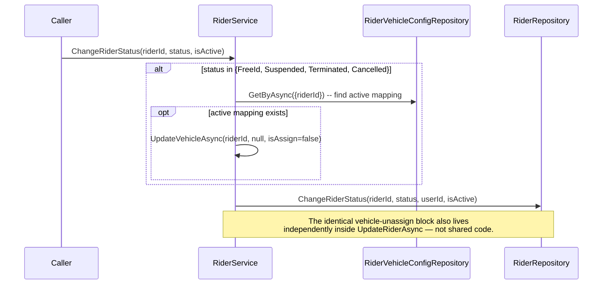
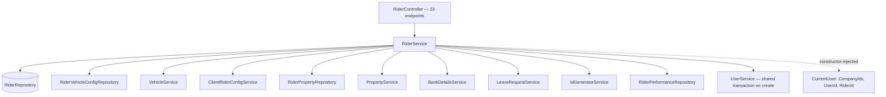
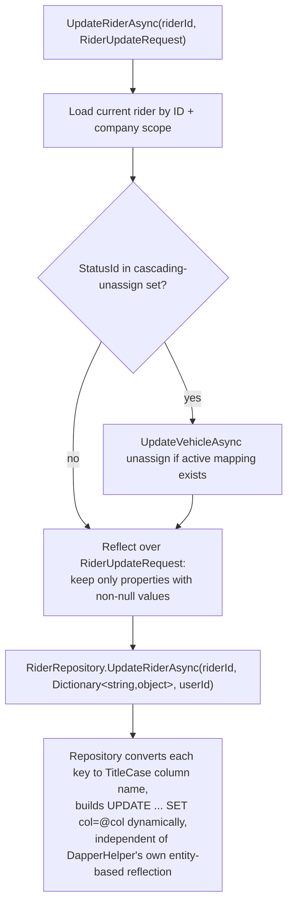
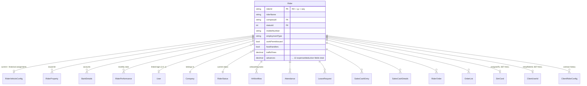

# Rider Management

## 1. Module overview

The largest and most central domain in the platform: the lifecycle of a Rider (a gig/fleet worker) from onboarding through active service to termination, including their vehicle assignment, issued property (kit), bank details, expense ledger, and performance record. `RiderController` alone carries 23 of the system's 167 endpoints. `Rider` is also the foreign-key hub of the database — 14 of 44 foreign keys point at it (see [architecture-overview.md](architecture-overview.md)).

**Where it lives:**

| Concern | Path |
|---|---|
| Controller | `CAG.Admin.API/CAG.Admin.API/Controllers/v1/RiderController.cs` |
| Core service | `CAG.Admin.API.Application/Service/Implementation/RiderService.cs` |
| Validation | `CAG.Admin.API.Application/Validator/RiderValidator.cs` |
| Repository | `CAG.Admin.API.DBRepository/Repository/RiderRepository.cs` |
| Domain model | `CAG.Admin.API.Domain/Model/DBModels/Rider.cs` (57 members) |
| UI pages | `src/app/(pages)/Rider/`, `src/app/(details)/Rider/[riderId]/` |
| UI data layer | `http-client/rider.api.ts` → `hooks/react-query/rider.tsx` |

## 2. Business perspective

### 2.1 Business purpose

Riders are the workforce the whole platform exists to manage — their documents, vehicle assignment, bank details for payroll, and status through an HR-driven onboarding pipeline. This module is the system of record for "who is this rider, what state are they in, what are they assigned, and what do they cost/earn."

### 2.2 Key use cases

1. **HR/Admin registers a new rider** — creates the `Rider` record and, transactionally, a linked `User` login account (see [User Management](user-management.md) §2.4).
2. **Staff view a rider's full profile** — company, vehicle, client mapping, bank details, issued property, performance.
3. **Staff reassign a rider to a different company or client.**
4. **Staff assign/unassign a rider to a vehicle.**
5. **Staff change a rider's status** — e.g. Onboarding → Active, or Active → Suspended/Terminated.
6. **Staff record/adjust a rider's recurring expense/deduction figures** (traffic fines, advances, admin fees, etc.) — feeds [Payroll Management](payroll-management.md).
7. **Staff issue/return/exchange property (kit)** to a rider.
8. **HR/Finance export the full rider roster** to Excel for offline reporting.
9. **A rider views their own record** — the same `GET api/rider/all` endpoint, filtered server-side to the caller's own `RiderId` when the caller's JWT carries one.
10. **System auto-transitions riders to Vacation/Vacation-Overdue** — a side effect of every "get all riders" call (see §2.3).

### 2.3 Business rules & logic

- **A new rider's employment type determines whether a work permit is required**: `WorkPermitIssued = rider.EmploymentType != "Full Time"` (explicit, string comparison — not enum-backed, so a typo'd or differently-cased employment type value would silently default to "requires a work permit"). `FoodHandlers` is always initialized `false` on creation (explicit).
- **A new rider gets an auto-generated login with a predictable default password**: `rider.RiderName[0] + "Welcome3!"` (e.g., a rider named "John" gets password `JWelcome3!`), role hardcoded to `RoleId = 8` (Rider). (explicit, `RiderService.AddRiderAsync`). See §4.3 — this is a concrete, verifiable security weakness, not an inference.
- **Rider creation and its linked User account are one atomic transaction** — both inserts share a single `IDbConnection`/`IDbTransaction`; a failure in either rolls back both (explicit, see [User Management](user-management.md) §2.4 for the sequence diagram).
- **Company-scoped visibility is enforced at the repository layer, not just the controller**: `GetRiderByIdAsync`, `GetAllRidersAsync`, `ExportRidersAsync`, etc. all pass `_userAssignedCompanies` (derived from the JWT's `CompanyIds` claim) down into the SQL `WHERE` clause — a rider outside the caller's assigned companies returns `null`/is excluded rather than a 403 (explicit; the controller then maps a `null` single-rider result to an `Unauthorized` exception with message "You can only view riders from companies assigned to you").
- **Three rider statuses block full record access until HR workflow completes**: `Onboarding`, `LocalTransfer`, `VisaProcess` — `GetRiderByIdAsync` throws `Forbidden` ("...before completing HR workflow tasks") unless the caller explicitly requests `skipStatusCheck=true` (explicit). This ties rider visibility to [HR Workflow & Onboarding](hr-workflow-onboarding.md)'s task pipeline.
- **A rider can hold at most one active vehicle, and a vehicle can be actively held by at most one rider** — both directions are checked before creating a `RiderVehicleConfig` mapping, each raising `DuplicateEntityExists` (400) on conflict (explicit, `UpdateVehicleAsync`).
- **Certain status transitions auto-unassign the rider's vehicle**: moving to `FreeId`, `Suspended`, `Terminated`, or `Cancelled` triggers an implicit unassign (`UpdateVehicleAsync(riderId, null, false)`) if an active mapping exists. This rule is implemented **twice, independently** — once inside `UpdateRiderAsync` and again inside `ChangeRiderStatus` (explicit, duplicated code, not shared) — the two entry points being `PUT api/rider/{riderId}` (general update, when `StatusId` is part of the payload) and `PUT api/rider/{riderId}/status` (dedicated status endpoint).
- **Property issuance currently only tracks `TotalQuantity`, never `AvailableQuantity`** — despite `Property` having both columns, every `AvailableQuantity` adjustment in `AddPropertyAsync`/`UpdatePropertyAsync`/`DeletePropertyAsync` is commented out in the source, and the *live* code instead increments/decrements `TotalQuantity` on issue/return/exchange. [Confirmed by reading both `Property.cs` and all three `RiderService` methods, not inferred] This means issuing a kit item to a rider **increases** `Property.TotalQuantity` rather than decreasing an available count — the opposite of what a "total owned inventory" figure should do — and no stock-insufficiency check is enforced anywhere (the `if (property.AvailableQuantity < dto.Quantity) throw ...` guard is present in the source only as a comment). See §4.1 and [Property & Inventory](property-inventory-management.md) §4.1 for the same defect from that module's side.
- **`GetAllRidersAsync` has a write side effect on every call**: before returning data, it fetches all riders currently on `"Vacation"` and `"Vacation Overdue"` leave status (from [Leave Management](leave-management.md)) and bulk-`UPDATE`s their `Rider.StatusId` to match — meaning a `GET` request performs two `UPDATE` statements as a side effect on every single invocation (explicit). This keeps rider status in sync with leave state without a scheduled job, at the cost of violating the usual expectation that `GET` requests are read-only/idempotent-safe-to-repeat-freely.
- **A rider's own login sees only their own record**: if the caller's JWT carries a `RiderId` claim (i.e., they logged in as a rider-linked account), `GetAllRidersAsync` filters the full result set down to `RiderId == _currentUser.RiderId` in C#, after the full company-scoped query already ran — [Inferred] this is a self-service view reusing the staff "all riders" endpoint and query rather than a dedicated single-record self endpoint, so a rider's browser still receives (and the server still executes) the full multi-table join for the whole company roster before filtering client-side-of-the-service-layer down to one row.
- **`GetTopRidersAsync` is unimplemented** — `throw new NotImplementedException()` (explicit). If [Dashboard & Reporting](dashboard-reporting.md) calls this path, it fails with a 500.

### 2.4 End-to-end business flows

**Rider creation (success and rollback paths):**

**Vehicle assignment / unassignment:**

**Status change with cascading vehicle unassignment:**

### 2.5 Actors & interactions

| Actor | Role |
|---|---|
| HR / Admin / Operational Manager | Create/edit riders, manage status, assign vehicles/property |
| Rider (self, via linked User account) | Read-only, filtered to own record, via the same endpoint staff use |
| [User Management](user-management.md) | Downstream — receives the auto-created login on rider creation |
| [HR Workflow & Onboarding](hr-workflow-onboarding.md) | Upstream gate — certain statuses block full rider record access until workflow tasks complete |
| [Leave Management](leave-management.md) | Upstream — vacation status feeds the side-effecting bulk status update in `GetAllRidersAsync` |
| [Client & Client-User-ID Mapping](client-clientuserid-mapping.md) | Peer — `ClientRiderConfigService` (client/rider contract mapping) is called from `RiderService.UpdateClientUserIdAsync` |
| [Property & Inventory](property-inventory-management.md) | Peer — `PropertyService` is called directly from `RiderService` for kit issuance |
| [Vehicle Management](vehicle-management.md) | Peer — `VehicleService` is called directly for assignment side effects |

## 3. Technical perspective

### 3.1 Architecture overview

`RiderService` is the largest and most interconnected service in the system — it directly injects **11 other services/repositories** (`IRiderRepository`, `IRiderVehicleConfigRepository`, `IVehicleService`, `IClientRiderConfigService`, `IRiderPropertyRepository`, `IPropertyService`, `IBankDetailsService`, `ILeaveRequestService`, `IIdGeneratorService`, `IRiderPerformanceRepository`, `IUserService`), making it a de facto orchestration layer for the rider aggregate rather than a narrowly-scoped service. It resolves `CurrentUser`/`CompanyIds` once in its constructor and reuses them across every method, rather than re-fetching per call.

### 3.2 Component breakdown

| Component | Responsibility | Key methods | Dependencies |
|---|---|---|---|
| `RiderController` | 23-endpoint HTTP surface | full CRUD + status + vehicle + property + expense + bank-details + performance + export | `IRiderService` |
| `RiderService` | All rider business logic; orchestrates 6+ peer services | see §2.3/§2.4 | 11 injected dependencies |
| `RiderValidator` | Static validation, called once (creation only — **not** on update) | `Validate(Rider)` | — |
| `RiderRepository` | Multi-table joined reads, dynamic partial updates, dashboard aggregates | `GetAllRidersAsync` (8-table join, see [architecture-overview.md](architecture-overview.md) §7.1), `GetRiderByIdAsync`, `UpdateRiderAsync` (dynamic field dict), `ChangeRiderStatus`, `GetRiderExportAsync`, `UpdateBulkRiderStatuesAsync`, six `Get*Dto` dashboard methods | Dapper |

### 3.3 Detailed technical flows

**Partial update via reflected field diffing (`UpdateRiderAsync`):**

This is a **second, independent reflection-based update mechanism**, parallel to but distinct from [Database Access Layer](database-access-layer.md)'s `DapperHelper.BuildUpdate<T>` — here the "entity" is a runtime `Dictionary<string, object>` built by filtering a DTO's non-null properties, and the repository does its own `ToTitleCase` column-name conversion and `JsonElement` unwrapping rather than reusing `DapperHelper`. [Inferred] This exists specifically so that `null` on the request DTO means "don't touch this field" rather than "set it to null" — a real requirement `DapperHelper.BuildUpdate` (which includes every settable property unconditionally) doesn't support.

### 3.4 API & interface documentation

| Method | Route | Purpose |
|---|---|---|
| `GET` | `api/rider/all` | Company-scoped list; self-filtered if caller is a rider; has vacation-status side effect (§2.3) |
| `GET` | `api/rider/all/with-company` | List with company info attached |
| `GET` | `api/rider/company/{companyId}` | List for one company |
| `GET` | `api/rider/{riderId}?skipStatusCheck=` | Single rider; blocks on Onboarding/LocalTransfer/VisaProcess unless bypassed |
| `POST` | `api/rider` | Create (raw `Rider` DBModel bound from body — see §4.3) |
| `PUT` | `api/rider/{riderId}` | Partial update via `RiderUpdateRequest` |
| `DELETE` | `api/rider/{riderId}` | See §3.12 — not a simple delete; orchestrated through [HR Workflow & Onboarding](hr-workflow-onboarding.md) |
| `PUT` | `api/rider/{riderId}/company` | Reassign company |
| `POST` | `api/rider/{riderId}/client` | Reassign client (delegates to `ClientRiderConfigService`) |
| `GET` | `api/rider/export` | Excel export, 70+ columns across rider/company/bank/client/vehicle/EMI |
| `POST`/`PUT`/`DELETE` | `api/rider/{riderId}/property[...]` | Issue/adjust/return kit property |
| `PUT` | `api/rider/{riderId}/status` | Dedicated status transition (own vehicle-unassign duplicate logic) |
| `POST` | `api/rider/{riderId}/vehicle/{vehicleId}/{isAssign}` | Assign/unassign vehicle |
| `PUT` | `api/rider/{riderId}/expense` | Overwrite the 12-field expense/deduction ledger — **this ledger is drained to zero automatically by [Payroll Management](payroll-management.md)'s `sp_process_rider_payroll` stored procedure** after each successful payroll run for that rider, so these fields represent unbilled month-to-date deductions, not a running total |
| `GET`/`POST`/`PUT`/`DELETE` | `api/rider/{riderId}/bank-details[...]` | Delegates to [Bank Details, within Rider Management] — see §3.2 |
| `GET` | `api/rider/{riderId}/performance[/all]` | Monthly performance figures |
| `GET` | `api/rider/{riderId}/client-rider-config` | Active client-rider contract mapping |

All require `[Authorize]`; none check role (see [architecture-overview.md](architecture-overview.md) §5).

### 3.5 Database & data model

`RiderStatuses` (C# enum) has 14 values — the five lifecycle-blocking/cascading ones used in business logic (`Onboarding`, `VisaProcess`, `LocalTransfer`, `FreeId`, `Suspended`, `Terminated`, `Cancelled`, `Vacation`, `VacationOverdue`) plus three that read as **role names, not rider states** (`Supervisor`, `OperationalManager`, `HR`) and one (`AkhamaTransfer`). [Inferred, not confirmed by tracing every reference] This enum may be doing double duty — e.g. also representing HR workflow task-owner roles — worth checking against [HR Workflow & Onboarding](hr-workflow-onboarding.md) if a discrepancy ever surfaces; documented here as an observed naming oddity rather than a traced defect.

### 3.6 External integrations

None directly (ClosedXML for the Excel export is a library, not a service).

### 3.7 Internal module dependencies

**Upstream (this module depends on):** [User Management](user-management.md) (login creation), [Authentication & Authorization](authentication-authorization.md) (`CompanyIds`/`UserId`/`RiderId` claims), [Leave Management](leave-management.md) (vacation status), [Property & Inventory](property-inventory-management.md), [Vehicle Management](vehicle-management.md), [Client & Client-User-ID Mapping](client-clientuserid-mapping.md), [Database Access Layer](database-access-layer.md).

**Downstream (depend on this module):** [HR Workflow & Onboarding](hr-workflow-onboarding.md), [Attendance Management](attendance-management.md), [Payroll Management](payroll-management.md), [Rider Orders & Batch Billing](rider-orders-batch-billing.md), [Sales Cash Reconciliation](sales-cash-reconciliation.md), [Dashboard & Reporting](dashboard-reporting.md) — nearly every other module either reads `Rider` rows or filters by `riderId`.

### 3.8 Configuration & environment

No module-specific configuration beyond the shared MySQL connection string.

### 3.9 Background jobs & workers

None — the vacation-status sync that would conventionally be a scheduled job is instead executed inline on every `GetAllRidersAsync` call (§2.3).

### 3.10 Events & messaging

None.

### 3.11 Authentication & authorization

Company-scoped row filtering (`_userAssignedCompanies`) is the only authorization logic in this module, and it is *data* scoping, not *action* scoping — every authenticated user, regardless of role, can create/update/delete/export riders within their assigned companies (or all companies, if Admin). See [architecture-overview.md](architecture-overview.md) §5.

### 3.12 Validation & error handling

- `RiderValidator.Validate` runs only on **creation** (`AddRiderAsync`) — phone required, surety phone ≠ personal phone (normalized to digits-only before comparing), DOB not future, passport/license expiry not already past. **`UpdateRiderAsync` does not call the validator at all** [confirmed by reading the method — no `RiderValidator.Validate` call exists in the update path], so an update can set a past-dated passport expiry or a future DOB that creation would have rejected.
- `AddRiderAsync` wraps its transaction in try/catch-rollback-rethrow — correct transactional error handling.
- `UpdateRiderAsync`/`GetRiderByIdAsync` throw `NotFoundException`/`AdminAPIException` appropriately for missing/out-of-scope riders.
- **`DeleteRiderAsync` itself is a hard delete** (`_riderRepository.DeleteAsync`, no soft-delete/`IsActive` flip) — but it is not reachable directly from the API in isolation. `RiderController.DeleteRider` (confirmed by reading the controller, not just the service) first checks for existing `ClientRiderConfig` associations via [Client & Client-User-ID Mapping](client-clientuserid-mapping.md) and returns a friendly 400 ("Cannot delete rider with existing client associations...") if any exist, then delegates to **`IHrWorkflowService.DeleteWorkflowTaskByRiderIdAsync`** — a method that, despite its name, first deletes all of the rider's `HrWorkflow` rows and *then* calls `RiderService.DeleteRiderAsync` internally (see [HR Workflow & Onboarding](hr-workflow-onboarding.md) §2.3 for the full trace). So rider deletion is a genuine cross-module orchestration spanning three services, clearing exactly two of the 14 dependent-table FKs (`ClientRiderConfig` via the pre-check, `HrWorkflow` via the delete-through) before attempting the hard delete — any rider with history in one of the *other* 12 `RESTRICT`-linked tables (attendance, orders, leave, performance, etc.) still throws a raw, unhandled MySQL FK-constraint exception. Only a rider with client and HR-workflow history cleared (or never created) can be deleted successfully.

### 3.13 Logging & observability

None beyond the platform-wide FTP exception log.

### 3.14 Design patterns & architectural decisions

- **Constructor-resolved current-user context** — `RiderService`'s constructor throws immediately if `ICurrentUserService.GetCurrentUser()` or its `CompanyIds` is null, meaning this service **cannot be constructed at all** outside an authenticated HTTP request context (no anonymous/system/background-job usage is possible without a `CurrentUser` present in `HttpContext.Items`, which requires an active request pipeline). This is a deliberate scoping choice but constrains reuse.
- **Reflected partial-update dictionary** (§3.3) as a workaround for `DapperHelper`'s all-or-nothing update semantics, duplicating (rather than extending) the shared SQL-building layer.
- **Direct service-to-service orchestration** rather than an event/mediator pattern — `RiderService` calls `PropertyService`, `VehicleService`, `ClientRiderConfigService`, `BankDetailsService`, and `UserService` synchronously and directly, making it the de facto aggregate root for "everything about a rider."

## 4. Risk & improvement analysis

### 4.1 Edge cases & failure scenarios

- **Property stock tracking is actively broken**, not just unimplemented (§2.3) — every issue/return/exchange operation mutates the wrong counter (`TotalQuantity` instead of `AvailableQuantity`) with no stock-sufficiency check, so `TotalQuantity` drifts upward indefinitely as items are issued and the platform can never detect running out of a property type.
- **Hard-delete against a heavily-referenced table**: deleting any rider with attendance, leave, order, or performance history throws an unhandled FK-constraint exception (§3.12) rather than a clean business error.
- **Duplicated cascading-unassign logic** (`UpdateRiderAsync` vs. `ChangeRiderStatus`) can drift out of sync if one is updated and the other isn't — e.g., if the set of "vehicle-forfeiting" statuses is ever changed in one method and not the other.
- **`GetTopRidersAsync` throws `NotImplementedException`** — a live 500 waiting for whatever dashboard widget calls it.
- Update path skips `RiderValidator` entirely — a rider's dates can be edited into an invalid state that creation would have refused.

### 4.2 Known limitations

- `POST api/rider` binds the raw `Rider` DBModel directly from the request body (see [architecture-overview.md](architecture-overview.md) §6.2) — every column-backed property, including audit fields, is exposed to client-supplied JSON, though `AddRiderAsync` does overwrite `CreatedBy`/`UpdatedBy`/`CreatedAt`/`UpdatedAt`/`RiderId`/`WorkPermitIssued`/`FoodHandlers` server-side after binding, narrowing the practical exposure to the remaining ~50 fields.
- `EmploymentType` gates `WorkPermitIssued` via exact string comparison (`!= "Full Time"`) rather than an enum — fragile to typos, casing, or localization.
- The RiderStatuses enum's apparent role-name entries (§3.5) suggest either dead values or an undocumented dual purpose.

### 4.3 Security considerations

- **Predictable default password for auto-created rider logins**: `{FirstInitial}Welcome3!` is deterministic from public-ish information (the rider's name) and identical in structure for every rider — anyone who knows or guesses a rider's name can guess their initial password with a handful of attempts, and there is no forced-password-change-on-first-login flow visible in [Authentication & Authorization](authentication-authorization.md) or here. Combined with no lockout/rate-limiting (see [Authentication & Authorization](authentication-authorization.md) §4.3), this is a concrete account-takeover risk for every rider account in the system.
- Company-scoped filtering is the only access boundary; it relies on `CompanyIds` being correct and non-empty in the JWT — a user with an empty/null `CompanyIds` claim (possible for a non-Admin with no `UserCompany` rows) would see no riders, effectively fail-safe, but this was not verified to be enforced consistently across every one of the 23 endpoints individually (some sub-resources — bank details, property, expenses — look the rider up by ID first via a company-scoped query, but a few, like `UpdateRiderExpenseAsync`, fetch by `RiderId` alone via `GetByAsync(new { RiderId = riderId })` **without** a company filter — [Inferred from reading that specific method] meaning expense figures may be editable for a rider outside the caller's assigned companies if the caller already knows the `riderId`).

### 4.4 Performance considerations

- `GetAllRidersAsync`'s per-call vacation-status bulk `UPDATE` (§2.3) runs on every list fetch, for every caller, adding two extra round-trips (query + bulk update ×2) to what should be a pure read.
- The underlying `GetAllRidersAsync` query is an 8-table LEFT JOIN with no pagination (see [architecture-overview.md](architecture-overview.md) §7.1) — at 1,778 riders today this is manageable; it is the first join in the system likely to need pagination as the roster grows.
- `ExportRidersAsync` builds a 70+ column, all-rows workbook in memory (`MemoryStream`) synchronously within the request — no streaming, no background job.

### 4.5 Potential improvements

**Quick wins:**
- Fix `AddPropertyAsync`/`UpdatePropertyAsync`/`DeletePropertyAsync` to adjust `AvailableQuantity` (and re-enable the stock-sufficiency checks) instead of `TotalQuantity`.
- Extract the duplicated cascading-vehicle-unassign block into one shared private method called from both `UpdateRiderAsync` and `ChangeRiderStatus`.
- Add company-scope filtering to `UpdateRiderExpenseAsync`'s lookup.
- Implement or remove `GetTopRidersAsync`.

**Medium effort:**
- Force a password change on first login for auto-created rider accounts, and randomize the initial password instead of deriving it from the rider's name.
- Run `RiderValidator` on update as well as create.
- Convert `DeleteRiderAsync` to a soft delete (`IsActive = false`), consistent with how `IsActive` is already used for filtering everywhere else in this module.

**Major refactors:**
- Split `RiderService`'s 11-dependency orchestration role into narrower, composed services (e.g., a dedicated `RiderAssignmentOrchestrator` for the vehicle/property/client side effects) so the core rider CRUD logic isn't entangled with five peer domains' business rules.

## 5. Summary

- The platform's largest and most-connected module — 23 endpoints, 11 injected dependencies, foreign-key hub of the database.
- Rider creation atomically creates a linked staff-portal login with a **predictable, name-derived default password**.
- Company-scoped visibility is enforced per-query via the JWT's `CompanyIds` claim, but at least one write path (`UpdateRiderExpenseAsync`) appears to skip that scoping.
- Three rider statuses (Onboarding, LocalTransfer, VisaProcess) block full record access pending HR workflow completion.
- Property/kit issuance mutates the wrong inventory counter (`TotalQuantity` instead of `AvailableQuantity`) with all stock-sufficiency checks commented out — confirmed, not inferred.
- Vehicle assignment correctly enforces a strict one-rider-one-vehicle invariant in both directions.
- `GetAllRidersAsync` performs write side effects (bulk vacation-status sync) on every read call.
- Validation runs on create but not on update; deletion is a hard delete orchestrated through [HR Workflow & Onboarding](hr-workflow-onboarding.md) (which clears `HrWorkflow` rows first) after a controller-level guard against existing client associations — but still fails against any of the other 12 `RESTRICT`-linked tables with rider history.
- `GetTopRidersAsync` is an unimplemented stub that will 500 if invoked.
