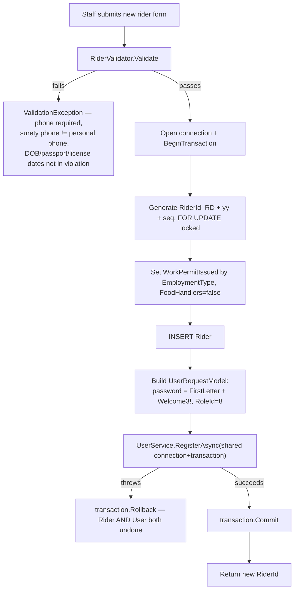
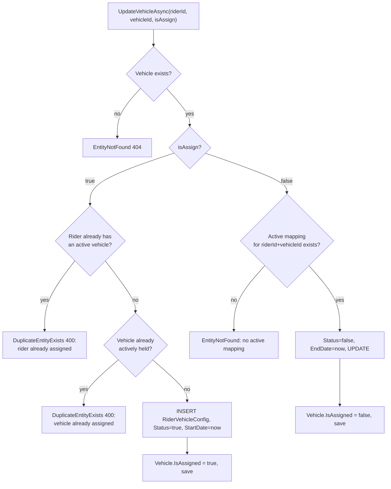
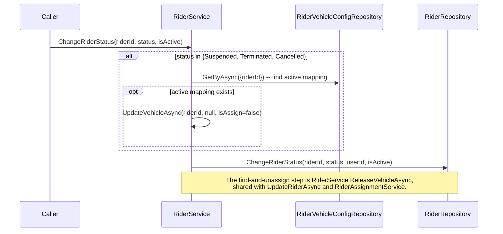
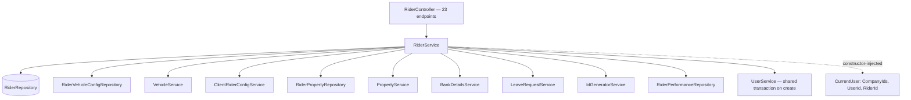
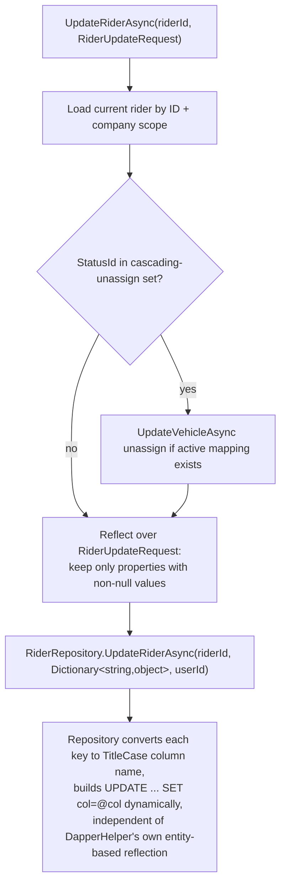
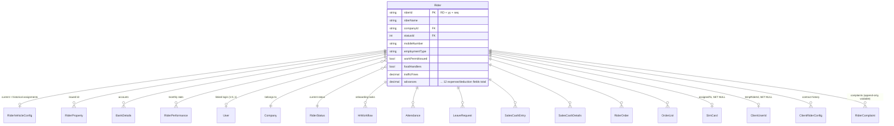

# Rider Management

## 1. Module overview

The largest and most central domain in the platform: the lifecycle of a Rider (a gig/fleet worker) from onboarding through active service to termination, including their vehicle assignment, issued property (kit), bank details, expense ledger, and performance record. `RiderController` alone carries 23 of the system's 167 endpoints. `Rider` is also the foreign-key hub of the database — 14 of 44 foreign keys point at it (see [architecture-overview.md](architecture-overview.md)).

**Where it lives:**

| Concern | Path |
|---|---|
| Controller | `CAG.Admin.API/CAG.Admin.API/Controllers/v1/RiderController.cs` |
| Core service | `CAG.Admin.API.Application/Service/Implementation/RiderService.cs` |
| Validation | `CAG.Admin.API.Application/Validator/RiderValidator.cs` |
| Repository | `CAG.Admin.API.DBRepository/Repository/RiderRepository.cs` |
| Domain model | `CAG.Admin.API.Domain/Model/DBModels/Rider.cs` (57 members) |
| UI pages | `src/app/(pages)/Rider/`, `src/app/(details)/Rider/[riderId]/` |
| UI data layer | `http-client/rider.api.ts` → `hooks/react-query/rider.tsx` |
| Complaints (Phase II CS-01) | API: `RiderComplaintController` → `RiderComplaintService` → `RiderComplaintRepository` (table `RiderComplaint`). UI: `components/details/rider/complaints-tab.tsx` → `hooks/react-query/rider-complaint.tsx` → `http-client/rider-complaint.api.ts` |

## 2. Business perspective

### 2.1 Business purpose

Riders are the workforce the whole platform exists to manage — their documents, vehicle assignment, bank details for payroll, and status through an HR-driven onboarding pipeline. This module is the system of record for "who is this rider, what state are they in, what are they assigned, and what do they cost/earn."

### 2.2 Key use cases

1. **HR/Admin registers a new rider** — creates the `Rider` record and, transactionally, a linked `User` login account (see [User Management](user-management.md) §2.4).
2. **Staff view a rider's full profile** — company, vehicle, client mapping, bank details, issued property, performance.
3. **Staff reassign a rider to a different company or client.**
4. **Staff assign/unassign a rider to a vehicle.**
5. **Staff change a rider's status** — e.g. Onboarding → Active, or Active → Suspended/Terminated.
6. **Staff record/adjust a rider's recurring expense/deduction figures** (traffic fines, advances, admin fees, etc.) — feeds [Payroll Management](payroll-management.md).
7. **Staff issue/return/exchange property (kit)** to a rider.
8. **HR/Finance export the full rider roster** to Excel for offline reporting.
9. **A rider views their own record** — the same `GET api/rider/all` endpoint, filtered server-side to the caller's own `RiderId` when the caller's JWT carries one.
10. **System auto-transitions riders to Vacation/Vacation-Overdue** — via a background sync the UI polls every 5 minutes (see §2.3).
11. **Any department records a complaint about a rider** — the **Complaints** tab on the More details page (`/Rider/{riderId}/details`). Each entry is a dated comment showing who wrote it and in which role; the list is the rider's complaint history (see §2.3).

### 2.3 Business rules & logic

- **A new rider's employment type determines whether a work permit is required**: `WorkPermitIssued = rider.EmploymentType != "Full Time"` (explicit, string comparison — not enum-backed, so a typo'd or differently-cased employment type value would silently default to "requires a work permit"). `FoodHandlers` is always initialized `false` on creation (explicit).
- **`Rider.HireTypeId`** (1 Full Time / 2 Part Time) is set once in `AddRiderAsync` from the rider's `EmploymentType` at creation and never updated afterwards — it's the *hire-time* type, kept separate from `EmploymentType` (which can change over a rider's tenure) specifically so [Client & Client-User-ID Mapping](client-clientuserid-mapping.md)'s permanent-vs-temp assignment rules always have an unambiguous "were they hired Full Time or Part Time" fact to check. `PUT api/rider/{id}` cannot change it — it was removed from `RiderUpdateRequest` in the same rework.
- **Changing `EmploymentType`** goes through `PUT api/rider/{id}/employment-type` (Rider page → Personal → Employment type → Change), never the generic rider update — it's validated against the rider's Client User ID assignments and may end a temporary assignment. Rules and the suspension → part-time → return flow are in [Client & Client-User-ID Mapping](client-clientuserid-mapping.md) §2.3.
- **A new rider gets an auto-generated login with a predictable default password**: `rider.RiderName[0] + "Welcome3!"` (e.g., a rider named "John" gets password `JWelcome3!`), role hardcoded to `RoleId = 8` (Rider). (explicit, `RiderService.AddRiderAsync`). See §4.3 — this is a concrete, verifiable security weakness, not an inference.
- **Rider creation and its linked User account are one atomic transaction** — both inserts share a single `IDbConnection`/`IDbTransaction`; a failure in either rolls back both (explicit, see [User Management](user-management.md) §2.4 for the sequence diagram).
- **Company-scoped visibility is enforced at the repository layer, not just the controller**: `GetRiderByIdAsync`, `GetAllRidersAsync`, `ExportRidersAsync`, etc. all pass `_userAssignedCompanies` (derived from the JWT's `CompanyIds` claim) down into the SQL `WHERE` clause — a rider outside the caller's assigned companies returns `null`/is excluded rather than a 403 (explicit; the controller then maps a `null` single-rider result to an `Unauthorized` exception with message "You can only view riders from companies assigned to you").
- **Three rider statuses used to block the rider page until the HR workflow completed — the page now opens for them** (Phase II OC-09, 2026-10-01). `RiderService.GetRiderByIdAsync(riderId, skipStatusCheck)` still throws `Forbidden` ("...before completing HR workflow tasks") for `Onboarding`, `LocalTransfer`, `VisaProcess` when `skipStatusCheck` is false, and server-side callers that want that (rider-order import, the performance export) still pass `false`. But `GET api/rider/{riderId}` now **always** passes `skipStatusCheck: true` — the query parameter is gone — and the Rider list opens these riders like any other (the "HR workflow tasks are still pending" popup was removed). The point is to let expenses be recorded while a rider is being hired: ledger entries made for these statuses are stored with `Source = 'Onboarding'`. A ledger entry needs a company (`RiderExpense.CompanyId` is NOT NULL) and a rider still being hired often has none yet, so the Expenses tab disables **Add entry / Import** with an explanatory note until a company is assigned on the Employment tab (the API says the same: "This rider has no company yet…"). Client mapping and vehicle assignment stay closed to these riders.
- **A rider can hold at most one active vehicle, and a vehicle can be actively held by at most one rider** — both directions are checked before creating a `RiderVehicleConfig` mapping, each raising `DuplicateEntityExists` (400) on conflict (explicit, `UpdateVehicleAsync`).
- **Certain status transitions auto-unassign the rider's vehicle**: moving to `Suspended`, `Terminated`, or `Cancelled` triggers an implicit unassign if an active mapping exists (`FreeId` was on this list until it was retired as a company status on 2026-10-06 — see §3). Both `UpdateRiderAsync` and `ChangeRiderStatus` now call one shared `RiderService.ReleaseVehicleAsync(riderId)` (it used to be the same block written twice) — the two entry points being `PUT api/rider/{riderId}` (general update, when `StatusId` is part of the payload) and `PUT api/rider/{riderId}/status` (dedicated status endpoint).
- **Four statuses can only be set by an Admin or an Operational Manager** (Phase II OC-08, 2026-10-01): `AkhamaTransfer`, `Terminated`, `Suspended`, `Cancelled`. Enforced on the API by `RiderStatusPolicy.EnsureCanSet` (role ids 1 and 2; anyone else gets **403** "Only an Admin or Operational Manager can set a rider to…"), at every place a person can set a status: `PUT api/rider/{id}` (`UpdateRiderAsync` — only when `StatusId` actually *changes*, since forms re-send the saved status), `PUT api/rider/{id}/status` (now `SetRiderStatusAsync`, which checks first and then calls `ChangeRiderStatus`), `POST api/rider` (a rider created straight into one of them) and the last step of the HR workflow (`HrWorkflowService.UpdateTaskDetails`, checked *before* the step is claimed so a refusal leaves the workflow untouched). System-driven changes (client assignment, vacation sync, workflow start) call `ChangeRiderStatus` directly and are not role-checked. The UI mirrors it: Company rider status and the workflow's final-status drop-down don't offer the four statuses to other roles (`useCanSetRestrictedRiderStatus`, `ROLE_RESTRICTED_RIDER_STATUSES`); a rider already in one of them still shows it. This is the second place the API checks a role itself, after complaints (§3.11).
- **Property issuance currently only tracks `TotalQuantity`, never `AvailableQuantity`** — despite `Property` having both columns, every `AvailableQuantity` adjustment in `AddPropertyAsync`/`UpdatePropertyAsync`/`DeletePropertyAsync` is commented out in the source, and the *live* code instead increments/decrements `TotalQuantity` on issue/return/exchange. [Confirmed by reading both `Property.cs` and all three `RiderService` methods, not inferred] This means issuing a kit item to a rider **increases** `Property.TotalQuantity` rather than decreasing an available count — the opposite of what a "total owned inventory" figure should do — and no stock-insufficiency check is enforced anywhere (the `if (property.AvailableQuantity < dto.Quantity) throw ...` guard is present in the source only as a comment). See §4.1 and [Property & Inventory](property-inventory-management.md) §4.1 for the same defect from that module's side.
- **Vacation status sync is its own endpoint** (`POST api/rider/vacation-status/sync` → `RiderService.SyncVacationStatusesAsync`): it fetches riders currently on `"Vacation"` / `"Vacation Overdue"` leave (from [Leave Management](leave-management.md)) and bulk-`UPDATE`s `Rider.StatusId`, skipping riders already in that status, and returns how many changed. The UI calls it on load and every 5 minutes in the background (`components/background/vacation-status-sync.tsx`, mounted in `AppProviders` for users with Rider access) and refreshes rider data once after the first run. Until September 2026 this ran as a write side effect inside every `GET api/rider/all` and `GET api/rider/paged`; those are now read-only.
- **A rider's own login sees only their own record**: if the caller's JWT carries a `RiderId` claim (i.e., they logged in as a rider-linked account), `GetAllRidersAsync` filters the full result set down to `RiderId == _currentUser.RiderId` in C#, after the full company-scoped query already ran — [Inferred] this is a self-service view reusing the staff "all riders" endpoint and query rather than a dedicated single-record self endpoint, so a rider's browser still receives (and the server still executes) the full multi-table join for the whole company roster before filtering client-side-of-the-service-layer down to one row.
- **Complaints are an append-only record** (Phase II CS-01, table `RiderComplaint`, added 2026-10-01). Any staff role that can open the rider page adds one from the **Complaints** tab: free text, trimmed, 1–2,000 characters, stamped **by the server** with the author's `UserId`, their **role at that moment** (the "department" — no department column exists anywhere, so the role is the department and is kept on the row so history stays right if the user changes role) and a UTC timestamp. There is **no edit and no delete**, so the list *is* the history; it is shown newest first. A mistaken entry is **voided** instead (`PUT …/complaints/{id}/void`, **Admin / Operational Manager / HR only**, reason required, ≤500 characters): the row stays listed struck-through with who voided it, when and why, and stops counting in the tab badge; a second void of the same entry is rejected (400) and never overwrites the first voider. A complaint is informational only — no status, category, attachment or notification, and it changes nothing about the rider's status or payroll. See §3.11 for who can read/add.
- **`GetTopRidersAsync` is unimplemented** — `throw new NotImplementedException()` (explicit). If [Dashboard & Reporting](dashboard-reporting.md) calls this path, it fails with a 500.

### 2.4 End-to-end business flows

**Rider creation (success and rollback paths):**

```mermaid
flowchart TD
    A[Staff submits new rider form] --> B[RiderValidator.Validate]
    B -- fails --> Z1[ValidationException — phone required,<br/>surety phone != personal phone,<br/>DOB/passport/license dates not in violation]
    B -- passes --> C[Open connection + BeginTransaction]
    C --> D[Generate RiderId: RD + yy + seq, FOR UPDATE locked]
    D --> E[Set WorkPermitIssued by EmploymentType, FoodHandlers=false]
    E --> F[INSERT Rider]
    F --> G[Build UserRequestModel:<br/>password = FirstLetter + Welcome3!, RoleId=8]
    G --> H["UserService.RegisterAsync(shared connection+transaction)"]
    H -- throws --> Z2[transaction.Rollback — Rider AND User both undone]
    H -- succeeds --> I[transaction.Commit]
    I --> J[Return new RiderId]
```

**Vehicle assignment / unassignment:**

```mermaid
flowchart TD
    A["UpdateVehicleAsync(riderId, vehicleId, isAssign)"] --> B{Vehicle exists?}
    B -- no --> Z1[EntityNotFound 404]
    B -- yes --> C{isAssign?}
    C -- true --> D{Rider already has<br/>an active vehicle?}
    D -- yes --> Z2[DuplicateEntityExists 400:<br/>rider already assigned]
    D -- no --> E{Vehicle already<br/>actively held?}
    E -- yes --> Z3[DuplicateEntityExists 400:<br/>vehicle already assigned]
    E -- no --> F[INSERT RiderVehicleConfig, Status=true, StartDate=now]
    F --> G[Vehicle.IsAssigned = true, save]
    C -- false --> H{Active mapping<br/>for riderId+vehicleId exists?}
    H -- no --> Z4[EntityNotFound: no active mapping]
    H -- yes --> I[Status=false, EndDate=now, UPDATE]
    I --> J[Vehicle.IsAssigned = false, save]
```

**Status change with cascading vehicle unassignment:**

```mermaid
sequenceDiagram
    participant C as Caller
    participant RS as RiderService
    participant RVC as RiderVehicleConfigRepository
    participant RR as RiderRepository

    C->>RS: ChangeRiderStatus(riderId, status, isActive)
    alt status in {Suspended, Terminated, Cancelled}
        RS->>RVC: GetByAsync({riderId}) -- find active mapping
        opt active mapping exists
            RS->>RS: UpdateVehicleAsync(riderId, null, isAssign=false)
        end
    end
    RS->>RR: ChangeRiderStatus(riderId, status, userId, isActive)
    Note over RS,RR: The find-and-unassign step is RiderService.ReleaseVehicleAsync,<br/>shared with UpdateRiderAsync and RiderAssignmentService.
```

### 2.5 Actors & interactions

| Actor | Role |
|---|---|
| HR / Admin / Operational Manager | Create/edit riders, manage status, assign vehicles/property |
| Rider (self, via linked User account) | Read-only, filtered to own record, via the same endpoint staff use |
| [User Management](user-management.md) | Downstream — receives the auto-created login on rider creation |
| [HR Workflow & Onboarding](hr-workflow-onboarding.md) | Upstream gate — certain statuses block full rider record access until workflow tasks complete |
| [Leave Management](leave-management.md) | Upstream — vacation status feeds the bulk status update in `SyncVacationStatusesAsync` |
| [Client & Client-User-ID Mapping](client-clientuserid-mapping.md) | Peer — since the September 2026 rework, all client-assignment control lives on the Rider page (Assign/End/Switch, via `RiderAssignmentService`) rather than a `RiderService` method; see that module's doc for the current model. `RiderService.UpdateClientUserIdAsync` (referenced by older versions of this doc) no longer exists. |
| [Property & Inventory](property-inventory-management.md) | Peer — `PropertyService` is called directly from `RiderService` for kit issuance |
| [Vehicle Management](vehicle-management.md) | Peer — `VehicleService` is called directly for assignment side effects |

## 3. Technical perspective

### 3.1 Architecture overview

`RiderService` is the largest and most interconnected service in the system — it directly injects **11 other services/repositories** (`IRiderRepository`, `IRiderVehicleConfigRepository`, `IVehicleService`, `IClientRiderConfigService`, `IRiderPropertyRepository`, `IPropertyService`, `IBankDetailsService`, `ILeaveRequestService`, `IIdGeneratorService`, `IRiderPerformanceRepository`, `IUserService`), making it a de facto orchestration layer for the rider aggregate rather than a narrowly-scoped service. It resolves `CurrentUser`/`CompanyIds` once in its constructor and reuses them across every method, rather than re-fetching per call.

```mermaid
graph TD
    RC[RiderController — 23 endpoints] --> RS[RiderService]
    RS --> RR[(RiderRepository)]
    RS --> RVC[RiderVehicleConfigRepository]
    RS --> VS[VehicleService]
    RS --> CRC[ClientRiderConfigService]
    RS --> RPR[RiderPropertyRepository]
    RS --> PS[PropertyService]
    RS --> BDS[BankDetailsService]
    RS --> LRS[LeaveRequestService]
    RS --> IDG[IdGeneratorService]
    RS --> RPerfR[RiderPerformanceRepository]
    RS --> US[UserService — shared transaction on create]
    RS -.constructor-injected.-> CU[CurrentUser: CompanyIds, UserId, RiderId]
```

### 3.2 Component breakdown

| Component | Responsibility | Key methods | Dependencies |
|---|---|---|---|
| `RiderController` | 23-endpoint HTTP surface | full CRUD + status + vehicle + property + expense + bank-details + performance + export | `IRiderService` |
| `RiderService` | All rider business logic; orchestrates 6+ peer services | see §2.3/§2.4 | 11 injected dependencies |
| `RiderValidator` | Static validation, called once (creation only — **not** on update) | `Validate(Rider)` | — |
| `RiderRepository` | Multi-table joined reads, dynamic partial updates, dashboard aggregates | `GetAllRidersAsync` (8-table join, see [architecture-overview.md](architecture-overview.md) §7.1), `GetRiderByIdAsync`, `UpdateRiderAsync` (dynamic field dict), `ChangeRiderStatus`, `GetRiderExportAsync`, `UpdateBulkRiderStatuesAsync`, six `Get*Dto` dashboard methods | Dapper |

### 3.3 Detailed technical flows

**Partial update via reflected field diffing (`UpdateRiderAsync`):**

```mermaid
flowchart TD
    A["UpdateRiderAsync(riderId, RiderUpdateRequest)"] --> B[Load current rider by ID + company scope]
    B --> C{StatusId in cascading-unassign set?}
    C -- yes --> D[UpdateVehicleAsync unassign if active mapping exists]
    C -- no --> E
    D --> E[Reflect over RiderUpdateRequest:<br/>keep only properties with non-null values]
    E --> F["RiderRepository.UpdateRiderAsync(riderId, Dictionary&lt;string,object&gt;, userId)"]
    F --> G[Repository converts each key to TitleCase column name,<br/>builds UPDATE ... SET col=@col dynamically,<br/>independent of DapperHelper's own entity-based reflection]
```

This is a **second, independent reflection-based update mechanism**, parallel to but distinct from [Database Access Layer](database-access-layer.md)'s `DapperHelper.BuildUpdate<T>` — here the "entity" is a runtime `Dictionary<string, object>` built by filtering a DTO's non-null properties, and the repository does its own `ToTitleCase` column-name conversion and `JsonElement` unwrapping rather than reusing `DapperHelper`. [Inferred] This exists specifically so that `null` on the request DTO means "don't touch this field" rather than "set it to null" — a real requirement `DapperHelper.BuildUpdate` (which includes every settable property unconditionally) doesn't support.

### 3.4 API & interface documentation

| Method | Route | Purpose |
|---|---|---|
| `GET` | `api/rider/all` | Company-scoped list; self-filtered if caller is a rider |
| `POST` | `api/rider/vacation-status/sync` | Vacation / Vacation Overdue status sync, polled by the UI every 5 min; returns `{vacation, vacationOverdue}` counts (§2.3) |
| `GET` | `api/rider/all/with-company` | List with company info attached |
| `GET` | `api/rider/company/{companyId}` | List for one company |
| `GET` | `api/rider/{riderId}` | Single rider; opens for Onboarding/LocalTransfer/VisaProcess too (OC-09 — the controller always skips the status gate) |
| `POST` | `api/rider` | Create (raw `Rider` DBModel bound from body — see §4.3) |
| `PUT` | `api/rider/{riderId}` | Partial update via `RiderUpdateRequest` |
| `DELETE` | `api/rider/{riderId}` | See §3.12 — not a simple delete; orchestrated through [HR Workflow & Onboarding](hr-workflow-onboarding.md) |
| `PUT` | `api/rider/{riderId}/company` | Reassign company |
| `POST` | `api/rider/{riderId}/client` | Reassign client (delegates to `ClientRiderConfigService`) |
| `GET` | `api/rider/export` | Excel export, 70+ columns across rider/company/bank/client/vehicle/EMI. The **Documents** column (2026-10-03) lists the document *types* the rider holds, comma-separated and alphabetical, once per type however many files — e.g. `Civil ID, Passport Files, Selfie` (no dates). It replaced the old "Document Details" column, which printed one line per file (file name, type, expiry) and so was mostly file names |
| `POST`/`PUT`/`DELETE` | `api/rider/{riderId}/property[...]` | Issue/adjust/return kit property |
| `PUT` | `api/rider/{riderId}/status` | Dedicated status transition (own vehicle-unassign duplicate logic) |
| `POST` | `api/rider/{riderId}/vehicle/{vehicleId}/{isAssign}` | Assign/unassign vehicle |
| `PUT` | `api/rider/{riderId}/expense` | Overwrite the 12-field expense/deduction ledger — **this ledger is drained to zero automatically by [Payroll Management](payroll-management.md)'s `sp_process_rider_payroll` stored procedure** after each successful payroll run for that rider, so these fields represent unbilled month-to-date deductions, not a running total |
| `GET`/`POST`/`PUT`/`DELETE` | `api/rider/{riderId}/bank-details[...]` | Delegates to [Bank Details, within Rider Management] — see §3.2 |
| `GET` | `api/rider/{riderId}/performance[/all]` | Monthly performance figures |
| `GET` | `api/rider/{riderId}/performance/export` | Excel report of the rider performance page (Phase II RP-15) — see the note under this table |
| `GET` | `api/rider/{riderId}/client-rider-config` | Active client-rider contract mapping |
| `GET` / `POST` | `api/rider/{riderId}/complaints` | List the rider's complaints, newest first, voided ones included / add one (body `{ complaint }`, returns the new id). Own controller, `RiderComplaintController` (§2.3) |
| `PUT` | `api/rider/{riderId}/complaints/{riderComplaintId}/void` | Void a complaint (body `{ reason }`) — Admin / Operational Manager / HR only |

All require `[Authorize]`; none check role (see [architecture-overview.md](architecture-overview.md) §5) — **except the three `…/complaints` routes**, which enforce access themselves (§3.11).

**Phase II RP-15 — performance report export (`GET api/rider/{riderId}/performance/export`).** `RiderPerformanceExportService` (own service, registered next to `RiderPerformanceService`) returns an `.xlsx` named `RiderPerformance_{riderId}_{yyyy-MM-dd}.xlsx` — the same ClosedXML approach as `rider/export`, but one rider and one sheet per section of the rider performance page (`/Rider/{riderId}`): **Summary** (rider information with the selfie thumbnail, client information, the four finance cards, the payroll calculation of the latest processed payroll, orders / attendance for the latest month, leave summary), **Payroll** (one row per processed month), **Earnings Ledger** (client-sheet batches of the latest order month, with a totals row), **Expense Ledger** (every transaction, with Pending / Deducted status and the payroll month that deducted it), **Incentives** (ledger entries whose category contains "incentive", amounts shown positive, with a total), **Orders** (days 1–31 per month, plus total, working days, orders per working day and change on the previous month), **Attendance**, **Assets** (vehicle — marked "Previously assigned" when it is only the last vehicle — SIM card and properties), **Sales Cash**, **Leave**, **Passport Requests**. It covers the last six months (the widest range the page offers); the Expense Ledger, Leave (20 latest) and Passport Requests (20 latest) follow the dashboard queries. It does not call any new SQL: it composes `IRiderService.GetRiderByIdAsync`, `GetMontlyRiderPerformanceAsync` and `GetRiderDashboardAsync`, `IRiderExpenseService.GetLedgerAsync` and `IRiderProfilePhotoService.GetAsync`, so the access rules are exactly the page's — the rider read runs first and enforces company scoping (`Unauthorized` outside the caller's companies) and the HR-workflow gate (`Forbidden` for Onboarding / Local Transfer / Visa Process). Finance figures come from the latest processed payroll; **Pending deductions** is `RiderInfo.PendingDeductions` (unpaid positive ledger entries, same as the Expenses tab). Text from the ledger is written as plain text cells, so a remark that starts with `=` or `+` is never evaluated as a formula. A thumbnail ClosedXML cannot read is skipped rather than failing the export. Client Rider Status uses the client's labels (`Free ID`, `ID Issued for Part-Time`, …), duplicated from the UI's `ClientUserIdStatusLabel` because the `ClientUserIdStatus` rows are only renamed once `2026-10-01_ClientUserIdStatus_Names.sql` is applied. The UI button (`ExportPerformanceButton`) sits in the top bar of the performance page and in the Performance tab on the details page.

**Gaps found while building it (not changed):** (1) `GET api/rider/{riderId}/performance/all` — `GetMontlyRiderPerformanceAsync` — has no company scope, so any signed-in user who knows a `riderId` gets that rider's payroll expenses, orders and attendance; the export is not affected because it reads the rider (scoped) first. (2) `AttendanceDto.Month` is a public *field*, so `System.Text.Json` leaves it out: `performance.attendances[].month` never reaches the UI (the dashboard's attendance labels show "—" and its *Current month* range hides every attendance row). The export reads the DTO server-side, so its months are correct. (3) `RiderPerformanceResponse` carries the `RiderPerformance` table columns (`performanceMonth`, `currentZone`, `workingDays`, …) but not the `month` / `totalOrders` / `totalEarnings` / `rating` the Performance tab reads, so its *Earnings* and *Client rating* cards always show "—" — and the `RiderPerformance` model has no rating column at all, so the export has no client rating (earnings are in the Payroll and Earnings Ledger sheets). (4) The performance page's *Pending deductions* tile still sums the legacy `Rider` expense columns (`PENDING_FIELDS` in `(details)/Rider/[riderId]/index.tsx`) instead of `rider.pendingDeductions`, so after the ledger-driven payroll migration it no longer matches the Expenses tab — or the export.

### 3.5 Database & data model

```mermaid
erDiagram
    Rider ||--o| RiderVehicleConfig : "current + historical assignments"
    Rider ||--o{ RiderProperty : "issued kit"
    Rider ||--o{ BankDetails : "accounts"
    Rider ||--o{ RiderPerformance : "monthly stats"
    Rider ||--o| User : "linked login (1:0..1)"
    Rider }o--|| Company : "belongs to"
    Rider }o--|| RiderStatus : "current status"
    Rider ||--o{ HrWorkflow : "onboarding tasks"
    Rider ||--o{ Attendance : ""
    Rider ||--o{ LeaveRequest : ""
    Rider ||--o{ SalesCashEntry : ""
    Rider ||--o{ SalesCashDetails : ""
    Rider ||--o{ RiderOrder : ""
    Rider ||--o{ OrderList : ""
    Rider ||--o| SimCard : "assignedTo, SET NULL"
    Rider ||--o| ClientUserId : "tempRiderId, SET NULL"
    Rider ||--o{ ClientRiderConfig : "contract history"
    Rider ||--o{ RiderComplaint : "complaints (append-only, voidable)"

    Rider {
        string riderId PK "RD + yy + seq"
        string riderName
        string companyId FK
        int statusId FK
        string mobileNumber
        string employmentType
        bool workPermitIssued
        bool foodHandlers
        decimal trafficFines
        decimal advances
        "... 12 expense/deduction fields total"
    }
```

`RiderStatuses` (C# enum) has 15 values — the five lifecycle-blocking/cascading ones used in business logic (`Onboarding`, `VisaProcess`, `LocalTransfer`, `FreeId`, `Suspended`, `Terminated`, `Cancelled`, `Vacation`, `VacationOverdue`) plus three that read as **role names, not rider states** (`Supervisor`, `OperationalManager`, `HR`) and one (`AkhamaTransfer`). [Inferred, not confirmed by tracing every reference] This enum may be doing double duty — e.g. also representing HR workflow task-owner roles — worth checking against [HR Workflow & Onboarding](hr-workflow-onboarding.md) if a discrepancy ever surfaces; documented here as an observed naming oddity rather than a traced defect.

**Phase II RM-02 (Company rider status), 2026-10-01:** `LegalIssue = 15` was added. `Rider.statusId` has a foreign key to the `RiderStatus` lookup table, so the row has to exist first — `CAG.Admin.API/Database/Migrations/2026-10-01_RiderStatus_LegalIssue.sql` (run it before using the status; without it saving a rider as Legal Issue fails on the FK). It is informational for now: it does **not** release the vehicle (unlike `FreeId` / `Suspended` / `Terminated` / `Cancelled`) and does not block client assignment — the Phase II notes suggest treating it like Suspended, which is still an open question. The dashboard's Total Riders breakdown counts it (`RidersBreakdownDto.LegalIssue`). `FreeId` is **no longer offered as a choice** in the UI (rider Overview / Employment edit, HR workflow final step) but the API still sets it (client assignment end / suspend / churn, part-time onboarding via `AddRiderModal`), it still releases the vehicle, and the dashboard still counts it (Total Riders row, shown only while riders have it, and the Workforce "Free Riders" figure) — so the enum value and the lookup row stay until those flows are re-pointed; existing Free ID riders keep showing it.

**"Others" company rider status, 2026-10-06 (bug sheet #2, reopened):** `Others = 16` was added for staff on a company's quota who are not riders, supervisors, operational managers or HR. Lookup row: `CAG.Admin.API/Database/Migrations/2026-10-06_RiderStatus_Others.sql` (same FK rule as Legal Issue — run it before the API/UI build that offers the status; applied to the Dev database on 2026-10-06, **not** QA/prod). It behaves like the other staff statuses (`Supervisor`, `OperationalManager`, `HR`): no vehicle release, no client-assignment block, not role-restricted. Offered in the rider Overview / Employment edit, the HR workflow final step and the Rider list *Company Rider Status* filter. It counts towards a company's onboarded employees on the dashboard Vehicle quota card and sits in the Total Riders "Staff roles" row — see [Dashboard & Reporting](dashboard-reporting.md).

**Free ID retired as a company rider status, 2026-10-06 (bug sheet #7, reopened) — supersedes the RM-02 paragraph above where they differ.** "Free ID" describes a Client User ID nobody is working on; it was also written to the rider (`Rider.statusId = 4`) every time an assignment ended, so one event was counted twice — under Client Rider Status *and* under Company Rider Status. Now:
- **Nothing sets it.** `RiderAssignmentService` (End, Release, Suspend, Mark Churn, employment-type change) no longer changes the rider's company status when an assignment ends — the rider stays what they were (normally Active). It still releases the rider's vehicle, through `RiderService.ReleaseVehicleAsync`, **after** the assignment transaction commits (before, the release ran on a second connection in the middle of that transaction). Switch and Resume-return-holder never released the vehicle and still don't.
- **Nobody can choose it.** `RiderStatusPolicy.EnsureCanSet` returns **400** "Free ID is no longer a company rider status…" on `PUT api/rider/{id}` (when the status changes), `PUT api/rider/{id}/status`, and the HR workflow's last step. `POST api/rider` quietly stores Active when a caller still sends 4 (the add-rider wizard used to create part-time riders as Free ID; it sends Active now).
- **Existing riders were moved to Active** by `CAG.Admin.API/Database/Migrations/2026-10-06_RiderStatus_RetireFreeId.sql` (backup table `_bak_RiderFreeId_20261006`, lookup row 4 set `isActive = 0`, undo statement in the header). Applied to Dev on 2026-10-06 — 258 riders (230 part-time, 228 of them with no company; 28 full-time) — **not** QA/prod; run it with the API + UI release, because the old API would put riders back into Free ID. A rider who should really be Cancelled / Terminated has to be set by hand.
- **UI:** the Rider list's Company Rider Status filter and the dashboard's Workforce card no longer have a Free ID / "Free Riders" entry; the Suspend / Mark Churn / Release dialogs say the rider's company status doesn't change. The enum value `RiderStatuses.FreeId = 4` and `RiderStatus.FREE_ID` stay so a row on an un-migrated database still reads (and the dashboard's Total Riders card still shows a Free ID row while any rider has it).
- **Knock-on effect:** the moved riders count as Active, so the dashboard's Active figure grows (Dev: 994 → 1,252) and the Vehicle quota card counts the ones that belong to a company as onboarded (Dev: +28; AMK 79 → 81).

**Phase II CS-01 (Complaint section), 2026-10-01:** table `RiderComplaint` — `CAG.Admin.API/Database/Migrations/2026-10-01_RiderComplaint.sql` (run it **before** deploying the API build that contains `RiderComplaintController`, otherwise the Complaints tab errors). Columns: `riderComplaintId` (PK), `riderId` (FK → `Rider`, default `RESTRICT`), `complaint` (`TEXT`), `roleId` (the author's role when it was written), `createdAt` / `createdBy` (UTC / `User.userId`), and the void fields `isVoided`, `voidedAt`, `voidedBy`, `voidReason`. `createdBy` / `voidedBy` are deliberately **not** foreign keys (same as `LeaveRequestComment`) so deactivating a user never blocks or rewrites what they wrote; the API reads names with a `LEFT JOIN` and shows the role from `Role.name` (trimmed — several `Role.name` values carry trailing spaces). The table is **utf8mb4**, unlike `LeaveRequestComment` (latin1), so Arabic text is stored correctly. One index, `(riderId, createdAt)`, serves the only query (one rider, newest first). Applied to the Dev database on 2026-10-01.

### 3.6 External integrations

None directly (ClosedXML for the Excel export is a library, not a service).

### 3.7 Internal module dependencies

**Upstream (this module depends on):** [User Management](user-management.md) (login creation), [Authentication & Authorization](authentication-authorization.md) (`CompanyIds`/`UserId`/`RiderId` claims), [Leave Management](leave-management.md) (vacation status), [Property & Inventory](property-inventory-management.md), [Vehicle Management](vehicle-management.md), [Client & Client-User-ID Mapping](client-clientuserid-mapping.md), [Database Access Layer](database-access-layer.md).

**Downstream (depend on this module):** [HR Workflow & Onboarding](hr-workflow-onboarding.md), [Attendance Management](attendance-management.md), [Payroll Management](payroll-management.md), [Rider Orders & Batch Billing](rider-orders-batch-billing.md), [Sales Cash Reconciliation](sales-cash-reconciliation.md), [Dashboard & Reporting](dashboard-reporting.md) — nearly every other module either reads `Rider` rows or filters by `riderId`.

### 3.8 Configuration & environment

No module-specific configuration beyond the shared MySQL connection string.

### 3.9 Background jobs & workers

No server-side scheduler — the vacation-status sync is triggered by the UI's 5-minute background poll of `POST api/rider/vacation-status/sync` (§2.3), so it only runs while someone with Rider access has the app open.

### 3.10 Events & messaging

None.

### 3.11 Authentication & authorization

Company-scoped row filtering (`_userAssignedCompanies`) is the only authorization logic in this module, and it is *data* scoping, not *action* scoping — every authenticated user, regardless of role, can create/update/delete/export riders within their assigned companies (or all companies, if Admin). See [architecture-overview.md](architecture-overview.md) §5.

**Exception — complaints (2026-10-01).** `RiderComplaintService` enforces access on the API itself, because complaints are sensitive and riders log in to this portal too. Every call (list, add, void) checks, in order: (1) the **Rider role (8), or any user whose token carries a `RiderId`, is refused** with 403 whatever the permission matrix says; (2) the caller's role must hold **at least View on module `CAG_RIDER`** (looked up from `RolePermission` on each call — "anyone who can open the rider page", so a View-only role such as Reporter can read *and add*); (3) the rider must be active and either have no company or be in one of the caller's companies (the same predicate as the rider details page) — otherwise 404 "Rider not found or not accessible". **Void** additionally requires role Admin, Operational Manager or HR (403 otherwise). The UI hides the Void button for other roles, but that is cosmetic — the API is the boundary. Errors are real HTTP statuses (`AdminAPIException`: 400 validation, 403, 404), unlike the legacy `ValidationException` → 500 mapping.

### 3.12 Validation & error handling

- `RiderValidator.Validate` runs only on **creation** (`AddRiderAsync`) — phone required, surety phone ≠ personal phone (normalized to digits-only before comparing), DOB not future, passport/license expiry not already past. **`UpdateRiderAsync` does not call the validator at all** [confirmed by reading the method — no `RiderValidator.Validate` call exists in the update path], so an update can set a past-dated passport expiry or a future DOB that creation would have rejected.
- `AddRiderAsync` wraps its transaction in try/catch-rollback-rethrow — correct transactional error handling.
- `UpdateRiderAsync`/`GetRiderByIdAsync` throw `NotFoundException`/`AdminAPIException` appropriately for missing/out-of-scope riders.
- **`DeleteRiderAsync` itself is a hard delete** (`_riderRepository.DeleteAsync`, no soft-delete/`IsActive` flip) — but it is not reachable directly from the API in isolation. `RiderController.DeleteRider` (confirmed by reading the controller, not just the service) first checks for existing `ClientRiderConfig` associations via [Client & Client-User-ID Mapping](client-clientuserid-mapping.md) and returns a friendly 400 ("Cannot delete rider with existing client associations...") if any exist, then delegates to **`IHrWorkflowService.DeleteWorkflowTaskByRiderIdAsync`** — a method that, despite its name, first deletes all of the rider's `HrWorkflow` rows and *then* calls `RiderService.DeleteRiderAsync` internally (see [HR Workflow & Onboarding](hr-workflow-onboarding.md) §2.3 for the full trace). So rider deletion is a genuine cross-module orchestration spanning three services, clearing exactly two of the 14 dependent-table FKs (`ClientRiderConfig` via the pre-check, `HrWorkflow` via the delete-through) before attempting the hard delete — any rider with history in one of the *other* 12 `RESTRICT`-linked tables (attendance, orders, leave, performance, etc.) still throws a raw, unhandled MySQL FK-constraint exception. Only a rider with client and HR-workflow history cleared (or never created) can be deleted successfully. Since 2026-10-01 `RiderComplaint` (§3.5) is one more `RESTRICT`-linked table: a rider who has complaints can't be deleted — deliberate, so the complaint history can't disappear together with the rider.

### 3.13 Logging & observability

None beyond the platform-wide FTP exception log.

### 3.14 Design patterns & architectural decisions

- **Constructor-resolved current-user context** — `RiderService`'s constructor throws immediately if `ICurrentUserService.GetCurrentUser()` or its `CompanyIds` is null, meaning this service **cannot be constructed at all** outside an authenticated HTTP request context (no anonymous/system/background-job usage is possible without a `CurrentUser` present in `HttpContext.Items`, which requires an active request pipeline). This is a deliberate scoping choice but constrains reuse.
- **Reflected partial-update dictionary** (§3.3) as a workaround for `DapperHelper`'s all-or-nothing update semantics, duplicating (rather than extending) the shared SQL-building layer.
- **Direct service-to-service orchestration** rather than an event/mediator pattern — `RiderService` calls `PropertyService`, `VehicleService`, `ClientRiderConfigService`, `BankDetailsService`, and `UserService` synchronously and directly, making it the de facto aggregate root for "everything about a rider."

## 4. Risk & improvement analysis

### 4.1 Edge cases & failure scenarios

- **Property stock tracking is actively broken**, not just unimplemented (§2.3) — every issue/return/exchange operation mutates the wrong counter (`TotalQuantity` instead of `AvailableQuantity`) with no stock-sufficiency check, so `TotalQuantity` drifts upward indefinitely as items are issued and the platform can never detect running out of a property type.
- **Hard-delete against a heavily-referenced table**: deleting any rider with attendance, leave, order, or performance history throws an unhandled FK-constraint exception (§3.12) rather than a clean business error.
- ~~**Duplicated cascading-unassign logic**~~ — fixed 2026-10-06: both now call `RiderService.ReleaseVehicleAsync`. Originally: (`UpdateRiderAsync` vs. `ChangeRiderStatus`) can drift out of sync if one is updated and the other isn't — e.g., if the set of "vehicle-forfeiting" statuses is ever changed in one method and not the other.
- **`GetTopRidersAsync` throws `NotImplementedException`** — a live 500 waiting for whatever dashboard widget calls it.
- Update path skips `RiderValidator` entirely — a rider's dates can be edited into an invalid state that creation would have refused.

### 4.2 Known limitations

- `POST api/rider` binds the raw `Rider` DBModel directly from the request body (see [architecture-overview.md](architecture-overview.md) §6.2) — every column-backed property, including audit fields, is exposed to client-supplied JSON, though `AddRiderAsync` does overwrite `CreatedBy`/`UpdatedBy`/`CreatedAt`/`UpdatedAt`/`RiderId`/`WorkPermitIssued`/`FoodHandlers` server-side after binding, narrowing the practical exposure to the remaining ~50 fields.
- `EmploymentType` gates `WorkPermitIssued` via exact string comparison (`!= "Full Time"`) rather than an enum — fragile to typos, casing, or localization.
- The RiderStatuses enum's apparent role-name entries (§3.5) suggest either dead values or an undocumented dual purpose.
- **Complaints (§2.3) are deliberately minimal**: no edit, no un-void, no category, status, severity, attachment or notification — the only correction to a wrong entry is voiding it and adding a new one. The role shown beside an entry comes from `Role.name` at read time, so renaming a role relabels old entries (the stored `roleId` itself never changes). The text typed into the composer but not yet added is lost when switching tabs (each tab remounts). The Complaints tab only exists on the More details page; the rider dashboard (`/Rider/{riderId}`) does not show complaint counts.

### 4.3 Security considerations

- **Predictable default password for auto-created rider logins**: `{FirstInitial}Welcome3!` is deterministic from public-ish information (the rider's name) and identical in structure for every rider — anyone who knows or guesses a rider's name can guess their initial password with a handful of attempts, and there is no forced-password-change-on-first-login flow visible in [Authentication & Authorization](authentication-authorization.md) or here. Combined with no lockout/rate-limiting (see [Authentication & Authorization](authentication-authorization.md) §4.3), this is a concrete account-takeover risk for every rider account in the system.
- Company-scoped filtering is the only access boundary; it relies on `CompanyIds` being correct and non-empty in the JWT — a user with an empty/null `CompanyIds` claim (possible for a non-Admin with no `UserCompany` rows) would see no riders, effectively fail-safe, but this was not verified to be enforced consistently across every one of the 23 endpoints individually (some sub-resources — bank details, property, expenses — look the rider up by ID first via a company-scoped query, but a few, like `UpdateRiderExpenseAsync`, fetch by `RiderId` alone via `GetByAsync(new { RiderId = riderId })` **without** a company filter — [Inferred from reading that specific method] meaning expense figures may be editable for a rider outside the caller's assigned companies if the caller already knows the `riderId`).

### 4.4 Performance considerations

- The underlying `GetAllRidersAsync` query is an 8-table LEFT JOIN with no pagination (see [architecture-overview.md](architecture-overview.md) §7.1) — at 1,778 riders today this is manageable; it is the first join in the system likely to need pagination as the roster grows.
- `ExportRidersAsync` builds a 70+ column, all-rows workbook in memory (`MemoryStream`) synchronously within the request — no streaming, no background job.

### 4.5 Potential improvements

**Quick wins:**
- Fix `AddPropertyAsync`/`UpdatePropertyAsync`/`DeletePropertyAsync` to adjust `AvailableQuantity` (and re-enable the stock-sufficiency checks) instead of `TotalQuantity`.
- Extract the duplicated cascading-vehicle-unassign block into one shared private method called from both `UpdateRiderAsync` and `ChangeRiderStatus`.
- Add company-scope filtering to `UpdateRiderExpenseAsync`'s lookup.
- Implement or remove `GetTopRidersAsync`.

**Medium effort:**
- Force a password change on first login for auto-created rider accounts, and randomize the initial password instead of deriving it from the rider's name.
- Run `RiderValidator` on update as well as create.
- Convert `DeleteRiderAsync` to a soft delete (`IsActive = false`), consistent with how `IsActive` is already used for filtering everywhere else in this module.

**Major refactors:**
- Split `RiderService`'s 11-dependency orchestration role into narrower, composed services (e.g., a dedicated `RiderAssignmentOrchestrator` for the vehicle/property/client side effects) so the core rider CRUD logic isn't entangled with five peer domains' business rules.

## 5. Summary

- The platform's largest and most-connected module — 23 endpoints, 11 injected dependencies, foreign-key hub of the database.
- Rider creation atomically creates a linked staff-portal login with a **predictable, name-derived default password**.
- Company-scoped visibility is enforced per-query via the JWT's `CompanyIds` claim, but at least one write path (`UpdateRiderExpenseAsync`) appears to skip that scoping.
- Three rider statuses (Onboarding, LocalTransfer, VisaProcess) block full record access pending HR workflow completion.
- Property/kit issuance mutates the wrong inventory counter (`TotalQuantity` instead of `AvailableQuantity`) with all stock-sufficiency checks commented out — confirmed, not inferred.
- Vehicle assignment correctly enforces a strict one-rider-one-vehicle invariant in both directions.
- Validation runs on create but not on update; deletion is a hard delete orchestrated through [HR Workflow & Onboarding](hr-workflow-onboarding.md) (which clears `HrWorkflow` rows first) after a controller-level guard against existing client associations — but still fails against any of the other 12 `RESTRICT`-linked tables with rider history.
- `GetTopRidersAsync` is an unimplemented stub that will 500 if invoked.

## Changes 2026-10-06 (reopened bugs)

- **Rider list — Rider Company Code / Vehicle Company Code** (bug sheet #3): a rider and the vehicle they drive can belong to different companies (Dev: 587 of the 679 riders with a vehicle), so the list shows both codes side by side, as Car EMI does. `RiderAPIResponse.VehicleCompanyCode` / `VehicleCompanyName` come from a new `LEFT JOIN Company vc ON vc.companyId = v.companyId` in `GetAllRidersAsync`, the paged hydration query and `RiderListQueryBuilder.BaseFromSql`; the list can be sorted by `vehicleCompanyCode` and the search box matches it. The existing column was renamed from "Company Code" to "Rider Company Code" (same field, `companyCode`) and now sits after Company Name, next to the new one. The company name shows on hover. The Excel export already had both.
- **Free ID is no longer a company rider status** (bug sheet #7) — see the paragraph in §3 above.
- **Others** company rider status (bug sheet #2) — see §3 above.
