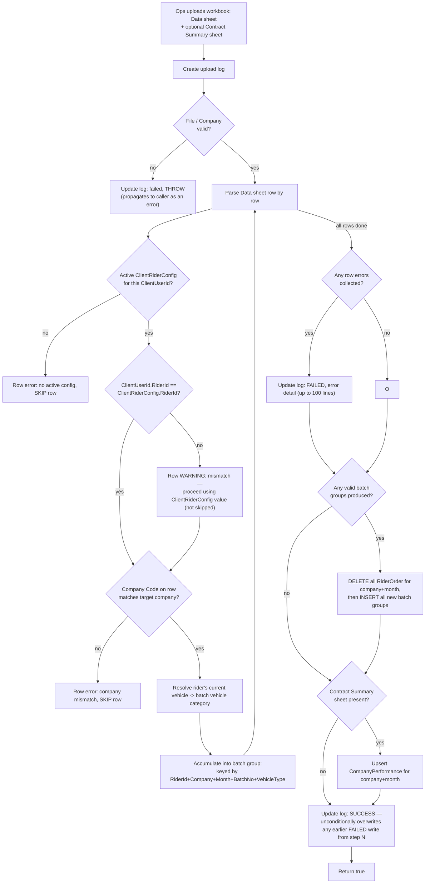
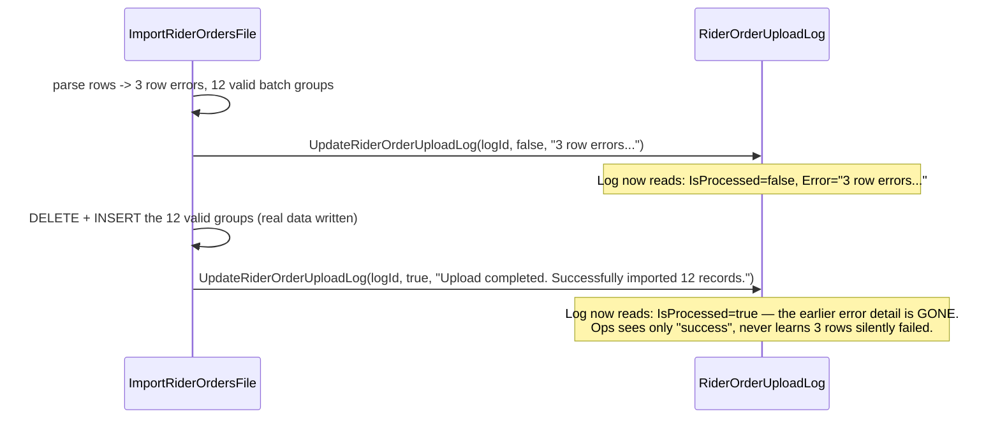
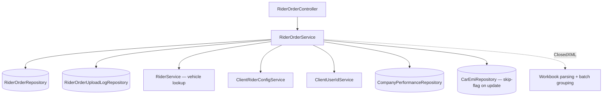
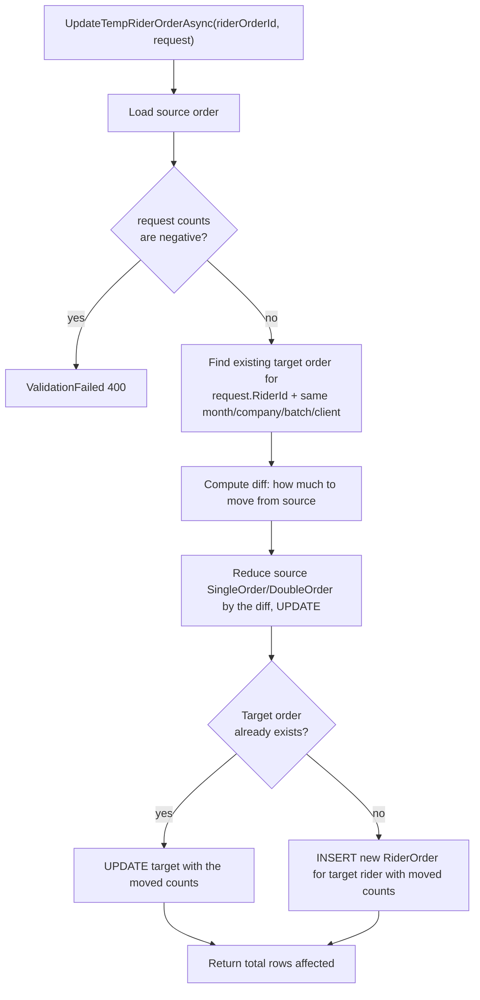
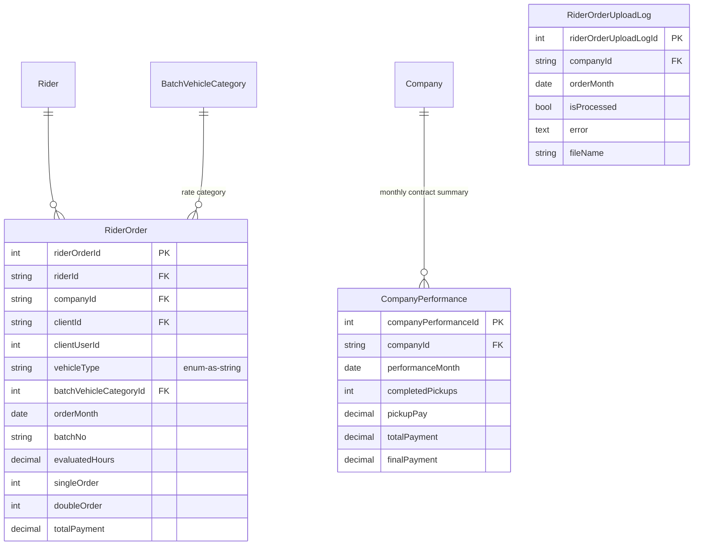

# Rider Orders & Batch Billing

## 1. Module overview

Tracks per-rider delivery order counts (pickups/dropoffs), grouped into billing batches by vehicle category, which [Payroll Management](payroll-management.md) rates and sums into rider earnings. Also ingests a client's monthly "Contract Summary" into [Dashboard & Reporting](dashboard-reporting.md)-adjacent `CompanyPerformance` data. `OrderList` (populated by [Attendance Management](attendance-management.md)'s misplaced `ImportRiderOrderList`, not this module — see that module's §2.3) is a related but separate table from `RiderOrder` (owned here); do not conflate the two.

**Where it lives:**

| Concern | Path |
|---|---|
| Controller | `CAG.Admin.API/CAG.Admin.API/Controllers/v1/RiderOrderController.cs` |
| Service | `CAG.Admin.API.Application/Service/Implementation/RiderOrderService.cs` |
| Repository | `RiderOrderRepository.cs`, `RiderOrderUploadLogRepository.cs` |
| Reference data | `BatchController.cs`/`BatchService`, `BatchVehicleCategoryController.cs` (see §3.7) |
| Enums | `BatchVehicleType` (`CAR`/`MOTOR_BIKE`), `BatchVehicleCategories` |

## 2. Business perspective

### 2.1 Business purpose

Client platforms report rider delivery activity (pickups, dropoffs, hours) on their own schedule and format; this module ingests that into a normalized, billable per-rider-per-batch record that [Payroll Management](payroll-management.md) rates against `OrderValue` pricing to compute earnings. It also supports manual order entry/correction and a mechanism to reallocate order credit between a temporary cover rider and the permanent rider they covered for.

### 2.2 Key use cases

1. **Ops imports a monthly order/performance workbook** for a company (a "Data" sheet plus an optional "Contract Summary" sheet).
2. **Ops manually adds/edits/deletes a single rider-order batch record.**
3. **Ops reallocates orders between a temporary rider and the permanent rider they covered for**, when a client-side report doesn't already distinguish them.
4. **Finance views orders per rider per client-user-ID** ahead of running payroll.
5. **[Dashboard & Reporting](dashboard-reporting.md) reads order totals, deltas, and top performers.**
6. **[Payroll Management](payroll-management.md) reads this module's `RiderOrder` rows** as its earnings source.

### 2.3 Business rules & logic

- **Import is destructive-replace per company+month, not incremental**: `ImportRiderOrdersFile` calls `DeleteRiderOrdersByCompanyAndMonthAsync(companyId, month)` **then** `AddRiderOrdersAsync(validEntries)` (explicit) — re-importing a month wipes and fully replaces that company's `RiderOrder` rows for the month, a materially different (and simpler, but more destructive) strategy than [Attendance Management](attendance-management.md)'s incremental date-lookback approach for a structurally similar problem.
- **`ClientRiderConfig` is treated as authoritative over `ClientUserId`, exactly per the incident fix in [Client & Client-User-ID Mapping](client-clientuserid-mapping.md)**: each import row resolves its rider via the **active `ClientRiderConfig`** for that `ClientUserId`, not `ClientUserId.RiderId` directly (explicit). If the two disagree, the row is **not** rejected — it proceeds using the `ClientRiderConfig` value, with a warning appended to the row-error list noting the mismatch and which value won ("using config value") (explicit). This is a direct, confirmed application of that module's incident-fix design intent, and the warning is a genuine (if easily-lost — see §4.1) data-quality signal that the two sources have drifted for some record.
- **Rows are grouped and summed into one batch record per `(RiderId, CompanyId, OrderMonth, BatchNo, VehicleType)`** — a workbook with many raw per-day/per-order rows is expected, and `EvaluatedHours`, `CompletedPickups`, `CompletedDropoffs`, and `TotalPayment` are all accumulated across every row sharing that key (explicit).
- **"Double orders" are derived, not sourced directly**: `SingleOrder = CompletedPickups`; `DoubleOrder = CompletedDropoffs − CompletedPickups` (explicit) — [Inferred] this models dropoffs in excess of pickups as the "double" leg of a delivery; the exact operational meaning of "double order" wasn't traceable beyond this arithmetic.
- **Batch vehicle category is derived from the rider's current/most-recent vehicle at import time, not from any per-order vehicle record**: a `Car` vehicle type maps straight to `CarFullTime`; otherwise the rider's `Vehicle.RegisteredOn` (`"Company"` vs. anything else) selects `CompanyBike`/`OwnBike` (explicit, via `RiderService.GetRiderByIdAsync(...).Vehicle`). [Inferred] A rider who changed vehicles mid-month would have their entire month's batches attributed to whichever vehicle they held *at the moment of import*, not at the moment each order occurred — this matters because `BatchVehicleCategoryId` selects the `OrderValue` pay rate in [Payroll Management](payroll-management.md).
- **A row with no rider vehicle history at all is skipped as an error**, not defaulted (explicit, `"No vehicle history found for Rider {name}"`).
- **Temporary-rider order reallocation is a targeted move, not a wholesale re-import**: `UpdateTempRiderOrderAsync` reduces a source order's counts by the requested amount and either updates or creates a matching target `RiderOrder` for the destination rider in the same batch/month/company/client — the counterpart mechanism, at the order-data level, to [Client & Client-User-ID Mapping](client-clientuserid-mapping.md)'s temporary-cover-rider concept.
- **Company-scope checks on add/query are conditional on the filter being supplied**: `AddRiderOrderAsync`/`GetRiderOrdersAsync` only verify `_userAssignedCompanies.Contains(companyId)` **if** `model.CompanyId`/`request.CompanyId` is non-null (explicit) — a query or add with no `CompanyId` filter skips this check entirely, the same conditional-scoping pattern seen in [Payroll Management](payroll-management.md) and [Attendance Management](attendance-management.md).

### 2.4 End-to-end business flows

**Order/performance import:**

**The confirmed log-overwrite defect, isolated:**

### 2.5 Actors & interactions

| Actor | Role |
|---|---|
| Ops staff | Import workbooks, manually correct order records |
| [Client & Client-User-ID Mapping](client-clientuserid-mapping.md) | Upstream — supplies the rider-resolution data this module's import depends on and defers to |
| [Rider Management](rider-management.md) | Upstream — supplies current vehicle for category derivation |
| [Payroll Management](payroll-management.md) | Downstream — the primary consumer of `RiderOrder` data |
| [Dashboard & Reporting](dashboard-reporting.md) | Downstream — totals, deltas, top performers |

## 3. Technical perspective

### 3.1 Architecture overview

A single, dense service handling both simple CRUD and a substantial Excel-import pipeline with cross-module resolution (rider, client mapping, vehicle) and a batch-grouping aggregation step.

### 3.2 Component breakdown

| Component | Responsibility | Key methods |
|---|---|---|
| `RiderOrderController` | 9-endpoint HTTP surface | CRUD, permanent/temp update, import, logs, performance |
| `RiderOrderService` | Batch CRUD, temp-rider reallocation, import pipeline, dashboard passthroughs | `AddRiderOrderAsync`, `UpdateRiderOrderAsync`, `UpdateTempRiderOrderAsync`, `ImportRiderOrdersFile`, `ParseRiderOrderWorksheet`, `ParseContractSummarySheet`, `GetClientUserIDs` |
| `RiderOrderRepository` | `GenericRepository<RiderOrderDBModel>` + batch/replace queries | `DeleteRiderOrdersByCompanyAndMonthAsync`, `AddRiderOrdersAsync`, `GetPerformersAsync`, `GetTotalOrdersAsync`, `GetOrderDeltaAsync` |

### 3.3 Detailed technical flows

**`UpdateTempRiderOrderAsync` — order reallocation between temp and permanent rider:**

This is covered in full detail in §2.3/§2.4 above where it matters most (business rule), so this section focuses on the control flow only.

### 3.4 API & interface documentation

| Method | Route | Notes |
|---|---|---|
| `GET` | `api/riderorder/get` | Company-scope check only if `CompanyId` filter supplied |
| `GET` | `api/riderorder/get-client-user-ids/{riderId}` | Per-client-user-ID order breakdown for a pay month |
| `POST` | `api/riderorder` | Manual single-batch add, company-scope checked if supplied |
| `PUT` | `api/riderorder/{riderOrderId}/update/permanent` | Full field update; can also flip a linked `CarEmi` to skipped |
| `PATCH` | `api/riderorder/{riderOrderId}/update/temporary` | Reallocation between riders (§3.3) |
| `DELETE` | `api/riderorder/{id}` | Hard delete, no guard |
| `POST` | `api/riderorder/import` | Excel import — see §2.4 for the log-overwrite defect |
| `GET` | `api/riderorder/getLogs?orderMonth=` | Company-scoped |
| `GET` | `api/riderorder/performance?companyIds=&month=&limit=&desc=` | Top/bottom performer ranking, feeds [Dashboard & Reporting](dashboard-reporting.md) |

### 3.5 Database & data model

`RiderOrder` carries `uq_rider_month_batch (riderId, batchNo, orderMonth)` plus `idx_month_batch`/`idx_order_month_rider` (see [architecture-overview.md](architecture-overview.md) §4.6) — indexes clearly tuned for [Payroll Management](payroll-management.md)'s per-rider-per-month aggregation query.

### 3.6 External integrations

None (ClosedXML is a library).

### 3.7 Internal module dependencies

**Upstream:** [Client & Client-User-ID Mapping](client-clientuserid-mapping.md) (rider resolution, deferring to it as authoritative), [Rider Management](rider-management.md) (vehicle lookup), `Batch`/`BatchVehicleCategory` reference data (owned by separate, minimal controllers/services not otherwise covered in depth — `BatchController`/`BatchService` provide plain CRUD on billing batch numbers, and `BatchVehicleCategoryController` is a dead shell with no actions, per [architecture-overview.md](architecture-overview.md) §6.1).

**Downstream:** [Payroll Management](payroll-management.md) (earnings source), [Dashboard & Reporting](dashboard-reporting.md) (totals/deltas/performers).

### 3.8 Configuration & environment

None module-specific.

### 3.9 Background jobs & workers

None — synchronous, in-request import, consistent with every other bulk-import path in the platform.

### 3.10 Events & messaging

None.

### 3.11 Authentication & authorization

`[Authorize]` only; company-scope checks are conditional on the filter being supplied (§2.3), consistent with the same pattern in [Payroll Management](payroll-management.md) and [Attendance Management](attendance-management.md).

### 3.12 Validation & error handling

- **Confirmed defect**: `ImportRiderOrdersFile`'s final, unconditional `UpdateRiderOrderUploadLog(logId, true, "Upload completed...")` call overwrites any earlier `false`/error-detail write made when row errors were found — so an import with row-level errors alongside some valid data ends up permanently logged as a clean success, with the error detail lost (§2.4). This differs from, but is the same *category* of defect as, [Attendance Management](attendance-management.md)'s silent-failure issue — between the two modules, this codebase has two independently-occurring but related bugs in bulk-import error reporting.
- Unlike [Attendance Management](attendance-management.md)'s `ImportAttendanceFile`, this method's outer `catch` **does rethrow** after logging (`throw;`) — so a hard failure (missing file, invalid company, unhandled exception) correctly propagates to the caller as an error response; only the *partial-success-with-warnings* case is mishandled.
- The row-level mismatch warning (`ClientUserId.RiderId != ClientRiderConfig.RiderId`) is informational only — it does not block the row and, per the above, is likely to be lost from the persisted log even when the import as a whole is later reviewed.
- `DeleteRiderOrderAsync` is an unguarded hard delete with no existence check.

### 3.13 Logging & observability

`RiderOrderUploadLog` exists specifically for this purpose but is compromised by the defect above — the audit trail this module is supposed to provide is unreliable exactly in the partial-failure case where it matters most.

### 3.14 Design patterns & architectural decisions

- **Delete-and-replace import strategy** is architecturally simpler than [Attendance Management](attendance-management.md)'s incremental approach and avoids that module's duplicate-detection complexity entirely, at the cost of being fully destructive per company+month on every re-import — reasonable if imports are always "the complete picture for this month," risky if a partial/incremental workbook is ever uploaded by mistake.
- **In-memory batch grouping via a dictionary keyed by a composite tuple** (`(RiderId, CompanyId, OrderMonth, BatchNo, VehicleType)`) is a clean, idiomatic aggregation approach for turning many raw rows into few billing records.
- **Deferring to `ClientRiderConfig` over `ClientUserId`** is a direct, positive architectural consequence of the incident documented in [Client & Client-User-ID Mapping](client-clientuserid-mapping.md) — this module is living proof the fix's design intent propagated correctly to its actual consumer.

## 4. Risk & improvement analysis

### 4.1 Edge cases & failure scenarios

- **Confirmed**: partial-failure imports (some row errors, some valid data) are logged as clean successes due to the unconditional final log write overwriting the error-detail write.
- A rider's vehicle change mid-month skews that month's entire batch-vehicle-category (and therefore payroll rate) toward whatever vehicle they held at import time, not at order time.
- A `ClientUserId`/`ClientRiderConfig` mismatch is logged as a warning that import-log readers are unlikely to ever see (§4.1 above) — meaning a real data-quality problem in [Client & Client-User-ID Mapping](client-clientuserid-mapping.md) could persist undetected.
- Re-importing a company+month wipes prior manual corrections made via the single-record CRUD endpoints for that period.

### 4.2 Known limitations

- Company-scope checks skipped when the filter is omitted (consistent platform pattern, not unique to this module).
- No existence guard on `DeleteRiderOrderAsync`.
- `BatchVehicleCategoryController` (referenced conceptually as reference data here) is a dead controller with no implemented actions (see [architecture-overview.md](architecture-overview.md) §6.1) — category management, if it happens at all, isn't through this API surface.

### 4.3 Security considerations

Same conditional company-scope gap as [Payroll Management](payroll-management.md)/[Attendance Management](attendance-management.md); no role checks, consistent with the platform-wide finding.

### 4.4 Performance considerations

Whole-workbook, synchronous, in-memory parsing and aggregation, consistent with every other import in the platform — the delete-then-bulk-insert strategy is likely more efficient than [Attendance Management](attendance-management.md)'s row-by-row incremental approach for large, full-month re-imports, at the cost of the destructiveness noted above.

### 4.5 Potential improvements

**Quick wins:**
- Fix the log-overwrite defect: only write the final "success" log entry when `errors` is empty; otherwise preserve the error-detail write as the final state (or combine both into one write reflecting partial success).
- Add an existence check to `DeleteRiderOrderAsync`.

**Medium effort:**
- Make company-scope checks unconditional rather than filter-dependent.
- Resolve batch vehicle category from the rider's vehicle assignment as of the relevant order date rather than at import time, if historical vehicle-assignment data is available to do so.

**Major refactors:**
- None specific to this module beyond the platform-wide recommendations in [architecture-overview.md](architecture-overview.md).

## 5. Summary

- Ingests client-reported delivery activity into per-rider, per-batch `RiderOrder` records that [Payroll Management](payroll-management.md) rates into earnings.
- Import is a full delete-and-replace per company+month — simpler but more destructive than [Attendance Management](attendance-management.md)'s incremental strategy for a similar problem.
- **Confirmed, directly analogous to but distinct from [Attendance Management](attendance-management.md)'s defect**: a partial-failure import (some row errors, some valid data) ends up logged as a clean success because the final unconditional log write overwrites the earlier error-detail write.
- Correctly and verifiably defers to `ClientRiderConfig` over `ClientUserId` when the two disagree — direct evidence the [Client & Client-User-ID Mapping](client-clientuserid-mapping.md) incident fix's design intent reached its real consumer — but the resulting mismatch warning is likely to be lost due to the same log-overwrite defect.
- Batch vehicle category (which determines payroll rate) is derived from the rider's vehicle at import time, not at order time.
- Includes a purpose-built mechanism (`UpdateTempRiderOrderAsync`) for reallocating order credit between a temporary cover rider and the permanent rider they stood in for.
- Company-scope authorization checks are conditional on a filter being supplied, the same pattern seen in the two modules most tightly coupled to this one.
