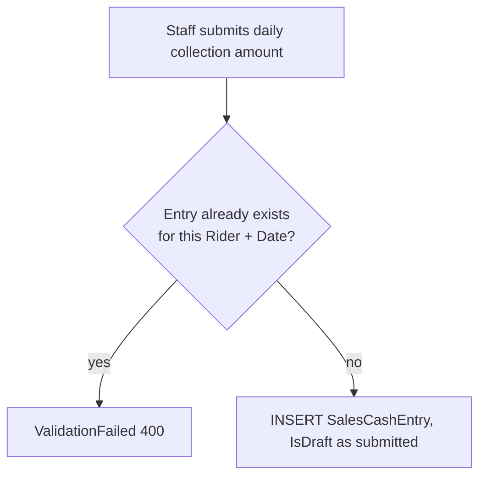
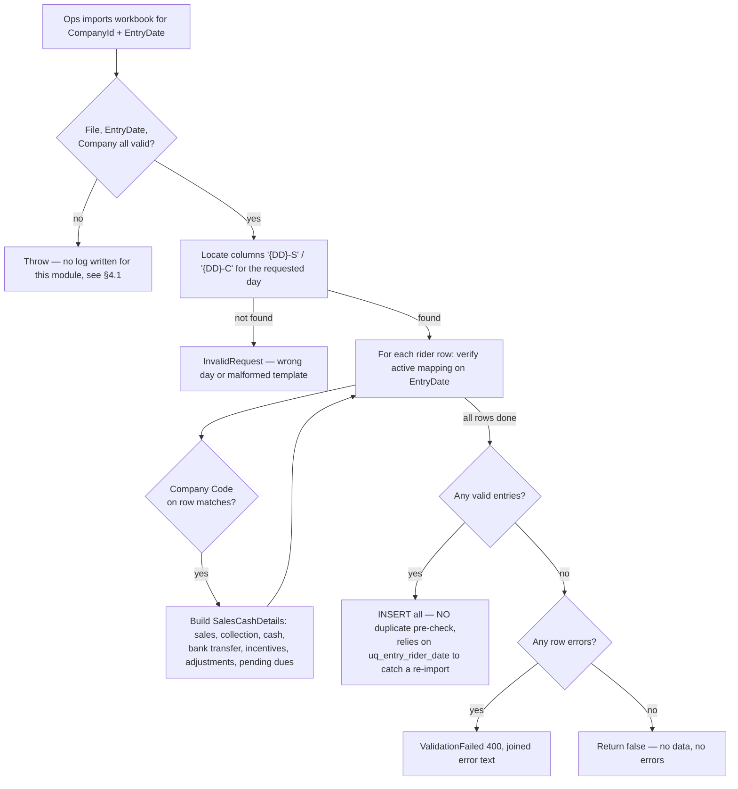
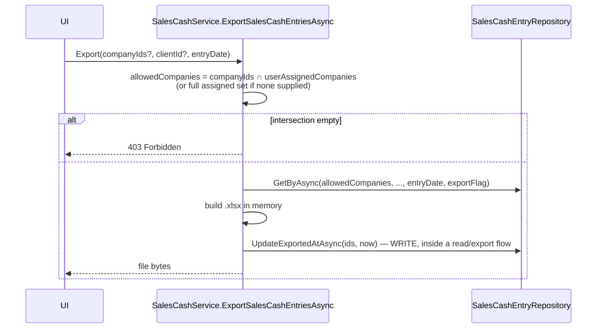
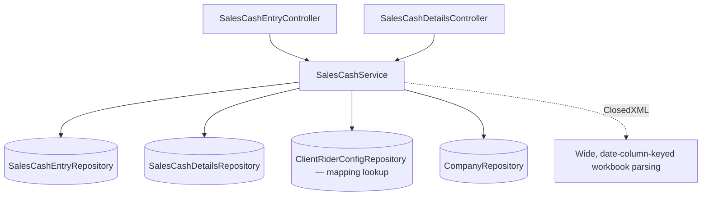
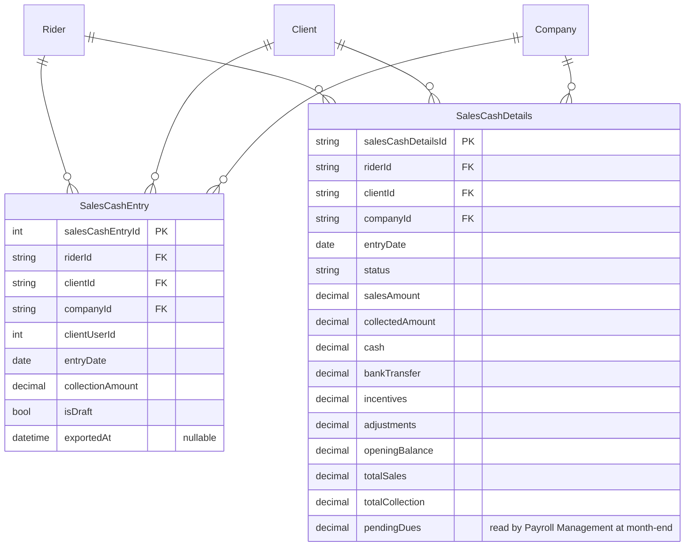

# Sales Cash Reconciliation

## 1. Module overview

Tracks daily cash collected by riders on cash-on-delivery orders, through two related record types: `SalesCashEntry` (a simple manual daily collection-amount record) and `SalesCashDetails` (a richer, Excel-imported daily reconciliation with sales/collection/cash/bank-transfer/incentive/adjustment breakdown and a running pending-dues balance). The month-end `PendingDues` figure from this module feeds directly into [Payroll Management](payroll-management.md)'s expense calculation.

**Where it lives:**

| Concern | Path |
|---|---|
| Controllers | `SalesCashEntryController.cs`, `SalesCashDetailsController.cs` |
| Service | `CAG.Admin.API.Application/Service/Implementation/SalesCashService.cs` (shared by both controllers) |
| Repository | `SalesCashEntryRepository.cs`, `SalesCashDetailsRepository.cs` |

## 2. Business perspective

### 2.1 Business purpose

Riders handling cash-on-delivery orders collect physical cash that must be reconciled against what they owe the company. This module records that daily reconciliation — how much was sold, how much was actually collected (cash vs. bank transfer), and what remains outstanding — which becomes a direct payroll deduction at month end.

### 2.2 Key use cases

1. **A rider or supervisor manually logs a daily cash collection amount** (`SalesCashEntry`) — can be saved as a draft.
2. **Ops imports a client's daily cash-reconciliation workbook** (`SalesCashDetails`) — one day at a time, per company.
3. **Staff correct a single day's entry or reconciliation record.**
4. **Finance exports collection entries** for a date, scoped to allowed companies — which also stamps those entries as exported.
5. **[Payroll Management](payroll-management.md) reads the month-end `PendingDues`** figure as an expense line.
6. **[Leave Management](leave-management.md) reads the most recent entry** to enrich the rider leave-review screen.

### 2.3 Business rules & logic

- **A `SalesCashEntry` cannot be duplicated per rider per date**: `AddSalesCashEntryAsync` explicitly queries for an existing entry by `(RiderId, EntryDate)` before inserting and throws `ValidationFailed` (400) if one exists (explicit) — a friendlier, application-level version of what the database's own `uq_company_date (clientUserId, entryDate)` constraint on `SalesCashEntry` would otherwise enforce as a raw exception. [Inferred] Note the predicate mismatch: the application check keys on `RiderId`, while the database constraint keys on `ClientUserId` — these coincide in the common case (one active rider per client-user-ID at a time) but are not strictly the same guarantee, particularly around a temporary-cover-rider transition (see [Client & Client-User-ID Mapping](client-clientuserid-mapping.md)).
- **`SalesCashDetails` import has no duplicate protection at the application level at all** — `ImportSalesCashDetailsFile` parses and inserts directly with no pre-check and no delete-then-replace step; re-importing the same day would rely entirely on the database's `uq_entry_rider_date (riderId, entryDate)` constraint, surfacing as an unhandled exception rather than a friendly error. This is a **third distinct bulk-import strategy** in the platform, alongside [Attendance Management](attendance-management.md)'s incremental-lookback approach and [Rider Orders & Batch Billing](rider-orders-batch-billing.md)'s delete-then-replace approach — and the least protected of the three.
- **The Excel import format is date-column-dynamic**: for a given `EntryDate`, the parser looks for columns literally named `"{DD}-S"` (sales) and `"{DD}-C"` (collection) where `DD` is the two-digit day of month (explicit) — implying the source workbook has one wide row per rider with a Sales/Collection column pair for *every day of the month*, and a single import call extracts just the one day requested. Importing a full month therefore requires one import call per day, each re-reading the same wide workbook.
- **Export has a write side effect**: `ExportSalesCashEntriesAsync` stamps every exported entry's `ExportedAt` via `UpdateExportedAtAsync` (explicit) — a `GET`-shaped download endpoint that mutates state, the same pattern flagged in [Rider Management](rider-management.md) §2.3 (bulk vacation-status sync on read) recurring in a third module.
- **Export company-scoping is done correctly, via allow-list intersection**: `ExportSalesCashEntriesAsync` intersects the caller-supplied `companyIds` against `_userAssignedCompanies` rather than trusting the input outright, defaulting to the full assigned set if none was supplied, and throws `Forbidden` (403) if the intersection is empty (explicit) — this is one of the more carefully-designed authorization checks in the codebase, worth noting as a positive counterexample to the platform's usual conditional/absent scoping pattern.
- **A rider's mapping must be active on the exact entry date** for an imported row to be accepted — the same `StartDate <= date <= (EndDate ?? unbounded)` pattern used by [Attendance Management](attendance-management.md) and [Rider Orders & Batch Billing](rider-orders-batch-billing.md).

### 2.4 End-to-end business flows

**Manual entry, with duplicate guard:**

**Excel reconciliation import — single day, wide-format workbook:**

**Export with side-effecting stamp:**

### 2.5 Actors & interactions

| Actor | Role |
|---|---|
| Rider / supervisor | Manual daily entry |
| Ops/Finance staff | Import reconciliation workbooks, export, correct records |
| [Client & Client-User-ID Mapping](client-clientuserid-mapping.md) | Upstream — rider resolution for import |
| [Payroll Management](payroll-management.md) | Downstream — reads month-end `PendingDues` |
| [Leave Management](leave-management.md) | Downstream — reads most-recent entry for view enrichment |

## 3. Technical perspective

### 3.1 Architecture overview

One service (`SalesCashService`) backs two controllers/two record types, sharing company-scoping and current-user context.

### 3.2 Component breakdown

| Component | Responsibility | Key methods |
|---|---|---|
| `SalesCashEntryController` | 4-endpoint HTTP surface for entries | get, add, update, export |
| `SalesCashDetailsController` | 3-endpoint HTTP surface for reconciliation detail | get, import, update |
| `SalesCashService` | Both models' business logic in one class | `AddSalesCashEntryAsync`, `UpdateSalesCashEntryAsync`, `ImportSalesCashDetailsFile`, `UpdateSalesCashDetailsAsync`, `ExportSalesCashEntriesAsync`, `ParseSalesCashDetailsWorksheet` |

### 3.3 Detailed technical flows

Covered fully in §2.4.

### 3.4 API & interface documentation

| Method | Route | Notes |
|---|---|---|
| `GET` | `api/salescashentry/get` | Company-scoped |
| `POST` | `api/salescashentry` | Duplicate-checked by `(RiderId, EntryDate)` |
| `PUT` | `api/salescashentry/{id}` | Full overwrite |
| `GET` | `api/salescashentry/export` | Allow-list-intersected company scope; write side effect (§2.3) |
| `GET` | `api/salescashdetails/get` | Company-scoped |
| `POST` | `api/salescashdetails/import` | No duplicate pre-check (§2.3) |
| `PUT` | `api/salescashdetails/{id}` | Full overwrite; note `id` is a route **string**, unusual for this platform's mostly-int keys |

### 3.5 Database & data model

`SalesCashEntry` carries `uq_company_date (clientUserId, entryDate)`; `SalesCashDetails` carries `uq_entry_rider_date (riderId, entryDate)` — different key columns between the two tables' uniqueness rules (§2.3).

### 3.6 External integrations

None.

### 3.7 Internal module dependencies

**Upstream:** [Client & Client-User-ID Mapping](client-clientuserid-mapping.md) (rider resolution), [Partner Company Management](partner-company-management.md) (company lookup for import validation).

**Downstream:** [Payroll Management](payroll-management.md) (`SalesCashDetails.PendingDues` on the month-end date), [Leave Management](leave-management.md) (most-recent entry for enrichment).

### 3.8 Configuration & environment

None module-specific.

### 3.9 Background jobs & workers

None.

### 3.10 Events & messaging

None.

### 3.11 Authentication & authorization

`[Authorize]` only; the export endpoint's allow-list intersection (§2.3) is a genuine, well-implemented exception to the platform's usual weak/absent company scoping — worth recognizing explicitly rather than only cataloguing gaps elsewhere.

### 3.12 Validation & error handling

- `AddSalesCashEntryAsync`'s duplicate check is a solid, explicit guard (with the RiderId/ClientUserId predicate caveat noted in §2.3).
- `ImportSalesCashDetailsFile` has **no top-level try/catch around the whole operation** — unlike [Attendance Management](attendance-management.md) (which swallows exceptions) or [Rider Orders & Batch Billing](rider-orders-batch-billing.md) (which logs then rethrows), this method has no upload-log table at all, so any exception (including a duplicate-key violation from the missing pre-check) propagates as a raw, unclassified error with zero audit trail of the attempt ever having happened.
- `UpdateSalesCashEntryAsync`/`UpdateSalesCashDetailsAsync` both check `rows <= 0` and throw a friendly `ValidationFailed` — a reasonable not-found-on-update pattern, though mapped to 400 rather than 404.

### 3.13 Logging & observability

**No upload log exists for `SalesCashDetails` imports** — unlike Attendance (`AttendanceUploadLog`) and Rider Orders (`RiderOrderUploadLog`), this is the one bulk-import path in the platform with no audit trail table at all. A failed or partially-failed import leaves no record of having been attempted.

### 3.14 Design patterns & architectural decisions

Two related record types sharing one service class (rather than two services) keeps the company-scoping/current-user boilerplate DRY, at the cost of a somewhat overloaded `SalesCashService` covering two distinct data shapes and two distinct import/entry patterns.

## 4. Risk & improvement analysis

### 4.1 Edge cases & failure scenarios

- **No audit log for `SalesCashDetails` imports** (§3.13) — the least observable bulk-import path in the platform.
- **No duplicate pre-check on import** — a re-imported day either throws an unhandled constraint exception (if using the same rider+date) or, if the constraint's exact key columns don't align with intent, could in principle insert a second conflicting record.
- The wide, per-day-column Excel format (§2.3) means a full month's import is 28-31 separate API calls against the same source file — if the workbook is modified between calls, results could be inconsistent across days without any cross-day reconciliation check.

### 4.2 Known limitations

- Predicate mismatch between the app-level duplicate check (`RiderId`) and the DB constraint (`ClientUserId`) on `SalesCashEntry`.
- `SalesCashDetails.Id` is a string primary key while most of the platform uses int — worth confirming this is intentional (e.g., a composite or generated string ID) rather than an inconsistency.

### 4.3 Security considerations

No role checks, consistent with the platform-wide gap; notable here given this module handles cash-handling reconciliation, typically a higher-sensitivity financial control point than most other domains.

### 4.4 Performance considerations

Nothing notable at current volumes (`SalesCashEntry` 1,390 rows, `SalesCashDetails` 209 rows per [architecture-overview.md](architecture-overview.md) §4.3).

### 4.5 Potential improvements

**Quick wins:**
- Add a `SalesCashDetailsUploadLog`-equivalent audit table, matching the pattern already established for Attendance and Rider Orders.
- Add a duplicate pre-check to `ImportSalesCashDetailsFile` for a friendlier error than an unhandled constraint violation.

**Medium effort:**
- Align the `SalesCashEntry` duplicate-check predicate with its actual database constraint (both on `ClientUserId`, or both on `RiderId`, deliberately chosen).
- Consider a "full month" import mode that reads all day-columns from the workbook in one call, rather than requiring 28-31 separate uploads of the same file.

**Major refactors:**
- None specific to this module beyond the platform-wide bulk-import consistency recommendation (see [architecture-overview.md](architecture-overview.md)).

## 5. Summary

- Two related record types — a simple manual `SalesCashEntry` and a richer, Excel-imported `SalesCashDetails` reconciliation — sharing one service.
- The Excel import format is unusually structured: one wide workbook with a Sales/Collection column pair per day of the month, requiring one import call per day.
- **This is the platform's least-protected bulk import**: no duplicate pre-check, no incremental logic, no delete-and-replace, and — uniquely among the platform's three bulk imports — no audit-log table at all.
- Export has a write side effect (stamping `ExportedAt`), the same "read mutates state" pattern seen elsewhere in the platform.
- The export endpoint's company-scoping (allow-list intersection with a `Forbidden` fallback) is genuinely well-designed — one of the platform's better authorization implementations, worth using as a model elsewhere.
- Month-end `PendingDues` from `SalesCashDetails` is a direct input to [Payroll Management](payroll-management.md)'s expense calculation.
