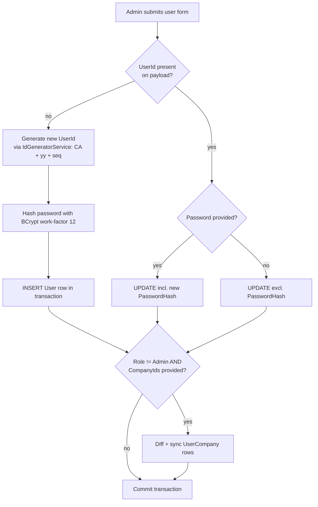
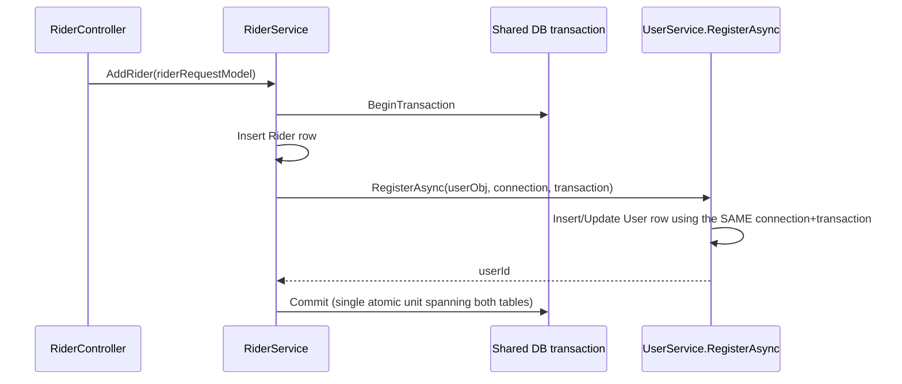
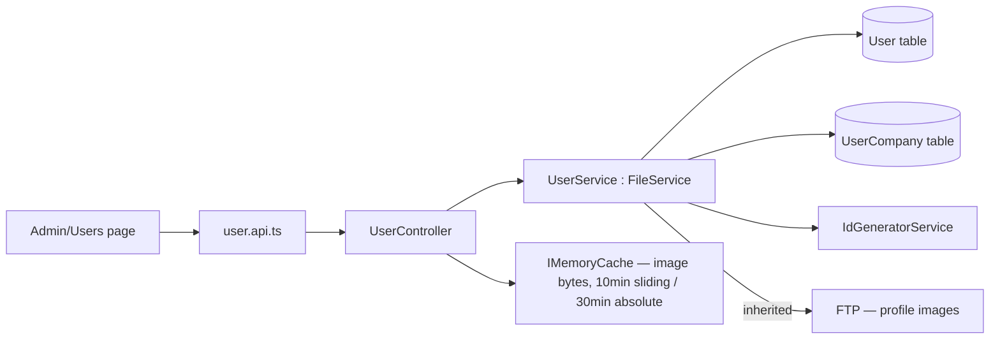
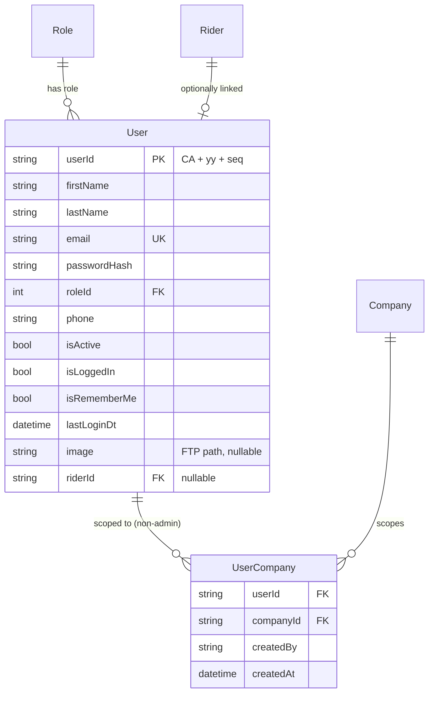

# User Management

## 1. Module overview

Manages staff login accounts — the operational users of the admin portal (as distinct from Riders, who are the subjects the portal manages). Covers account creation/editing, role assignment, per-company scoping for non-admins, password self-service, and profile image handling.

**Where it lives:**

| Concern | Path |
|---|---|
| Controller | `CAG.Admin.API/CAG.Admin.API/Controllers/v1/UserController.cs` |
| Service | `CAG.Admin.API/CAG.Admin.API.Application/Service/Implementation/UserService.cs` (shared with [Authentication & Authorization](authentication-authorization.md) — `UserService` implements both `IUserService` login/logout and user-CRUD) |
| Repository | `CAG.Admin.API.DBRepository/Repository/UserRepository.cs`, `UserCompanyRepository.cs` |
| ID generation | `IdGeneratorService.cs` |
| UI data layer | `http-client/user.api.ts` → `hooks/react-query/users.tsx` |
| UI screen | `src/app/(pages)/Admin/Users/` |

## 2. Business perspective

### 2.1 Business purpose

Only staff with a `User` account can operate the admin portal. The business needs to control who has an account, what role they hold (which drives their module permissions via [Authentication & Authorization](authentication-authorization.md)), and — for non-admin roles — which of the company tenants they're allowed to see data for. This module is the administrative front door for staff onboarding/offboarding, distinct from rider onboarding ([HR Workflow](hr-workflow-onboarding.md)).

### 2.2 Key use cases

1. **Admin creates a new staff account** — sets name, email, phone, password, role, and (for non-admin roles) which companies they can access.
2. **Admin edits an existing staff account** — same form, role and company reassignment included.
3. **A rider gets an auto-created login** — triggered by [Rider Management](rider-management.md): creating a Rider can register a companion `User` row transactionally in the same operation (see §3.7).
4. **User changes their own password** — self-service, requires being already authenticated.
5. **User uploads/removes their own profile photo.**
6. **Admin (or the system) deactivates a user** — sets `IsActive = false`, which blocks login per [Authentication & Authorization](authentication-authorization.md) §2.3.

### 2.3 Business rules & logic

- **Riders are excluded from the staff user list** — `GetAllUsersAsync` filters out `RoleId == (int)RoleCodes.Rider` (explicit). The `User` table holds both staff and rider-linked accounts, but the admin Users grid shows only staff.
- **Test accounts are filtered from the list** — any `UserId` containing `"TEST"` is excluded (explicit, hardcoded substring match — a convention, not a flag column).
- **Admins are not assigned to specific companies** — `RegisterAsync`/`UpdateAsync` only sync `UserCompany` rows `if (!isAdminUser && CompanyIds != null)`; an Admin's company scope is instead resolved dynamically at login time as *all* companies (see [Authentication & Authorization](authentication-authorization.md) §2.3). Changing a user's role away from Admin does not retroactively populate `UserCompany` — [Inferred] the caller must supply `CompanyIds` explicitly when demoting a user, or that user is left scoped to zero companies.
- **Company assignment is a full sync, not an incremental add** — `SyncUserCompanies` diffs the requested `CompanyIds` against existing `UserCompany` rows and deletes/inserts only the difference (explicit, uses `Except()` both directions), so submitting a company list always defines the complete new set.
- **User creation/update is one endpoint, two branches** — `RegisterAsync` inspects whether `UserId` is populated on the incoming DTO to decide INSERT vs UPDATE (explicit). Password is optional on update (`newUser.Password != null` gates whether `PasswordHash` is included in the update payload) but required on insert (`HashPassword(newUser.Password)` is called unconditionally in the insert branch — a null password here throws inside `BCrypt.HashPassword`, an unhandled `NullReferenceException`/`ArgumentNullException` rather than a validated 400). [Inferred from code shape, not an explicit guard]
- **Generated user IDs follow a yearly-reset sequence**: format `CA{yy}{seq:D3}` (e.g. `CA26001`), shared sequence infrastructure with Rider (`RD{yy}{seq:D4}`), Vehicle (`VH{yy}{seq:D4}`), Client (`CLT{yy}{seq:D2}`), and Company (`COMP{yy}{seq:D2}`) IDs, keyed by `(entityType, yearPrefix)` in `IdSequences` (explicit, `IdGeneratorService`).
- **Two distinct update surfaces exist with different scope** — `PUT api/user/update` (`UpdateAsync`) touches only `FirstName`, `LastName`, `IsActive`, and optionally `CompanyIds`; it does **not** touch `RoleId`, `Email`, `Phone`, or `Password` even though `UserUpdateRequestModel` declares a `RoleId` field. Full edits (including role, email, phone, password) go through `POST api/user/add` (`RegisterAsync`) when `UserId` is populated. [Inferred from comparing the two service methods] These appear to be two independently-evolved update paths rather than a deliberate split; see §4.2.

### 2.4 End-to-end business flows

**Create/edit user (via the Add/Edit User modal, which always posts to `add`):**



**Rider-triggered account creation (cross-module — see [Rider Management](rider-management.md) §3.3):**



### 2.5 Actors & interactions

| Actor | Role |
|---|---|
| Admin | Creates/edits staff accounts, assigns roles and companies |
| Any authenticated staff user | Views the user list (`GetAllUsers` requires only `[Authorize]`, no role check — see §4.3), changes their own password/photo |
| [Rider Management](rider-management.md) | Upstream caller of `RegisterAsync` when a rider needs portal access |
| [Authentication & Authorization](authentication-authorization.md) | Downstream consumer of `RoleId`, `IsActive`, `CompanyIds` set here |

## 3. Technical perspective

### 3.1 Architecture overview

Standard four-hop chain. Notable deviation: `UserService` **inherits from `FileService`** (`class UserService : FileService, IUserService`) rather than composing it, so `UserService` gets `UploadAsync`/`GetFileAsync`/`DeleteAsync` as protected base methods directly — the only service in the codebase observed to use inheritance rather than injection for file operations. Profile images are cached in `IMemoryCache` at the controller layer, keyed per user.



### 3.2 Component breakdown

| Component | Responsibility | Key methods | Dependencies |
|---|---|---|---|
| `UserController` | HTTP surface; owns the image `IMemoryCache` layer | `GetAllUsers`, `GetUserById`, `AddUser`, `UpdateUser`, `UpdatePassword`, `GetProfileImage`, `UpdateProfileImage`, `RemoveProfileImage` | `IUserService`, `IMemoryCache`, `ICurrentUserService` |
| `UserService` | All business logic; also implements login/logout (§[Authentication & Authorization](authentication-authorization.md)) | `GetAllUsersAsync`, `RegisterAsync`, `UpdateAsync`, `UpdatePassword`, `GetUserByIdAsync`, profile-image trio | `IUserRepository`, `IUserCompanyRepository`, `IIdGeneratorService`, `ICompanyRepository`, `IRolePermissionService`, `ITokenSerivce`, `IDbConnectionFactory` |
| `UserRepository` | `GenericRepository<User>("User")` + hand-written multi-map join to `UserCompany` | `GetAllUsersAsync` (join), `UpdateUserImageAsync` (unused legacy — see §4.2) | Dapper |
| `UserCompanyRepository` | CRUD on the `UserCompany` join table, transaction-aware overloads | `GetCompanyIdsByUserId`, `DeleteByUserIdAsync`, `AddAsync`/`DeleteAsync` (tx overloads) | `GenericRepository<UserCompany>` |
| `IdGeneratorService` | Shared sequence-based human-readable ID generator | `GenerateIdAsync(entityType, connection, transaction)` | `IIdSequenceRepository` |

### 3.3 Detailed technical flows

**`RegisterAsync` — full method trace:**

```mermaid
sequenceDiagram
    participant Caller as UserController / RiderService
    participant US as UserService.RegisterAsync
    participant Factory as IDbConnectionFactory
    participant UR as UserRepository
    participant IDG as IdGeneratorService
    participant UCR as UserCompanyRepository

    Caller->>US: RegisterAsync(newUser, [connection], [transaction])
    US->>US: null-check newUser -> AdminAPIException(InvalidRequest) if null
    alt no external connection supplied
        US->>Factory: Create() + Open()
        US->>US: BeginTransaction() locally
    end
    alt newUser.UserId is set
        US->>UR: UpdateAsync(fields incl. optional PasswordHash, {userId}, connection, transaction)
        opt not Admin and CompanyIds != null
            US->>UCR: SyncUserCompanies (diff + delete/insert)
        end
    else newUser.UserId is empty
        US->>IDG: GenerateIdAsync("USER", connection, transaction)
        IDG-->>US: "CA26###"
        US->>UR: AddAsync(User{...}, connection, transaction)
        opt not Admin and CompanyIds != null
            US->>UCR: SyncUserCompanies
        end
    end
    alt owns the transaction (riderTransaction was null)
        US->>US: transaction.Commit()
    end
    US-->>Caller: finalUserId
    Note over US: catch block rolls back only if this call OWNS the transaction;<br/>an externally-supplied transaction is left for the caller to commit/rollback
```

### 3.4 API & interface documentation

| Method | Route | Auth | Request | Response |
|---|---|---|---|---|
| `GET` | `api/user` | `[Authorize]` | — | `List<UserCompanyResponseModel>` (excludes riders and `TEST*` accounts) |
| `GET` | `api/user/{userId}` | `[Authorize]` (class-level; no method attribute) | route `userId` | `User`; throws `EntityNotFound` (404) if absent |
| `POST` | `api/user/add` | `[Authorize]` | `UserRequestModel` | new/updated `userId` string |
| `PUT` | `api/user/update` | `[Authorize]` | `UserUpdateRequestModel` | `SuccessWithNoData()` — **return value of `UpdateAsync` is discarded**, so the response is 200 even if `res` was `false` (see §4.1) |
| `PUT` | `api/user/updatepassword` | `[Authorize]` | **`password` as a URL query parameter** (`?password=...`), not request body — confirmed from both the C# signature (`UpdatePassword(string password)`, a simple type, defaults to query-string binding under `[ApiController]`) and the UI call (`axiosInstance.put(url, null, { params: { password } })`) | `Success`/`BadRequest` |
| `GET` | `api/user/image` | `[Authorize]` (class-level) | — | binary image, cached 10min sliding / 30min absolute per user in `IMemoryCache` |
| `PUT` | `api/user/image/update` | `[Authorize]` (class-level) | multipart `image` | `Success`/`BadRequest`; invalidates the cache entry |
| `DELETE` | `api/user/image/delete` | `[Authorize]` (class-level) | — | `Success`/`BadRequest`; invalidates the cache entry |

**None of these endpoints check the caller's role.** Any authenticated user can list all users, create a new Admin account, or change any field on any user via `add` — there is no ownership or role check comparing the caller to the target `UserId`/`RoleId`. See §4.3.

### 3.5 Database & data model



`GetAllUsersAsync` query (repository level):

```sql
SELECT U.*, UC.CompanyId
FROM User U
LEFT JOIN UserCompany UC ON UC.UserId = U.UserId
```

Multi-mapped in C# via `QueryAsync<UserCompanyResponseModel, string, UserCompanyResponseModel>` with `splitOn: "CompanyId"`, collapsing one row per user with `companyIds` as a list — the same fan-out-then-collapse pattern used in [Rider Management](rider-management.md).

### 3.6 External integrations

FTP, via inherited `FileService` methods — profile images stored under `FilePath:UserFiles/{userId}/profile.{ext}`.

### 3.7 Internal module dependencies

**Upstream (this module depends on):** [Authentication & Authorization](authentication-authorization.md) for `ICurrentUserService`/`RoleCodes`; [Database Access Layer](database-access-layer.md) for `GenericRepository`/transactions; [Document Management](document-management.md)'s `FileService` (via inheritance) for FTP.

**Downstream (depend on this module):** [Rider Management](rider-management.md) calls `RegisterAsync` directly, sharing its DB transaction, to create a rider's login account atomically with the rider record — this is the one place in the codebase where two "modules" share a single transaction across service boundaries. [Authentication & Authorization](authentication-authorization.md) reads `User.RoleId`/`IsActive`/`RiderId` at login.

### 3.8 Configuration & environment

`FilePath:UserFiles` (appsettings) — FTP directory for profile photos. No other module-specific configuration.

### 3.9 Background jobs & workers

None. Note the UI polls `GET api/user` on a **5-second `refetchInterval`** (`useGetAllUsers`) — not a server-side job, but a client-driven near-real-time refresh of the entire staff list while the Users page is mounted.

### 3.10 Events & messaging

None.

### 3.11 Authentication & authorization

Every endpoint requires `[Authorize]` (valid JWT). No endpoint restricts by role — see §4.3.

### 3.12 Validation & error handling

- `UserRequestModel`/`UserUpdateRequestModel` carry `required` on some fields (C# 11 `required` modifier — a compile-time/model-binding-time check, not a runtime business validation) but no DataAnnotations and no custom validator (unlike [Rider Management](rider-management.md)'s `RiderValidator`).
- `GetUserById` throws `AdminAPIException(EntityNotFound, ..., 404)` for a missing user — one of the few endpoints in the codebase using the correct exception-to-status mapping for a not-found case.
- `UpdatePassword` in `UserController` wraps its body in try/catch and returns `BadRequest(ex.Message)`, bypassing `ExceptionHandlingMiddleware` (same pattern flagged in [Authentication & Authorization](authentication-authorization.md) §4.3).
- `UpdateUser`'s controller action discards `UpdateAsync`'s boolean result and always returns `SuccessWithNoData()` — a caller cannot distinguish "0 rows updated" (e.g., stale `userId`) from success.

### 3.13 Logging & observability

None beyond the FTP-based generic exception log. No audit trail of who changed a user's role or company scope beyond the generic `UpdatedBy`/`UpdatedAt` columns (which record the *editor*, not a history of prior values).

### 3.14 Design patterns & architectural decisions

- **Inheritance for cross-cutting file capability** (`UserService : FileService`) instead of composition/injection — inconsistent with every other file-touching service ([Document Management](document-management.md), [Vehicle Management](vehicle-management.md), [Partner Company Management](partner-company-management.md)), which inject `IFileService`. [Inferred] Likely historical — `UserService` may predate `IFileService` extraction.
- **Optional-transaction parameter pattern**: `RegisterAsync(newUser, connection = null, transaction = null)` lets the same method serve as both a standalone unit and a participant in someone else's transaction — the same pattern used throughout [Database Access Layer](database-access-layer.md)'s `GenericRepository`.

## 4. Risk & improvement analysis

### 4.1 Edge cases & failure scenarios

- `UpdateUser`'s controller ignoring `UpdateAsync`'s return value means a request against a non-existent `userId` returns HTTP 200 with no indication nothing changed.
- Registering a new user with `Password == null` throws inside `BCrypt.HashPassword` (unhandled), surfacing as a generic 500 rather than a validation error.
- If `RegisterAsync` is called mid-transaction from [Rider Management](rider-management.md) and the User insert fails, the exception propagates and (per Rider's own transaction ownership) should roll back the Rider insert too — but this depends entirely on the caller correctly wrapping both in one `try/catch`; a defect in that caller's error handling could leave a Rider without a linked User silently.

### 4.2 Known limitations

- **`PUT api/user/update` / `UpdateUserProfileAsync` / `useUpdateUser` are unreferenced from any UI page** — confirmed by searching all `.tsx` files under `Admin/Users` and the whole `src/app` tree for calls to `useUpdateUser`; only its own definition file matches. [Inferred as dead code] The Admin/Users edit flow instead reuses the `add` endpoint (`useUpsertUser` → `RegisterUserAsync`) for both create and edit, which is why `PUT update`'s narrower scope (no role/email/phone/password change) doesn't matter in practice — nothing calls it.
- `UserRepository.UpdateUserImageAsync(byte[], userId)` writes to a `User.image` **binary** column via raw SQL, but the actual image flow (`UserService.UpdateProfileImageAsync`) uploads to FTP and stores a **path string** in `image` instead — this repository method appears to be a leftover from a pre-FTP, DB-blob-storage design and is not called from the service layer. [Inferred — confirmed unused via the same UserService reading above, which never calls `UpdateUserImageAsync`]
- Password sent as a query-string parameter (see §3.4, §4.3).
- No password complexity/length validation anywhere in this module.

### 4.3 Security considerations

- **New password travels as a URL query parameter** (`PUT api/user/updatepassword?password=...`). Query strings are commonly captured in web server access logs, proxy logs, browser history, and `Referer` headers — even over HTTPS, the query string is visible to anything that logs the full request URL. This should be a request body field.
- **No role check on any endpoint.** Any authenticated user — including a Rider-linked account or the lowest-privilege Reporter role — can call `GET api/user` (full staff roster with emails/phones), `POST api/user/add` to create a **new Admin account**, or edit any other user's role, active flag, or company scope. This compounds the cross-cutting authorization gap noted in [Authentication & Authorization](authentication-authorization.md) §4.3: this module is a concrete example of the blast radius (privilege escalation to Admin is directly reachable).
- Profile images are cached in `IMemoryCache` keyed by `CAG_USER_IMAGE_{userId}` with no access check beyond `[Authorize]` at the class level and no verification that the caller *is* that user for `GetProfileImage` — reading `_currentUserService.GetCurrentUser()?.UserId` always fetches the **caller's own** image by construction (there's no `userId` route/query parameter on this endpoint), so this is self-scoped correctly; noted for completeness rather than as a finding.

### 4.4 Performance considerations

- `useGetAllUsers`'s 5-second `refetchInterval` polls the full staff roster (with the `UserCompany` LEFT JOIN) continuously while the Users page is open — for a table with under 1,000 rows today this is inexpensive, but it's a fixed polling cost with no visible business reason (staff lists change rarely) rather than event-driven or on-demand refresh.
- `GetAllUsersAsync`'s join-and-collapse pattern loads the entire result set into memory before returning — consistent with the no-pagination pattern noted platform-wide (see [architecture-overview.md](architecture-overview.md)).

### 4.5 Potential improvements

**Quick wins:**
- Move `updatepassword`'s `password` parameter into the request body.
- Return `UpdateAsync`'s actual result from `UpdateUser` instead of unconditional `SuccessWithNoData()`.
- Remove `UserRepository.UpdateUserImageAsync` and the unused `update` endpoint/hook chain, or wire the endpoint into a real caller if the narrower-scope update was intentional.

**Medium effort:**
- Add role-gating so only Admins can create/edit users or view the full roster with contact details.
- Add password complexity validation, mirroring the pattern in `RiderValidator`/`BankDetailsValidator`.

**Major refactors:**
- Consolidate the two update paths (`update` vs `add`-with-`UserId`) into one clearly-scoped endpoint, or explicitly document why both exist if a narrower "profile self-edit" endpoint is still intended for future use.

## 5. Summary

- Manages staff accounts; explicitly excludes riders and test accounts from the visible roster.
- Shares its core service class with [Authentication & Authorization](authentication-authorization.md) (`UserService` implements both).
- One endpoint (`add`) does double duty as both create and full update, branching on whether `UserId` is populated; a second, narrower update endpoint exists but is unreferenced by the UI.
- Participates in a genuine cross-module transaction: creating a Rider can atomically create its linked User account via a shared `IDbConnection`/`IDbTransaction`.
- Company scoping is a full diff-and-sync operation per update, skipped entirely for Admin-role users (who get all-companies dynamically at login instead).
- Password change sends the new password as a URL query parameter — a real logging-exposure risk.
- No endpoint in this module checks caller role — any authenticated user can create a new Admin account.
- Profile images: FTP-backed, cached per-user in `IMemoryCache` with a 10-minute sliding / 30-minute absolute expiry.
