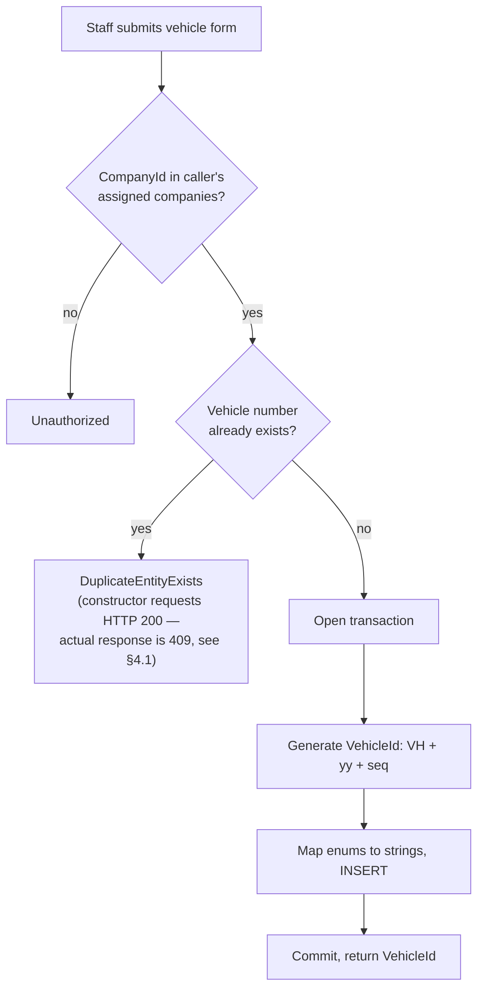
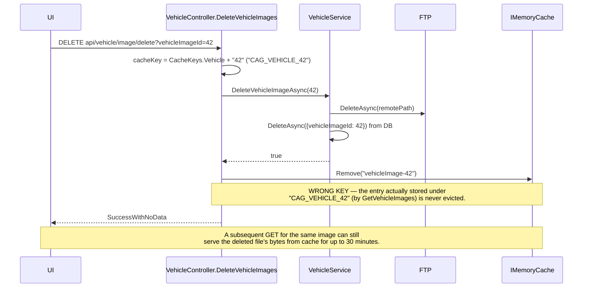
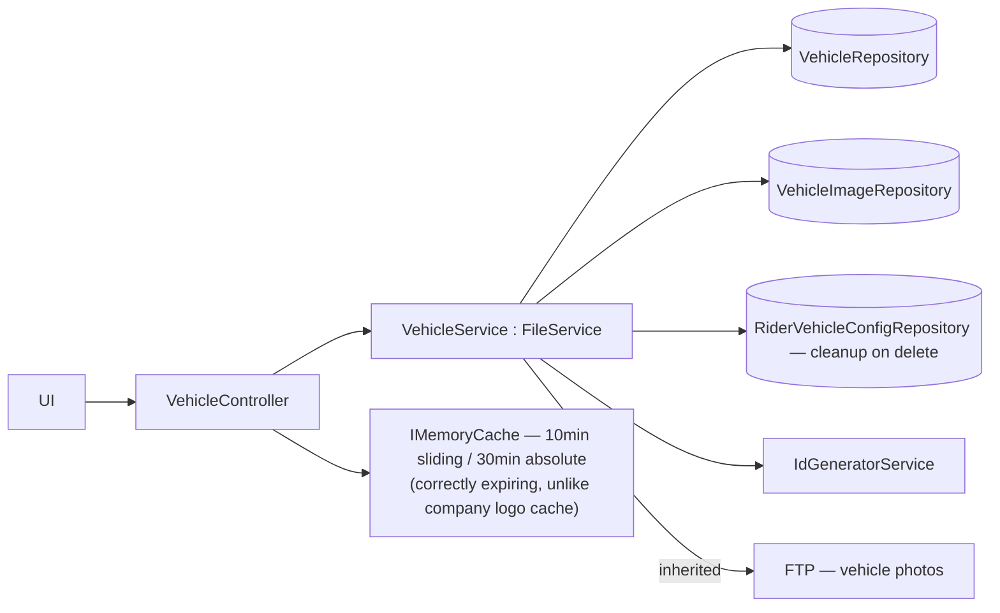
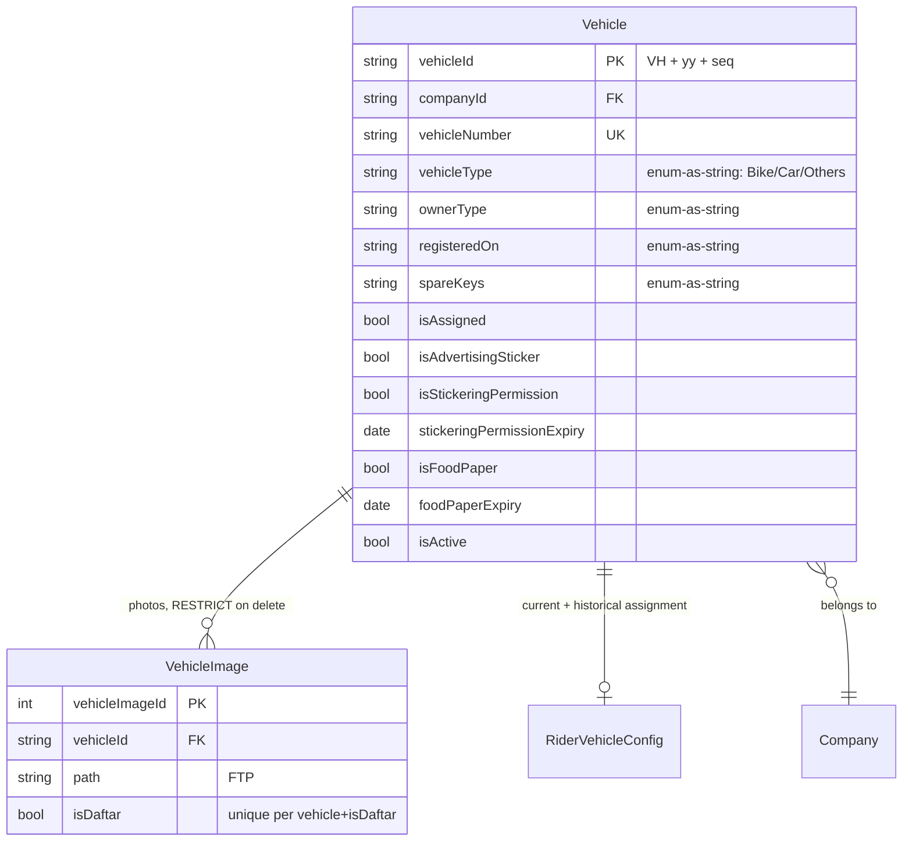

# Vehicle Management

## 1. Module overview

Manages the fleet of vehicles riders are assigned to: registration details, ownership type, compliance stickers/permits, images, and the vehicle side of the rider-vehicle assignment relationship (the `RiderVehicleConfig` mapping itself is owned and mutated primarily from [Rider Management](rider-management.md)).

**Where it lives:**

| Concern | Path |
|---|---|
| Controller | `CAG.Admin.API/CAG.Admin.API/Controllers/v1/VehicleController.cs` |
| Service | `CAG.Admin.API.Application/Service/Implementation/VehicleService.cs` |
| Repository | `CAG.Admin.API.DBRepository/Repository/VehicleRepository.cs`, `VehicleImageRepository.cs` |
| Enums | `CAG.Admin.API.Domain/Enums/Vehicle.cs` (`VehicleType`, `OwnerType`, `RegisteredOn`, `SpareKeys`) |
| UI | `src/app/(pages)/Vehicle/`, `src/app/(details)/Vehicle/[vehicleId]/` |

## 2. Business perspective

### 2.1 Business purpose

Vehicles are capital assets the business either owns, rents, or finances for riders to use. This module tracks each vehicle's registration/ownership status, compliance documents (advertising stickers, food-delivery paperwork), and photographic record, and is the vehicle-side counterpart to [Rider Management](rider-management.md)'s assignment logic.

### 2.2 Key use cases

1. **Register a new vehicle** — type, ownership, registration, compliance flags.
2. **View/search the fleet**, optionally filtered by company.
3. **Update vehicle details.**
4. **Retire/delete a vehicle.**
5. **Photograph a vehicle** — multi-image upload with per-image metadata.
6. **[Rider Management](rider-management.md) assigns/unassigns a vehicle to a rider**, which flips this module's `Vehicle.IsAssigned` flag as a side effect (see [Rider Management](rider-management.md) §2.4).
7. **[Dashboard & Reporting](dashboard-reporting.md) reads expiring compliance items** (sticker/food-paper expiry) and fleet totals/deltas.

### 2.3 Business rules & logic

- **Vehicle creation is scoped to the caller's assigned companies**: `AddVehicle` throws `Unauthorized` if `vehicle.CompanyId` is not in `_userAssignedCompanies` (explicit) — the same correctly-implemented resource-scoping pattern seen in [Partner Company Management](partner-company-management.md)'s `GetByCompanyID`.
- **Vehicle numbers must be unique**, checked proactively on both create and update (only re-checked on update if the number actually changed) (explicit, `GetVehicleByNumber` lookup before insert/update).
- **Enum fields are persisted as strings, not integers** — `VehicleType`, `OwnerType`, `RegisteredOn`, `SpareKeys` are all converted with `.ToString()` before being written to the `Vehicle` DBModel's `string` properties (explicit, `MapToVehicleAdd`/`MapToVehicleUpdate`). The database columns are not free-text, though — confirmed by reading `CAG_Schema.sql`, they're genuine MySQL `ENUM` columns (`vehicleType enum('Bike','Car','Others')`, `ownerType enum('Company','EmployeeOwned','Rental','Installment')`, `registeredOn enum('Company','EmployeeOwned')`, `spareKeys enum('Office','Driver','N/A')`).
- **Confirmed value mismatch between the C# and database enums for `SpareKeys`**: the C# `SpareKeys` enum's third member is `NA` (`CAG.Admin.API.Domain/Enums/Vehicle.cs`), but the database column only accepts the literal `'N/A'` (with a slash). `SpareKeys.NA.ToString()` produces `"NA"`, which is **not a valid value for the MySQL enum column** — saving a vehicle with `SpareKeys = NA` would either be rejected outright (strict SQL mode) or silently coerced to the enum's error value (empty string, in non-strict mode), depending on the server's `sql_mode` setting. This is a real, concrete, previously-unnoticed defect distinct from the general "enums as unconstrained strings" framing below — here the database *is* constrained, and the C# value simply doesn't match one of the allowed options.
- **Deleting a vehicle proactively cleans up its active rider assignment** (deletes the `RiderVehicleConfig` row) **but not its images** — `VehicleImage` rows are left in place, and since `fk_vehicleimage_vehicle` is `RESTRICT` (per [architecture-overview.md](architecture-overview.md) §4.5), deleting a vehicle that has any uploaded photo throws an unhandled FK-constraint exception despite the partial cleanup that was done for the rider-mapping side. [Confirmed by reading `DeleteVehicle` — it deletes the `RiderVehicleConfig` mapping explicitly but has no corresponding `VehicleImageRepository.DeleteAsync` call]
- **Vehicle IDs are generated**: `VH{yy}{seq:D4}` via the shared sequence generator (explicit).
- **Vehicle image upload tolerates partial batch failure**, identical pattern to [Partner Company Management](partner-company-management.md)'s document upload — a failed FTP upload for one image in a batch is silently skipped (`continue`), with only the successfully-uploaded images returned to the caller (explicit).

### 2.4 End-to-end business flows

**Vehicle creation:**

**Vehicle image delete — the stale-cache defect:**

### 2.5 Actors & interactions

| Actor | Role |
|---|---|
| Ops/Fleet staff | Register/edit/retire vehicles, manage photos |
| [Rider Management](rider-management.md) | Owns the assignment side effect (`IsAssigned` flag, `RiderVehicleConfig` creation) |
| [Dashboard & Reporting](dashboard-reporting.md) | Reads fleet totals and expiring compliance items |

## 3. Technical perspective

### 3.1 Architecture overview

Same shape as [User Management](user-management.md)/[Partner Company Management](partner-company-management.md): `VehicleService : FileService` for FTP inheritance, company-scoped queries, transactional creation with sequence-based ID generation.

### 3.2 Component breakdown

| Component | Responsibility | Key methods |
|---|---|---|
| `VehicleController` | 10-endpoint HTTP surface; owns image cache | CRUD + image metadata/upload/get/delete |
| `VehicleService` | Business logic, company scoping, FTP orchestration | `AddVehicle`, `UpdateVehicle`, `DeleteVehicle`, `UploadVehicleImages`, dashboard aggregate passthroughs |
| `VehicleRepository` | `GenericRepository<Vehicle>` + joined/aggregate queries | `GetAllVehicleAsync`, `GetVehicleByIdAsync`, `GetAllVehicleNumberAsync`, `GetTotalVehiclesAsync`, `GetVehicleDeltaAsync`, `GetExpiringVehicleDtosAsync` |
| `VehicleImageRepository` | `GenericRepository<VehicleImage>` | standard CRUD |

### 3.3 Detailed technical flows

See §2.4 — creation and the image-delete cache defect are the two flows worth tracing in detail; everything else is direct CRUD.

### 3.4 API & interface documentation

| Method | Route | Notes |
|---|---|---|
| `GET` | `api/vehicle/getall?companyId=` | Company-scoped; optional further filter by a specific `companyId` |
| `GET` | `api/vehicle/getall/vehiclenumber` | Plain list of vehicle numbers (e.g., for a picker) |
| `GET` | `api/vehicle/{id}` | Throws `Unauthorized` if outside caller's companies |
| `POST` | `api/vehicle/add` | Company-scoped, duplicate-number-checked |
| `PUT` | `api/vehicle/update` | Raw `Vehicle` DBModel bound from body |
| `DELETE` | `api/vehicle/delete/{id}` | Cleans up active `RiderVehicleConfig`; does not clean up `VehicleImage` (§2.3) |
| `GET` | `api/vehicle/image/metadata?vehicleId=` | List image records for a vehicle |
| `POST` | `api/vehicle/image/upload` | multipart, partial-failure-tolerant batch |
| `GET` | `api/vehicle/image?vehicleImageId=` | Cached 10min sliding / 30min absolute |
| `DELETE` | `api/vehicle/image/delete?vehicleImageId=` | Cache eviction targets the wrong key (§2.4) |

### 3.5 Database & data model

### 3.6 External integrations

FTP, under `FilePath:VehicleFiles/{vehicleId}/{name}_{timestamp}.{ext}`.

### 3.7 Internal module dependencies

**Upstream:** [Database Access Layer](database-access-layer.md), [Partner Company Management](partner-company-management.md) (company scoping).

**Downstream:** [Rider Management](rider-management.md) (`UpdateVehicleAsync` mutates `Vehicle.IsAssigned` directly via this module's `UpdateVehicle`/`GetVehicleById`), [Dashboard & Reporting](dashboard-reporting.md).

### 3.8 Configuration & environment

`FilePath:VehicleFiles`.

### 3.9 Background jobs & workers

None — sticker/food-paper expiry is surfaced only on-demand via `GetExpiringVehicleDtosAsync` (read by [Dashboard & Reporting](dashboard-reporting.md)), not proactively alerted by any scheduled job.

### 3.10 Events & messaging

None.

### 3.11 Authentication & authorization

`AddVehicle` and `GetByVehicle` both correctly scope to the caller's `CompanyIds`. `UpdateVehicle` and `DeleteVehicle`, notably, **do not** re-check company scope before acting — they look the vehicle up by ID alone (`GetVehicleById(vehicle.VehicleId!)` / `GetVehicleById(vehicleId)`, both unscoped queries) [confirmed by reading both methods]. [Inferred] Combined with the platform-wide lack of role checks, any authenticated user who knows or guesses a `vehicleId` can update or delete a vehicle belonging to a company outside their assigned scope, even though creating or viewing it would have been correctly blocked.

### 3.12 Validation & error handling

- **The `statusCode` argument passed to `AdminAPIException` is dead code, confirmed here concretely**: `AddVehicle`'s duplicate-number check constructs `AdminAPIException(DuplicateEntityExists, "...", (int)HttpStatusCode.OK)` — i.e., the code explicitly asks for the response to carry HTTP 200 with an error body. But `ExceptionHandlingMiddleware` (see [architecture-overview.md](architecture-overview.md) §6.2) computes the actual response status **solely from a hardcoded switch on `ExceptionType`** (`DuplicateEntityExists → 409`), and never reads the exception's `statusCode`/`Data["StatusCode"]` value at all. The real response here is 409, not the 200 the call site explicitly requested — meaning this call site's author believed the parameter had an effect it does not. This is not unique to this module: every `AdminAPIException` constructor call across the entire API passes a `statusCode` argument that the middleware silently discards; this module simply contains the clearest evidence of a developer relying on it. See [architecture-overview.md](architecture-overview.md) for the cross-cutting writeup.
- `UpdateVehicle`/`DeleteVehicle` throw `EntityNotFound`/appropriate exceptions for a missing vehicle; error handling here is otherwise unremarkable.

### 3.13 Logging & observability

None beyond the platform-wide exception log.

### 3.14 Design patterns & architectural decisions

Identical shape to [User Management](user-management.md)/[Partner Company Management](partner-company-management.md): inheritance-based FTP capability, transactional create with sequence ID generation, partial-failure-tolerant batch upload. The consistency across these three modules suggests they were built from a shared template or by the same author in succession — useful context for a reader jumping between them.

## 4. Risk & improvement analysis

### 4.1 Edge cases & failure scenarios

- **Confirmed cache-invalidation bug**: `DeleteVehicleImages` removes a cache entry keyed `"vehicleImage-{id}"`, but `GetVehicleImages` stores it keyed `CacheKeys.Vehicle + id` (`"CAG_VEHICLE_{id}"`) — the delete operation's cache eviction is a no-op against the real entry, so a deleted image's bytes can still be served from cache for up to 30 minutes after deletion.
- **Confirmed dead exception parameter**: see §3.12 — every custom `statusCode` passed to `AdminAPIException` throughout the codebase is discarded by the middleware; only the `ExceptionType` enum value determines the actual HTTP status.
- Deleting a vehicle with uploaded images throws an unhandled FK-constraint exception (§2.3) — the delete path cleans up one dependent table (`RiderVehicleConfig`) but not the other (`VehicleImage`).

### 4.2 Known limitations

- `UpdateVehicle`/`DeleteVehicle` skip company-scope re-verification (§3.11) — an inconsistency relative to `AddVehicle`/`GetByVehicle` within the same service.
- Enum fields stored as free-text strings rather than a constrained type — a typo'd or programmatically-mismatched value (e.g., from a future API client) would silently persist as an unrecognized string rather than fail validation.
- `PUT api/vehicle/update` binds a raw `Vehicle` DBModel from the request body (mass-assignment surface, platform-wide pattern).

### 4.3 Security considerations

The unscoped `UpdateVehicle`/`DeleteVehicle` lookups (§3.11) are the concrete finding here: combined with no role check, any authenticated user who can enumerate or guess a `vehicleId` (a predictable `VH{yy}{seq}` format, not a random identifier) can modify or delete a vehicle outside their assigned company scope.

### 4.4 Performance considerations

Vehicle image caching is correctly time-boxed (10min/30min), unlike [Partner Company Management](partner-company-management.md)'s company-logo cache — no concern here beyond the invalidation-key bug already noted.

### 4.5 Potential improvements

**Quick wins:**
- Fix the cache-key mismatch in `DeleteVehicleImages` (use `cacheKey`, not the hardcoded `"vehicleImage-{id}"` string, in the `Remove` call).
- Add `VehicleImage` cleanup to `DeleteVehicle` alongside the existing `RiderVehicleConfig` cleanup.
- Add company-scope checks to `UpdateVehicle`/`DeleteVehicle`, matching `AddVehicle`/`GetByVehicle`.

**Medium effort:**
- Address the dead `statusCode` parameter platform-wide (see [architecture-overview.md](architecture-overview.md)) — either make `ExceptionHandlingMiddleware` honor it, or remove the parameter from every call site to stop misleading future readers into thinking it has an effect.
- Store enum fields as their integer/enum representation with a check constraint, or validate the string against the enum on read.

**Major refactors:**
- None specific to this module beyond what's already covered in [architecture-overview.md](architecture-overview.md).

## 5. Summary

- Manages the vehicle fleet: registration, ownership, compliance flags, and photos.
- `AddVehicle` and `GetByVehicle` correctly scope by the caller's assigned companies; `UpdateVehicle` and `DeleteVehicle` do not — an inconsistency within the same service that widens the platform's already-broad lack-of-authorization gap.
- **Confirmed, not inferred**: the `DeleteVehicleImages` cache-eviction call targets a cache key that was never used to store anything, so deleted images can still be served from cache.
- **Confirmed, not inferred**: the `statusCode` parameter on `AdminAPIException` has no effect on the actual HTTP response anywhere in the API — `AddVehicle`'s duplicate-check is concrete proof, since it explicitly requests HTTP 200 for an error and actually returns 409.
- Vehicle deletion cleans up the rider-assignment foreign key but not the vehicle-image foreign key, so any photographed vehicle cannot be deleted without an unhandled database error.
- Enum-typed fields are persisted as strings into genuine MySQL `ENUM` columns; `SpareKeys.NA` does not match the database's allowed `'N/A'` value (§2.3) — a confirmed, silent-until-tested defect.
